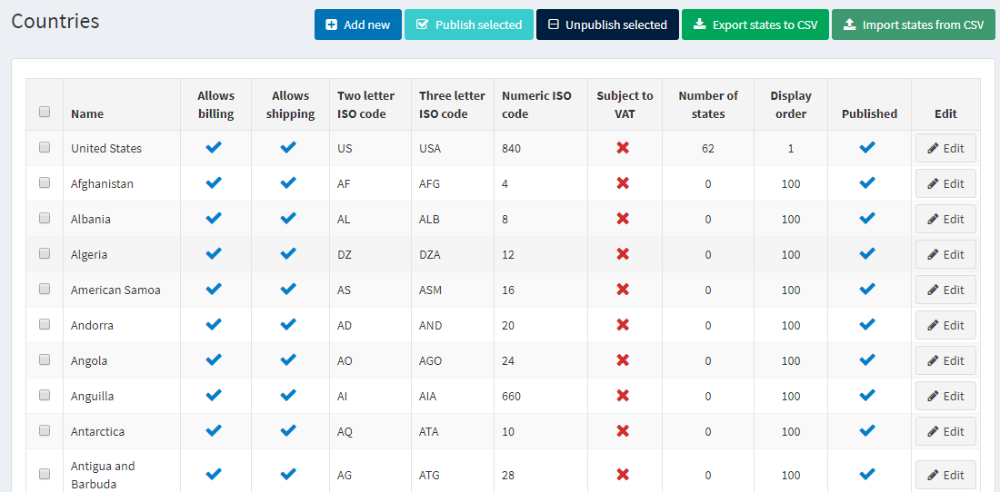
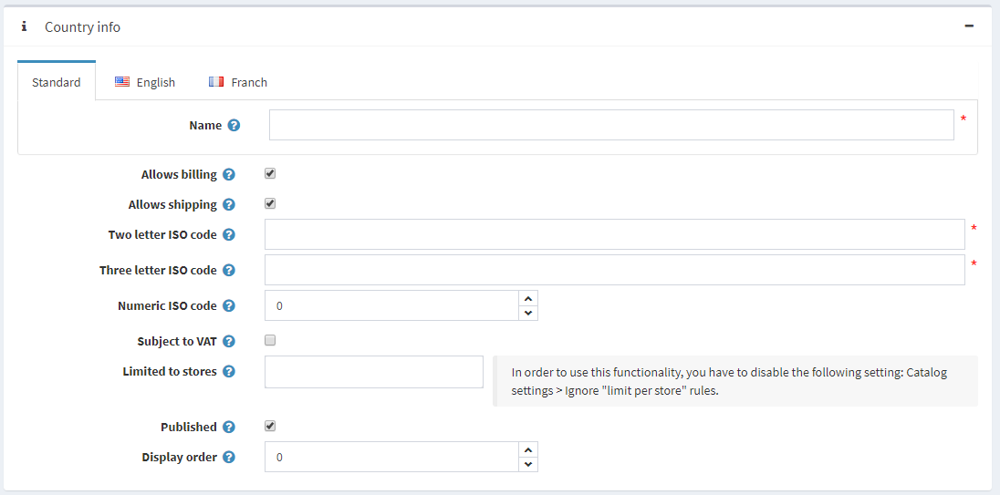
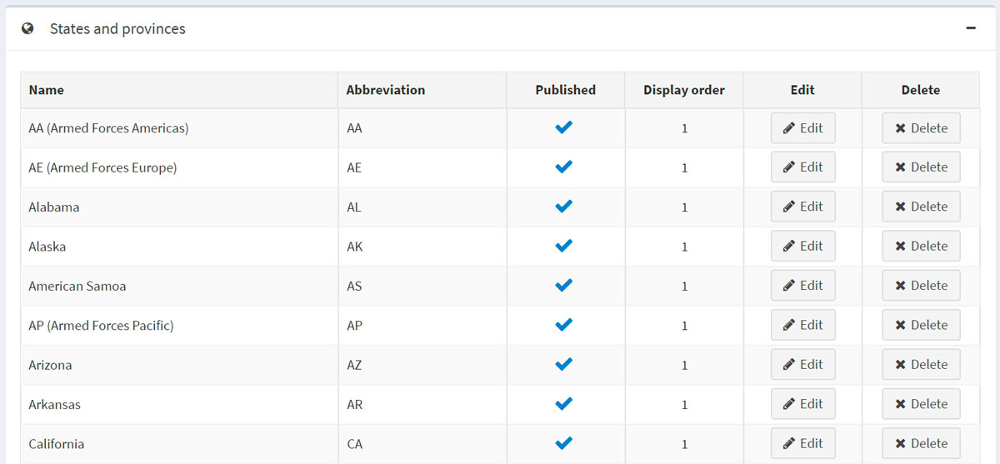
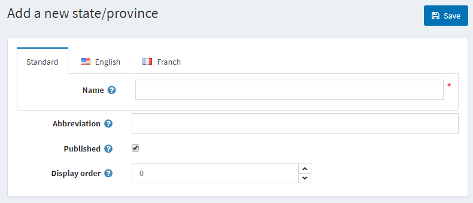
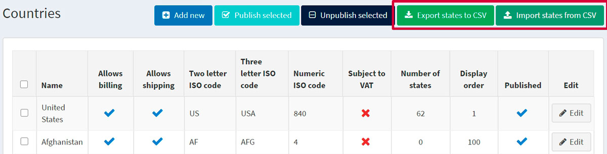

# 國家與州/省

本節說明如何管理國家（顧客所在位置）與州/省。

若要定義國家與州/省，請前往 **設定 → 國家**。

> [!TIP]
>
> 預設情況下，已上傳所有國家。您可以透過選取國家並點擊頁面頂端的對應按鈕來執行 *發佈* 或 *取消發佈*。

## 新增國家

若要新增國家，請點擊 **新增**。

在 *國家資訊* 面板中，定義下列國家設定：

* **名稱**：國家的名稱。
* **允許帳單**：允許位於此國家的顧客進行結帳。
* **允許寄送**：允許將商品寄送至位於此國家的顧客。
* **Two letter ISO code**：輸入該國家的 ISO 二位字母代碼。
* **Three letter ISO code**：輸入該國家的 ISO 三位字母代碼。
* **Numeric ISO code**：輸入該國家的 ISO 數字代碼。
* **Subject to VAT**：勾選此核取方塊以指出該國家的顧客是否需支付歐盟增值稅（European Union value added tax）。

> [!NOTE]
>
> 此欄位僅在稅務設定頁面（設定 → 設定 → 稅務設定）啟用歐盟增值稅選項時使用。

* 若要將特定商店連結至國家，請在 **限制商店** 欄位中選取所需的商店，如下所示：

> [!NOTE]
>
> 此清單僅在您設定多個商店時使用。如需進一步詳細資訊，請參閱 [多商店功能](xref:zh-Hant/getting-started/advanced-configuration/multi-store)。

* **已發佈**：勾選此核取方塊，使該國家能在新帳號註冊以及建立寄送與帳單地址時顯示。
* **顯示順序**：輸入該國家的顯示順序。值為 1 代表顯示在清單最上方。

點擊 **儲存**。

## 新增州與省

在 *州與省* 面板中，您可以新增該國家的州與省份。

> [!TIP]
>
> 預設已加入美國的州。

點擊面板下方的 **新增州/省** 按鈕來新增州或省份。

定義下列州/省細節：

* **名稱**：州或省份的名稱。
* **縮寫**：州或省份的縮寫。
* **已發佈**：勾選此核取方塊以在網站上發佈該州或省份。
* **顯示順序**：在顯示順序欄位中，輸入該省份或州的顯示順序。值為 1 代表顯示在清單最上方。

點擊 **儲存**。

## 匯出/匯入州與省

您可以匯出已新增至系統的所有國家之州/省清單，或使用 **設定 → 國家** 頁面頂端的對應按鈕來匯入額外的資料。

> [!NOTE]
>
> 匯入的檔案格式應與匯出的檔案格式相同。