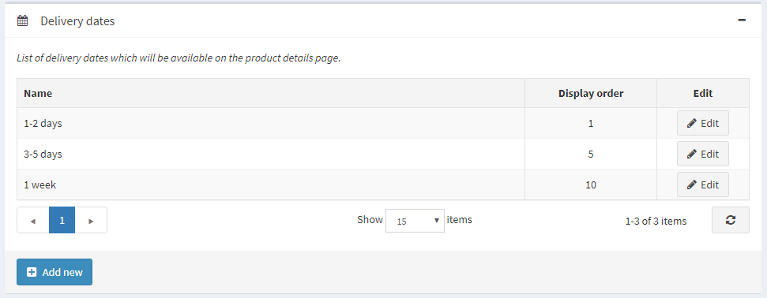
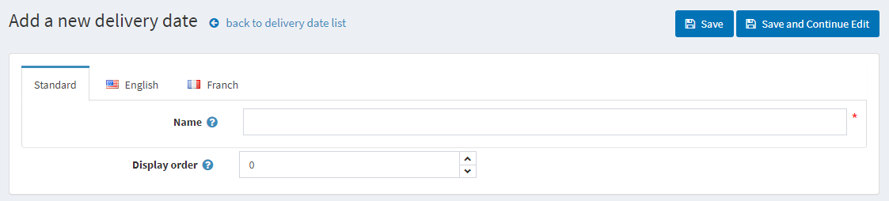
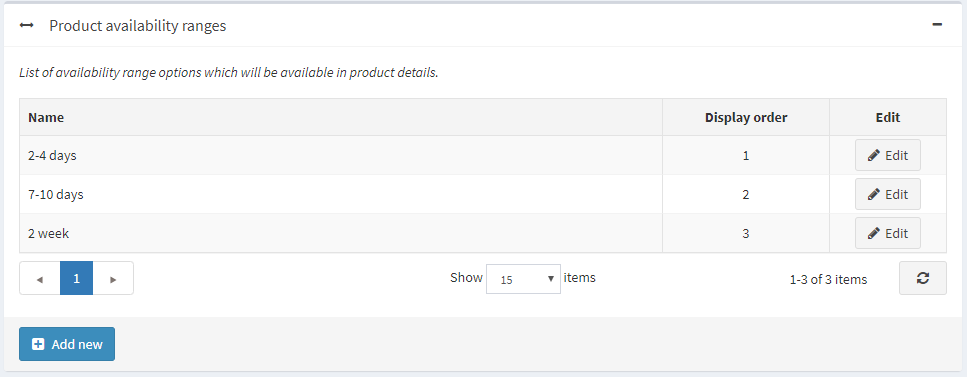
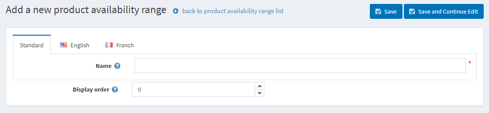

# 日期與範圍

## 到貨日期

到貨日期是指顯示給顧客的大約送達時間範圍。到貨日期可以應用於商品，並顯示在商品詳細頁面上。

* 前往 **設定 → 運送 → 日期與範圍**。在 *日期與範圍* 視窗中將顯示以下兩個面板：

### 到貨日期面板

點擊 **新增**。將會顯示 *新增到貨日期* 視窗：

* 在 **名稱** 欄位中，輸入新到貨日期的名稱；通常這是一個日期範圍。
* 在 **顯示順序** 欄位中，輸入此到貨日期的顯示順序。1 代表列表的最上方。

點擊 **儲存** 按鈕。

### 商品供貨範圍面板

在此，您可以設定商品的供貨範圍。這些選項將顯示在商品編輯頁面上。

點擊 **新增** 以加入您自己的範圍。將會顯示 *新增商品供貨範圍* 視窗：

* 在 **名稱** 欄位中，輸入新範圍的名稱，例如：2 個月。
* 在 **顯示順序** 欄位中，輸入此供貨範圍的顯示順序。1 代表列表的最上方。

點擊 **儲存** 按鈕。