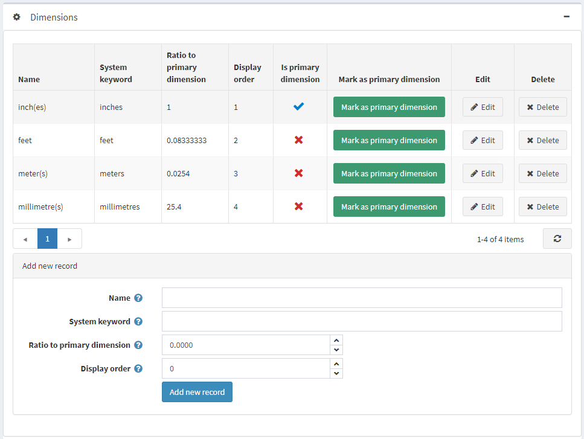
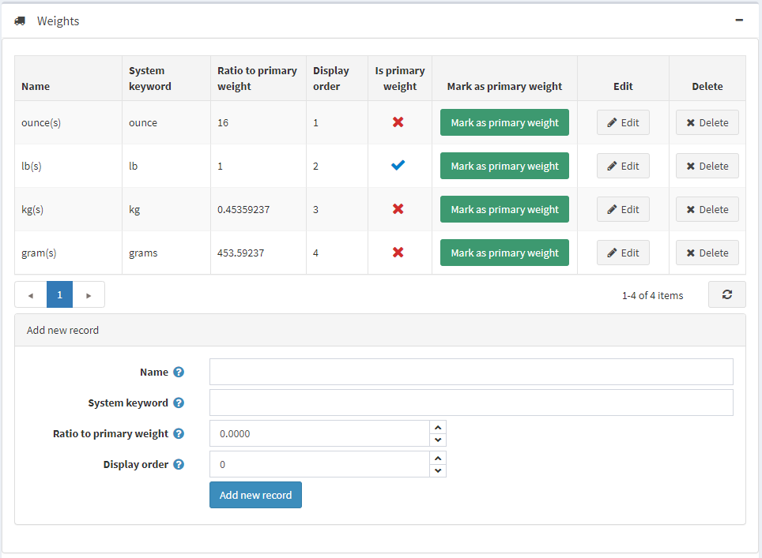

# 度量衡

本章節說明如何新增重量與尺寸的單位。

若要新增尺寸或重量單位：

前往 **設定 → 貨運 → 度量衡**。此時，「尺寸」與「重量」區塊將會展開，如下所示：

在該區塊的最下方，定義下列新單位的詳細資料：

* 新尺寸（或重量）單位的 **名稱**。
* 此單位的 **系統關鍵字**。
* 此單位與主要尺寸（或重量）單位的 **比例**。
* 此度量在清單中的 **顯示順序**。數值 1 代表位於清單最上方。

完成後點選 **新增記錄**。

新的尺寸（或重量）單位將會加入至「尺寸」（或「重量」）表格中。

> [!NOTE]
>
> 您可以透過點選 **標記為主要尺寸（重量）** 來設定主要尺寸（或重量）單位。

點選度量旁邊的 **編輯** 按鈕，即可按照上述說明修改其詳細資料。