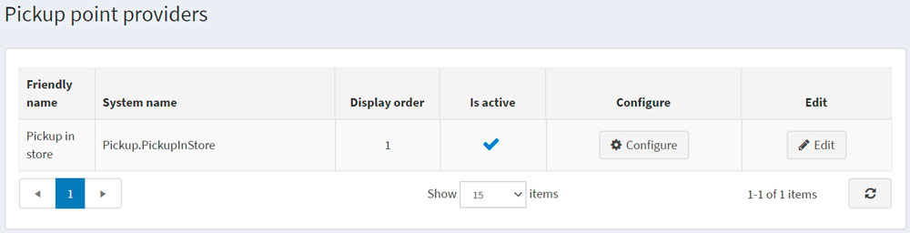
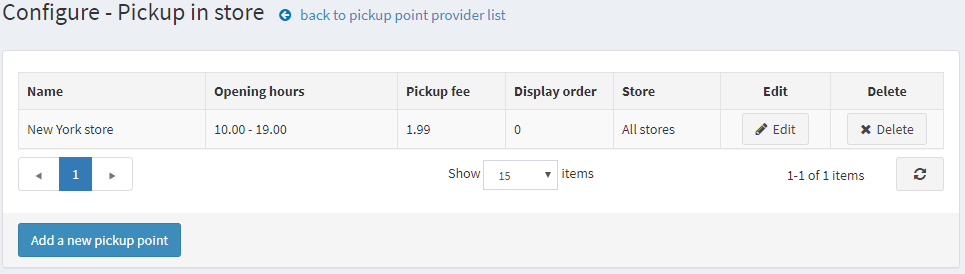
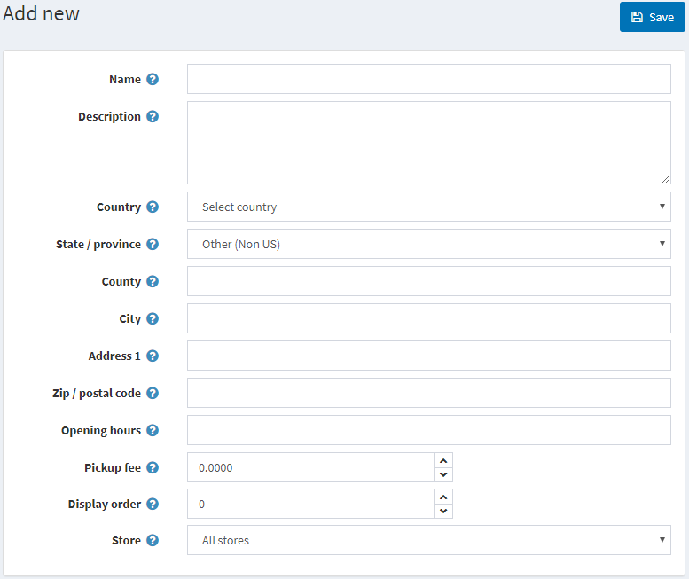

# 取貨點

取貨點是一個提供顧客靈活選擇包裹接收地點的選項。

> [!NOTE]
>
> 此選項僅在運送設定頁面（**設定 → 設定 → 運送設定**）中勾選了 **「店內取貨」已啟用** 核取方塊時才可用。

若要管理取貨點提供者：

前往 **設定 → 運送 → 取貨點**；系統將會顯示 *取貨點提供者* 頁面：

預設情況下，僅有一個 **店內取貨** 選項可用。請確保取貨點提供者處於啟用狀態。如果不是，請點擊 **編輯** 按鈕，並勾選 **已啟用** 欄位中的核取方塊。接著點擊 **更新** 按鈕以儲存變更。

若要編輯現有的取貨點或新增取貨點，請點擊表格中的 **設定**。系統將會開啟 *設定 - 店內取貨* 頁面：

點擊 **新增取貨點**；系統將會顯示 *新增* 視窗：

定義下列詳細資訊：

* 取貨點的 **名稱**。
* 如有需要，請填寫 **說明**。
* 從下拉式選單中選擇 **國家**。
* 從下拉式選單中選擇 **州/省**。
* **城市**。
* **地址 1**。
* **郵遞區號**。
* 取貨點的 **營業時間**。
* 如有需要，請填寫 **取貨費用**。
* 此取貨點的 **顯示順序**。
* 使用此取貨點的 **商店**。

**儲存** 變更。

點擊取貨點旁邊的 **編輯**，即可編輯先前輸入的詳細資訊。