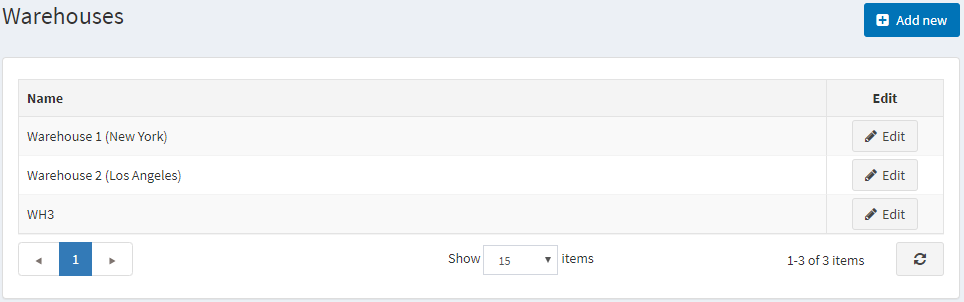
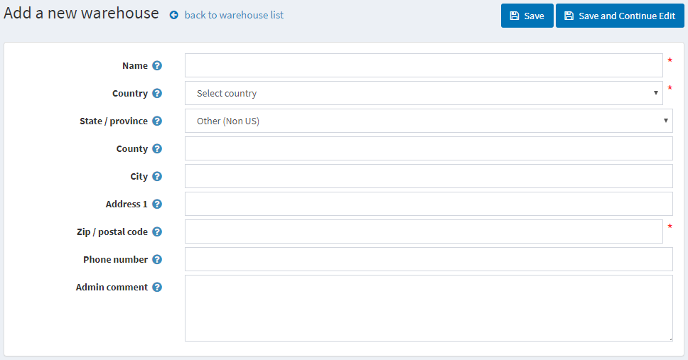
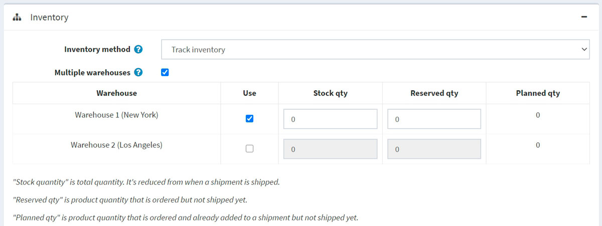

# 倉儲

nopCommerce 支援多倉儲功能。此工具可讓商店擁有者追蹤不同倉儲的庫存，並改善物流效率。

以下章節說明如何新增倉儲。這包含倉儲詳細資訊，例如名稱、國家/地區、地址等。若要新增倉儲：

1. 前往 **設定 → 貨運 → 倉儲**。系統將會顯示 *倉儲 (Warehouses)* 視窗：
    

1. 點擊 **新增 (Add new)**。系統將會顯示 *新增倉儲 (Add a new warehouse)* 視窗：
    

1. 設定以下倉儲詳細資訊：
    * **名稱 (Name)**。
    * 倉儲的 **國家/地區 (Country)**。
    * 倉儲的 **州/省 (State/province)**。
    * 倉儲的 **縣/區 (County/region)**。
    * 倉儲的 **城市 (City)**。
    * 倉儲的 **地址 1 (Address 1)**。
    * 倉儲的 **郵遞區號 (Zip/postal code)**。
    * 倉儲的 **電話號碼 (Phone number)**。
    * 在 **管理員註解 (Admin comment)** 欄位中，輸入選填的註解或內部使用資訊。

完成後，您將能在商品編輯頁面中為您的商品選擇倉儲，甚至使用多倉儲功能：
