# 手動（固定費用、按重量或按總金額計算）

手動（固定費用、按重量或按總金額計算）運送方式允許您為所有預先定義的運送方式設定固定費用，或根據重量及總金額來計算費用。

若要查看此方法如何應用於您的商店範例，請參閱下方的 [範例](#example) 章節。

## 定義手動配送提供者

前往 **設定 → 配送 → 配送提供者**。系統將會顯示 *配送提供者* 視窗：

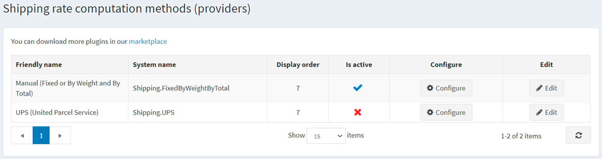

請依照下列步驟啟用手動配送費率計算方法：

* 在 **Manual (fixed or by weight and by total)** 列中，點擊 **編輯** 按鈕。
* 在 **Is active** 欄位中，勾選核取方塊。
* 點擊 **更新** 按鈕。該 *false* 選項將會變更為 *true*。

點擊清單中 Manual (fixed or by weight and by total) 選項旁邊的 **設定** 按鈕。

您可以透過點擊頁面上方的按鈕，將 *固定費率 (Fixed rate)* 配送費計算方式切換為 *依重量/總計 (By weight/total)* 計算方式。

## 設定固定費率

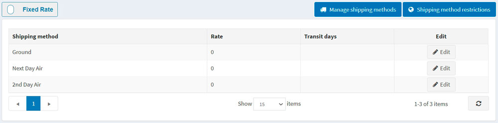

點擊物流方式旁邊的 **編輯 (Edit)** 按鈕，並為其輸入 **費率 (Rate)** 和 **運送天數 (Transit days)**（如有需要）。

點擊 **更新 (Update)**。

> [!NOTE]
>
> 您可以透過點擊  開啟「物流方式視窗」來新增或移除物流方式，並透過點擊上方的  來針對特定國家限制某些物流方式。

## 依重量/總計設定運費

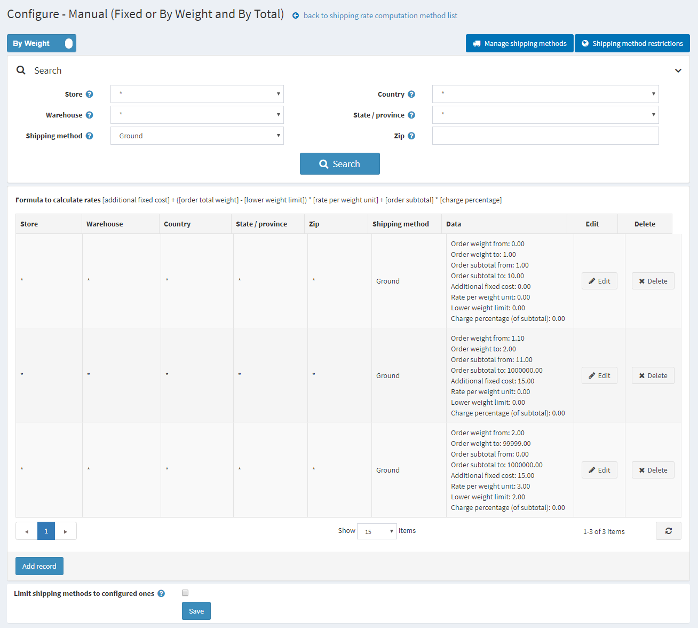

**依重量及總計運費（shipping by weight and by total）**選項允許您根據貨件的重量與總計金額設定不同的運費。根據貨件的重量與總計金額收取不同費用的能力，有助於公司在寄送重型商品時控制運費，同時又能為購買輕型產品的顧客提供合理的運費。

使用公式 **[額外固定成本] + ([訂單總重量] - [重量下限]) &times; [單位重量費率] + [訂單小計] &times; [收費百分比]** 來計算費用，其中：

* **額外固定成本（additional fixed cost）** 是指重量低於特定水平（重量下限）時的貨件成本。
* **單位重量費率（rate per weight unit）** 是指超過重量下限後，每單位重量的成本。
* **訂單小計與收費百分比（order subtotal and charge percentage）** 是根據訂單小計計算額外成本的參數。

例如，如果您有以下運送條件：

* 若重量為 0 到 1 磅，且訂單小計為 $1 到 $10，則成本為 $10。您應該建立**下列運送規則**：
  * 訂單重量起始：**0**
  * 訂單重量結束：**1**
  * 訂單小計起始：**1**
  * 訂單小計結束：**10**
  * 額外固定成本：**10**
  * 重量下限：**0**
  * 單位重量費率：**0**
* 若重量為 1.1 磅到 2 磅，且訂單小計為 $11 到 $1,000,000，則成本為 $15。您應該建立**下列運送規則**：
  * 訂單重量起始：**1.000**
  * 訂單重量結束：**2**
  * 訂單小計起始：**11**
  * 訂單小計結束：**1000000**
  * 額外固定成本：**15**
  * 重量下限：**0**
  * 單位重量費率：**0**
* 若超過 2 磅，每額外 0.5 磅的成本為 $3。您應該建立**下列運送規則**：
  * 如果您的固定成本為 $15，則超過 2 磅後每磅的成本為 $6
  * 訂單重量起始：**2.0001**
  * 訂單重量結束：**99999**
  * 額外固定成本：**15**
  * 重量下限：**2**
  * 單位重量費率：**6**
  
 > [!NOTE]
 >
 > 超出部分的重量將按比例收費；
 > 例如，對於 2.1 磅的貨件，$15 + (0.1 * 6) = $15.6 將會被計費。

要新增運送規則，請點擊 **新增記錄**。系統將顯示 *新增記錄* 視窗：

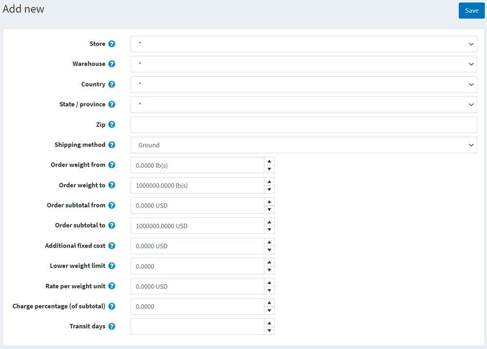

定義以下資訊：

* **商店**：將應用此計算費用的商店。選擇 * 以將規則套用到所有商店。
* **倉庫**：進行運送作業的倉庫。選擇 * 以將規則套用到所有倉庫。
* **國家、州/省、郵遞區號**：貨件的目的地。
* 從預先建立的選項清單中選擇一個 **運送方式**。使用上方的 **管理運送方式** 來新增/移除運送方式，或前往 [設定運送方式](#configure-shipping-methods) 章節了解更多資訊。
* 透過填寫 **訂單重量起始** 與 **訂單重量結束** 欄位來建立您的重量設定。如果顧客的貨件重量落在此範圍內，額外成本將會固定並根據此記錄進行計算。
* 使用 **訂單小計起始、訂單小計結束、額外固定成本、重量下限、單位重量費率、收費百分比（小計的百分比）** 欄位，為此記錄設定定價規則。
* 定義 **轉運天數** 欄位，該欄位定義了預計送達的天數。

> [!NOTE]
>
> 請確保 **設定 → 設定 → 運送設定 → 考慮關聯商品的尺寸與重量** 設定為「開啟（true）」。

點擊 **儲存**。

> [!NOTE]
>
> 如果您希望將顧客僅限制在該畫面上設定的運送方式，請勾選頁面底部的 **將運送方式限制為已設定的方式** 核取方塊。

## 設定運送方式

商店擁有者可以定義在「手動（固定金額或依重量與總價）」提供者中所使用的運送方式清單。若要管理運送方式：

前往 **設定 → 運送 → 運送提供者**。接著點擊「手動（固定金額或依重量與總價）」提供者旁邊的 **設定** 按鈕。此時將會顯示設定視窗：

點擊 **管理運送方式**；接著將會顯示「運送方式視窗」：

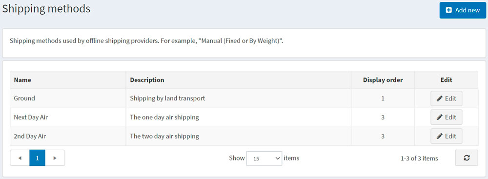

點擊 **新增** 按鈕；「新增運送方式」視窗將會如下顯示：

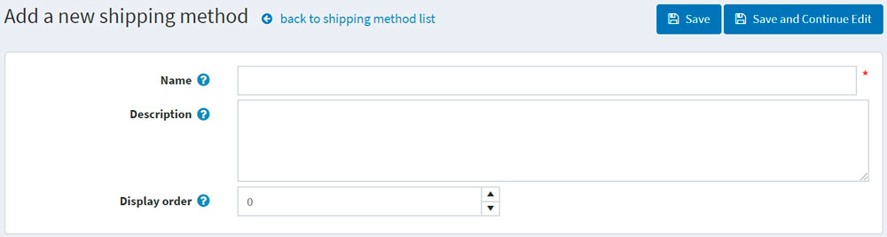

為新紀錄定義以下欄位：

* **名稱**：顧客所看到的運送方式名稱。
* **說明**：顧客所看到的運送方式說明。
* **顯示順序**：運送方式的顯示順序。值為 1 代表在清單的最上方。

點擊 **儲存**。

> [!NOTE]
>
> 您可以在「運送方式」視窗中點擊 **編輯**，以編輯如上述所示的現有運送方式。

## 運送方式限制

商店管理者可以在特定國家/地區定義運送方式的限制。若要執行此動作，請前往 **設定 → 運送 → 運送提供者**。點擊 *Manual (fixed or by weight and by total)* 提供者旁邊的 **設定** 按鈕。此時將會顯示設定視窗：

點擊 **運送方式限制**；此時將會顯示 *運送方式限制* 視窗：

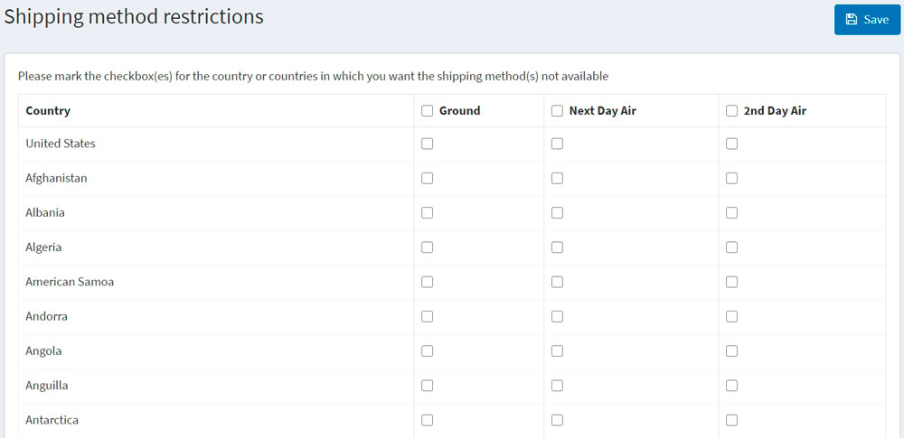

選取您想要在特定國家/地區停用的一種或多種運送方式。

如有需要，您可以選取該限制欄位以套用至所有國家/地區。

點擊 **儲存**。

## 範例

假設您有一家位於美國的商店，提供美國境內以及運送到加拿大的服務。您設定了三種可用的運送方式：

* **Ground**：允許透過陸路運輸運送。
* **Next day air**：提供次日航空運送。
* **2nd day air**：提供兩日航空運送。

> [!TIP]
>
> 您可以點擊「設定 - 手動（固定費用或依重量與總計）」頁面上的 **管理運送方式** 按鈕來新增您自己的運送方式。

接著，假設運費取決於訂單總金額與運送地址。例如：

* 若顧客的訂單金額為 $150，我們僅針對美國境內提供 **Ground** 方式的免運費服務。若訂單總額低於 $150，我們將收取 $10。美國境內的配送時間為 5 天。
* 針對加拿大，顧客需訂購金額達 $250 的商品，才能透過 **Ground** 方式享受免運費。若訂單總額低於 $250，我們將收取 $20。此情況下的配送時間為 7 天。
* 若顧客需要 **Next day air** 配送，美國境內的運費為 $60。假設您希望停用加拿大地區的 **Next day air** 選項。
* 若顧客願意多等一天，我們建議使用 **2nd day air** 運送，美國與加拿大地區的費用皆為 $40。

考量到上述所有需求，我們將在「設定 - 手動（固定費用或依重量與總計）」頁面上設定付款方式如下：

* **Ground** 方式
  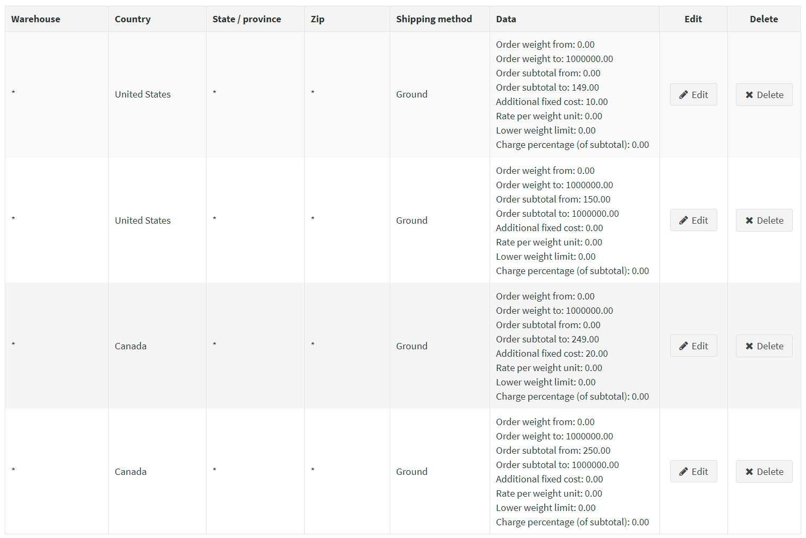

* **Next day air** 方式
  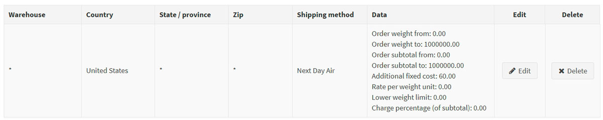

* **2nd day air** 方式
  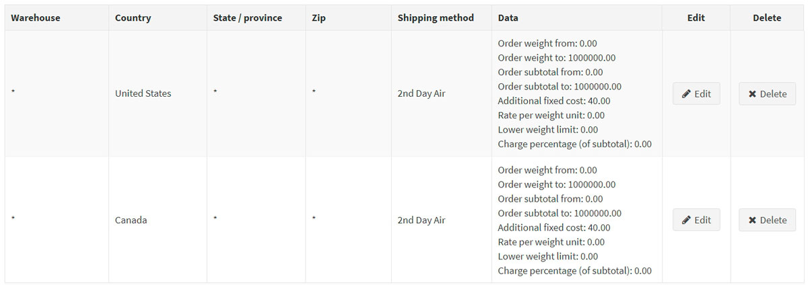

若要停用加拿大地區的 **Next day air** 選項，請點擊 **運送方式限制** 按鈕，並依照下列方式填寫「運送方式限制」：
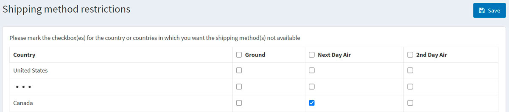

### 讓我們看看在前端商店中運送選項的樣貌

1. 每當來自美國的顧客造訪商品頁面（或購物車頁面）時，運費預估將顯示如下：
  
    > [!TIP]
    >
    > 順帶一提，您可以透過取消勾選 **設定 → 設定 → 運送設定** 頁面上的 **啟用運費預估（購物車頁面）** 以及 **啟用運費預估（商品頁面）** 核取方塊來停用運費預估功能。

    當顧客繼續進行運送細節流程時，將會顯示下列選項：
    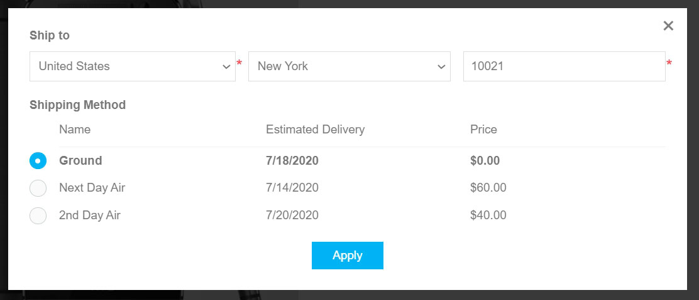

2. 每當顧客在運費預估視窗中選擇加拿大時，將會顯示下列選項：
  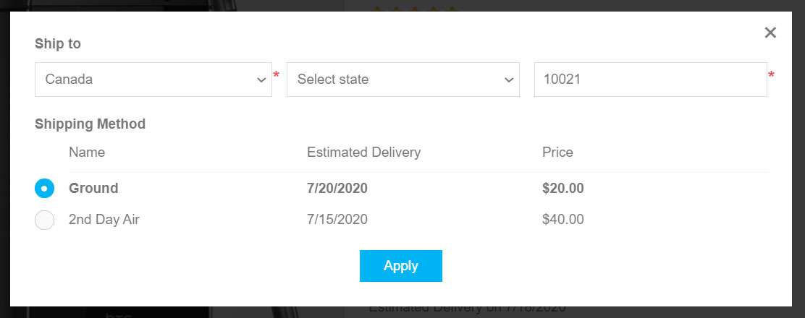
    如您所見，**Next day air** 選項已不再提供。

> [!TIP]
>
> 如果您想提供取貨點給顧客，請參閱 [取貨點](xref:zh-Hant/getting-started/configure-shipping/advanced-configuration/pickup-points) 章節以了解如何進行設定。

## 教學課程

* [設定人工物流方式](https://www.youtube.com/watch?v=1nYj0NqVUWw&t=8s)