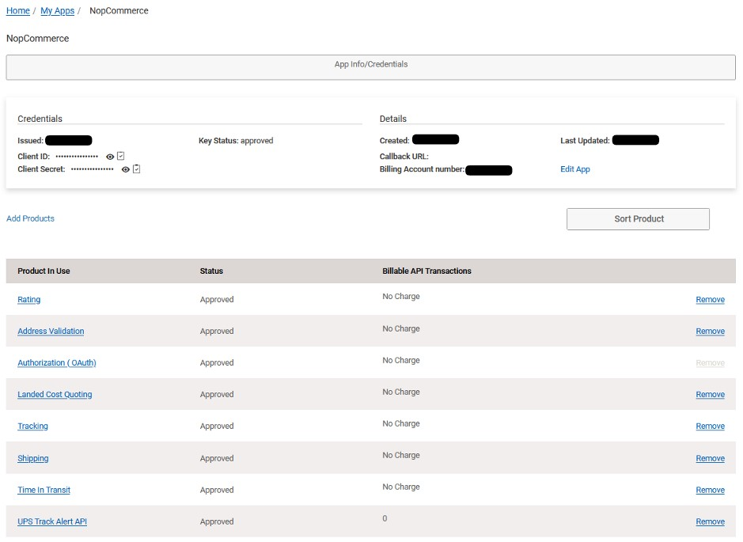
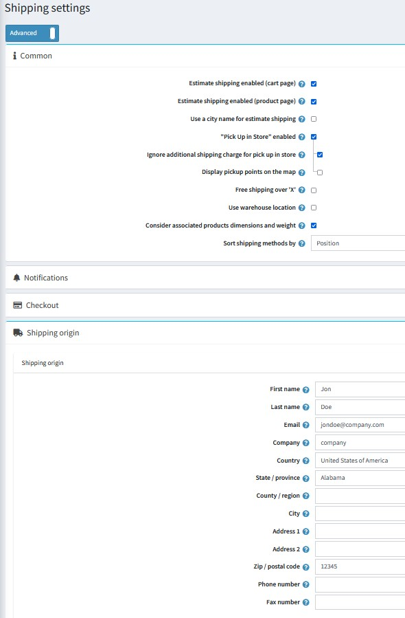
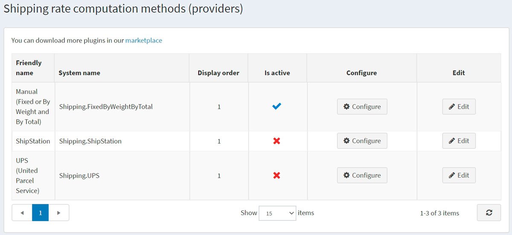
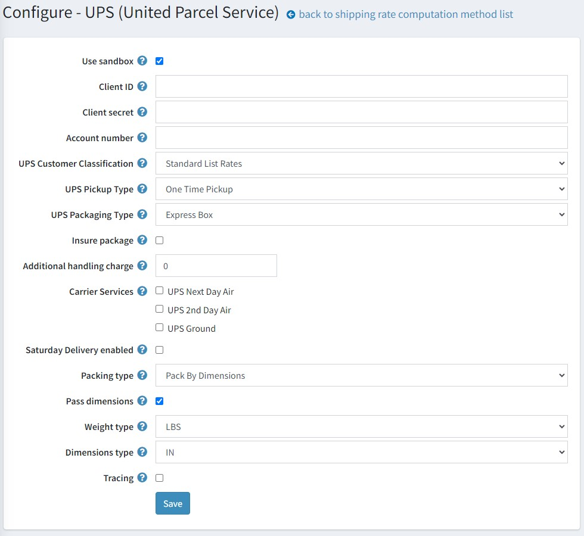

# UPS

## 定義 UPS 即時運費計算

1. 透過 [UPS.com](https://www.ups.com/) 建立 UPS 使用者帳號，然後前往 [developer.ups.com](https://developer.ups.com/)，並建立一個應用程式以取得以下資訊：
   * Client ID
   * Client Secret
     > [!NOTE]
     > 這是為了使用 UPS OAuth，所有 2023 年 6 月之後的新帳號，以及 2024 年 6 月之後的所有帳號均強制要求使用此驗證方式。

     

2. 加入 UPS 產品以啟用貨件追蹤、費率計算等功能。推薦的產品如下：

   * Rating（費率計算）
   * Address Validation（地址驗證）
   * Landed Cost Quoting（到岸成本報價）
   * Tracking（追蹤）
   * Shipping（貨運）
   * Time In Transit（運送時間）

3. 在 nopCommerce 管理後台，前往 **設定 → 設定 → 貨運設定**。設定貨運點位置。預設選項是設定單一的 **貨運起始地 (Shipping Origin)**，此項設定在頁面下方。然而，如果您希望使用在 **設定 → 貨運 → 倉庫** 中設定的內容，也可以選擇 **使用倉庫位置 (Use Warehouse Location)**。點擊頁面設定選擇器下方的 **Shipping settings** 標題，選擇 **進階 (Advanced)** 即可顯示 **使用倉庫位置** 核取方塊。

   

4. 在 nopCommerce 管理後台，前往 **設定 → 貨運 → 貨運提供者**。
   

5. 啟用此方式步驟如下：

   * 在 UPS (United Postal Service) 資料列中，點擊 **編輯** 按鈕。
   * 在 **啟用 (Is active)** 欄位中，勾選該選項。
   * 點擊 **更新**。該 *false* 選項將變更為 *true*。
6. 點擊清單中 UPS (United Parcel Service) 選項旁邊的 **設定**。
   系統將顯示 *設定 – UPS (United Parcel Service)* 視窗，如下所示：

   > [!WARNING]
   > 自 2024 年 6 月起，您將無法再使用存取金鑰 (Access Key) 來進行 UPS API 驗證，必須將安全模型更新為 OAuth 2.0。

7. 輸入從 UPS 提供者取得的下列資訊，並選擇與您商店相關的選項：

   * 勾選 **使用沙盒 (Use sandbox)** 核取方塊以使用測試環境。
   * 輸入 UPS 提供者的 **Client ID**。
   * 輸入從提供者取得的 **Client Secret**。
   * 輸入從提供者取得的 **帳號號碼 (Account Number)**。
   * 選擇您所需的 **UPS 顧客分類 (UPS Customer Classification)**：
     * Rates Associated With Shipper Number（與託運人號碼相關的費率）
     * Daily Rates（每日費率）
     * Retail Rates（零售費率）
     * Regional Rates（區域費率）
     * General List Rates（一般列表費率）
     * Standard List Rates（標準列表費率）
   * 選擇您所需的 **UPS 取貨類型 (UPS Pickup Type)**：
     * Daily Pickup（每日取貨）
     * Customer Counter（顧客櫃台）
     * One Time Pickup（單次取貨）
     * On Call Air（電話預約空運取貨）
     * Letter Center（信件中心）
     * Air Service Center（航空服務中心）
   * 選擇您所需的 **UPS 包裝類型 (UPS Packaging Type)**：
     * Unknown（未知）
     * Letter（信件）
     * Customer Supplied Package（客戶自備包裹）
     * Tube（圓筒）
     * P A K
     * Express Box（快遞盒）
     * 10 kg Box（10公斤盒）
     * 25 kg Box（25公斤盒）
     * Pallet（棧板）
     * Small Express Box（小型快遞盒）
     * Medium Express Box（中型快遞盒）
     * Large Express Box（大型快遞盒）
   * 勾選 **保險包裹 (Insure package)** 核取方塊，表示包裹將進行保險。
   * 輸入 **額外手續費 (Additional handling charge)**。這是向顧客收取的額外費用。
   * 選擇您要提供給顧客的 **承運商服務 (Carrier Services)**。
   * 選擇是否啟用 **週六配送 (Saturday Delivery enabled)** 的費率計算。
   * 選擇 **包裝類型 (Packing type)**：
     * Pack by dimensions（依尺寸包裝）
     * Pack by one item per package（每個包裹單一項目包裝）
     * Pack by volume（依體積包裝）
   * 勾選 **傳遞尺寸 (Pass dimensions)** 核取方塊，以便在請求費率時傳遞包裹尺寸。
   * 選擇 **重量單位 (Weight type)** – 英磅或公斤。
   * 選擇 **尺寸單位 (Dimensions type)** – 英吋或公分。
   * 勾選 **追蹤 (Tracing)** 核取方塊以將系統追蹤記錄至系統日誌中。系統將記錄完整的請求與回應 XML（包含 AccessKey/使用者名稱、密碼）。請勿在正式環境中保持此功能開啟。

   點擊 **儲存**。