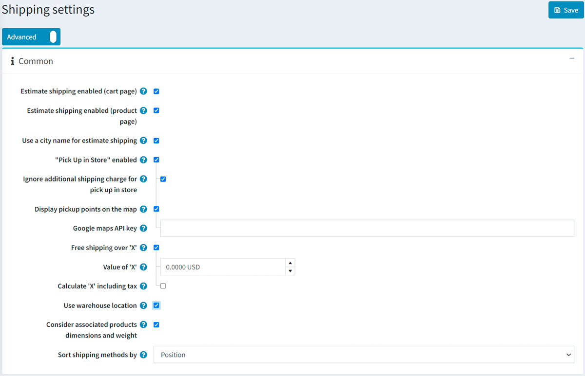
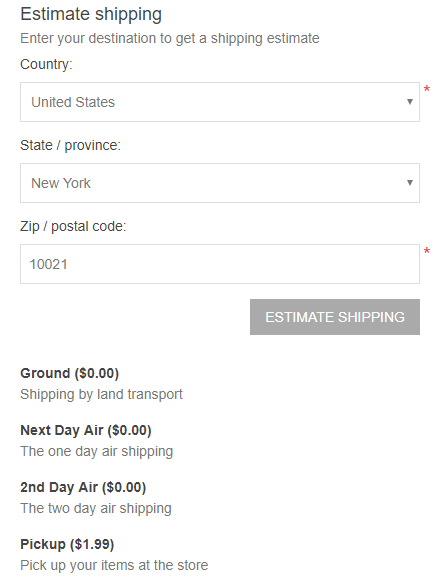
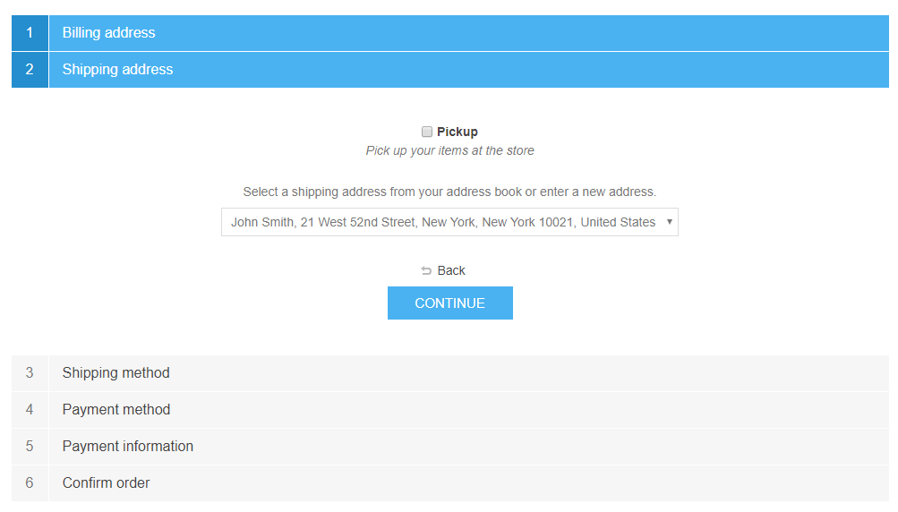
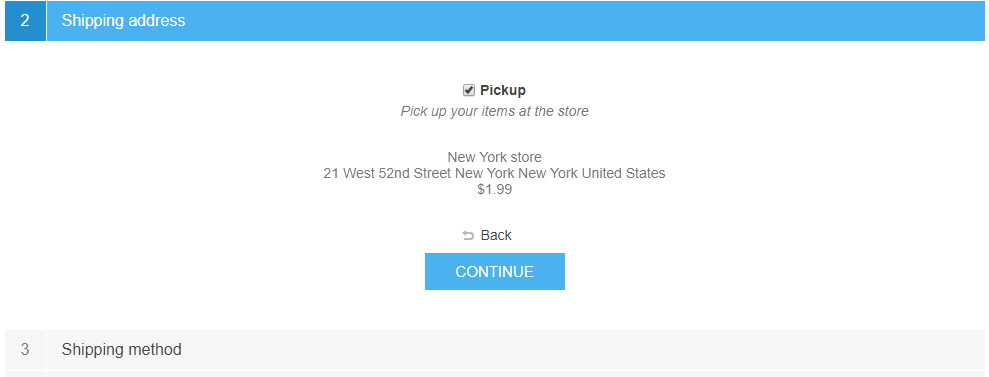
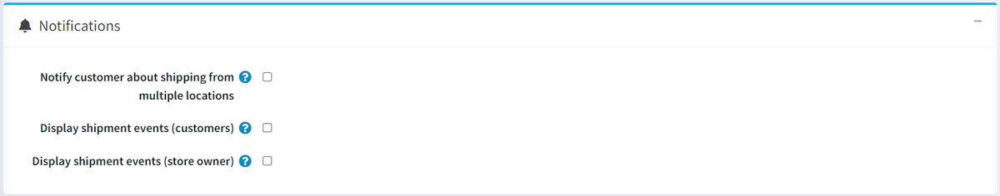
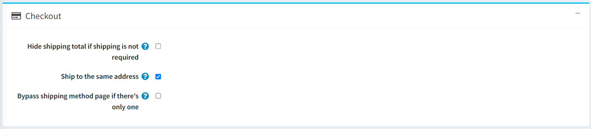
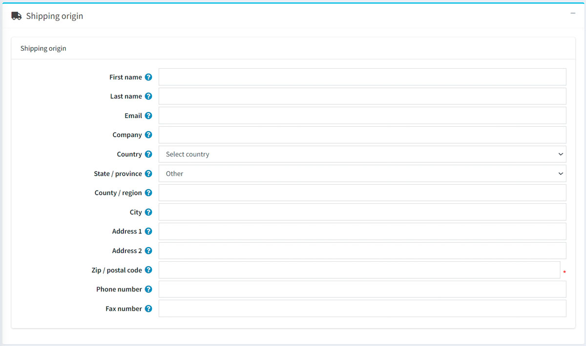

# 運送設定

本章節說明如何設定商店的運送詳細資訊。除了地點與倉庫設定外，其他因素也有助於完善物流管理。

若要管理運送設定，請前往 **設定 → 設定 → 運送設定**。

在「一般」面板中定義您的運送設定如下：

* 勾選 **啟用運費預估（購物車頁面）**，以便在購物車頁面中，根據顧客的收貨地址顯示預估運費資訊。請參考下方的截圖以了解其呈現方式。
* 勾選 **啟用運費預估（商品頁面）**，以便在商品詳細頁面中，根據顧客的收貨地址顯示預估運費資訊。請參考下方的截圖以了解其呈現方式。

* 勾選 **使用城市名稱進行運費預估** 核取方塊，允許顧客輸入城市名稱，而非使用 ZIP 或郵遞區號。
* 勾選 **啟用「店內取貨」**，以便在結帳流程的收貨地址步驟中顯示店內取貨選項。使用者將會看到以下畫面：

 

* 若有需要，請勾選 **忽略店內取貨的額外運費** 核取方塊。
* 若希望在地圖上顯示取貨點，請選擇 **在地圖上顯示取貨點**。若選取此選項，顧客將無需輸入收貨地址並選擇運送方式。
* **Google 地圖 API 金鑰**：若已開啟上述設定，請在此處指定 Google 地圖 API 金鑰。

> [!Note]
>
> 您也可以為「店內取貨」選項指定費用。若要執行此操作，請前往 **設定 → 運送 → 取貨點** 並設定對應的取貨點提供者。詳情請參閱：[取貨點](xref:zh-Hant/getting-started/configure-shipping/advanced-configuration/pickup-points)。

* 選擇 **「x」金額以上免運費**，以啟用超過特定總金額的訂單免運費功能。隨後將顯示下一個欄位，供您定義 'x' 的數值。
* 在 **'x' 的數值** 欄位中，輸入金額門檻，超過此總金額的所有訂單均可享有免運費優惠。
* **計算 'x' 時包含稅金**：若未勾選，則計算數值時將不含稅。
* 勾選 **使用倉庫位置**，以便在請求運費計算時使用倉庫地點。這對於從多個倉庫出貨的情況非常實用。
* 勾選 **考慮關聯商品的尺寸與重量**，以便在計算運費時納入關聯商品的尺寸與重量；例如，若主商品已包含這些資訊，則可取消勾選。
* 在 **運送方式排序依據** 下拉式選單中，選擇要用來排序運送方式的欄位。

在「通知」面板中定義您的運送設定如下：

* 若有需要，請勾選 **通知顧客從多個地點運送**。這對於從多個倉庫出貨的情況非常實用。
* 選擇 **顯示出貨事件（顧客）**，以便顧客在他們的出貨詳細頁面上查看出貨進度。

    > [!NOTE]
    >
    > 注意：若要啟用此功能，運送計算方式必須支援此功能。

* 勾選 **顯示出貨事件（商店擁有者）**，以便商店擁有者在他們的出貨詳細頁面上查看出貨進度。
    > [!NOTE]
    >
    > 注意：若要啟用此功能，運送計算方式同樣必須支援此功能。

接著定義「結帳」設定：

* 若希望在無需運送時隱藏「運費總計」標籤，請勾選 **若無需運送則隱藏運費總計** 核取方塊。
* 勾選 **運送至相同地址** 核取方塊，以便在結帳（帳單地址步驟）期間顯示「運送至相同地址」選項。在這種情況下，將會跳過「收貨地址」及其對應選項（例如店內取貨）。

    > [!NOTE]
    >
    > 使用此設定時，請確保所有帳單國家/地區（**設定 → 國家/地區**）皆支援運送（已勾選 **允許運送** 核取方塊）。

* 若只有一種運送方式可用，請選擇 **略過運送方式頁面**。此頁面將不會在結帳流程中顯示。

定義「運送來源詳細資訊」：

這包含以下地址欄位：

* 選擇 **國家/地區**。
* 選擇 **州/省**。
* 定義 **縣市/區域**。
* 輸入必填的 **城市**。
* 輸入必填的 **地址 1**。
* 輸入必填的 **ZIP/郵遞區號**。

以及其他欄位。

點擊 **儲存**。