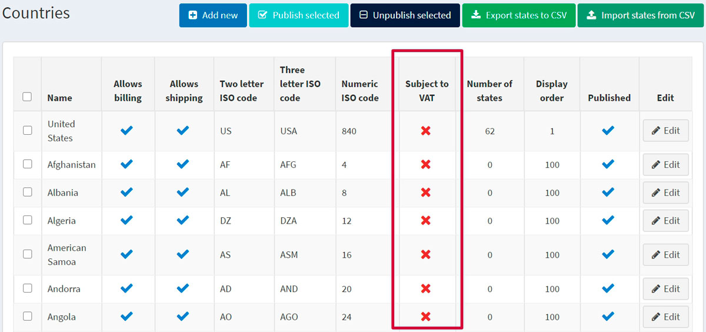
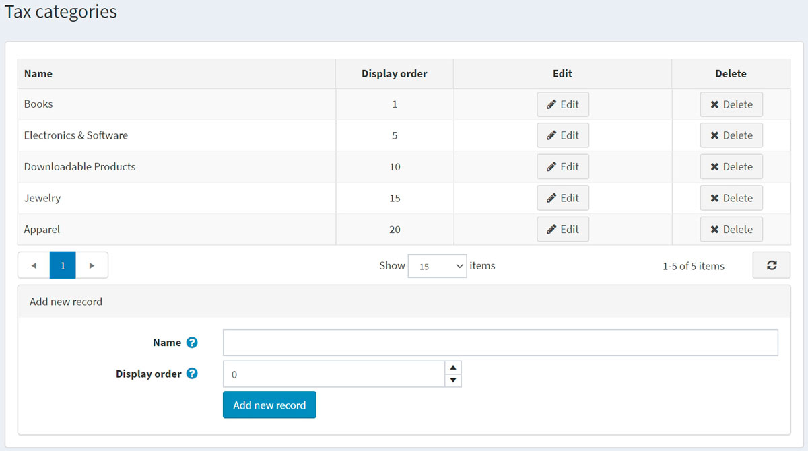
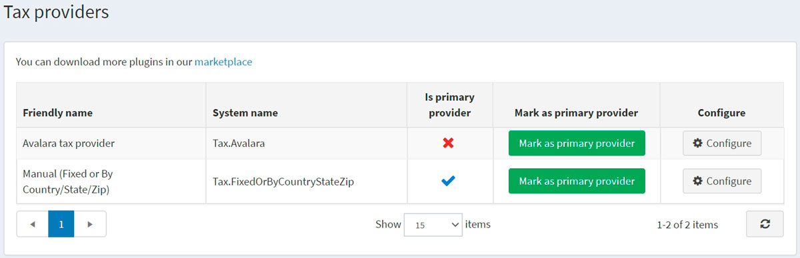
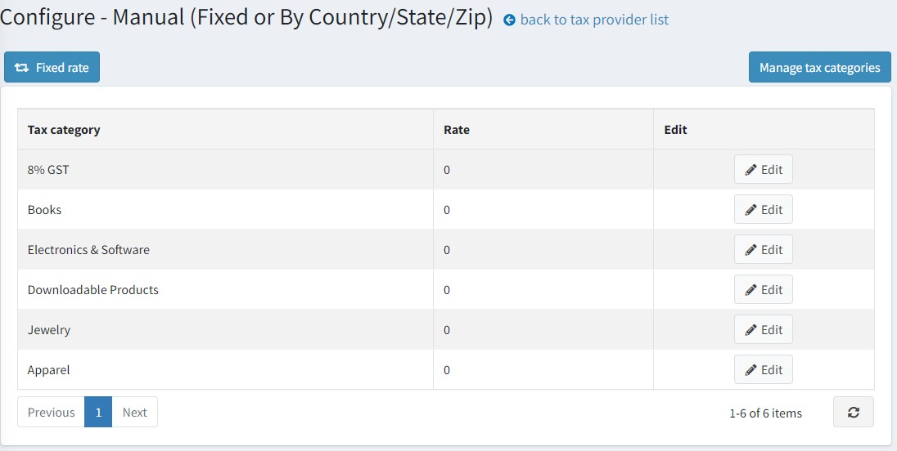
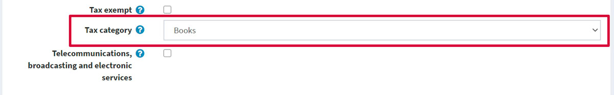

# 設定稅務

本章節涵蓋 nopCommerce 稅務工具的相關設定。

> [!NOTE]
>
> 本章節包含 nopCommerce 內建的稅務工具，不包含第三方稅務服務。

nopCommerce 同時支援外部服務，但這些服務需要從 [市集 (Marketplace)](http://www.nopcommerce.com/marketplace) 安裝對應的外掛。此類模組的安裝流程詳見 [外掛 (Plugins)](xref:zh-Hant/developer/plugins/index) 章節。

## 歐盟 VAT 設定指南

若要為位於歐盟的商店設定 nopCommerce 的 VAT（增值稅）支援，請前往 **設定 → 設定 → 稅務設定**。

在「通用 (Common)」面板中：

* 將 **稅務基準 (Tax based on)** 設定為 **收件地址 (Shipping address)**。

在「VAT」面板中：

* 勾選 **啟用歐盟 VAT (EU VAT enabled)**。這將確保僅針對歐盟境內的貨運收取稅金。
* 選擇您商店所在的 **國家/地區 (Country)**。
* 若適用，請勾選 *允許 VAT 免稅 (Allow VAT exemption)*。這將確保您那些位於歐盟境內但不在商店所在國的 VAT 註冊顧客，不會被收取 VAT。
* 勾選 **假設 VAT 永遠有效 (Assume VAT always valid)** 核取方塊以跳過 VAT 驗證。輸入的 VAT 號碼將被視為永遠有效。提供正確的 VAT 號碼將由顧客自行負責。
* 如果您勾選了 **允許 VAT 免稅 (Allow VAT exemption)**，那麼您可能也會想要勾選「**使用 Web 服務 (Use web service)**」和「**當提交新的 VAT 號碼時通知管理員 (Notify admin when a new VAT number is submitted)**」核取方塊。

點擊 **儲存 (Save)** 按鈕。

前往 **設定 → 國家/地區 (Countries)**。請確保所有在 VAT 範圍內的國家/地區，其 **須課徵 VAT (Subject to VAT)** 屬性都設為 *true*。

> [!NOTE]
>
> 澤西島 (Jersey)、根西島 (Guernsey) 以及其他海峽群島既不屬於英國，也不在 VAT 的適用範圍內。如果您有銷售商品到這些地方，您可能需要進行相關變更。

前往 **設定 → 稅務類別 (Tax categories)**。

為您所在國家/地區的每一種 VAT 稅率設定一個稅務類別。例如：「標準稅率 (Standard Rate)」、「零稅率 (Zero rate)」、「折扣稅率 (Discounted rate)」。刪除預設存在但不再適用的類別。

前往 **設定 → 稅務提供者 (Tax providers)**。使用 **標記為主要提供者 (Mark as primary provider)** 按鈕，將 **人工 (固定或按國家/地區/州/郵遞區號) (Manual (fixed or by country/state/zip))** 設定為預設提供者。

點擊 **人工 (固定或按國家/地區/州/郵遞區號) (Manual (fixed or by country/state/zip))** 提供者列中的 **設定 (Configure)** 以編輯稅率。在頁面頂部，您會看到一個按鈕。點擊該按鈕以切換至 **固定稅率 (Fixed rate)** 模式。

在此頁面上，您可以看到您的 VAT 稅率類別。點擊每個類別旁邊的 **編輯 (Edit)**，然後輸入百分比稅率。接著點擊 **更新 (Update)** 按鈕。

請確保所有商品都在其 [商品頁面 (product pages)](xref:zh-Hant/running-your-store/catalog/products/add-products) 上指派了稅務類別。

## 參閱

* [稅務設定 (Tax settings)](xref:zh-Hant/getting-started/configure-taxes/tax-settings)
* [稅務提供者 (Tax providers)](xref:zh-Hant/getting-started/configure-taxes/tax-providers/index)