# Avalara 稅務提供者

## 連接到 AvaTax

安裝 Avalara 稅務提供者後，您需要設定其整合功能。

> [!NOTE]
>
> 請確保該外掛已安裝並設定為「啟用」狀態（**設定 → 本地外掛**）。若要啟用此外掛，請點擊 **編輯** 並勾選 **已啟用** 核取方塊。

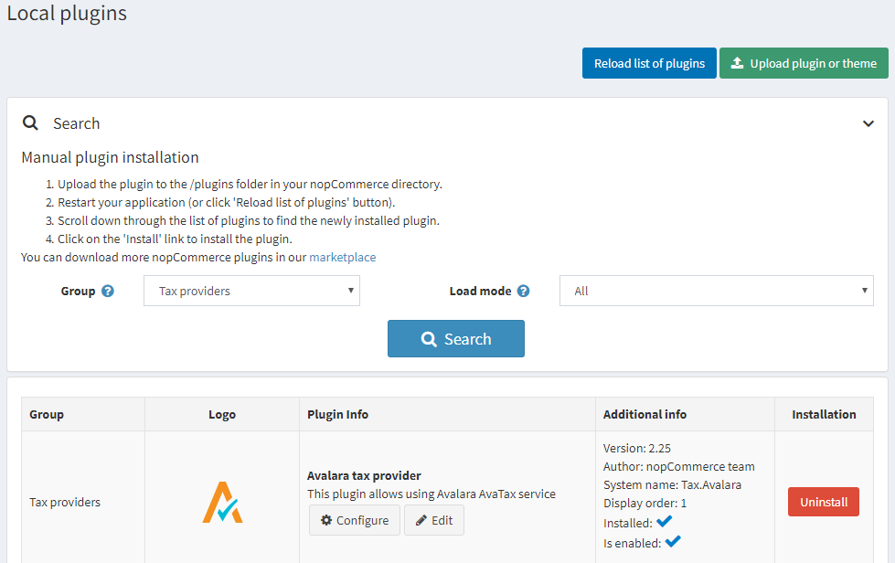

若要設定 Avalara 稅務提供者，請前往 **設定 → 稅務提供者**。

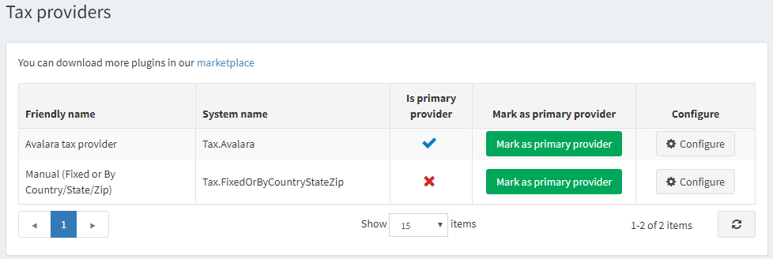

點擊 **標記為主要提供者**。

點擊清單中 Avalara 稅務提供者選項旁邊的 **設定**。

請依照頁面頂端的說明建立帳戶。
接著進行外掛設定；當滑鼠游標停留在「?」圖示上時，會顯示各欄位的功能說明。

1. 設定您的 AvaTax 憑證：

    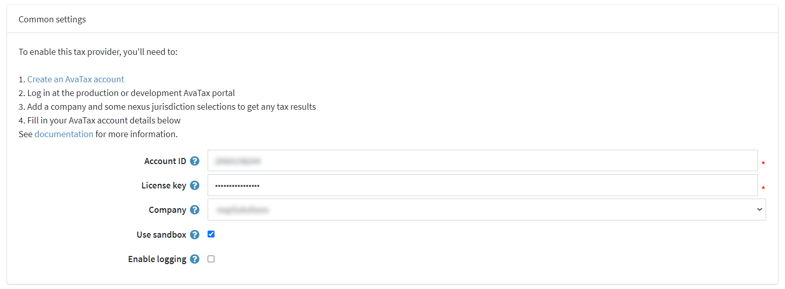

    * **Account ID**：在 AvaTax 帳戶啟用過程中提供。
    * **License key**：在 AvaTax 帳戶啟用過程中提供。
    * **Company**：AvaTax 管理控制台中的公司設定檔識別碼。
    * **Use sandbox**：啟用後即可提交測試交易。
    * **Enable logging**：啟用後會記錄所有對 Avalara 服務的請求。

2. 設定稅額計算設定：

    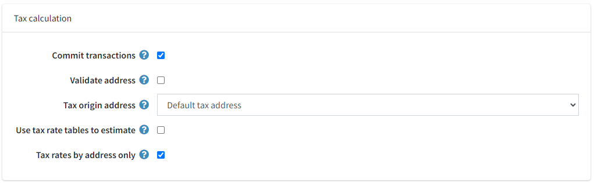

    * **Commit transactions**：啟用後可在交易儲存後立即提交。
    * **Validate address**：啟用後可驗證所輸入的地址。
    * **Tax origin address**：用於向 Avalara 服務發送稅務請求。
    * **Use tax rate tables to estimate**：決定是否使用稅率表進行預估。此設定將作為目錄頁面的預設稅額計算方式，並在結帳期間調整與核對為最終交易稅額。稅率會根據郵遞區號（僅限美國）在 Avalara 定期更新的檔案中查詢（參閱排程任務）。
    * **Tax rates by address only**：若上述設定未勾選，則會顯示此選項。啟用它可僅根據地址獲取稅率（可減少 API 呼叫次數，但可能會影響結果準確度）。

3. 設定稅務免稅設定：

    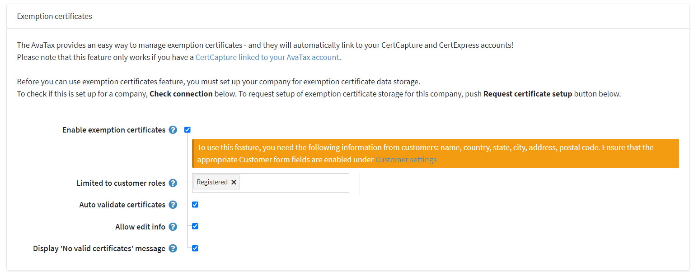

    * **Enable exemption certificates**：啟用後可啟用免稅證明功能。
    * **Limited to customer roles**：用於限制可存取此功能的顧客角色。
    * **Auto validate certificates**：啟用後可自動驗證新上傳或建立的證明。
    * **Allow edit info**：啟用後允許顧客在管理證明時編輯其資訊（如姓名、電話、地址）。
    * **Display 'No valid certificates' message**：啟用後，若顧客在訂單確認頁面上沒有有效的證明，將會顯示相關訊息。

    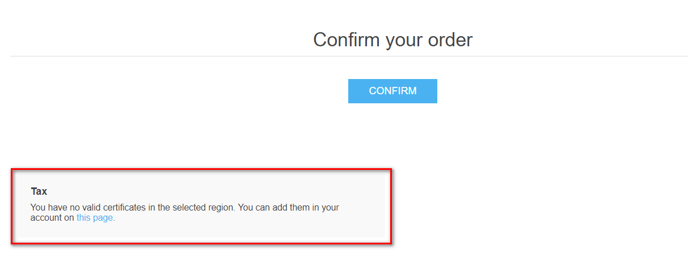

    > [!TIP]
    >
    > 此訊息文字可在語言資源中進行編輯。

4. **儲存** 並點擊 **測試連線** 按鈕以執行連線測試。
5. 若要執行「測試稅額計算」，請填寫頁面底部的地址表單（請注意，nopCommerce Avalara 稅務外掛僅針對美國地址提交交易），然後點擊 **測試稅務交易**。

    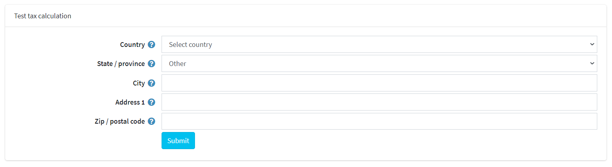

## 指派 AvaTax 代碼

前往 **設定 → 稅務類別**。

在頁面的右上角，您會看到品牌化的 **Avalara 稅務代碼** 按鈕。點擊它將會顯示以下的下拉式選單：

> [!IMPORTANT]
> 只有當 *Avalara* 外掛在 **設定 → 稅務提供者** 頁面中被選為主要稅務提供者時，才會顯示 **Avalara 稅務代碼** 按鈕。

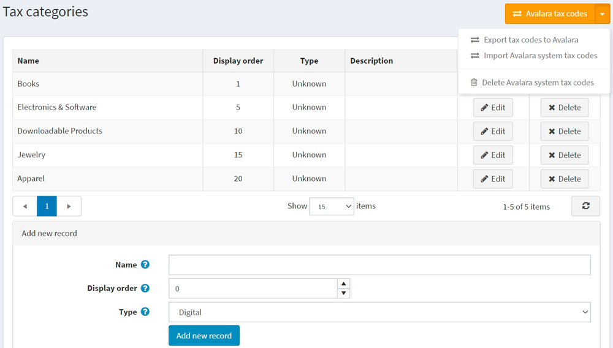

* **匯出稅務代碼至 Avalara** – 將您商店中的所有代碼匯出至您的 AvaTax 後台。
* **匯入 Avalara 系統稅務代碼** – 從 Avalara 匯入所有的 AvaTax 稅務代碼。
    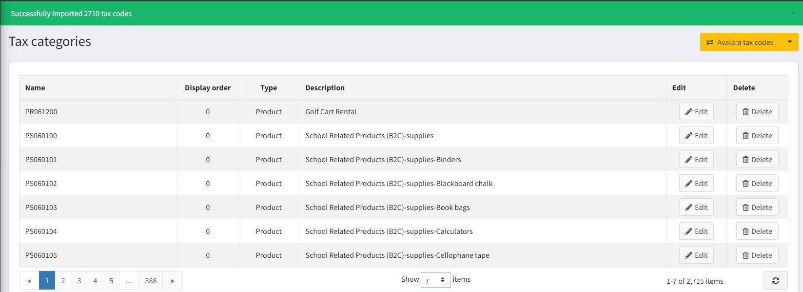
* **刪除 Avalara 系統稅務代碼** – 刪除所有從 Avalara 匯出的代碼。

## 指定 AvaTax 系統稅碼給商品

1. 前往 **目錄 → 商品**。
1. 選擇一項商品以開啟商品詳細資料畫面，並點擊 **編輯**。
1. 在 **商品詳細資料** 畫面的 **價格** 面板中，從 **稅務類別** 欄位的下拉式選單中指定合適的代碼。

    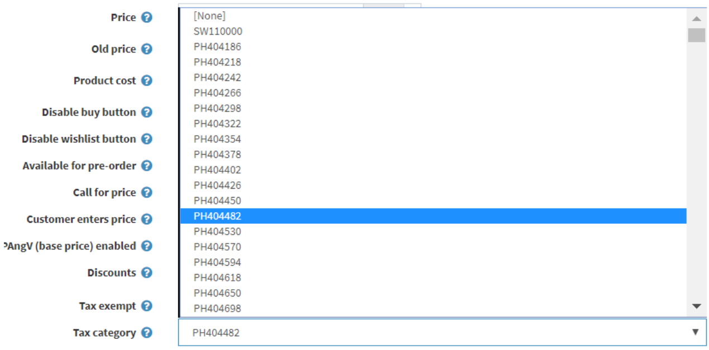

    > [!IMPORTANT]
    > 請確保已輸入 **SKU**，以便在 AvaTax 後台進行更好的導覽。
1. 點擊 **儲存**。
1. 若要查看所有可用的 AvaTax 系統稅碼清單，請造訪 [http://taxcode.avatax.avalara.com](http://taxcode.avatax.avalara.com)。

## 商品分類

Managed Tariff Code Classification 是 Avalara 提供的一項服務，用於將商品統一分類編碼（HS Code，即海關編碼）指派給您的商品目錄。一旦 Avalara 完成您所銷售商品的分類，即可在 AvaTax 計算中自動納入關稅編碼，或將其匯出以供您自己的商業應用程式使用。

海關當局使用海關編碼（HS Code）來計算所有國際貿易產品的關稅稅率。與銷售稅和使用稅代碼不同，關稅編碼並非全球通用。請為您銷往國際的產品指派完整合規的關稅編碼，以計算關稅與進口稅。

在 AvaTax 中，父層產品會被指派一個關稅編碼，而任何子層 SKU 都會繼承該分類。

1. 在名稱相同的頁籤上啟用 *Item Classification* 功能。
1. 指定要獲取 HS 分類代碼的目標國家。
1. 使用 **Save** 按鈕儲存設定。

    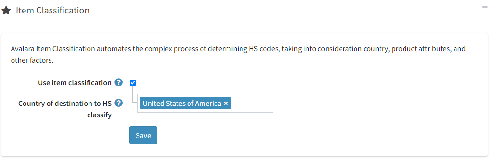

1. 前往您 Avalara 個人帳戶中的 **Item Classification settings**。
    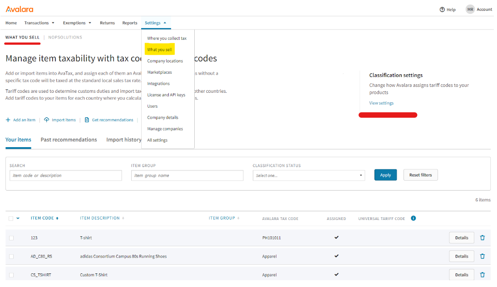

1. 指定 webhook 的端點位址 - `{your.store.url}/avalara/item-classification-webhook`

    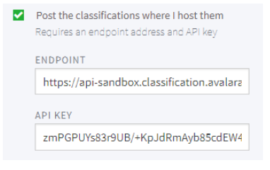

1. 再次前往外掛設定頁面，指定應發送哪些產品進行分類。

    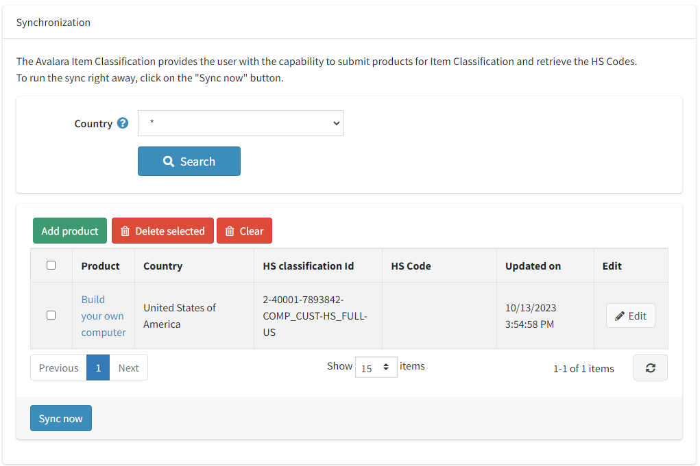

1. 點擊 **Sync now** 按鈕，開始發送產品進行分類的流程。在收到 Avalara 服務的回應後，表格將會填入接收到的數值（您需要手動更新表格）。之後，這些接收到的分類代碼數值將會被轉移用於計算稅率。

## 驗證顧客地址

1. 確保 **Validate address** 核取方塊已勾選；在這種情況下，地址將會自動進行驗證。
1. 使用者將會看到以下畫面：

    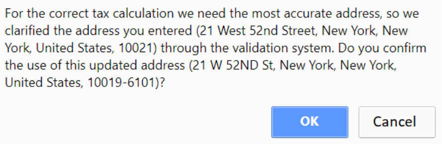

## 免稅 (Tax exemption)

使用此外掛啟用免稅有兩種方式：

1. 在管理後台將 AvaTax 免稅類別指派給特定顧客或整個顧客角色：

    * 點選 **顧客 → 顧客 → 編輯顧客**
    * 找到反白顯示的 **Entity use code** 欄位，選取該欄位，並選擇適當的顧客類型代碼。

        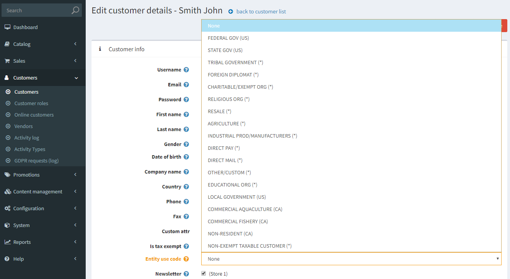
    * 點選 **儲存**

    > [!NOTE]
    >
    > 不需要勾選 **免稅 (Tax exempt)** 核取方塊：指派 **Entity use code** 即已足夠。

2. 啟用免稅證明功能：

    > [!IMPORTANT]
    >
    > 您需要一個 [CertCapture 帳戶](https://avlr.co/3bA1P1X) 才能使此功能正常運作。

    * 確保 **啟用免稅證明 (Enable exemption certificates)** 核取方塊已勾選；在這種情況下，顧客將能夠在購物前管理他們的免稅證明。
    * 帳戶區域將會新增一個新頁面：

        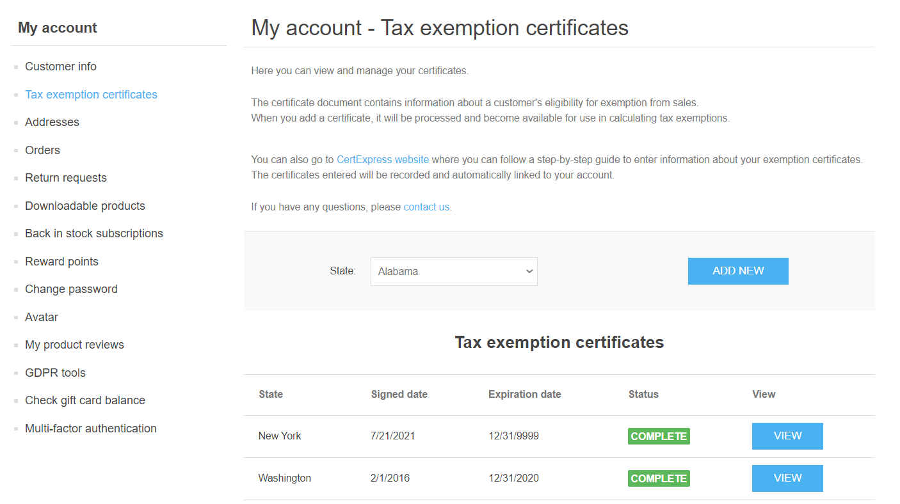