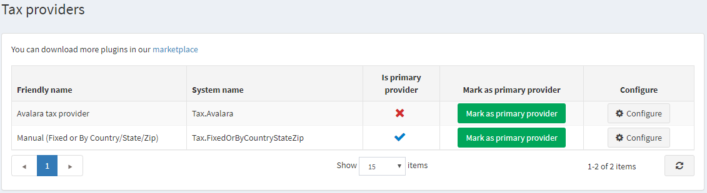

# 稅務提供者

若要定義稅率提供者，請前往 **設定 → 稅務提供者**。

稅務計算一次僅能使用一種稅率提供者。僅建議進階使用者新增新的稅務提供者。
若要選擇預設的稅務提供者，請點擊 **標記為主要提供者** 按鈕。

> [!TIP]
>
> nopCommerce 預設提供了數種稅務提供者，但您可以在 nopCommerce [市集](https://www.nopcommerce.com/marketplace) 中找到更多稅務提供者。

稅務提供者的設定說明請見下列章節：

* [Avalara 稅務提供者](xref:zh-Hant/getting-started/configure-taxes/tax-providers/avalara)
* [手動設定（固定稅率或依國家/州/郵遞區號）](xref:zh-Hant/getting-started/configure-taxes/tax-providers/manual)