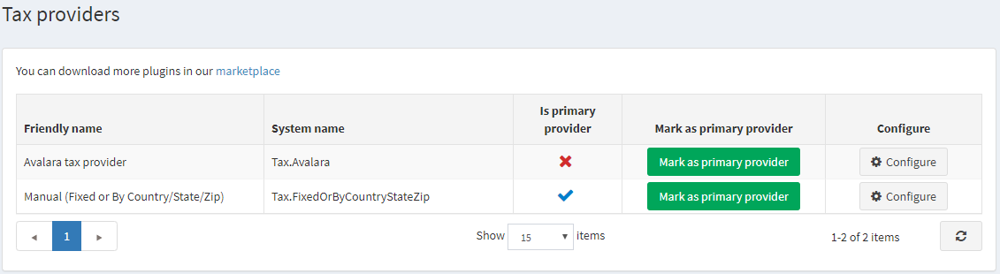
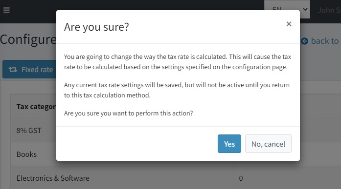
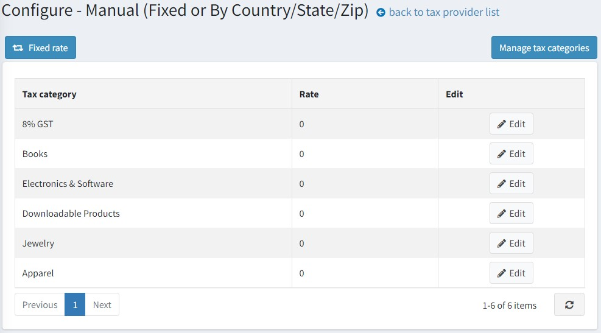
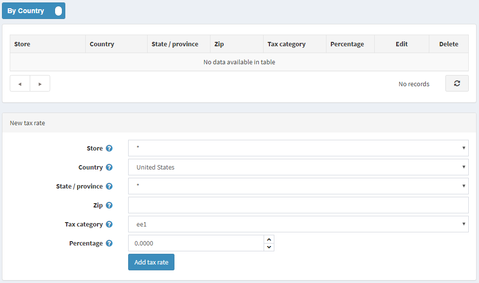
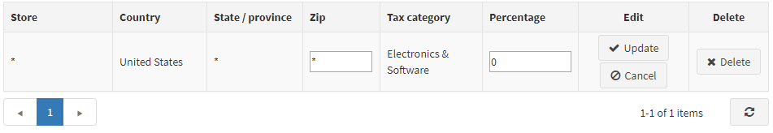

# 手動設定（固定費率或依國家/州/郵遞區號）

若要設定「手動設定（固定費率或依國家/州/郵遞區號）」稅額提供者，請前往 **設定 → 稅額提供者**。

在 **手動設定（固定費率或依國家/州/郵遞區號）** 提供者列中，點擊 **設定** 以編輯稅率。
您可以點擊左上角的對應按鈕，在 *固定費率* 稅額計算與 *依國家/州/郵遞區號* 稅額計算之間進行切換。
若要管理稅務分類，請點擊右上角的 **管理稅務分類** 按鈕。

## 固定費率

點擊頁面頂部的 **依國家** 按鈕，將編輯器切換至 **固定費率** 模式。

請注意，當您在 *固定費率* 與 *依國家* 模式之間切換時，稅務規則將會套用當前設定頁面上所顯示的規則。

在此頁面上，您可以查看預先建立的稅務分類。點擊每個分類旁的 **編輯**，並輸入百分比稅率。接著點擊 **更新** 按鈕。

請確保您的商品已在各自的 [商品頁面](xref:zh-Hant/running-your-store/catalog/products/add-products) 上指派了稅務分類。

> [!NOTE]
>
> 本節僅顯示預先建立的稅務分類。點擊 **管理稅務分類** 按鈕可編輯稅務分類，或參考此處了解如何管理稅務分類：[設定稅務分類](#configure-tax-categories)。

## 依國家

點擊頁面頂部的 **固定費率** 按鈕，將編輯器切換至 **依國家** 模式。

請依照下列方式定義新的稅率：

* 選擇要定義此費率的 **商店**。選擇 * 可將此費率套用到所有商店。
* 選擇要定義此稅率的 **國家**。
* 選擇要定義此稅率的 **州/省**。若選擇星號 (*)，則此稅率將套用到選定國家內的所有顧客，不論其州別為何。
* 輸入定義此稅率區域的 **郵遞區號**。若此欄位留空，則此稅率將套用到選定國家或州內的所有顧客，不論其郵遞區號為何。
* 選擇要套用此稅率的 **稅務分類**。
* 在 **百分比** 欄位中，輸入所需的百分比。

點擊 **新增稅率**。新的稅率將顯示如下：

> [!NOTE]
>
> 本節僅顯示預先建立的稅務分類。點擊 **管理稅務分類** 按鈕可編輯稅務分類，或參考此處了解如何管理稅務分類：[設定稅務分類](#configure-tax-categories)。

## 設定稅務分類

若要定義稅務分類，請前往 **設定 → 稅務分類**。系統將顯示 *稅務分類* 視窗：

若要新增稅務分類，請在面板底部輸入分類 **名稱** 以及此稅務分類的 **顯示順序**。在 **顯示順序** 欄位中，數值 1 代表列表的最上方。接著點擊 **新增記錄** 以儲存新的稅務分類。