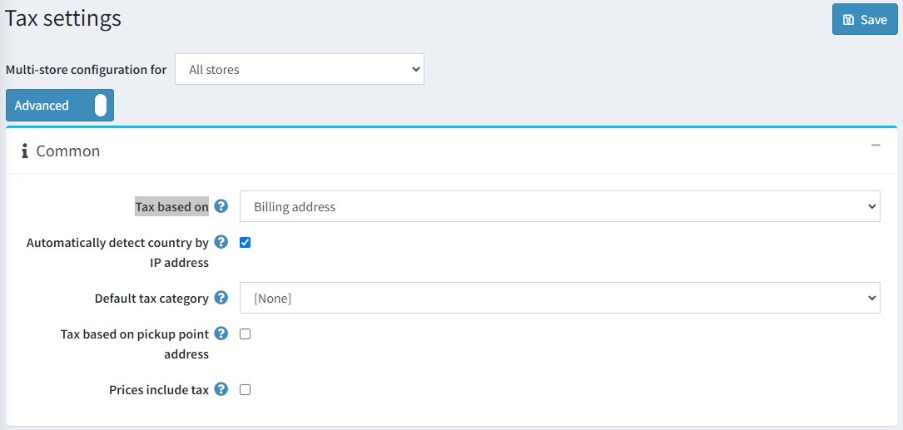

# 稅務設定

本節說明您商店的稅務設定，例如定義價格是否包含稅額、定義稅額顯示類型等。

若要管理您的稅務設定，請前往 **設定 → 設定 → 稅務設定**。

首先，請定義**一般**稅務設定：

* 在 **稅額計算依據 (Tax based on)** 下拉式選單中，選擇計算稅額的依據，如下所示：
  * **帳單地址 (Billing address)**：選擇此選項時，稅額將根據顧客的帳單地址計算。如果帳單地址未知，則使用預設地址（於下方輸入）。
  * **配送地址 (Shipping address)**：選擇此選項時，稅額將根據顧客的配送地址計算。如果配送地址未知，則使用預設地址（於下方輸入）。
  * **預設地址 (Default address)**：選擇此選項時，稅額將根據下方輸入的預設地址計算。
* **依據 IP 位址自動偵測國家/地區 (Automatically detect country by IP address)**：啟用此設定後，若顧客尚未設定帳單/配送地址，系統將會透過地理位置服務（依據 IP 位址）自動判斷稅額計算所使用的國家/地區。
* 選擇商品的 **預設稅務類別 (Default tax category)**。此類別將會預先選定於 *新增商品* 頁面中。
* **依據取貨點地址計算稅額 (Tax based on pickup point address)** 核取方塊用於定義當選擇取貨點時，是否應使用取貨點地址來計算稅額。
* 勾選 **價格包含稅額 (Prices include tax)** 核取方塊，以標示輸入的價格是否已包含稅額。

接著，請定義 **預設稅務地址（用於稅額計算）**，如下所示：

* 選擇 **國家/地區 (Country)**。
* 選擇 **州/省 (State/province)**。
* 定義 **縣市/地區 (County/region)**。
* 定義 **城市 (City)**。
* 定義 **地址 1 (Address 1)**。
* 輸入 **郵遞區號 (Zip/postal code)**。

在 **稅額顯示 (Tax displaying)** 面板中，您可以設定顧客看到的稅額顯示方式：

* 勾選 **允許顧客選擇稅額顯示類型 (Allow customers to select tax display type)** 核取方塊，以允許顧客選擇稅額顯示類型。若未勾選，則會顯示 **稅額顯示類型 (Tax display type)** 下拉式選單：
  * **未稅 (Excluding tax)**：選擇此項以強制執行未稅顯示。
  * **含稅 (Including tax)**：選擇此項以強制執行含稅顯示。
* 勾選 **顯示稅額後綴 (Display tax suffix)** 核取方塊，以顯示稅額後綴（含稅/未稅）。
* 勾選 **顯示所有已套用的稅率 (Display all applied tax rates)** 核取方塊，以在購物車頁面中的單獨行顯示所有已套用的稅率。
* 勾選 **隱藏零稅額 (Hide zero tax)** 核取方塊，以在訂單摘要中隱藏零稅額數值。
* 勾選 **在訂單摘要中隱藏稅額 (Hide tax in order summary)** 核取方塊，以便在價格顯示為含稅時，隱藏訂單摘要中的稅額數值。
* 勾選 **強制從訂單小計中排除稅額 (Force tax exclusion from order subtotal)** 核取方塊，以始終從訂單小計中排除稅額（與所選的稅額顯示類型無關）。此核取方塊僅影響顯示訂單總計的頁面。

在 *配送 (Shipping)* 面板中，勾選 **配送應課稅 (Shipping is taxable)** 核取方塊，以標示配送費用應課稅。接著會顯示下列欄位：

* **配送價格包含稅額 (Shipping price includes tax)**：勾選以標示配送價格已包含稅額。
* **配送稅務類別 (Shipping tax category)**：選擇用於計算配送稅額所需的稅務類別。

在 *付款 (Payment)* 面板中，勾選 **付款方式附加費應課稅 (Payment method additional fee is taxable)** 核取方塊，以標示付款方式的附加費用應課稅。將會顯示下列選項：

* **付款方式附加費包含稅額 (Payment method additional fee includes tax)**：勾選以標示付款方式的附加費用已包含稅額。
* **付款方式附加費稅務類別 (Payment method additional fee tax category)**：從下拉式選單中，選擇用於計算付款方式附加費稅額所需的稅務類別。

接著，在 *VAT* 面板中設定增值稅 (VAT)：

* 勾選 **啟用歐盟增值稅 (EU VAT enabled)** 核取方塊，以標示已啟用歐盟增值稅。選擇此選項後，顧客在註冊時或於顧客帳戶詳細資料頁面中，將會被要求填寫 *公司增值稅號 (Company VAT number)*。如果勾選了 **使用網路服務 (Use web service)** 核取方塊，此增值稅號可透過網路服務自動驗證，或由商店管理員在後台的顧客詳細資料頁面手動驗證。
* **對訪客啟用歐盟增值稅 (EU VAT enabled for guests)** - 勾選此項可對訪客顧客啟用歐盟增值稅。他們將需要在結帳流程的帳單地址步驟中輸入增值稅號。
* **需要增值稅號 (VAT number required)** - 若需要「歐盟增值稅號」則勾選。
* **您的商店所在國家 (Your shop country)**：從下拉式選單中，選擇您的商店所在國家。
* **允許免除增值稅 (Allow VAT exemption)**：勾選此核取方塊，可對符合資格且已註冊增值稅的顧客免除增值稅。
* **假設增值稅始終有效 (Assume VAT always valid)**：勾選此核取方塊可跳過增值稅驗證。輸入的增值稅號將始終視為有效。顧客有責任提供最新的增值稅號。
* **使用網路服務 (Use web service)**：勾選此核取方塊以使用網路服務驗證增值稅號。
* **當提交新的增值稅號時通知管理員 (Notify admin when a new VAT number is submitted)**：勾選此核取方塊，以便在提交新的增值稅號時透過電子郵件接收通知。

> [!NOTE]
>
> 若啟用 VAT，則針對歐盟以外地區的運送收取 0% 稅率；對於已提供經過驗證並核准的 VAT 號碼，且運送目的地為歐盟境內但商店所屬國家以外的顧客，亦收取 0% 稅率。關於歐盟 VAT 的進一步資訊，請參考相關文章。

> [!TIP]
>
> 閱讀如何設定歐盟 VAT：[歐盟 VAT 設定指南](xref:zh-Hant/getting-started/configure-taxes/index#eu-vat-configuration-guide)。

點擊 **儲存 (Save)**。

## 教學課程

* [管理稅務設定](https://www.youtube.com/watch?v=8iF5nQvIoLs&feature=youtu.be)