# 上傳 Favicon

從 4.20 版本開始，您可以透過管理後台自動上傳 Favicon（網站圖示）。

> [!NOTE]
>
> 若為多商店模式，您需要針對每一間商店重複此上傳程序。

1. 若要上傳 Favicon，請前往 **設定 → 設定 → 一般設定**。此時會顯示 *Favicon 和應用程式圖示* 面板：
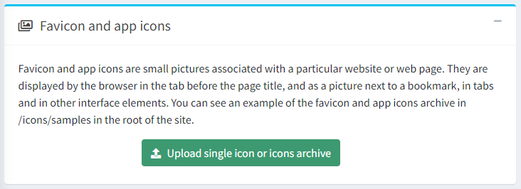

1. 點擊綠色的 **上傳單一圖示或圖示壓縮檔** 按鈕；隨即會開啟檔案選擇視窗：
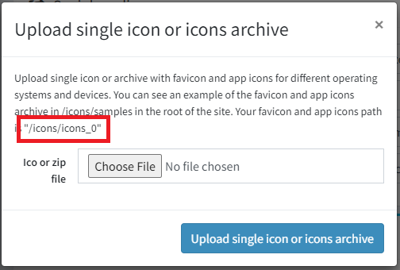

   在此處，您需要複製您的圖示路徑（路徑會根據商店與虛擬目錄而有所不同）。例如：`/icons/icons_0`。

1. 根據您的網站需要支援多樣化裝置的友善程度，有幾種上傳選項：

   - 最完整的選項是使用 Favicon 產生器。在本手冊中，我們將示範使用 [RealFaviconGenerator](https://realfavicongenerator.net/) 的範例。透過此服務，只需點擊幾下即可上傳完整的 Favicon 套件。

      - 前往該產生器的首頁，系統會邀請您選擇一張作為 Favicon 的圖片
      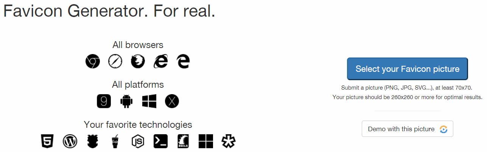

      - 選擇圖片並點擊 **Continue with this picture** 後，您將被重新導向至下一個頁面。在此頁面，您可以調整特定裝置與應用程式的 Favicon 顯示設定，例如 iOS Web Clip、Android Chrome、Windows Metro、macOS Safari 等。該服務會自動顯示顯示範例，您可以根據需求自訂，或是保留預設值。

      - 在同頁面的底部，您可以找到 **Favicon Generator Options** 面板。
      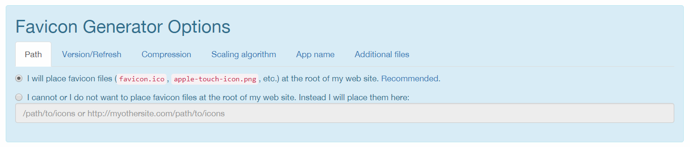

         - 在此區段中，您必須設定特定參數。在 **Path** 頁籤中，選擇 `I cannot or I do not want to place favicon files at the root of my web site. Instead I will place them here` 選項，並指定步驟 2 中的路徑。 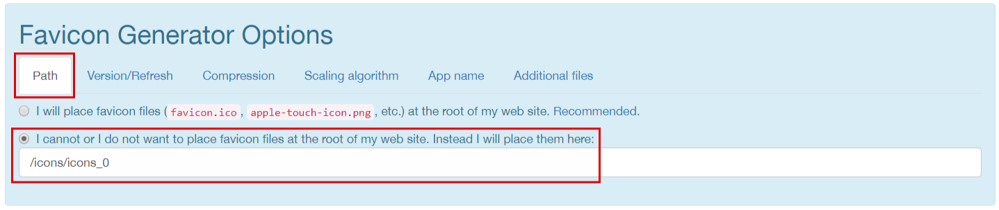

         - 在 **Version/Refresh** 頁籤中，根據您的網站是否已正式上線來選擇選項。設定描述將會協助您進行判斷。 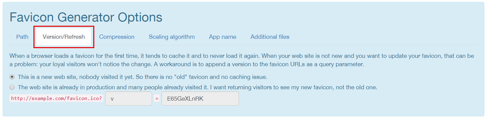

         - 在 **Additional files** 頁籤中，必須選擇在套件中產生 html 檔案的選項。 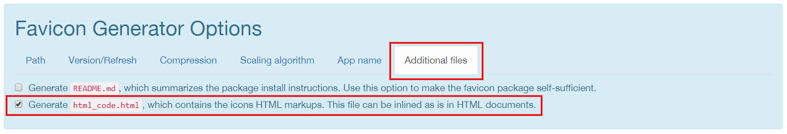

      - 現在所有設定已完成，點擊產生按鈕。 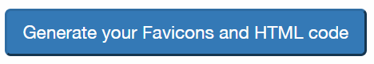

      - 下載您的 Favicon 套件。 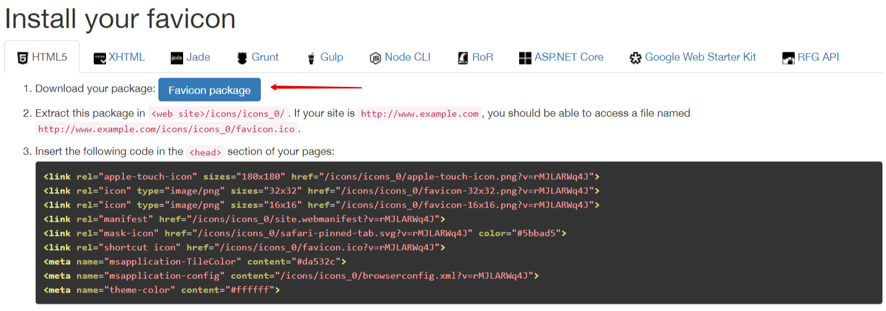

   - 最簡單的選項是僅使用 **favicon.ico** 檔案，這在各種螢幕解析度的裝置出現之前，已在許多網站上成功使用了很長一段時間。

      - 找到位於 `wwwroot/icons/samples/` 目錄中的範例 Favicon 套件並將其複製。

      - 在新的套件中，刪除除了 **favicon.ico** 和 **html_code.html** 以外的所有檔案。

      - 將此套件中的 **favicon.ico** 檔案替換為您新的 Favicon。

      - 編輯 **html_code.html** 檔案。僅保留該行：`<link rel="shortcut icon" href="/icons/icons_0/favicon.ico">`，假設 `/icons/icons_0` 是來自步驟 2 的路徑。

      - 將這兩個檔案儲存為一個壓縮包。您的 Favicon 套件即已準備就緒。

   - 中間選項是不使用產生器，直接使用完整的 Favicon 套件。

      1. 找到位於 `wwwroot/icons/samples/` 目錄中的範例 Favicon 套件並將其複製。

      1. 在參考原始尺寸的前提下，將新套件中的圖片替換為您自己的圖片。

      1. 編輯 **html_code.html** 檔案，將所有 `/icons/icons_0` 的字串替換為步驟 2 中儲存的路徑。

      1. 儲存此套件。您的 Favicon 套件即已準備就緒。

1. 帶著準備好的 Favicon 套件回到管理後台進行上傳。選擇所需的檔案並點擊 **上傳單一圖示或圖示壓縮檔**。 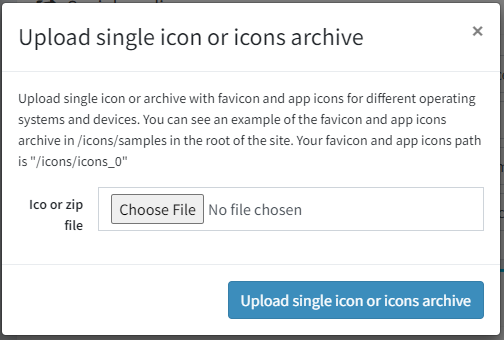

1. 確保您的套件已成功上傳。 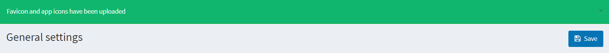

1. 若要在網站上看到新的 Favicon，您應該在管理後台清除快取並清理瀏覽器快取，然後重新載入頁面。

> [!TIP]
>
> 若要建立 Favicon 套件，您可以使用任何產生器、第三方服務，或是手動製作。唯一的條件是必須包含含有 html 程式碼的 **html_code.html** 檔案，該程式碼將會被放置於網站頁面的 `<head>` 元素中。