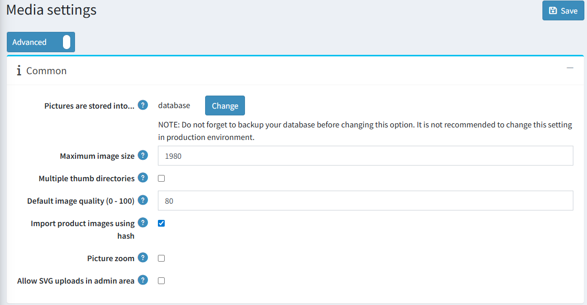
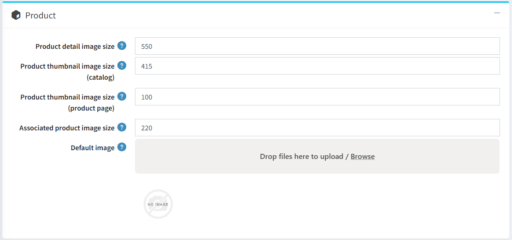
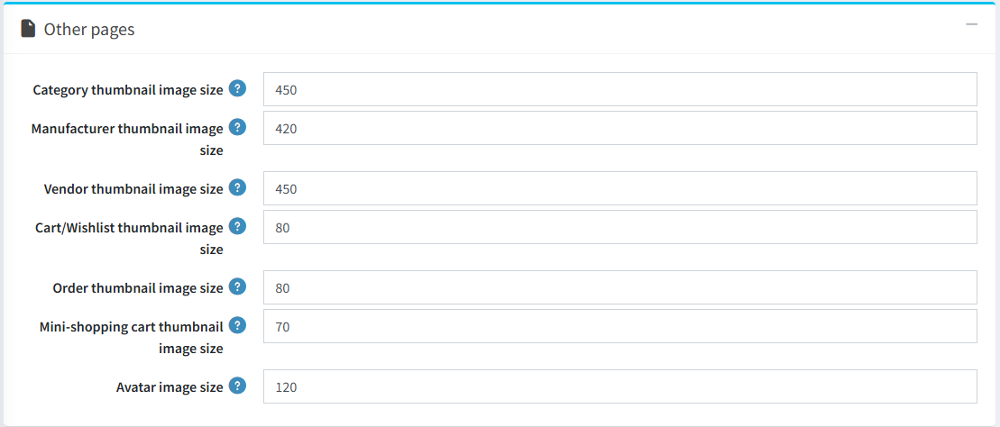

# 媒體設定

本章節說明如何設定您商店的媒體細節，包括定義商品、變體與頭像的圖片大小等。

若要設定媒體設定，請前往 **設定 → 設定 → 媒體設定**。

在「一般」面板中，請依照下列方式定義設定：

- 點擊「圖片儲存於」選項上方的「變更」按鈕，可選擇將圖片儲存於資料庫或檔案系統中。

  > [!NOTE]
  >
  > 建議在點擊「變更」按鈕之前，先備份資料庫。
- 在「最大圖片尺寸」欄位中，輸入允許上傳的圖片最大尺寸（即最長邊的像素值）。
- 勾選「多個縮圖目錄」以使用多個縮圖目錄。當您的代管商限制每個目錄的檔案數量時，此功能非常實用。
- 在「預設圖片品質 (0 - 100)」中輸入上傳圖片的品質。一旦變更此設定，您必須手動刪除所有已產生的縮圖。
- 勾選「使用雜湊值匯入商品圖片」以使用 HASHBYTES 來比較圖片與已上傳的商品。請注意，部分資料庫不支援此功能。
- 勾選「圖片縮放」以啟用商品詳細頁面上的圖片縮放功能。
- 「允許在後台上傳 SVG」 - 由於 *svg* 格式為向量圖形且以 XML 形式描述，為了提升安全性，您可以停用在管理後台新增此類格式的圖片。

在「商品」面板中，請依照下列方式定義設定：

- 在「商品詳細頁圖片尺寸」欄位中，輸入商品詳細頁圖片的預設像素尺寸。
- 在「商品縮圖尺寸 (目錄)」欄位中，輸入顯示在分類或製造商頁面上的商品縮圖預設像素尺寸。
- 在「商品縮圖尺寸 (商品頁面)」欄位中，輸入顯示在商品詳細頁面上的商品縮圖預設像素尺寸（當您有多張商品圖片時使用）。
- 在「關聯商品圖片尺寸」欄位中，輸入關聯商品圖片的預設像素尺寸。關聯商品是群組商品的一部分。
- 「預設圖片」 - 您可以選擇一張預設圖片，該圖片將在前台網站顯示於沒有圖片的商品上。

在「其他頁面」面板中，請依照下列方式定義設定：

- 在「分類縮圖尺寸」欄位中，輸入分類頁面上商品縮圖的預設像素尺寸。
- 在「製造商縮圖尺寸」欄位中，輸入製造商頁面上商品縮圖的預設像素尺寸。
- 在「供應商縮圖尺寸」欄位中，輸入供應商頁面上商品縮圖的預設像素尺寸。
- 在「購物車/願望清單縮圖尺寸」欄位中，輸入購物車與願望清單中商品縮圖的預設像素尺寸。
- 在「迷你購物車縮圖尺寸」欄位中，輸入顯示於迷你購物車區塊中商品縮圖的預設像素尺寸。
- 在「頭像圖片尺寸」欄位中，輸入頭像圖片的預設尺寸。

此頁面支援**多商店設定**，這意味著相同的設定可以套用至所有商店，也可以針對不同商店進行個別設定。如果您想管理特定商店的設定，請從「多商店設定下拉式選單」中選擇其名稱，並勾選左側所需的核取方塊，以便為其設定自訂值。

## 教學課程

- [管理媒體設定](https://www.youtube.com/watch?v=3JS4Zj4TBwQ)