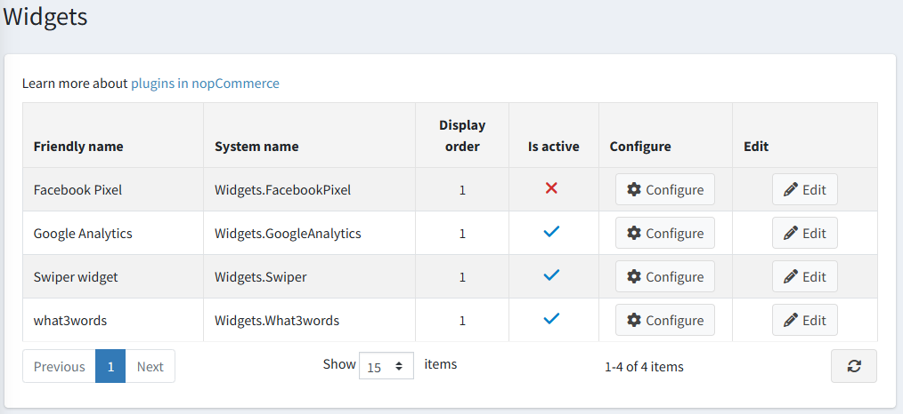
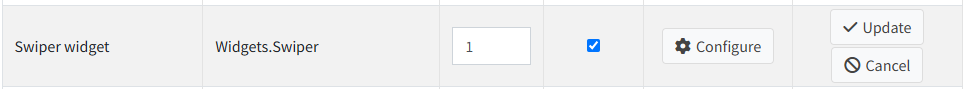
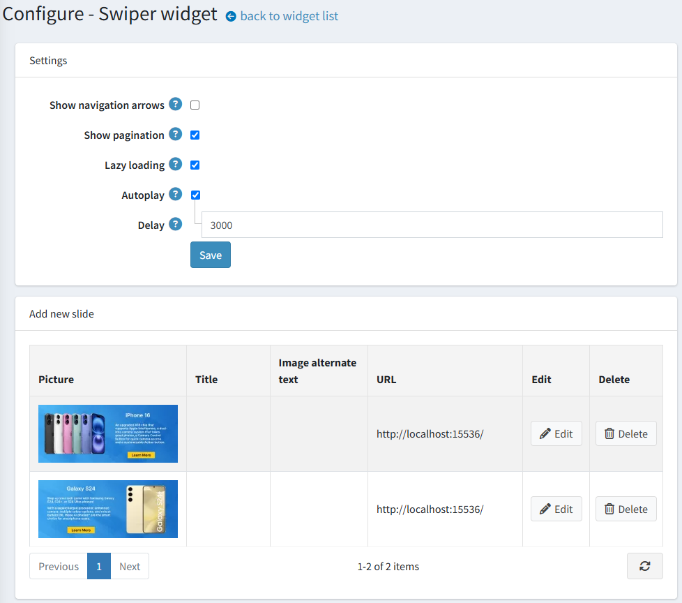
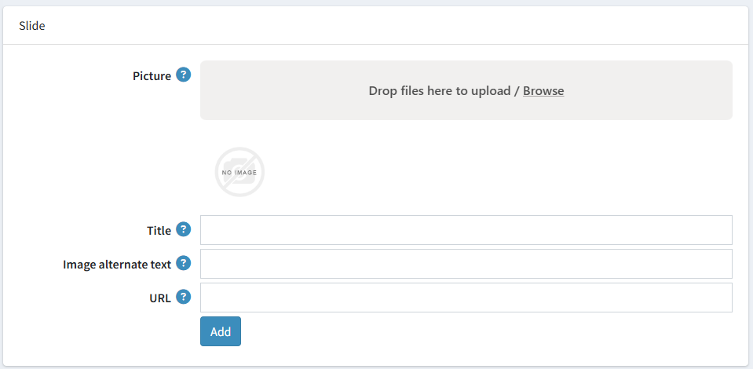

# Swiper 小工具

Swiper 小工具允許您在商店的首頁顯示輪播圖。

## 設定 Swiper 外掛

前往 **設定 → 小工具**。隨即會顯示 *小工具* 視窗：

點擊 Swiper 小工具旁的 **編輯**。視窗將會展開如下：

勾選 **是否啟用** 核取方塊以啟用此外掛。

點擊 **設定**。隨即會顯示 *設定 – Swiper* 視窗如下：

針對您想要上傳的每一張投影片，執行以下操作：

* 在 **圖片** 欄位中，點擊 *瀏覽* 以上傳所需的圖片。
* 在 **標題** 欄位中，輸入圖片的標題。如果您不想顯示任何文字，請留空。
* 在 **圖片替代文字** 欄位中，輸入要新增至圖片的替代文字。
* 在 **URL** 欄位中，輸入所需的 URL，或者若您不希望圖片可被點擊，則留空。

點擊 **新增**。

現在您可以前往公開商店的首頁，查看更新後的圖片輪播：
