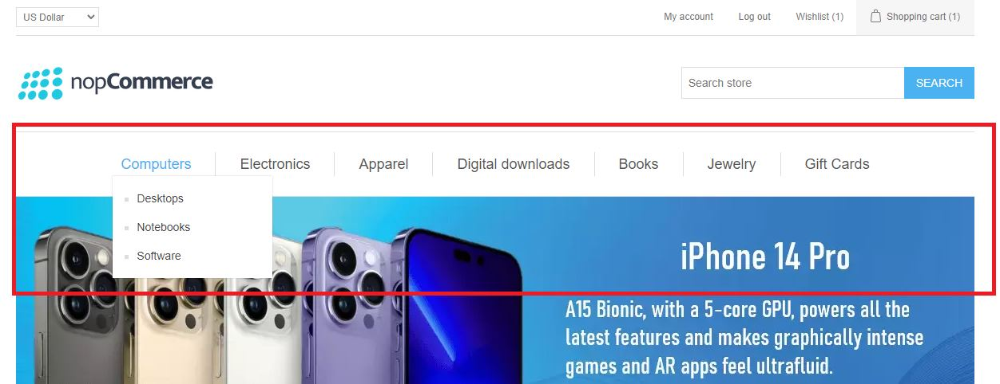
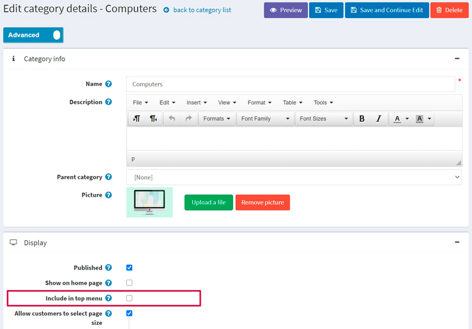
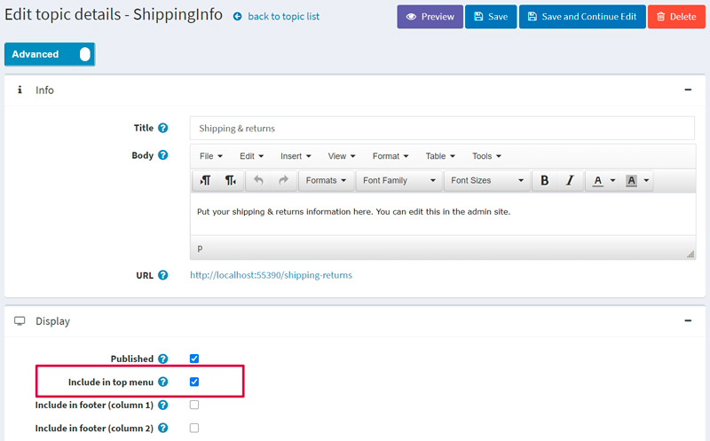
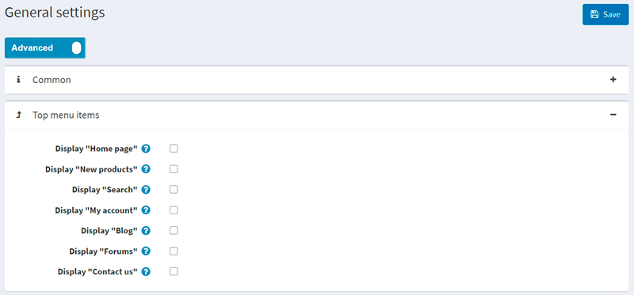
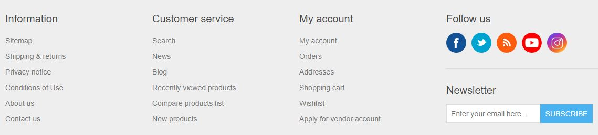
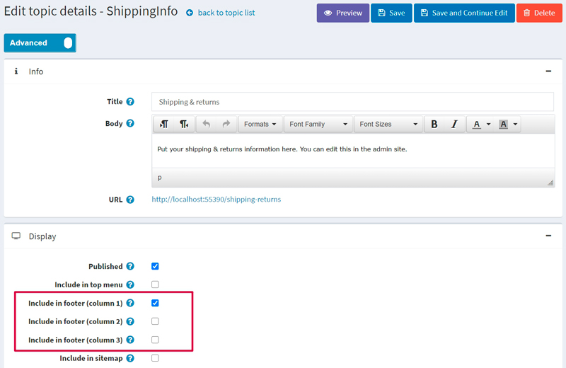
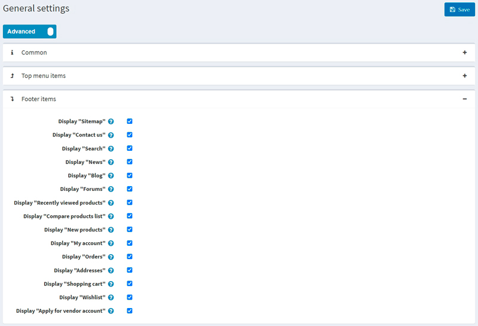
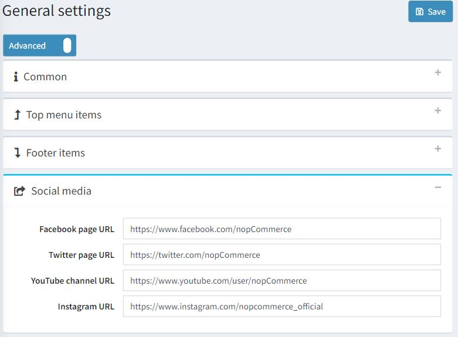
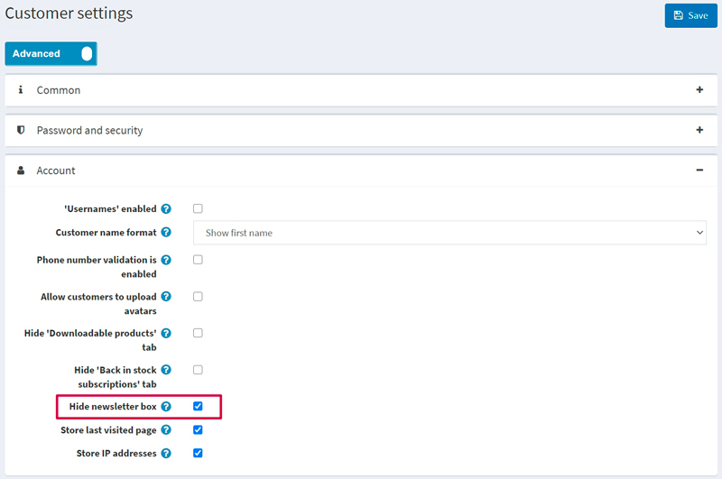

# 頂部選單與頁尾

> [!WARNING]
> 本文章適用於 nopCommerce 4.80 及以下版本。自 nopCommerce 4.90 起開始使用的全新選單產生方式，請參考 [選單 (Menu)](xref:zh-Hant/running-your-store/content-management/menu) 一文。

在 nopCommerce 中，您可以自行決定頂部選單與頁尾的顯示方式。您可以將最重要且吸引人的連結放置於頂部選單，以吸引更多顧客；並將服務相關連結新增至頁尾，為您的顧客提供目前的商店資訊。

## 頂部選單

在 Default Clean 佈景主題中，頂部選單呈現如下：

如您所見，它會顯示商店分類。請注意，若您希望某個分類顯示在頂部選單中，您必須在分類編輯頁面勾選 **Include in top menu** 核取方塊。詳細資訊請參閱下文。

您可以在頂部選單中包含以下項目：

- 分類
- 自訂內容頁面 (Topics)
- 網站區塊的連結

請參閱下方關於如何新增上述各項目的說明。

### 商品分類

若要將商品分類包含在頂部選單中，請前往管理後台的分類編輯頁面：選擇 **目錄 → 商品分類**。接著點擊該分類旁邊的 **編輯** 按鈕。畫面將顯示 *編輯分類詳情* 視窗：

勾選 **包含在頂部選單** 核取方塊並點擊 **儲存**。

> [!NOTE]
>
> 如果此分類為子分類，請確保其父分類也啟用了此屬性。

### 自訂內容頁面（pages）

若要將內容頁面包含在頂部選單中，請前往管理後台的內容頁面編輯頁面：選擇 **內容管理 → 內容頁面（pages）**。接著點擊該內容頁面旁邊的 **編輯** 按鈕。此時會顯示 *編輯內容頁面詳細資料* 視窗：

勾選 **包含於頂部選單** 核取方塊並點擊 **儲存**。

### 連結至網站區塊

若要將網站的某些區塊包含在頂部選單中，請前往 **設定 → 設定 → 一般設定**。接著進入「頂部選單項目」面板：

從下列清單中選擇您想要顯示於頂部選單的項目：

- **顯示「首頁」**
- **顯示「新品」**
- **顯示「搜尋」**
- **顯示「我的帳戶」**
- **顯示「部落格」**
- **顯示「論壇」**
- **顯示「聯絡我們」**

然後點擊 **儲存**。

> [!NOTE]
>
> 只有當「新品」頁面在 **設定 → 設定 → 目錄設定** 頁面（「其他區塊」面板）中啟用時，才會顯示「新品」選單項目。

## 頁尾

在 Default Clean 佈景主題中，頁尾顯示如下：

預設情況下，它會顯示分為三種類型的網站區塊連結：*資訊、顧客服務、我的帳戶*。您可以移除任何已顯示的連結或加入新的連結。

您可以在頁尾包含以下項目：

- 自訂內容頁面（Topic）
- 網站區塊的連結

請參閱下方說明，了解如何加入這些項目。

### 自訂內容頁面

若要在頁尾包含一個內容頁面（Topic），請前往管理後台的內容頁面編輯頁面：選擇 **內容管理 → 內容頁面 (頁面)**。接著點擊該內容頁面旁的 **編輯** 按鈕。此時會顯示 *編輯內容頁面詳細資訊* 視窗：

選擇您希望顯示內容頁面連結的位置。您可以勾選一個或多個核取方塊：

- **包含在頁尾 (欄位 1)**
- **包含在頁尾 (欄位 2)**
- **包含在頁尾 (欄位 3)**

例如，如果您選擇 **包含在頁尾 (欄位 1)**，該連結就會顯示在 *資訊* 欄位中。

點擊 **儲存** 以儲存變更。

### 連結至網站的區段

若要在頁尾包含網站的某些區段，請前往 **設定 → 設定 → 一般設定**。接著進入 *頁尾項目 (Footer items)* 面板：

從下列清單中選擇您希望顯示在頁尾的項目：

- **顯示「網站地圖」**

 > [!NOTE]
 >
 > 「網站地圖」選單項目僅會在 **設定 → 設定 → 一般設定** 頁面（*網站地圖* 面板）中勾選 **啟用網站地圖** 核取方塊時顯示。

- **顯示「聯絡我們」**
- **顯示「搜尋」**
- **顯示「新聞」**
- **顯示「部落格」**
- **顯示「論壇」**
- **顯示「最近瀏覽過的商品」**

 > [!NOTE]
 >
 > 「最近瀏覽過的商品」選單項目僅會在 **設定 → 設定 → 目錄設定** 頁面（*額外區段* 面板）中啟用「最近瀏覽過的商品」頁面時顯示。

- **顯示「商品比較清單」**

 > [!NOTE]
 >
 > 「商品比較清單」選單項目僅會在 **設定 → 設定 → 目錄設定** 頁面（*商品比較* 面板）中啟用「商品比較」功能時顯示。

- **顯示「新商品」**

 > [!NOTE]
 >
 > 「新商品」選單項目僅會在 **設定 → 設定 → 目錄設定** 頁面（*額外區段* 面板）中啟用「新商品」頁面時顯示。

- **顯示「我的帳戶」**
- **顯示「訂單」**
- **顯示「地址」**
- **顯示「購物車」**

 > [!NOTE]
 >
 > 「購物車」選單項目僅會在該顧客的角色已啟用「公開商店。啟用購物車」權限時，才會對該名顧客顯示。若要管理權限，請前往 **設定 → 存取控制清單** 頁面。或者，您可以在 [存取控制清單](xref:zh-Hant/running-your-store/customer-management/access-control-list) 章節閱讀更多關於權限的資訊。

- **顯示「願望清單」**

 > [!NOTE]
 >
 > 「願望清單」選單項目僅會在該顧客的角色已啟用「公開商店。啟用願望清單」權限時，才會對該名顧客顯示。若要管理權限，請前往 **設定 → 存取控制清單** 頁面。或者，您可以在 [存取控制清單](xref:zh-Hant/running-your-store/customer-management/access-control-list) 章節閱讀更多關於權限的資訊。

- **顯示「申請供應商帳戶」**

 > [!NOTE]
 >
 > 「申請供應商帳戶」選單項目僅會在 **設定 → 設定 → 供應商設定** 頁面（*一般* 面板）中勾選 **允許顧客申請供應商帳戶** 核取方塊時顯示。

點擊 **儲存** 以儲存變更。

### 追蹤我們

若要自訂頁尾的 **追蹤我們** 區塊，請前往 **設定 → 設定 → 一般設定**。接著前往 *社群媒體* 面板，如下所示：

輸入您的社群媒體連結：

- **Facebook 頁面 URL**
- **Twitter 頁面 URL**
- **YouTube 頻道 URL**
- **Instagram 頁面 URL**

如果您想要啟用或停用頁尾的 RSS 連結，您需要前往 **設定 → 設定 → 新聞設定** 頁面（*一般* 面板）中，對應地啟用或停用新聞功能。

### 電子報

電子報區塊預設會顯示在頁尾。若要隱藏此區塊，請前往 **設定 → 設定 → 顧客設定**。進入「帳戶」面板並勾選 **隱藏電子報方塊 (Hide newsletter box)** 核取方塊，如下所示：

點擊 **儲存 (Save)** 以儲存變更。頁尾將會隨之更新。

### Powered by nopCommerce

根據 nopCommerce 授權條款，若未購買「版權移除金鑰」（*Copyright removal key*）：

- 您不可以移除或隱藏出現在 nopCommerce 驅動網站每個頁面底部的「Powered by nopCommerce」聲明。
- 當使用者點擊「Powered by nopCommerce」文字時，必須導向至 <https://www.nopcommerce.com>。此「Powered by nopCommerce」連結必須保持與程式原始碼中提供的格式相同，不得進行任何編輯。此義務同樣適用於任何複製品或衍生作品！
- 您商店（網站）頁尾的版權聲明必須保持完整、未經編輯且清晰可見。請勿以任何方式嘗試編輯、移除或隱藏該版權聲明。

在購買「版權移除金鑰」後，您將被允許移除「Powered by nopCommerce」聲明。
侵犯版權是違法行為，敬請知悉。

如需更多資訊，請造訪 [nopCommerce 版權移除金鑰](https://nopcommerce.com/nopcommerce-copyright-removal-key?utm_source=documentation&utm_medium=link&utm_campaign=powered_by_nopcommerce&utm_content=topmenu_footer) 頁面。