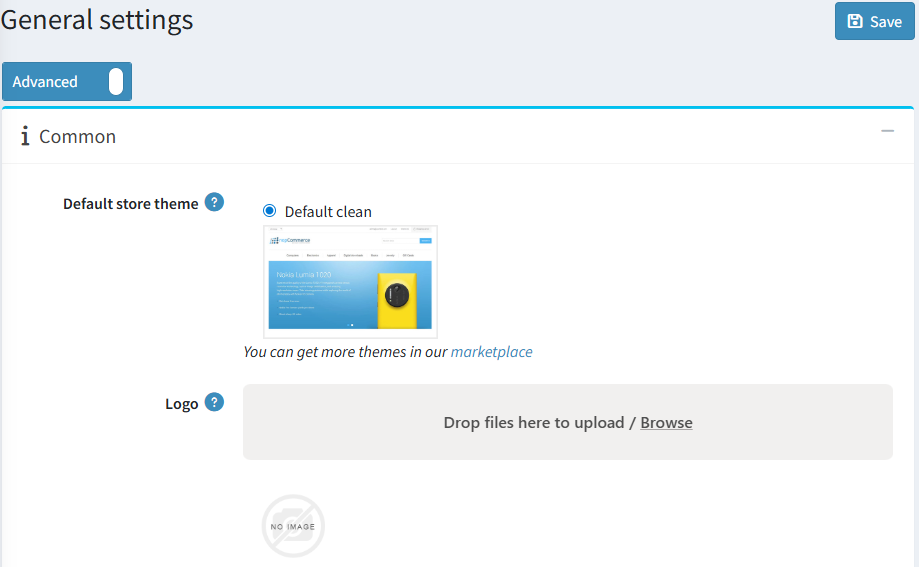
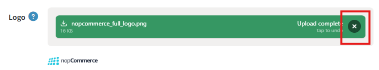

# 上傳您的商標 (Logo)

您網站的商標通常會顯示在每個頁面的頁首。無論您選擇哪一個 nopCommerce 佈景主題，或是變更頻率為何，您的商標在大多數的佈景主題中看起來都會非常完美。請依照下列步驟將新商標上傳到您的網站：

1. 前往 **設定 → 設定 → 一般設定**。隨即會顯示 *一般設定* 視窗：

1. 找到 **商標 (Logo)** 欄位，點擊旁邊的 **瀏覽 (Browse)** 按鈕，並選擇一個圖片檔案。所選的圖片將會被上傳。您可以點擊 **點擊以復原 (tap to undo)** 按鈕來移除已上傳的圖片。

1. 點擊右上角的 **儲存 (Save)** 按鈕，即可在您的網站上啟用該商標。

1. 前往公開的網站前台，確認商標顯示正常。