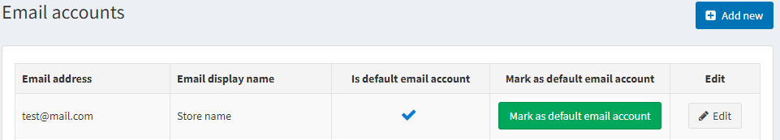
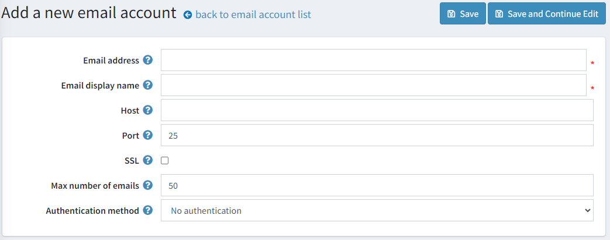
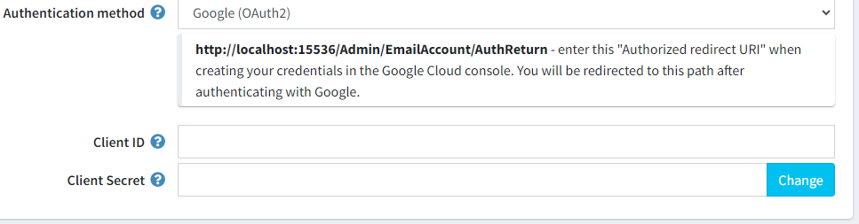
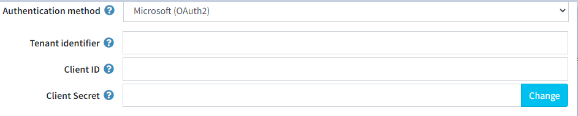
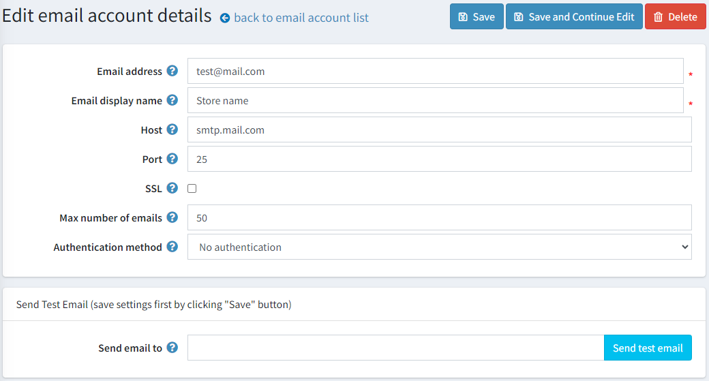

# 電子郵件帳號

本章節將說明如何設定與您的商店相關聯的電子郵件帳號：例如一般聯絡信箱、業務代表信箱、客戶支援信箱等。

若要管理電子郵件帳號，請前往 **設定 → 電子郵件帳號**。*電子郵件帳號* 視窗會顯示商店擁有者的電子郵件帳號，如下所示。電子郵件帳號設定完成後，商店擁有者即可在訊息範本詳細資料頁面中選擇所需的電子郵件帳號，相關說明請參閱 [訊息範本](xref:zh-Hant/running-your-store/content-management/message-templates) 章節。

## 新增電子郵件帳號

若要新增電子郵件帳號，請點選 **新增**。系統將會顯示 *新增電子郵件帳號* 視窗：

請定義以下電子郵件帳號資訊：

* 在 **電子郵件地址** 欄位中，輸入您商店所有外寄郵件所使用的電子郵件地址。範例：`sales@yourstore.com`。
  > [!NOTE]
  > 某些電子郵件提供者可能不會使用此設定，除非該電子郵件地址已在您用於驗證的電子郵件帳號中，被新增為外寄郵件的別名/帳號。
* 在 **電子郵件顯示名稱** 欄位中，輸入您商店外寄郵件的顯示名稱。範例：「您的商店業務部門」。
* 在 **主機** 欄位中，輸入您郵件伺服器的主機名稱或 IP 位址。
* 在 **連接埠** 欄位中，輸入您郵件伺服器的 SMTP 連接埠。
* 勾選 **SSL** 核取方塊，以使用安全通訊端層 (SSL) 來加密 SMTP 連線。
* 在 **郵件傳送最大數量** 欄位中，輸入一次傳送郵件的最大數量。
* 選擇連線至 SMTP 伺服器時，用於識別用戶端的 **驗證方式**。
  * *無驗證*（無額外欄位）
  * *NTLM (預設網路憑證)*
  * *帳號/密碼*
    * 在 **使用者** 欄位中，輸入您郵件伺服器的使用者名稱。
    * 在 **密碼** 欄位中，輸入您郵件伺服器的密碼。
  * *Google (OAuth2)*
  
    * **客戶端 ID (Client ID)**。應用程式的公開識別碼。
    * **客戶端密鑰 (Client Secret)**。僅應用程式與授權伺服器知曉的密鑰。
  * *Microsoft (OAuth2)*
  
    * **租戶識別碼 (Tenant identifier)** 可以是 GUID（您 Microsoft Entra 執行個體的 ID）、網域名稱，或使用佔位符："organizations"、"consumers"、"common"。
    * **客戶端 ID (Client ID)**。應用程式的公開識別碼。
    * **客戶端密鑰 (Client Secret)**。僅應用程式與授權伺服器知曉的密鑰。

點選 **儲存**。視窗將會展開並顯示如下：

在 **寄送電子郵件至** 欄位中，輸入用於測試的電子郵件地址，並點選 **傳送測試郵件**。