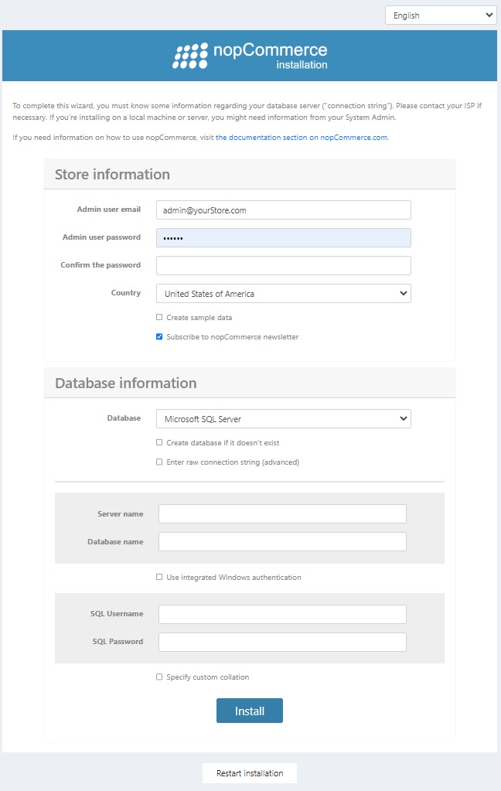

# 本地安裝

本章節介紹如何下載 nopCommerce 軟體、將其上傳至您的伺服器、定義檔案權限，以及如何在您的系統上進行安裝。您也可以在我們的 [YouTube 頻道](https://www.youtube.com/watch?v=L7NGodeB9sQ) 觀看關於 nopCommerce 安裝的教學影片。

在開始安裝之前，請確保您的網站主機符合 [執行 nopCommerce 的最低需求](xref:zh-Hant/installation-and-upgrading/technology-and-system-requirements)。

> [!NOTE]
> 如需更多關於主機選擇準則的資訊，請造訪 [此頁面](xref:zh-Hant/installation-and-upgrading/installing-nopcommerce/choose-a-hosting-company)。

下載 nopCommerce 時有幾種選項可供選擇。為了決定要下載哪個選項，您需要確認您將如何使用它。以下提供幾種可用選項：

1. **Web (無原始碼)**。此選項適用於不希望或不需要開發任何自訂程式碼的使用者。這是 nopCommerce 的預先編譯版本，只需上傳至您的託管服務提供者即可立即使用。使用此選項，使用者仍然可以根據需要修改網站的外觀或使用者介面 (UI)，而不必擔心開發相關事宜。
1. **原始碼 (Source code)**。此選項包含完整的 Visual Studio 解決方案。它適用於希望自訂 nopCommerce 內部程式碼的使用者。它包含開發 nopCommerce 所使用的所有原始碼，且必須使用 Visual Studio 開啟。它還包含用於建置與編譯解決方案並上傳至託管服務提供者的腳本。
1. **升級腳本 (Upgrade script)**。升級腳本選項適用於已經安裝過 nopCommerce 的使用者。此腳本會將您目前的安裝版本升級至最新版本。

除了升級腳本外，上述每一種選項都可以讓您將 nopCommerce 部署到您的開發環境以及託管服務提供者。選擇您想要 [下載](https://www.nopcommerce.com/en/download-nopcommerce) 的選項，並點擊對應的下載連結即可開始下載。建議您在桌面上建立一個新資料夾來存放下載的檔案，以便日後存取。

## 使用 IIS 執行網站（不含原始程式碼的套件）

若要使用 IIS，請將解壓縮後的 nopCommerce 資料夾內容複製到 IIS 的虛擬目錄（或網站根目錄），然後使用瀏覽器瀏覽該網站。

如果您使用的是 nopCommerce 3.90 或更低版本，請將其設定為在整合模式（integrated mode）下執行，並將應用程式集區設定為執行 .NET Framework 4 版本。請注意，此步驟對於 nopCommerce 4.00 及以上版本並非必要。

## 使用 Visual Studio 執行網站（原始程式碼套件）

此步驟說明如何在 Visual Studio 中啟動網站。若要在 Visual Studio 中執行網站，請將完整的原始程式碼壓縮檔解壓縮至本機資料夾。啟動 Visual Studio 並選擇 **檔案 → 開啟 → 專案/方案**。導覽至您解壓縮檔案的資料夾，並開啟 `NopCommerce.sln` 方案檔。執行 `Nop.Web` 專案。

## 從包含原始程式碼的套件中取得「準備部署」的套件（不含原始程式碼）

如果您使用的是 nopCommerce **3.20（或以上版本）**，請依照下列步驟操作：

- 在 Visual Studio 中開啟方案。
- 重建整個方案。
- 從 Visual Studio 部署 **Nop.Web** 專案。部署時，請確保設定為 *Release* 模式。

## 安裝流程

nopCommerce 需要對以下所述的目錄與檔案具備寫入權限：

- **針對 nopCommerce 4.00 及以上版本：**
  - `\App_Data\`
  - `\bin\`
  - `\Logs\`
  - `\Plugins\`
  - `\Plugins\Uploaded\`
  - `\wwwroot\.well-known\`
  - `\wwwroot\bundles\`
  - `\wwwroot\db_backups\`
  - `\wwwroot\files\`
  - `\wwwroot\files\exportimport\`
  - `\wwwroot\icons\`
  - `\wwwroot\images\`
  - `\wwwroot\images\thumbs\`
  - `\wwwroot\images\uploaded\`
  - `\wwwroot\sitemaps\`
  - `\App_Data\DataProtectionKeys\`
  - `\App_Data\plugins.json` (安裝後)
  - `\App_Data\appsettings.json` (或早期版本的 dataSettings.json；安裝後)

- **針對 nopCommerce 2.00-3.90 版本：**
  - `\App_Data\`
  - `\bin\`
  - `\Content\`
  - `\Content\Images\`
  - `\Content\Images\Thumbs\`
  - `\Content\Images\Uploaded\`
  - `\Content\files\ExportImport\`
  - `\Plugins\`
  - `\Plugins\bin\`
  - `\Global.asax`
  - `\web.config`

這些權限會在安裝過程中進行驗證。如果您沒有寫入權限，系統將會顯示警告訊息，要求您設定權限。
在安裝 nopCommerce 之前，請確保您的系統中已安裝資料庫伺服器。

您可以使用以下任一種驗證方式來連線到伺服器：

- **SQL server 帳戶**：使用此方式連線時，會在 SQL server 中建立帳號，該帳號並非基於 Windows 使用者帳戶。使用者名稱與密碼皆由 SQL server 建立並儲存於 SQL server 內。使用此方法時，您必須輸入您的登入帳號與密碼。
- **整合式 Windows 驗證**：使用此方式連線時，SQL Server 會使用作業系統中的 Windows 主體權杖（principal token）來驗證帳戶名稱與密碼。這意味著使用者身分是由 Windows 所確認。SQL Server 不會要求密碼，也不會執行身分驗證。Windows 驗證是預設的驗證模式，且比 SQL server 驗證安全許多。Windows 驗證使用 Kerberos 安全通訊協定，提供針對強密碼複雜度驗證的密碼原則強制執行、支援帳戶鎖定，以及支援密碼過期。使用 Windows 驗證建立的連線有時被稱為信任連線（trusted connection），因為 SQL server 會信任 Windows 所提供的憑證。

當您第一次開啟網站時，將會被重新導向至安裝頁面，如下所示：

在 *商店資訊 (Store information)* 面板中，填寫以下詳細資訊：

- **管理員電子郵件 (Admin user email)**：這是網站第一位管理員的電子郵件地址。
- **管理員密碼 (Admin user password)**：您需要為管理員帳戶設定一組密碼。
- **確認密碼 (Confirm the password)**：確認管理員密碼。
- **國家/地區 (Country)**：從下拉式選單中選擇國家。這能讓系統根據您選擇的國家預先設定您的商店。例如：
  - 從官方網站下載並預先安裝語言包
  - 預先設定某些參數（例如：德國的 PangV 或「顯示稅額/運費資訊」設定）
  - 預先設定某些運送細節、增值稅 (VAT) 設定、貨幣、度量單位等。
- **建立範例資料 (Create sample data)**：如果您希望建立範例商品，請勾選此核取方塊。建議勾選此項，以便您在加入自己的商品之前，能先著手處理您的網站。您可以隨時刪除這些項目，或是將其取消發佈，使它們不再顯示於您的網站上。
- **訂閱 nopCommerce 電子報 (Subscribe to nopCommerce newsletter)**：如果您希望在安裝期間訂閱 nopCommerce 電子報，請勾選此核取方塊。

在 *資料庫資訊 (Database information)* 面板中，您需要輸入以下資訊：

- **資料庫 (Database)**：在此處您可以選擇 Microsoft SQL Server、MySQL 或 PostgreSQL。
- **如果資料庫不存在則建立 (Create database if it doesn't exist)**：建議您事先建立好資料庫與資料庫使用者，以確保安裝順利。只需建立一個資料庫實例並將資料庫使用者加入其中即可。安裝程序將會自動建立所有資料表、預存程序等內容。
- **輸入原始連接字串 (進階) (Enter raw connection string (advanced))**：如果您想要輸入 **連接字串 (Connection string)** 而非填寫個別連線欄位，請勾選此核取方塊。
- **伺服器名稱 (Server name)**：這是您資料庫的 IP、URL 或伺服器名稱。您可以從資料庫管理系統或主機控制台取得伺服器名稱。
- **資料庫名稱 (Database name)**：這是 nopCommerce 所使用的資料庫名稱。如果您選擇提前建立資料庫，請在此處輸入您為該資料庫取的名稱。
- **使用整合式 Windows 驗證 (Use integrated Windows authentication)**：如果您是在託管服務提供者（hosting provider）處安裝，您可以使用您的 SQL Server 帳戶並提供您隨資料庫建立的憑證。在此情況下，請勿勾選此選項。如果您使用的是開發環境，則可以選擇 Windows 驗證。在此情況下，請勾選此核取方塊。若使用 Windows 驗證，IIS 中代管應用程式集區 (application pool) 的帳戶必須是資料庫中的使用者。
- **SQL 使用者名稱 (SQL Username)**：輸入您的資料庫使用者登入帳號。
- **SQL 密碼 (SQL Password)**：輸入您的資料庫使用者密碼。
- **指定自訂定序 (Specify custom collation)**：這是一項進階設定，通常保持空白即可。

點擊 **安裝 (Install)** 以開始安裝程序。當設定程序完成後，您新網站的首頁將會顯示。

> [!NOTE]
>
> 安裝頁面底部的 **重新安裝 (Restart installation)** 按鈕，可讓您在發生問題時重新執行安裝程序。

> [!NOTE]
>
> 若您使用的是 nopCommerce 3.90 或更舊的版本，請確保您的應用程式集區 (Application Pool) 設定為 *Integrated* 模式。

> [!NOTE]
>
> 若您想要將 nopCommerce 網站完全重設為預設設定，您可以從位於 `App_Data` 目錄下的 `appsettings.json`（或舊版本的 `dataSettings.json`）檔案中刪除 **ConnectionStrings** 區段。您甚至可以直接刪除整個檔案，但請注意，在這種情況下，該檔案會在下次執行時以預設值恢復，因此您可能會遺失您的設定。