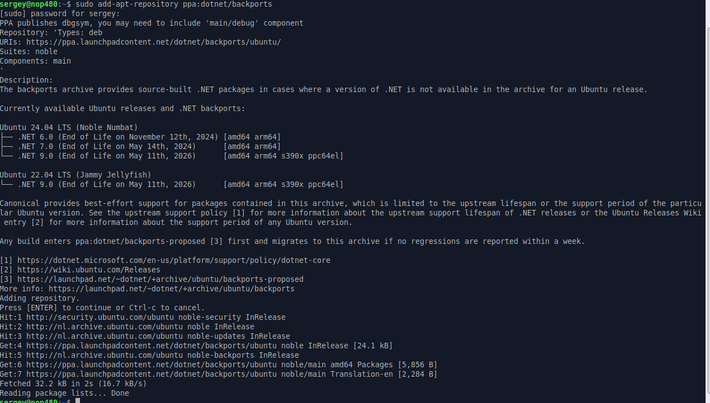
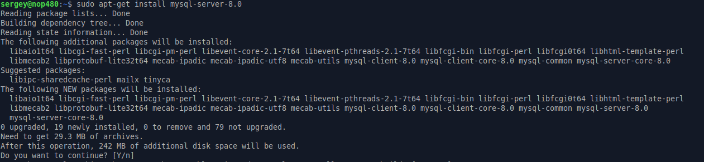
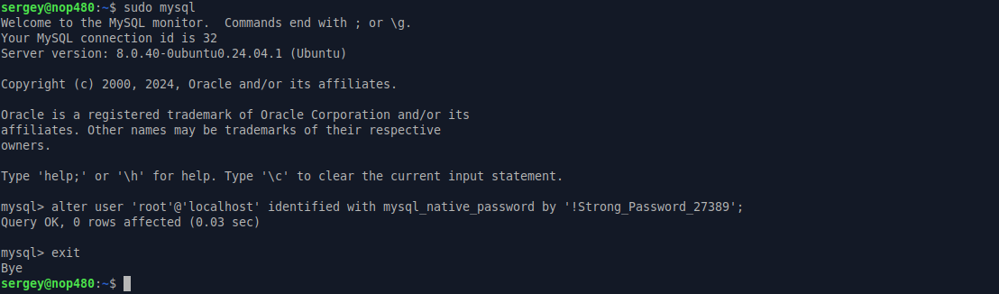
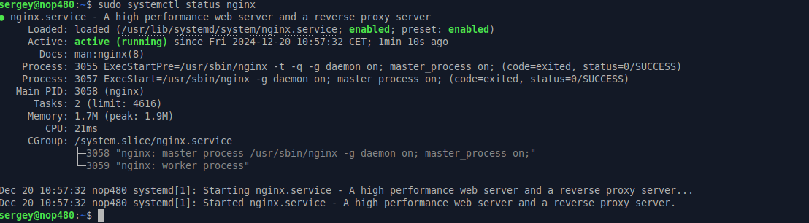
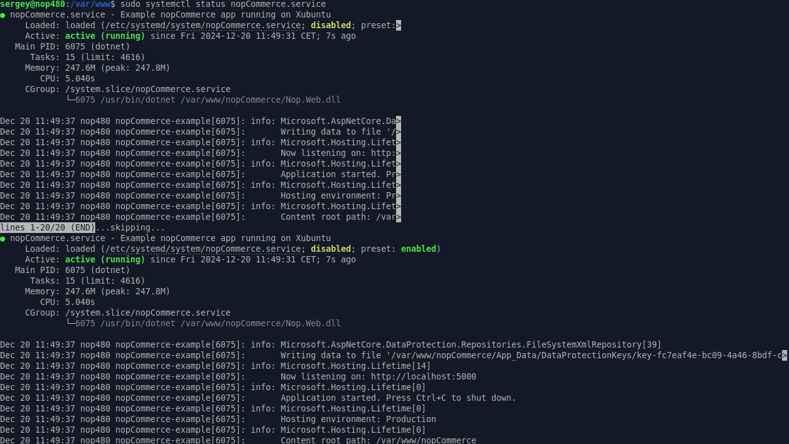

# 在 Linux 上安裝

本章節將以 *Xubuntu 22.04* 為例，說明如何在 Linux 系統上安裝 nopCommerce 軟體：

- [在 Linux 上安裝](#installing-on-linux)
  - [安裝與設定軟體](#install-and-configure-software)
    - [新增 .NET 軟體庫](#add-the-net-repository)
    - [安裝 .NET Core Runtime](#install-the-net-core-runtime)
    - [安裝 MySql Server](#install-mysql-server)
    - [安裝 nginx](#install-nginx)
  - [取得 nopCommerce](#get-nopcommerce)
  - [建立 nopCommerce 服務](#create-the-nopcommerce-service)
  - [安裝流程](#installation-process)
  - [疑難排解](#troubleshooting)
    - [Gdip](#gdip)
    - [SSL](#ssl)
  - [參閱](#see-also)

## 安裝與設定軟體

.NET 可於 Ubuntu 的 .NET backports 套件儲存庫中取得。

### 新增 .NET Repository

開啟終端機並執行以下指令：

```cmd
sudo add-apt-repository ppa:dotnet/backports
```



### 安裝 .NET Core Runtime

更新可用於安裝的產品，然後安裝 .NET runtime：

```cmd
sudo apt-get update

sudo apt-get install -y aspnetcore-runtime-9.0
```

> [!NOTE]
>
> 如果您遇到錯誤，請參閱 [Install .NET SDK or .NET Runtime on Ubuntu](https://learn.microsoft.com/en-us/dotnet/core/install/linux-ubuntu-install) 頁面上的詳細資訊。

您可以使用下列指令查看所有已安裝的 .Net Core runtime：

```cmd
dotnet --list-runtimes
```

### 安裝 MySql Server

安裝 MySql server 8.0 版本：

```cmd
sudo apt-get install mysql-server-8.0
```



預設情況下，root 的密碼是空的；讓我們來設定它。執行以下指令以存取 MySQL 提示字元：

```cmd
sudo mysql
```

執行以下的 ALTER USER 指令，將 root 使用者的驗證方式切換為 mysql_native_password，此方式會使用密碼進行驗證。請將 ‘password’ 取代為您想要設定的新密碼，並確保密碼前後保留單引號：

```cmd
ALTER USER 'root'@'localhost' IDENTIFIED WITH mysql_native_password BY 'password';
```

> [!NOTE]
> 為您的 MySQL root 使用者選擇一個高強度且唯一的密碼非常重要。強密碼長度應至少為 12 個字元，並包含大小寫字母、數字及特殊字元的組合。

輸入 **exit** 並按下 Enter 鍵以離開 MySQL 提示字元。



> [!NOTE]
>
> 如果您在設定 MySql server 的 root 密碼時遇到問題，請閱讀以下文章：
> [如何重設 Root 密碼](https://dev.mysql.com/doc/refman/8.0/en/resetting-permissions.html) 以及
> [MySQL 錯誤：'Access denied for user 'root'@'localhost'](https://stackoverflow.com/questions/41645309/mysql-error-access-denied-for-user-rootlocalhost)。

### 安裝 nginx

安裝 nginx 套件：

```cmd
sudo apt-get install nginx
```


執行 nginx 服務：

```cmd
sudo systemctl start nginx
```

並檢查其狀態：

```cmd
sudo systemctl status nginx
```



若要將 nginx 設定為反向代理以轉發請求至您的 ASP.NET Core 應用程式，請修改 /etc/nginx/sites-available/default。使用文字編輯器開啟該檔案，並將內容取代為以下程式碼：

```cmd

# Default server configuration
#
server {
    listen 80 default_server;
    listen [::]:80 default_server;

    server_name   nopCommerce.com;

    location / {
    proxy_pass         http://localhost:5000;
    proxy_http_version 1.1;
    proxy_set_header   Upgrade $http_upgrade;
    proxy_set_header   Connection keep-alive;
    proxy_set_header   Host $host;
    proxy_cache_bypass $http_upgrade;
    proxy_set_header   X-Forwarded-For $proxy_add_x_forwarded_for;
    proxy_set_header   X-Forwarded-Proto $scheme;
    }

    # SSL configuration
    #
    # listen 443 ssl default_server;
    # listen [::]:443 ssl default_server;
    #
    # Note: You should disable gzip for SSL traffic.
    # See: https://bugs.debian.org/773332
    #
    # Read up on ssl_ciphers to ensure a secure configuration.
    # See: https://bugs.debian.org/765782
    #
    # Self signed certs generated by the ssl-cert package
    # Don't use them in a production server!
    #
    # include snippets/snakeoil.conf;
}
```

## 取得 nopCommerce

建立一個目錄：

```cmd
sudo mkdir /var/www/nopCommerce
```

下載並解壓縮 nopCommerce：

```cmd
cd /var/www/nopCommerce

sudo wget https://github.com/nopSolutions/nopCommerce/releases/download/release-4.90.4/nopCommerce_4.90.4_NoSource_linux_x64.zip

sudo apt-get install unzip

sudo unzip nopCommerce_4.90.4_NoSource_linux_x64.zip
```

建立幾個用來執行 nopCommerce 的目錄：

```cmd
sudo mkdir bin
sudo mkdir logs
```

變更檔案權限：

```cmd
cd ..
sudo chgrp -R www-data nopCommerce/
sudo chown -R www-data nopCommerce/
```

## 建立 nopCommerce 服務

建立 */etc/systemd/system/nopCommerce.service* 檔案，並填入以下內容：

```cmd
[Unit]
Description=Example nopCommerce app running on Xubuntu

[Service]
WorkingDirectory=/var/www/nopCommerce
ExecStart=/usr/bin/dotnet /var/www/nopCommerce/Nop.Web.dll
Restart=always

# Restart service after 10 seconds if the dotnet service crashes:
RestartSec=10
KillSignal=SIGINT
SyslogIdentifier=nopCommerce-example
User=www-data
Environment=ASPNETCORE_ENVIRONMENT=Production
Environment=DOTNET_PRINT_TELEMETRY_MESSAGE=false

[Install]
WantedBy=multi-user.target
```

啟動該服務：

```cmd
sudo systemctl start nopCommerce.service
```

檢查 nopCommerce 服務狀態：

```cmd
sudo systemctl status nopCommerce.service
```



重新啟動 nginx 伺服器：

```cmd
sudo systemctl restart nginx
```

現在所有設定已就緒，您可以繼續進行商店的安裝與設定。

## 安裝流程

nopCommerce 的後續安裝流程與 Windows 上的安裝流程相同；您可以參考 [this link](xref:zh-Hant/installation-and-upgrading/installing-nopcommerce/installing-on-windows#install-nopcommerce) 中的說明。

## 疑難排解

### Gdip

*如果您在 RichText Box 中載入圖片時遇到問題（類型初始化器 'Gdip' 拋出了例外狀況），只需安裝 libgdiplus 程式庫即可：*

```cmd
sudo apt-get install libgdiplus
```

### SSL

*如果您希望在網站上使用 SSL，請別忘了將 **appsettings.json** 檔案中的 `UseProxy` 設定值設為 **`true`**。*

## 參閱

- [在 Linux VPS 上執行 nopCommerce。第二部分](https://www.nopcommerce.com/running-nopcommerce-on-linux-vps-part-2)