# 目錄設定

目錄設定包含啟用商品排序、更改檢視模式、比較商品等選項。

若要定義目錄設定，請前往 **設定 → 設定 → 目錄設定**。目錄設定頁面提供 *進階* 與 *基本* 兩種模式（預設為進階模式）。

此頁面支援多商店設定；這意味著可以為所有商店定義相同的設定，或是針對不同商店設定不同的值。如果您想要管理特定商店的設定，請從多商店設定下拉式清單中選擇該商店名稱，並勾選左側所需的核取方塊，以便為其設定自訂數值。如需進一步詳情，請參閱 [多商店](xref:zh-Hant/getting-started/advanced-configuration/multi-store)。

## 人工智慧

此功能將 *人工智慧 (AI)* 服務直接整合至平台中，以自動化建立商品描述與搜尋引擎最佳化 (SEO) meta 標籤，包含 Meta Title、Meta Description 與 Meta Keywords。

此功能內建於核心應用程式中，並支援三種熱門的 AI 服務提供者：

- DeepSeek
- Gemini
- ChatGPT

> [!NOTE]
>
> 同一時間只能啟用一個提供者。

所有相關設定皆可在 **目錄設定 (Catalog settings)** 頁面的 **人工智慧 (Artificial Intelligence)** 區段中找到。

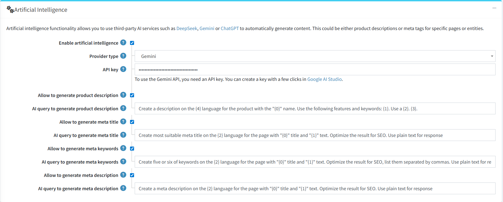

主要設定選項包含：

- **啟用人工智慧 (Enable artificial intelligence)**：您可以啟用或停用整體 AI 生成功能。您也可以獨立啟用或停用 SEO 欄位的生成。
- **提供者類型 (Provider type)**：下拉式選單可讓您選擇上述三種支援的 AI 提供者，用於內容生成。
- **提示詞範本 - AI 生成查詢 (Prompt Templates - AI query to generate[..])**：所有傳送至 AI 服務的 API 請求範本皆可編輯。這讓進階使用者能夠自訂並微調提示詞，以更符合其特定需求。

### 生成商品描述

1. 前往商品編輯頁面。**「使用 AI 生成描述」**按鈕位於商品描述編輯器正下方。

    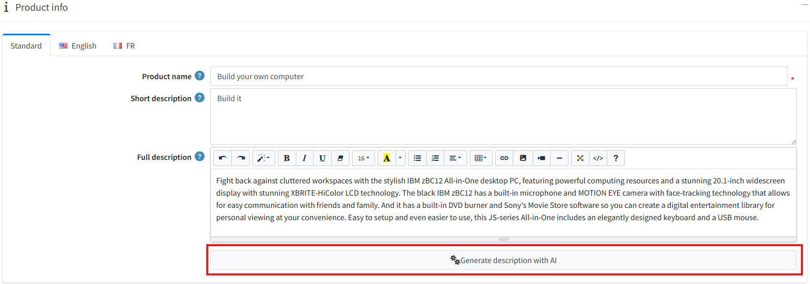

1. 點擊該按鈕會開啟一個設定視窗。

     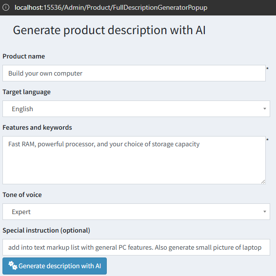

    在此，您可以調整要傳送給 AI 服務以生成描述的參數。以下欄位為必填：
    - **商品名稱**
    - **目標語言**
    - **功能與關鍵字**
    - **語氣**
    - 您也可以提供任何 **特別說明** 來引導 AI。

1. 點擊彈出視窗中的 **「使用 AI 生成描述」** 按鈕以送出請求。
    - 成功時：生成的文字將會顯示在視窗中。您可以將其直接 **儲存** 到商品描述欄位，或 **複製到剪貼簿**。如果您對結果不滿意，可以再次點擊「生成」按鈕以取得新版本。

    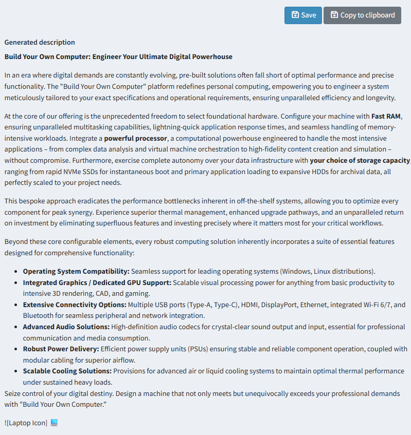

    - 失敗時：如果在生成過程中發生錯誤，視窗將顯示錯誤訊息而非生成的文字，訊息中通常會包含指向記錄檔的連結，以便進行除錯。

    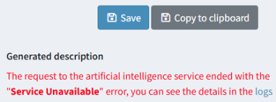

### 產生 SEO Meta 標籤

1. 在商品編輯頁面的 SEO 區段中，每個 meta 標籤區塊皆包含一個 **「使用 AI 產生 meta 標籤」(Generate meta tags with AI)** 按鈕。

    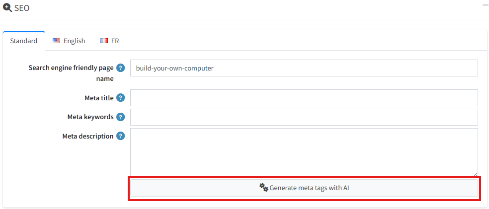

1. 點擊此按鈕將會自動為所有符合以下條件的 SEO 欄位產生內容：
    - 在設定中已啟用產生功能的欄位。
    - 目前為空的欄位（此工具不會覆蓋現有手動輸入的資料）。

> [!IMPORTANT]
>
> 如果您對作為產生基礎的欄位進行了修改（例如商品名稱或簡短描述）但尚未儲存，系統將會提示您先儲存變更，然後再傳送請求至 AI 服務。
>
> 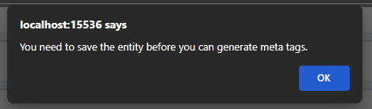

## 設定搜尋

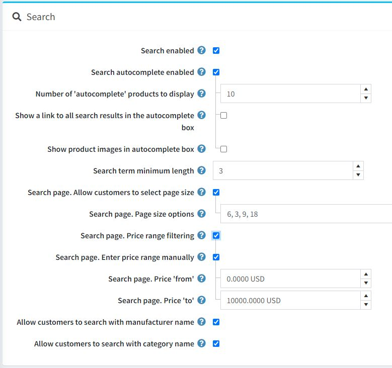

頁面頂端的面板用於設定 *搜尋* 功能：

- 若您希望在前台網站啟用搜尋功能，請勾選 **搜尋已啟用 (Search enabled)** 核取方塊。
- 勾選 **搜尋自動完成已啟用 (Search autocomplete enabled)** 核取方塊，即可在前台網站顯示自動完成搜尋方塊，如下所示：

  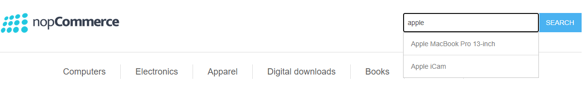

  啟用此選項後，將會顯示下列額外欄位：

  - **要顯示的「自動完成」商品數量 (Number of 'autocomplete' products to display)**：設定在前台網站搜尋方塊的自動完成下拉式清單中，可見的搜尋結果數量。
  - 勾選 **在自動完成方塊中顯示所有搜尋結果的連結 (Show a link to all search results in the autocomplete box)** 核取方塊，即可在自動完成搜尋方塊中顯示指向所有結果的連結。當找到的項目數量大於自動完成方塊中設定的顯示數量時，此連結將會顯示。
  - 勾選 **在自動完成方塊中顯示商品圖片 (Show product images in autocomplete box)** 核取方塊，即可啟用在自動完成搜尋方塊中顯示商品圖片的功能。

- **搜尋字詞最小長度 (Search term minimum length)**：搜尋時所需的最少字元數。
- 若您希望允許顧客從預定義的選項清單中選擇每頁顯示數量，請勾選 **搜尋頁面。允許顧客選擇每頁顯示數量 (Search page. Allow customers to select page size)** 核取方塊。
  - 在 **搜尋頁面。每頁顯示數量選項 (Search page. Page size options)** 欄位中，輸入以逗號分隔的每頁顯示數量選項，供顧客選擇，或是輸入您希望在搜尋商品頁面上顯示的商品數量。
  - 若停用 **搜尋頁面。允許顧客選擇每頁顯示數量** 設定，則會顯示 **搜尋頁面。每頁商品數 (Search page. Products per page)** 欄位。請在此欄位中輸入您希望在搜尋頁面上顯示的商品數量。
- 若您希望啟用依價格範圍進行篩選，請勾選 **搜尋頁面。價格範圍篩選 (Search page. Price range filtering)** 核取方塊。
  - 若您希望手動輸入價格範圍，請勾選 **搜尋頁面。手動輸入價格範圍 (Search page. Enter price range manually)** 核取方塊。
    - 若上述設定已啟用，請輸入 **搜尋頁面。價格「從」(Search page. Price 'from')**。
    - 以及 **搜尋頁面。價格「到」(Search page. Price 'to')**。
- 若啟用 **允許顧客使用製造商名稱搜尋 (Allow customers to search with manufacturer name)**，顧客將能以製造商名稱進行搜尋。
- 若啟用 **允許顧客使用類別名稱搜尋 (Allow customers to search with category name)**，顧客將能以類別名稱進行搜尋。

> [!NOTE]
> 標準的 nopCommerce 搜尋依賴精確匹配，因此若您希望提升網站搜尋的速度與相關性，我們建議使用全文檢索 (Full-text Search)。與標準搜尋不同，全文檢索會分析整個網站的內容以檢索出最相關的結果。自動完成與拼字容錯功能可最佳化搜尋速度，並協助使用者精確找到他們所需的內容。
>
> [了解更多](xref:zh-Hant/running-your-store/catalog/catalog-settings/full-text-search/index)

## 商品評論

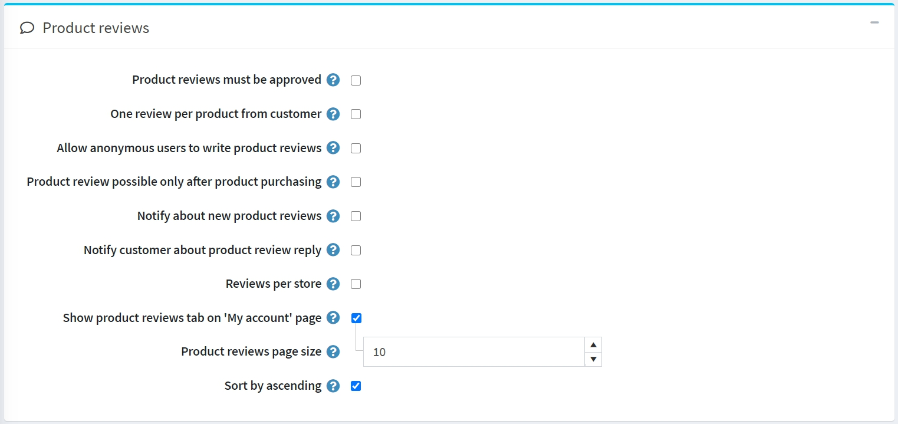

第二個面板用於設定 *商品評論*。請定義以下項目：

- **商品評論必須經過核准**：強制要求商品評論在公開發布前，必須先由商店管理員進行核准。
- **顧客對每個商品僅限一則評論**：限制顧客對每個商品只能新增 1 則評論。
- **允許匿名使用者撰寫商品評論**：允許匿名使用者撰寫商品評論。
- **僅在購買商品後才能進行商品評論**：僅允許已訂購該商品的顧客撰寫評論。
- **通知新商品評論**：當有新的公開評論時，通知商店擁有者。
- **通知顧客關於商品評論的回覆**：當商品評論獲得回覆時，通知顧客。
- **每個商店的評論**：僅顯示當前商店的評論（於商品詳細資料頁面上）。如果您希望顧客看到該商品在您所有商店中的評論，請取消勾選此核取方塊。
- **在「我的帳戶」頁面顯示商品評論分頁**：允許顧客在「我的帳戶」頁面查看他們所有的評論。
- **商品評論分頁大小**：設定每頁顯示的評論數量。
- **以升序排序**：將商品評論依建立日期進行升序排列。

## 評論類型

下一個區塊用於設定 *評論類型 (Review types)*。如果您認為基本的評論功能不足，可以自行設定一系列的評論類型。

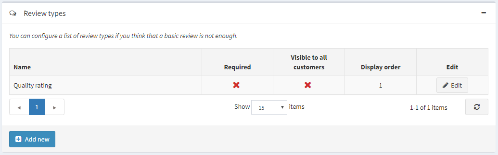

點擊 **新增 (Add new)** 按鈕來建立新的評論類型。

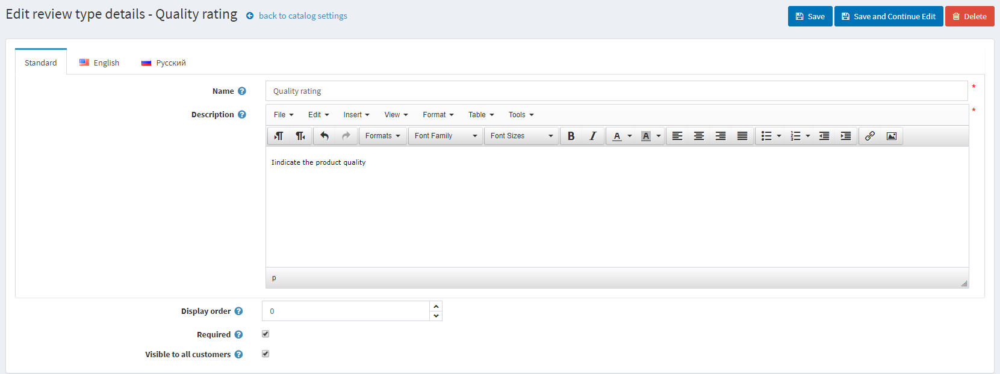

定義以下欄位：

- 輸入評論類型的 **名稱 (Name)**。
- 輸入評論類型的 **描述 (Description)**。
- 定義 **顯示順序 (Display order)**。
- 若勾選 **必填 (Required)**，顧客必須先選擇適當的評分值才能繼續。
- **對所有顧客顯示 (Visible to all customers)** 可設定該評論類型是否對所有顧客顯示。

點擊 **儲存 (Save)** 按鈕以新增評論類型。

現在，顧客將能夠在前台網站的商品評論頁面上填寫額外的評分。

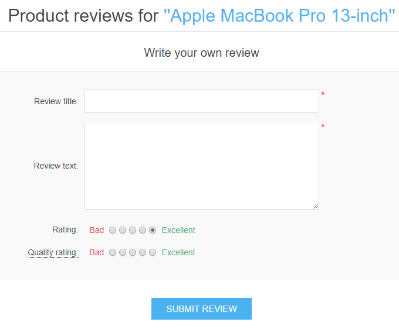

在此頁面上，您也可以查看所有顧客留下的意見回饋（若此設定已啟用）。在顧客的個人帳戶頁面上，同樣可以瀏覽該顧客對商品所留下的所有評論。

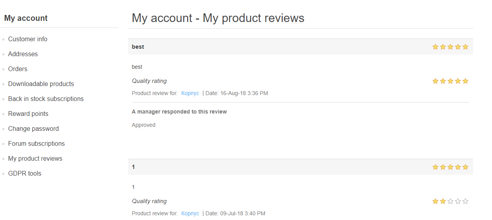

## 效能

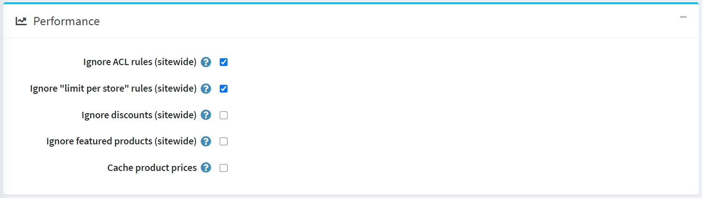

下一個面板用於設定 *效能*。啟用下列設定可以顯著提升商店的效能：

- **忽略 ACL 規則 (全站)**：關閉為實體所設定的 [ACL 規則](xref:zh-Hant/running-your-store/customer-management/access-control-list)。
- **忽略各商店限制 (全站)**：允許忽略為實體設定的各商店限制規則。如果您只有一家商店或是沒有任何針對特定商店的限制，建議啟用此設定。請參閱 [多重商店](xref:zh-Hant/getting-started/advanced-configuration/multi-store) 章節以了解更多關於多重商店的資訊。
- **忽略折扣 (全站)**。
- **忽略精選商品 (全站)**。
- **快取商品價格**：如果您使用了複雜的折扣、折扣需求規則或優惠碼，則不應啟用此項。

## 分享

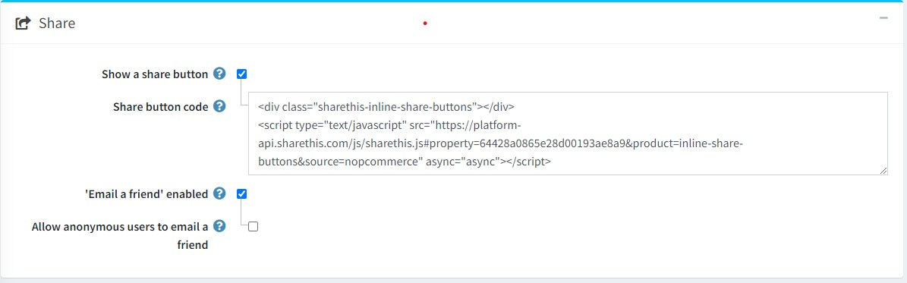

「分享」面板中的分享選項，可讓您設定讓顧客在他們的社群媒體網路上分享商品的機會。這些選項將以小圖示的形式顯示在商品頁面上。若要設定分享選項：

- 勾選 **顯示分享按鈕 (Show a share button)**，即可在商品詳細頁面上顯示分享按鈕。當勾選此欄位時，系統會顯示 **分享按鈕程式碼 (Share button code)** 欄位。
- **分享按鈕程式碼 (Share button code)** 欄位會顯示頁面的按鈕程式碼。

  > [!NOTE]
  >
  > 預設使用 ShareThis 服務 ([https://sharethis.com/](https://sharethis.com/))。

分享連結的外觀如下：

- 勾選 **啟用「寄給朋友」( 'Email a friend' enabled)** 核取方塊，以允許顧客使用「寄給朋友」選項。
- 若有需要，可勾選 **允許匿名使用者寄給朋友 (Allow anonymous users to email a friend)**。

## 商品比較

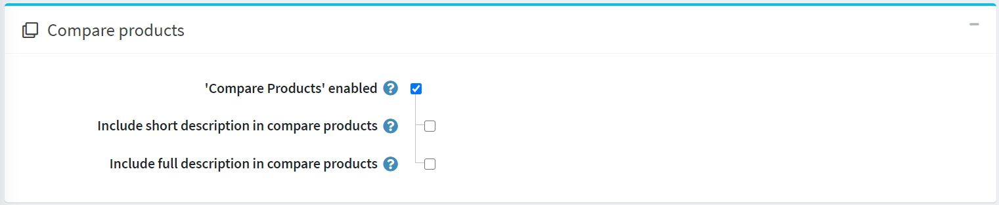

商品比較選項讓顧客能夠根據商品的特性與價格進行比較，進而做出最佳的購物決策。請依照下列步驟設定「商品比較」區塊：

- 勾選 **「商品比較」已啟用** 核取方塊，即可讓顧客在前台網站比較商品選項。此後，「加入比較清單」按鈕將會出現在商品頁面上。
- 勾選 **在商品比較中包含簡短說明** 核取方塊，即可在商品比較頁面上顯示簡短的商品說明。
- 勾選 **在商品比較中包含詳細說明** 核取方塊，即可在商品比較頁面上顯示詳細的商品說明。

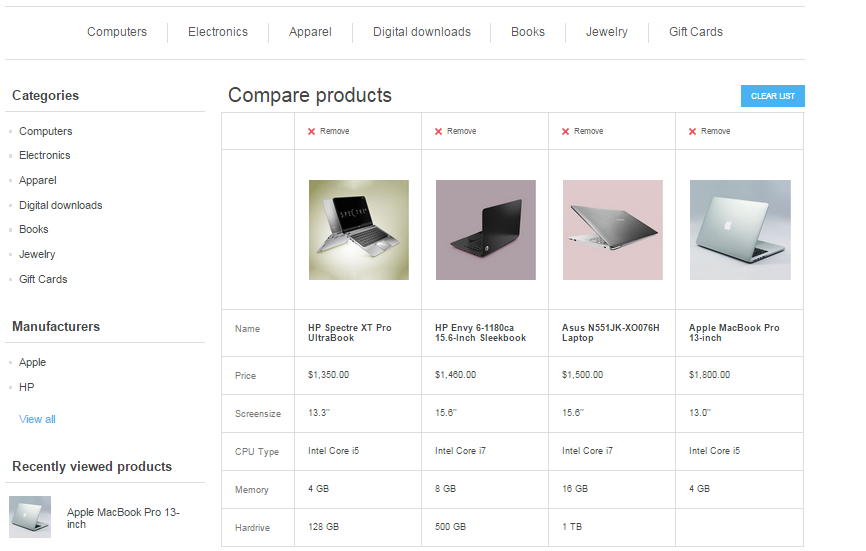

## 額外區段

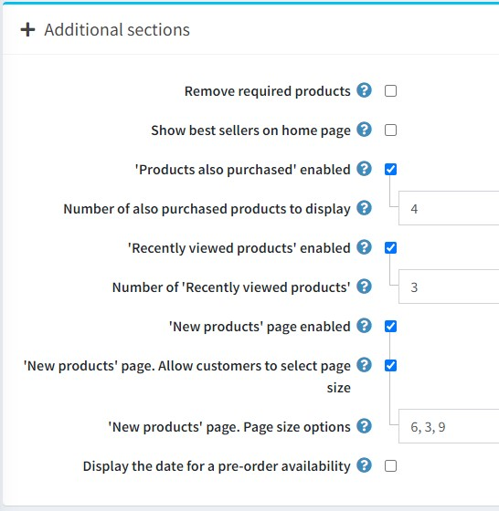

*額外區段* 面板允許您設定以下選項：

- 勾選 **移除必要商品 (Remove required products)** 核取方塊，以便在移除主要商品時，自動從購物車中移除必要商品。
- **首頁顯示暢銷商品 (Show best sellers on home page)** 允許您在首頁顯示暢銷商品。
  - 如果勾選了前一個核取方塊，您將能夠輸入 **首頁暢銷商品數量 (Number of best sellers on home page)**。
- 勾選 **啟用「也購買了此商品的顧客也購買了...」 ('Products also purchased' enabled)** 核取方塊，讓顧客能夠查看購買上述商品的其他人所購買的其他商品列表。
  - 當啟用上述選項時，會出現 **顯示「也購買了此商品」的商品數量 (Number of also purchased products to display)** 欄位。商店管理者可在此設定要顯示的商品數量。
- 勾選 **啟用「最近瀏覽過的商品」 ('Recently viewed products' enabled)** 核取方塊，讓顧客能夠查看在您商店中最近瀏覽過的商品。
  - 在 **「最近瀏覽過的商品」數量 (Number of 'Recently viewed products')** 欄位中，輸入勾選前一個核取方塊後要顯示的最近瀏覽商品數量。
- 如果您希望在商店中啟用「新商品」頁面，請勾選 **啟用「新商品」頁面 ('New products' page enabled)** 核取方塊。
  - 在 **「新商品」頁面。頁面大小選項 ('New products' page. Page size options)** 欄位中，輸入勾選 *啟用「新商品」頁面* 後要顯示的最近新增商品數量。
- 若有需要，請勾選 **顯示預購商品的到貨日期 (Display the date for a pre-order availability)** 核取方塊。

## 商品欄位

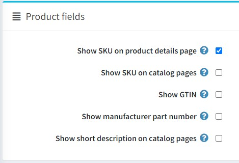

在 *商品欄位* 面板中，您可以設定下列選項：

- **在商品詳細頁面顯示 SKU**。
- **在目錄頁面顯示 SKU**。
- **在前台網站顯示 GTIN**。
- **在前台網站顯示製造商零件編號**。
- **在前台網站目錄頁面顯示簡短描述**。

## 商品頁面

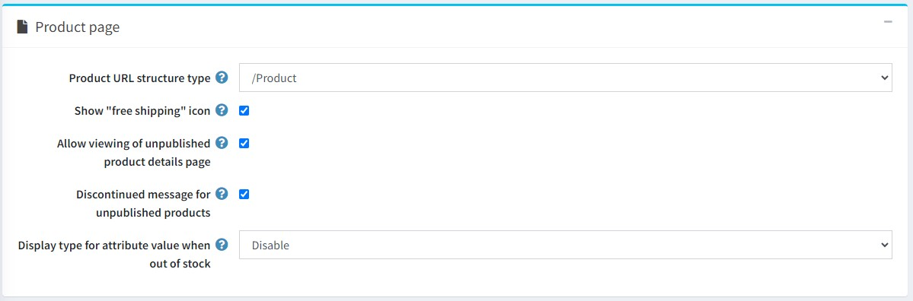

在 *商品頁面* 面板中，您可以設定以下選項：

- **商品 URL 結構類型**。可選值：
  - /Product
  - /Category/Product
  - /Manufacturer/Product
- **顯示「免運費」圖示**：針對已啟用此選項的商品顯示圖示。
- **允許檢視未發布商品的詳細資料頁面**。在此情況下，SEO 不會受到影響，搜尋引擎爬蟲仍會索引該頁面，即使商品暫時未發布且對顧客隱藏。請注意，商店管理員始終可以存取未發布的商品。
- 勾選 **未發布商品的停產訊息** 核取方塊，以便在顧客嘗試存取未發布商品的詳細資料頁面時，顯示「該商品已停產」的訊息。
- **缺貨時屬性值的顯示類型**。若屬性組合已缺貨，您可以選擇將其顯示為停用或正常顯示。

  > [!NOTE]
  >
  > 請注意，該商品必須啟用 **僅允許現有的屬性組合** 選項。

## 目錄頁面

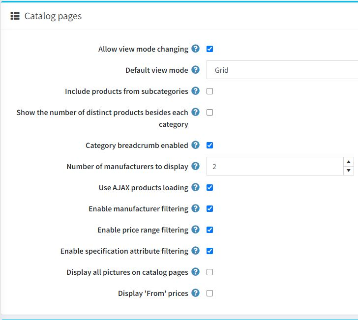

*目錄頁面 (Catalog pages)* 面板可讓您設定：

- **允許變更檢視模式**：設定於類別與製造商頁面。
- **預設檢視模式**：可選擇 *網格 (Grid)* 或 *清單 (List)*。
- **包含子類別商品**：在檢視類別詳細資料頁面時。
- **顯示各類別旁的商品數量**：在前台網站左側欄位的類別導覽區塊中顯示。
  - 若有需要，請開啟 **顯示各類別旁的商品數量** 設定。
- **啟用類別麵包屑**：勾選後即可啟用類別路徑（麵包屑）。這是顯示於螢幕頂端的列，標示出商品頁面所在的類別與子類別層級。列中的每個子項目都是一個獨立的超連結。
- **要顯示的製造商數量**：設定於製造商導覽區塊中。
- **使用 AJAX 商品載入**：在目錄頁面上以非同步方式載入商品（適用於「分頁」、「篩選」、「檢視模式」）。
- **啟用製造商篩選**：啟用目錄頁面上的製造商篩選功能。
- **啟用價格範圍篩選**：啟用目錄頁面上的價格範圍篩選功能。
- **啟用規格屬性篩選**：若有需要，可在目錄頁面上啟用規格屬性篩選。若關閉此項，即便您已建立相關屬性，規格屬性篩選也不會顯示在目錄頁面上。
- **在目錄頁面上顯示所有圖片**：在目錄頁面上將可檢視商品的所有圖片。
- **顯示「起」價格**：勾選後，即可在目錄頁面上顯示「起」價格。這將根據屬性與組合的價格調整，顯示商品的最低可能價格，而非顯示固定的基礎價格。若啟用此功能，建議同時啟用「快取商品價格」設定。但請注意，若您使用了複雜的折扣、折扣需求規則等，可能會影響效能。

> [!TIP]
>
> 若要在目錄頁面上顯示商品的簡短描述，您需要啟用此設定：`catalogsettings.showshortdescriptiononcatalogpages`

## 標籤

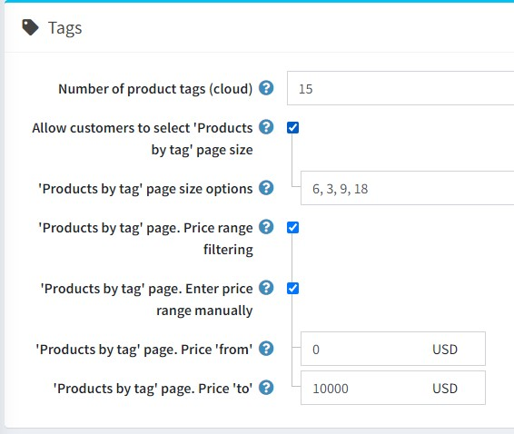

在 *標籤* 面板中，您可以定義：

- **商品標籤數量 (雲端)** — 標籤雲中顯示的標籤數量。
- **允許顧客選擇「依標籤搜尋商品」頁面大小**：允許顧客從商店擁有者預先定義的清單中選擇頁面大小。若停用此功能，顧客將無法選擇頁面大小，而改由商店擁有者進行設定。
  - 若選取了上述選項，**「依標籤搜尋商品」頁面大小選項** 欄位將會顯示。您可以輸入讓商店使用者可選擇的數值，數值之間請用逗號分隔，第一個數值將會成為預設值。
  - 若停用 **允許顧客選擇「依標籤搜尋商品」頁面大小** 設定，則會顯示 **「依標籤搜尋商品」頁面。每頁顯示商品數** 欄位。請在此欄位輸入您希望在搜尋頁面上顯示的商品數量。
- 若您想要啟用依價格區間篩選的功能，請勾選 **「依標籤搜尋商品」頁面。價格區間篩選** 核取方塊。
  - 若您希望手動輸入價格區間，請勾選 **「依標籤搜尋商品」頁面。手動輸入價格區間** 核取方塊。
    - 若啟用了上述設定，請輸入 **「依標籤搜尋商品」頁面。價格「從」**。
    - 以及 **「依標籤搜尋商品」頁面。價格「至」**。

## 稅務

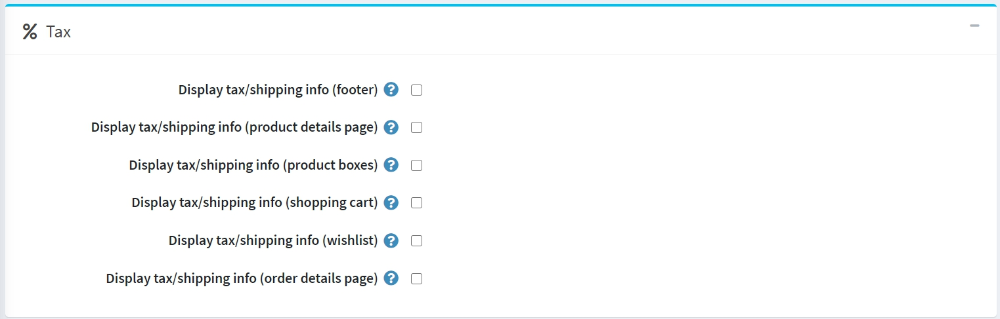

在「稅務」面板中，提供了一些針對德國的特定稅務/運費資訊選項：

- **顯示稅務/運費資訊（頁尾）**。
- **顯示稅務/運費資訊（商品詳細頁面）**。
- **顯示稅務/運費資訊（商品區塊）**。
- **顯示稅務/運費資訊（購物車）**。
- **顯示稅務/運費資訊（願望清單）**。
- **顯示稅務/運費資訊（訂單詳細頁面）**。

## 匯出/匯入

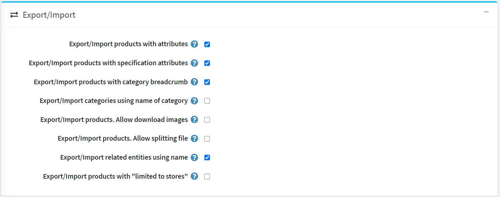

在 *匯出/匯入* 面板中，您可以設定：

- 若您需要在匯出/匯入商品時同時匯出/匯入商品屬性，請勾選 **匯出/匯入帶有屬性的商品** 核取方塊。
- 若商品應連同規格屬性一起匯出/匯入，請勾選 **匯出/匯入帶有規格屬性的商品** 核取方塊。
- 若商品應以完整的分類名稱（包含所有父分類名稱）進行匯出/匯入，請勾選 **匯出/匯入帶有分類麵包屑的商品** 核取方塊。
- 若分類應使用分類名稱進行匯出/匯入，請勾選 **使用分類名稱匯出/匯入分類** 核取方塊。
- 若在匯出商品時允許從遠端伺服器下載圖片，請勾選 **匯出/匯入商品。允許下載圖片** 核取方塊。
- 若您希望從自動從主檔案建立的最佳大小個別檔案匯入商品，請勾選 **匯出/匯入商品。允許分割檔案** 核取方塊。此功能將協助您以較小的延遲匯入大量資料。
- 若相關實體應使用名稱進行匯出/匯入，請勾選 **使用名稱匯出/匯入相關實體** 核取方塊。
- 若商品應連同其「限制於商店」屬性一起匯出/匯入，請勾選 **匯出/匯入帶有「限制於商店」的商品** 核取方塊。

> [!NOTE]
>
> 當您擁有兩種或多種語言時，匯出/匯入 Excel/XML 功能支援多語言資料。

## 商品排序

在 *商品排序* 面板中，您可以設定以下項目：

- 勾選 **允許商品排序** 核取方塊，即可在類別頁面和供應商頁面上啟用商品排序選項。您可以啟用或停用依據 *位置*、*名稱*、*價格* 和 *建立日期* 的排序功能。

  > [!NOTE]
  > 選擇「位置」值表示商品排序將不會有任何限制。

  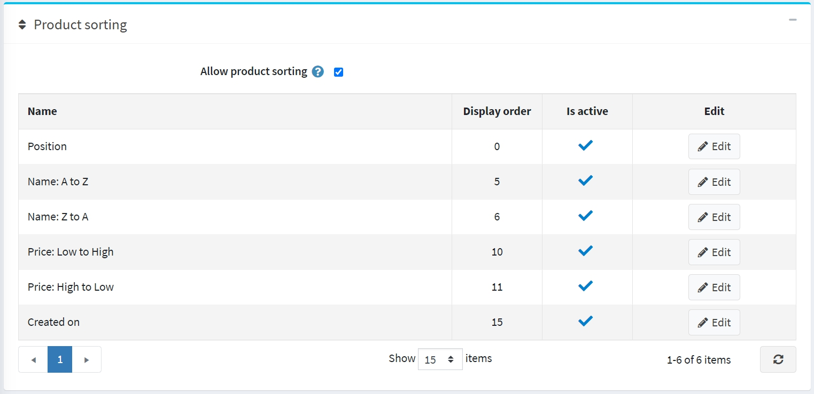

  您可以點擊 **編輯** 按鈕來編輯每個選項的 **顯示順序** 與 **是否啟用** 屬性。