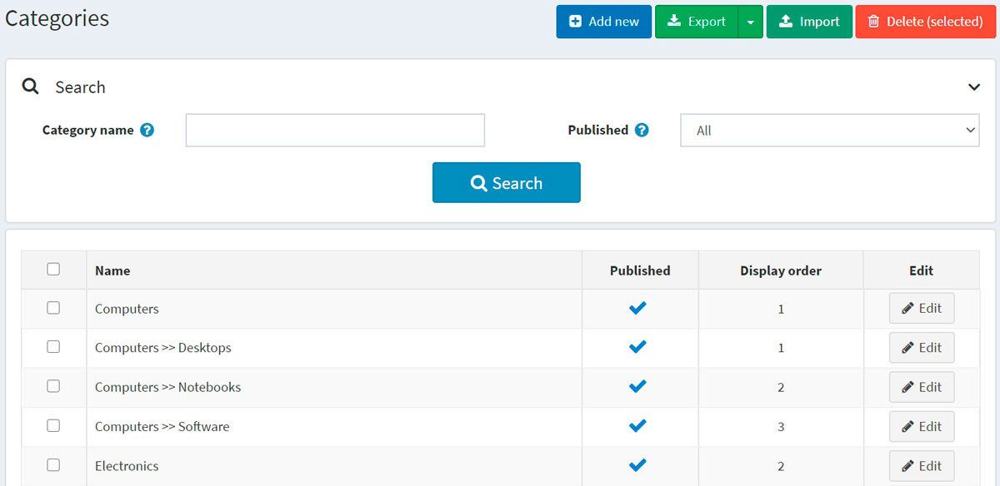
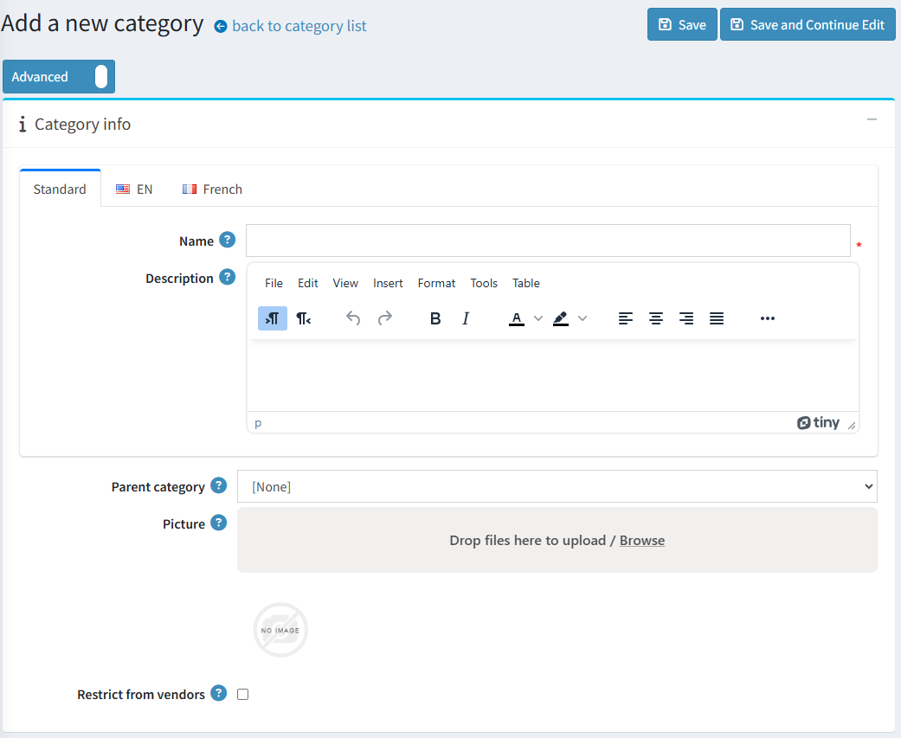
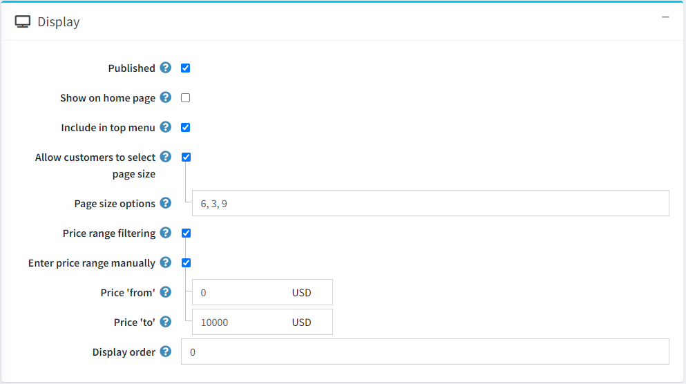
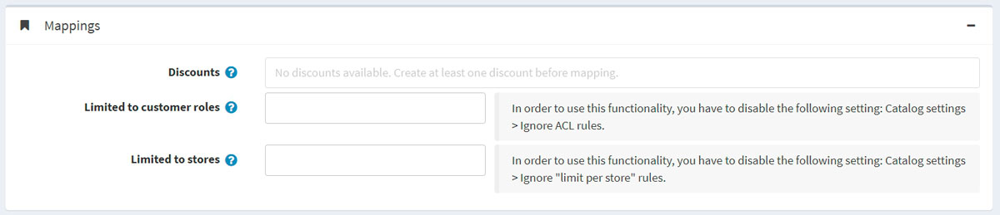
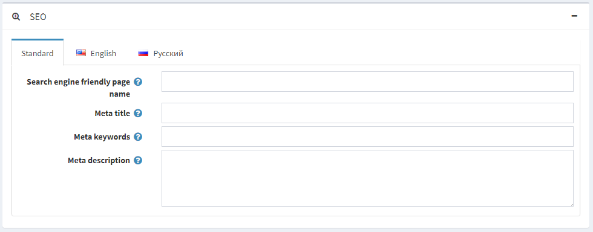
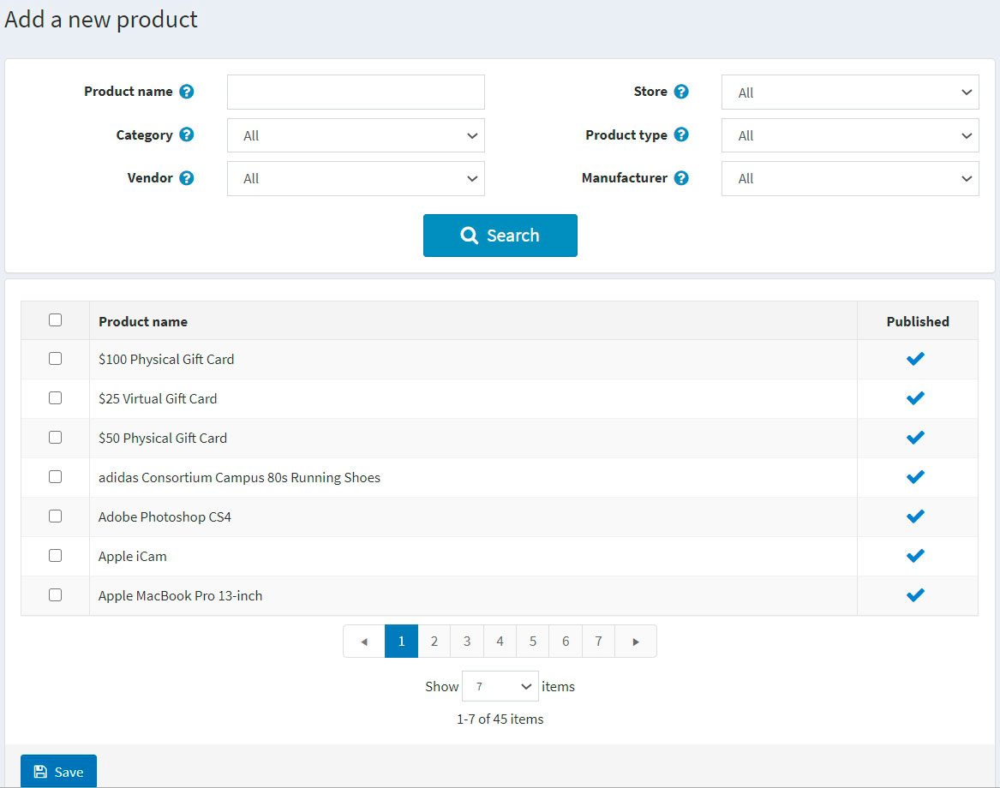
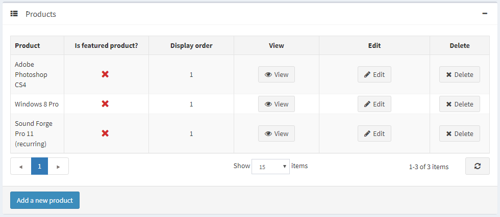

# 商品分類

在新增商品之前，商店管理員應先建立商品分類，以便稍後將這些商品歸類。若要管理商品分類，請前往 **目錄 → 商品分類**。



您可以透過 *搜尋* 面板輸入 **分類名稱** 或其部分字串、根據 **已發布** 屬性，或在特定的 **商店**（若已啟用多間商店）中篩選分類。

> [!NOTE]
>
> 若要從清單中移除商品分類，請選取要刪除的項目，然後點擊 **刪除 (所選)** 按鈕。
> 您可以點擊 **匯出** 按鈕，將商品分類匯出至外部檔案以進行備份。點擊 **匯出** 按鈕後，您會看到下拉式選單，可選擇 **匯出為 XML** 或 **匯出為 Excel**。

## 新增類別

若要新增類別，請點擊頁面頂端的 **新增 (Add new)** 按鈕。此時將會顯示「新增類別」視窗。



此頁面提供兩種模式：**進階 (advanced)** 與 **基本 (basic)**。您可以切換至基本模式（僅顯示主要欄位），或使用進階模式來顯示所有可用的欄位。

### 商品分類資訊

在 *商品分類資訊 (Category info)* 面板中，請定義以下分類資訊：

- **名稱 (Name)** — 這是在目錄中顯示的分類名稱。
- **描述 (Description)** — 分類描述。請使用編輯器來調整版面配置與字型。
- 若此分類為子分類，請從下拉式清單中選擇 **父分類 (Parent category)**。新的分類將會被放置於前台網站中該分類的下方。
- **圖片 (Picture)** — 代表此分類的圖片。請從您的裝置上傳圖片。
- **限制供應商 (Restrict from vendors)** - 勾選此項可限制供應商將商品新增至此分類。當您的商店啟用了多供應商功能時，此選項非常實用。一旦啟用，供應商將無法在管理後台的「新增商品」或「編輯商品」頁面中看到此分類。

### 顯示



在「顯示」面板中，定義以下類別資訊：

- 勾選 **Published** (已發佈) 核取方塊，使類別在前台網站中顯示。
- 勾選 **Show on home page** (顯示於首頁) 核取方塊，將此類別顯示在首頁。
- 勾選 **Include in top menu** (包含於頂部選單) 核取方塊，將此類別包含在首頁的頂部選單中。
- 勾選 **Allow customers to select page size** (允許顧客選擇頁面大小) 核取方塊，以啟用讓顧客選擇頁面大小的功能，即類別詳細資訊頁面上顯示的商品數量。顧客可以從商店管理員在 **Page size options** (頁面大小選項) 欄位中輸入的清單中進行選擇。
  - 若已勾選上述核取方塊，則會顯示 **Page size options** 欄位。請輸入以逗號分隔的頁面大小選項清單（例如：10, 5, 15, 20）。如果顧客未做選擇，第一個選項即為預設的頁面大小。
  - 若取消勾選 **Allow customers to select page size** 核取方塊，則會顯示 **Page size** (頁面大小) 選項。此選項用來設定此類別中商品的頁面大小，例如每頁顯示「4」個商品。
  > [!TIP]
  >
  > 例如，當您在類別中新增七項商品並將頁面大小設為三時，前台網站的此類別詳細資訊頁面每頁將顯示三項商品，總頁數將為三頁。

- 若您想啟用依價格範圍篩選的功能，請勾選 **Price range filtering** (價格範圍篩選) 核取方塊。
  - 若您希望手動輸入價格範圍，請勾選 **Enter price range manually** (手動輸入價格範圍) 核取方塊。
    - 若啟用了上述設定，請輸入 **Price 'from'** (價格「起」)。
    - 以及 **Price 'to'** (價格「迄」)。
- **Display order** (顯示順序) — 類別顯示的順序編號。此顯示編號用於排序前台網站中的類別（遞增排序）。顯示順序為 1 的類別將被放置在清單的最上方。
- 如果您在 **系統 → 範本** (System → Templates) 頁面安裝了自訂類別範本，則會顯示 **Category template** (類別範本) 欄位。此範本定義了此類別（及其商品）的顯示方式。

### 對應 (Mappings)



在 *Mappings* 面板中，定義下列類別資訊：

- **折扣 (Discounts)** — 選擇與此類別關聯的折扣。您可以在 **促銷 → 折扣** 頁面中建立折扣。閱讀更多關於折扣的資訊，請參考 [折扣](xref:zh-Hant/running-your-store/promotional-tools/discounts) 章節。

    > [!NOTE]
    >
    > 請注意，這裡僅顯示類型為 *指派至類別 (assigned to categories)* 的折扣。將折扣對應至類別後，這些折扣將套用於該類別下的所有商品。
    >
    > [!NOTE]
    >
    > 若要使用折扣功能，請確保 **設定 → 設定 → 目錄設定 → 效能** 面板中的 **忽略折扣 (全站)** 設定已停用。

- 在 **限於顧客角色 (Limited to customer roles)** 欄位中，選擇可以在目錄中看到此類別的顧客角色。如果不需要此選項，請保持此欄位留空，這樣所有人都能看到該類別。
    > [!NOTE]
    >
    > 若要使用此功能，您必須停用下列設定：**設定 → 目錄設定 → 忽略 ACL 規則 (全站)**。閱讀更多關於存取控制清單 (ACL) 的資訊 [here](xref:zh-Hant/running-your-store/customer-management/access-control-list)。

- 如果該類別僅在特定商店販售，請在 **限於商店 (Limited to stores)** 欄位中選擇對應的商店。如果不需要此功能，請保持欄位留空。
  > [!NOTE]
  >
  > 若要使用此功能，您必須停用下列設定：**目錄設定 → 忽略「每家商店限制」規則 (全站)**。閱讀更多關於多商店功能的資訊 [here](xref:zh-Hant/getting-started/advanced-configuration/multi-store)。

### SEO



在 *SEO* 面板中，請定義下列詳細資訊：

- **搜尋引擎友善網頁名稱** — 搜尋引擎所使用的頁面名稱。如果您將此欄位留空，類別頁面的 URL 將會使用類別名稱來產生。如果您輸入 custom-seo-page-name，則會使用下列自訂 URL：`http://www.yourStore.com/custom-seo-page-name`。

- **Meta 標題** 指定了網頁的標題。這是一段插入到您網頁表頭（header）的程式碼：

    ```html
    <head>
        <title> Creating Title Tags for Search Engine Optimization & Web Usability </title>
    </head>
    ```

- **Meta 關鍵字** — 類別的 meta 關鍵字，代表該頁面最重要主題的簡潔清單。Meta 關鍵字標籤看起來像這樣：
 `<meta name="keywords" content="keyword, keyword, keyword phrase, etc.">`

- **Meta 描述** — 類別的描述。Meta 描述標籤是頁面內容的簡短摘要。Meta 描述標籤看起來像這樣：
 `<meta name="description" content="Brief description of the contents of your page">`

點擊 **儲存並繼續編輯** 按鈕以繼續將商品加入至此類別。

### 商品

*商品* 面板包含與所選類別相關的商品列表。這些商品可以在型錄中按類別進行篩選。商店擁有者可以將新商品新增至此類別。請注意，您必須先儲存該類別，才能開始新增商品。

點擊 **新增商品** 以搜尋您想要納入此類別的商品。您可以透過 **商品名稱**、**類別**、**供應商**、**商店**、**商品類型** 以及 **製造商** 進行搜尋。



選取您想要新增至此類別的商品，然後點擊 **儲存** 按鈕。這些商品將會顯示在所選類別之下。



在將商品新增至類別後，請點擊商品旁邊的 **編輯** 按鈕，於 *商品* 表格中定義以下資訊：

- **是否為精選商品**。
- **顯示順序**。

> [!NOTE]
>
> 點擊 **檢視** 後，您將被重新導向至 *編輯商品詳細資料* 頁面。

點擊 **儲存**。新的類別將會顯示在前端商店的父類別之下。

## 匯入類別

如果您不想手動將所有類別新增至目錄中，可以使用匯入選項。

> [!NOTE]
>
> 在開始匯入之前，您應該下載 Excel 格式的表格範本。為了確保正確且精確地匯入您的類別，請務必將表格中的所有欄位名稱正確命名（與下載的表格完全一致）。

並非一定要填寫所有表格欄位。系統會根據已填寫的欄位來建立類別。

匯入過程需要消耗大量的記憶體資源。因此，不建議一次匯入超過 500–1000 筆記錄。如果您有更多的記錄，建議將其分割成多個 Excel 檔案並分別進行匯入。

## 參閱

- [新增商品](xref:zh-Hant/running-your-store/catalog/products/add-products)
- [SEO](xref:zh-Hant/running-your-store/search-engine-optimization)