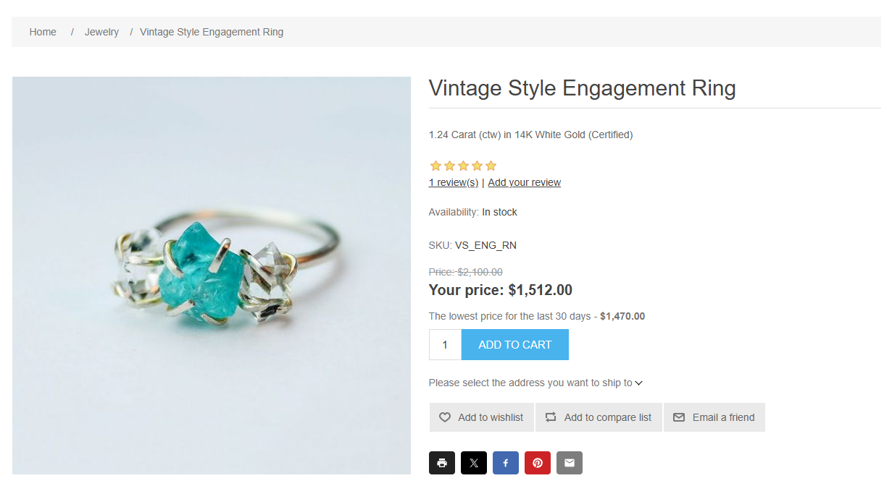
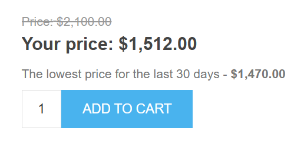
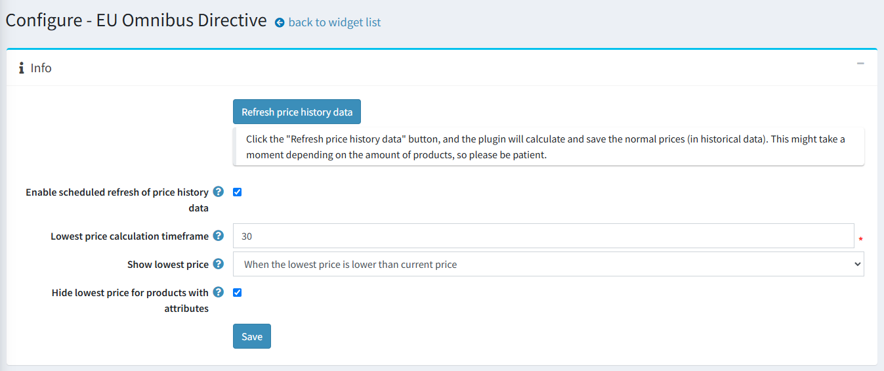
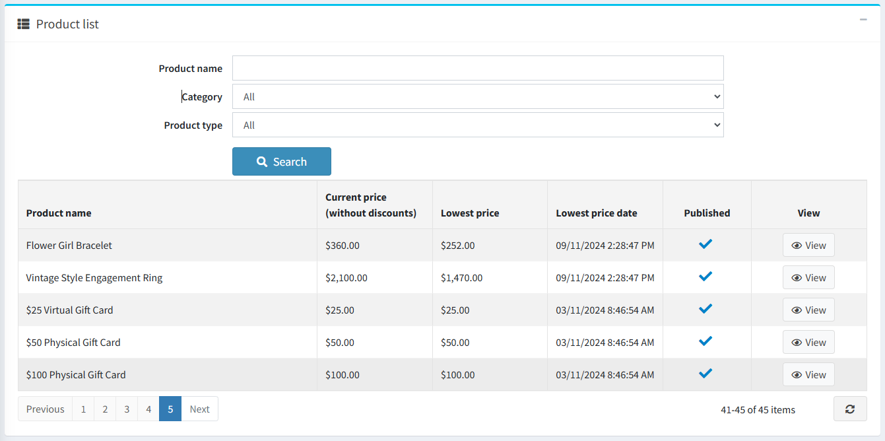
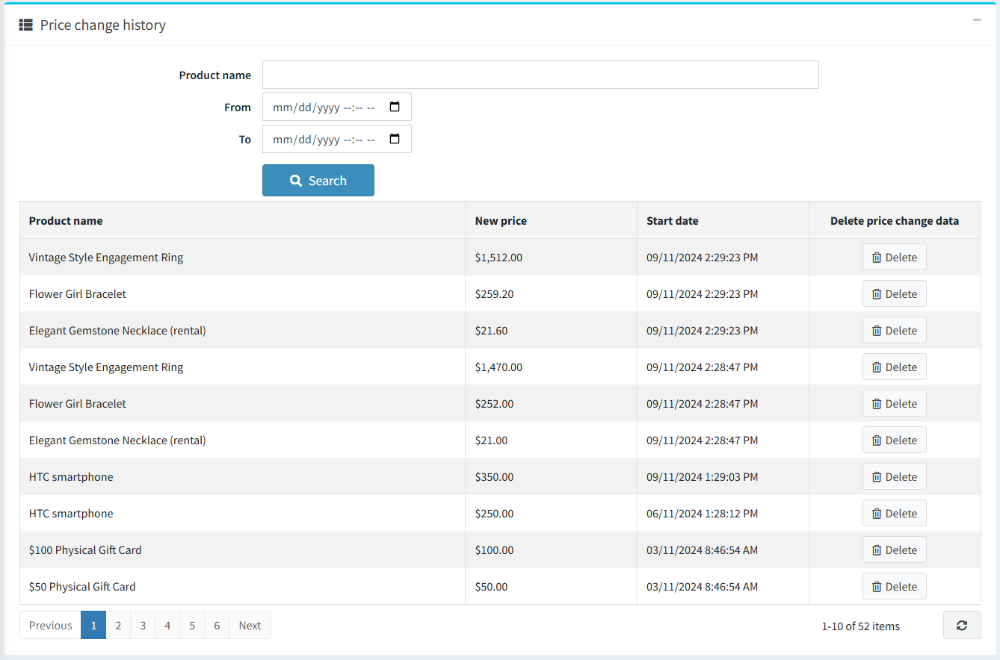
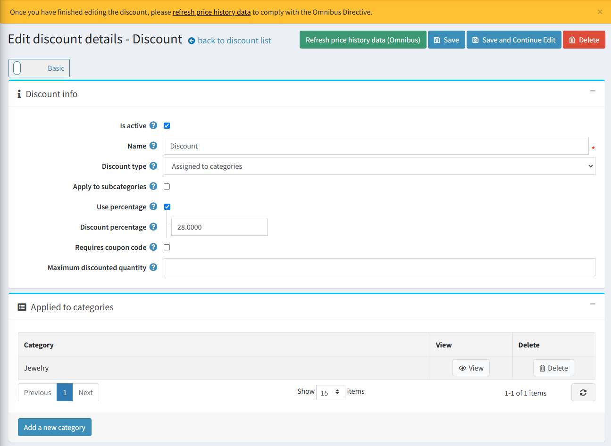

# 歐盟綜合指令 (EU Omnibus Directive)

## 簡介

請取得 Omnibus Directive 整合 [here](https://www.nopcommerce.com/omnibus-directive)。

### 什麼是 Omnibus？

指令 (EU) 2019/2161（亦稱為 [Omnibus Directive](https://eur-lex.europa.eu/eli/dir/2019/2161/oj)）是一項歐盟指令，旨在透過實施制裁來強化消費者權益並促進更高的透明度。Omnibus Directive 的主要目標是提升整個歐盟地區的消費者保護權益，且適用於所有電子商務商店。

### Omnibus Directive 的關鍵重點：

* 任何價格折減都必須在電子商務網站上顯示，並同時呈現折價前的原價以及折扣後的現價。
* 在促銷活動開始前的 30 天內所記錄的最低價格，必須作為套用價格折減的參考基準。

### 如何合規地套用促銷活動

在規劃促銷活動或折扣檔期之前，您必須確保至少在促銷日期前的 30 天內，所有歷史價格皆可供查詢。若當地主管機關要求，您必須能夠證明並提供過去一個月的價格記錄。

## 適用於 Omnibus Directive 的 nopCommerce 外掛

為了遵守 Omnibus Directive（歐盟綜合指令），我們的整合功能會追蹤設定時間範圍內的價格變動，並向顧客顯示最低價格。追蹤過程會納入套用於商品、類別或製造商的折扣。

歐盟的 Omnibus Directive 影響了電子商務企業顯示商品價格的方式，特別是促銷中的商品。該指令要求零售商不僅要告知顧客折扣後的價格或百分比，還必須提供該商品在過去 30 天內的最低售價。這些價格被稱為 omnibus 價格。企業在訂價上必須保持透明，使這些 omnibus 價格顯眼且易於讓顧客取得，同時確保所有商品頁面的一致性。

### 外掛設定

在設定頁面上，您可以啟用歷史紀錄重新整理、設定時間範圍、自訂顯示選項等等。

點擊「Refresh price history data」按鈕，外掛將會計算並儲存標準價格（於歷史資料中）。根據商品數量的多寡，這可能需要一些時間，請耐心等待。建議在安裝外掛後或開始新的折扣活動時執行此操作。

> [!NOTE]
> 此外掛僅支援標準折扣。不支援使用個人化優惠碼的折扣。

價格歷史資料會每 24 小時針對已發佈的商品自動重新整理，或者在商品價格變更（建立或編輯商品）時立即重新整理。

1. 若要停用價格歷史資料的排程重新整理，請取消勾選 **Enable scheduled refresh of price history data** 核取方塊，該功能預設為啟用。這對於擁有大量商品的商店來說非常實用。
1. 若要調整計算最低價格的時間範圍，請在 **Lowest price calculation timeframe** 欄位中輸入所需數值。預設情況下，此整合功能會顯示當前日期前 30 天內的最低價格。
1. 使用 **Show lowest price** 設定來選擇如何在商品詳細資訊頁面顯示最低價格：
    * **When the lowest price is lower than the current price** – 僅在最低價格低於當前價格時顯示（否則將隱藏）。
    * **Always** – 若您希望永遠顯示最低價格（即使與當前價格相同）。
    * **Hide** – 當您剛安裝外掛且收集的資料尚不足時很有幫助（建議在外掛運作的前 30 天選擇此設定）。

1. **Hide lowest price for products with attributes** 核取方塊允許您針對具有商品屬性的商品隱藏或顯示最低價格。具有價格調整功能的商品屬性不會儲存價格歷史資料（我們僅儲存標準商品價格）。

此外掛會每 24 小時自動清除過期的價格歷史資料（早於所設定價格計算時間範圍的歷史資料）。

> [!NOTE]
> 排程任務不會刪除早於所設定價格計算時間範圍的價格歷史記錄，因為該記錄會被視為初始價格。

在 **Product list** 區塊中，您可以查看當前價格與最低價格、庫存狀態，以及用於編輯商品的「View」按鈕。您可以根據名稱、類別、類型和商店（如果您有多家商店）來篩選商品。

**Price change history** 區塊包含所有儲存的商品價格。表格中的每個項目都有一個刪除按鈕，允許您將其刪除（例如，若該記錄是誤存的）。您可以根據商品名稱、計算期間和商店（如果您有多家商店）來篩選歷史變更資料。

在折扣詳細資訊頁面上，您可以新增所有折扣資訊並列出該折扣所適用的商品。我們建議在折扣詳細資訊頁面設定折扣促銷後，點擊「Refresh price history data (Omnibus)」按鈕手動重新整理價格變更資料。否則，在兩次排程任務執行間隔（每 24 小時）可能會導致不符合 Omnibus Directive 的規範。

### 外掛安裝

本節說明如何將 Omnibus Directive 外掛整合到您的商店中。

1. 購買整合 [here](https://www.nopcommerce.com/omnibus-directive)。
1. 下載外掛壓縮檔。
1. 前往 **管理後台 > 設定 > 本地外掛**。
1. 使用「上傳外掛或佈景主題」按鈕上傳外掛壓縮檔。
1. 向下捲動外掛列表以找到剛上傳的外掛。
1. 點擊 **安裝** 按鈕來安裝此外掛。

請參閱關於如何安裝外掛的更多資訊 [here](https://docs.nopcommerce.com/getting-started/advanced-configuration/plugins-in-nopcommerce.html)。