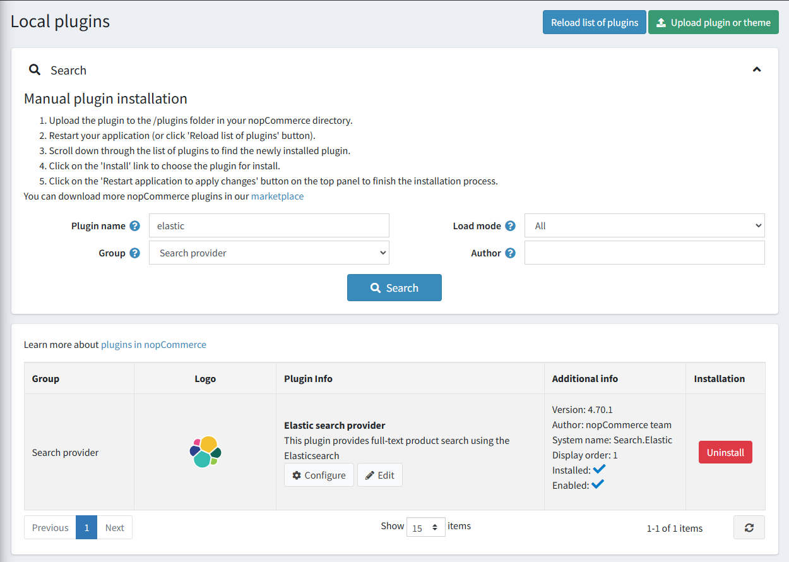
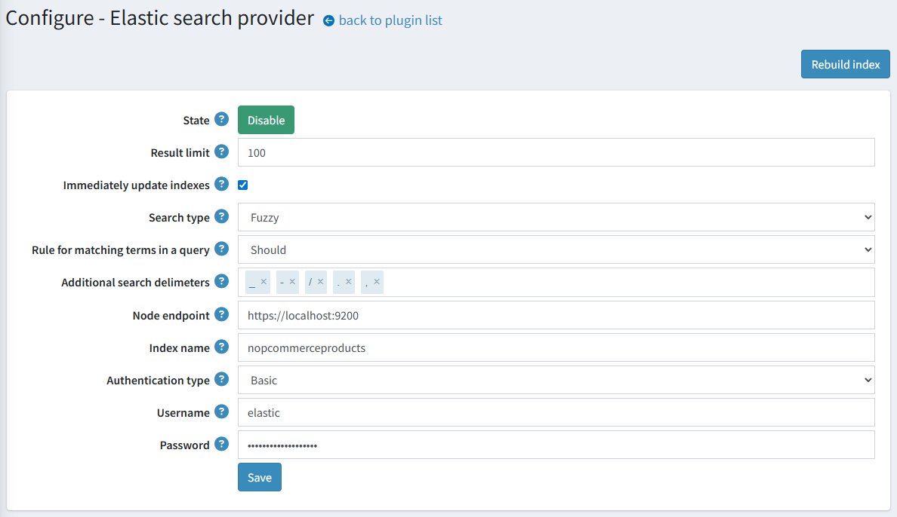

# 基於 Elasticsearch 的全文搜尋

請取得與 Elasticsearch 的官方整合 [here](https://www.nopcommerce.com/full-text-search-elasticsearch?utm_source=docs.nopcommerce&utm_medium=documentation&utm_campaign=full-text-search-elasticsearch)。

Elasticsearch 是一個基於 Lucene 函式庫的搜尋引擎。它提供了一個具備分散式、多租戶能力的全文搜尋引擎，並具有 HTTP 網頁介面與無 Schema 的 JSON 文件。

我們的整合方案提供了一套強型別 API 與查詢 DSL，以利與 Elasticsearch 伺服器互動。此外掛包含針對商品的高階操作，例如批次索引（bulk indexing）、更新操作與搜尋。

> [!NOTE]
> 此整合基於 v8 .NET 用戶端，適用於 Elasticsearch 8.x 版本。

## 可用功能

以下是支援的功能列表：

* 自動更新 Elasticsearch 伺服器上的商品資料（即時或排程更新）。
* 自動將可用的索引語言對應到目前的商店語言。
* 多種內建搜尋類型：
  * 模糊搜尋（Fuzzy search）：用於拼字錯誤的詞句。例如，如果您輸入「test」而不是「text」，系統仍然能找到結果。
  * 萬用字元搜尋（Wildcard search）：用於符合詞句模式而非搜尋完整詞句。此整合使用 `*` 萬用字元運算子來表示字詞結尾。
  * 精確搜尋（Exact search）：將查詢與索引後的 Token 進行嚴格比對。
* 多種存取 Elasticsearch 叢集的驗證方法。

## 外掛安裝

本章節說明如何將 Elasticsearch 整合至您的商店。

1. 前往 [https://www.nopcommerce.com/full-text-search-elasticsearch](https://www.nopcommerce.com/full-text-search-elasticsearch?utm_source=docs.nopcommerce&utm_medium=documentation&utm_campaign=full-text-search-elasticsearch) 購買整合套件。
1. 下載外掛壓縮檔。
1. 前往 **後台 > 設定 > 本地外掛**。使用「上傳外掛或佈景主題」功能上傳該外掛壓縮檔。
1. 在外掛清單中向下捲動，找到剛安裝的外掛。點擊「安裝」按鈕以完成安裝。

您可以參考 [here](https://docs.nopcommerce.com/getting-started/advanced-configuration/plugins-in-nopcommerce.html) 以取得更多關於如何安裝外掛的資訊。

必須正確設定 Elasticsearch 才能使外掛正常運作。關於 Elasticsearch 安裝流程的詳細資訊，請參考 [here](https://www.elastic.co/downloads/elasticsearch)。

> [!NOTE]
> 此外掛屬於 **搜尋提供者** 群組。您可以在搜尋面板中使用 **群組** 欄位來篩選外掛，以便更快速地找到目標。

## 外掛設定

點擊清單中 Elastic search 提供者選項旁邊的 **Configure** 按鈕。接著，請遵循下列步驟完成外掛設定：

1. 輸入外掛將用來連接至您的 Elasticsearch 叢集的 Node 端點 URL。
1. 輸入將用於 Elasticsearch 伺服器請求的索引名稱（預設為 *nopcommerceproducts*）。
1. 輸入您的 Elasticsearch 伺服器憑證：
    * **Authentication type**：選擇用於授權存取 Elasticsearch 叢集的驗證方法。
    * **Username**：這是您在使用 Basic 驗證機制時所使用的使用者名稱。
    * **Password**：這是您在使用 Basic 驗證機制時所使用的密碼。
    * **Api Key**：這是您在使用 Bearer 驗證機制時所使用的金鑰。
1. 選擇搜尋演算法：
    * "**Fuzzy**"（模糊）搜尋是基於 Levenshtein 距離（例如，搜尋「roam」一詞會找到「foam」和「roams」等詞）。
    * "**Contains**"（包含）搜尋會基於在末尾加上「*」的萬用字元搜尋，尋找 0 個或多個字元（例如，若要搜尋「test」、「tests」或「tester」，您可以使用「test」一詞）。
    * "**None**"（無）選項則是基於精確比對。
1. 選擇搜尋查詢中詞彙的比對規則：
    * "**Should**" 運算子：詞彙應出現在相符商品的欄位中，但非強制條件。
    * "**Must**" 運算子：詞彙必須出現在相符商品的欄位中。
1. 設定更新搜尋索引文件的行為。勾選 **Immediately update indexes** 以立即套用對應商品（例如，商品名稱或描述已變更）的變更。否則，重新索引作業將會排程執行。
    > [!NOTE]
    > 您也可以手動點擊「Rebuild index」按鈕來開始重新索引。
1. 如有必要，請輸入 **Result limit**。結果限制是搜尋查詢從 Elasticsearch 伺服器取回的最高結果比對數量。
1. 輸入額外的分隔字元，將搜尋查詢分割成多個詞彙。請注意，搜尋查詢除了依據您輸入的分隔字元外，永遠都會以空格進行分割。
1. 點擊 **Save** 按鈕。

> [!NOTE]
> 若要切換外掛狀態，請使用 "**Enable**" 或 "**Disable**" 按鈕。這些按鈕會根據目前的狀態顯示。