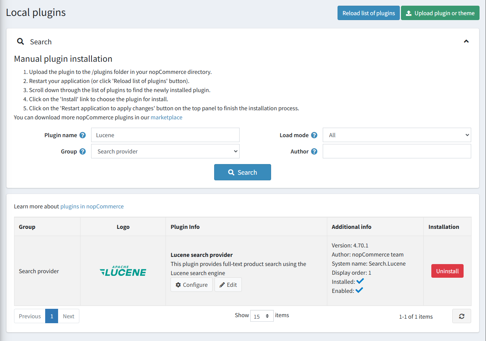
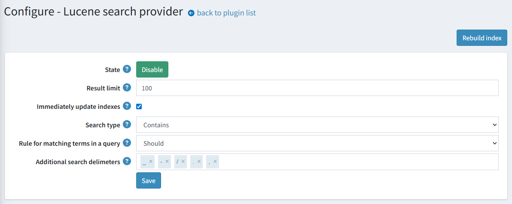

# 基於 Lucene 的全文檢索

請取得基於 Lucene 的全文檢索外掛 [here](https://www.nopcommerce.com/full-text-search-lucene?utm_source=docs.nopcommerce&utm_medium=documentation&utm_campaign=full-text-search-lucene)。

[Apache Lucene™](https://lucene.apache.org/) 是一個高效能、功能完整的搜尋引擎函式庫，完全使用 Java 編寫。它幾乎適用於任何需要結構化搜尋、全文檢索、分面搜尋 (faceting)、高維度向量的近鄰搜尋、拼字校正或查詢建議的應用程式。

我們的整合方案使用了 [Lucene.Net](https://lucenenet.apache.org/)，這是 Lucene 搜尋函式庫的 .NET 移植版本。Apache Lucene.NET 是一個提供強大索引、搜尋功能以及進階分析與詞彙切分 (tokenization) 能力的 .NET 函式庫。

## 可用功能

以下是支援的功能列表：

* 自動更新索引儲存中的商品資料。
* 自動將可用的索引語言與目前的商店語言進行配對。
* 幾種內建的搜尋類型：
  * 模糊搜尋 (Fuzzy search)：用於拼字錯誤的短語。例如，當您輸入「test」而非「text」時，仍然可以找到結果。
  * 萬用字元搜尋 (Wildcard search)：用於比對短語模式，而非搜尋完整短語。此整合功能使用 `*` 萬用字元運算子來代表字尾。
  * 精確搜尋 (Exact search)：將查詢內容與索引中的詞彙進行嚴格比對。

## 外掛安裝

本節說明如何將 Lucene 外掛整合至您的商店。

1. 在 [https://www.nopcommerce.com/full-text-search-lucene](https://www.nopcommerce.com/full-text-search-lucene?utm_source=docs.nopcommerce&utm_medium=documentation&utm_campaign=full-text-search-lucene) 購買此整合外掛。
1. 下載外掛壓縮檔。
1. 前往 **後台 > 設定 > 本地外掛**。
1. 使用「上傳外掛或佈景主題」功能上傳外掛壓縮檔。
1. 向下捲動外掛列表以找到剛安裝的外掛，點擊「安裝」按鈕進行安裝。

您可以找到更多關於如何安裝外掛的資訊 [here](https://docs.nopcommerce.com/getting-started/advanced-configuration/plugins-in-nopcommerce.html)。

> [!NOTE]
> 此外掛屬於 **搜尋提供者** 群組。在搜尋面板中使用 **群組** 欄位來篩選外掛，以便更快速地瀏覽。

## 外掛設定

點擊列表中 Lucene 搜尋提供者選項旁邊的「設定」按鈕。接著，依照下列步驟完成外掛設定：

1. 選擇搜尋演算法：
    * 「**Fuzzy**」（模糊）搜尋基於萊文斯坦距離 (Levenshtein Distance)（例如，搜尋「roam」一詞會找到「foam」和「roams」等詞）。
    * 「**Contains**」（包含）搜尋會根據以「*」結尾的萬用字元搜尋來尋找 0 個或多個字元（例如，若要搜尋「test」、「tests」或「tester」，您可以使用「test」一詞）。
    * 「**None**」選項基於精確比對。
1. 選擇搜尋查詢中詞彙比對的規則：
    * 「**Should**」運算子 - 詞彙應出現在比對商品的欄位中，但非必要條件。
    * 「**Must**」運算子 - 詞彙必須出現在比對商品的欄位中。
1. 設定更新搜尋索引文件的行為。勾選「**立即更新索引**」以針對已對應的商品立即套用變更（例如，名稱或描述有所變更時）。否則，重新索引將會排程執行。
    > [!NOTE]
    > 您也可以手動點擊「重建索引」按鈕來啟動重新索引。
1. 如有必要，請輸入「**結果限制**」。結果限制是搜尋查詢從索引中提取的最大比對結果數量。
1. 輸入額外的分隔字元以將搜尋查詢拆分為詞彙。請注意，除了輸入的分隔字元外，搜尋查詢一律會以空格進行分割。
1. 點擊「儲存」按鈕。

> [!NOTE]
> 若要切換外掛狀態，請使用「**啟用**」或「**停用**」按鈕。按鈕的顯示取決於目前的狀態。