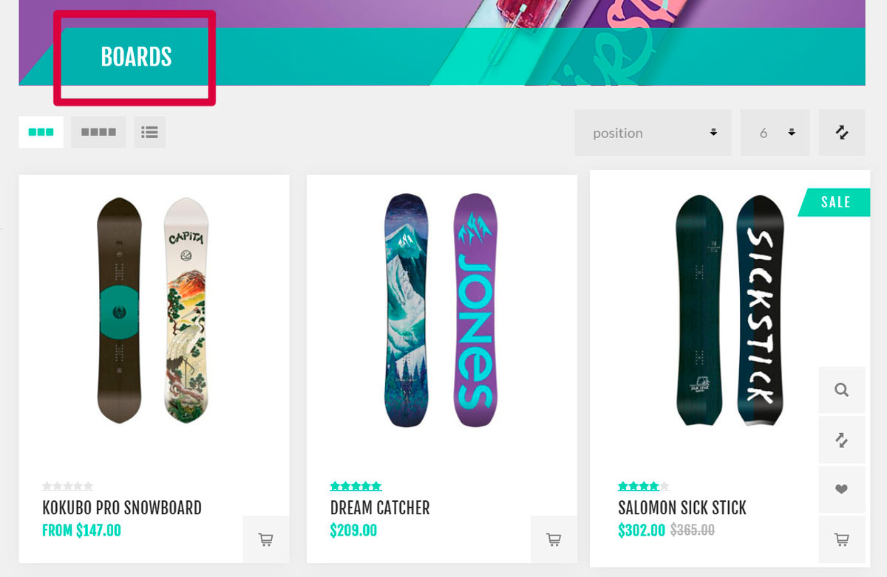
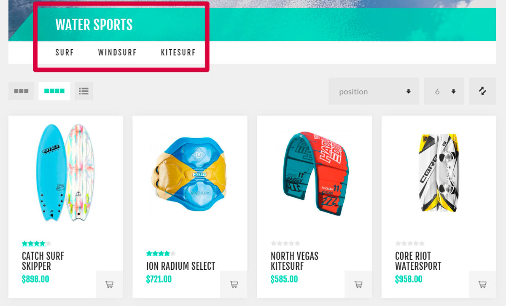
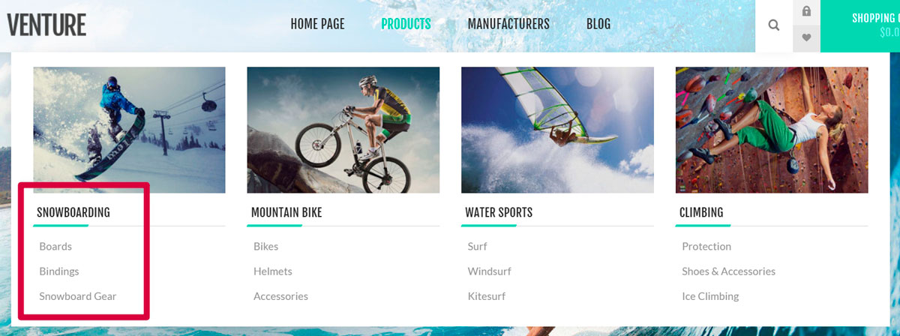
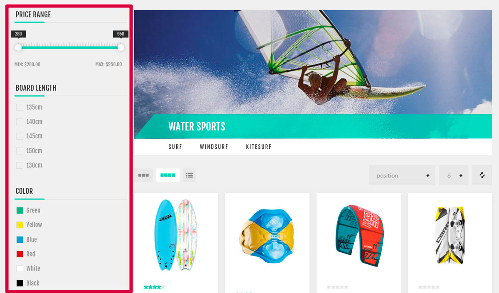
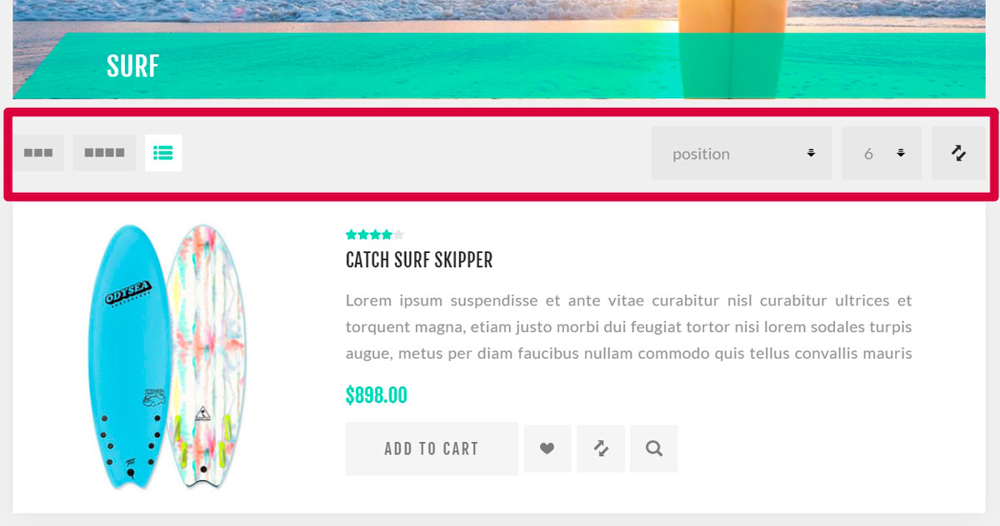

# 目錄

商品是網路商店的基礎，而商品管理是您商店管理策略中非常重要的一環。商品資訊有助於顧客決定是否要購買該商品。因此，請確保商店中擁有高品質的商品內容，因為這能建立顧客的信心，讓他們確信自己買到的正是所需且符合期待的商品。

nopCommerce 商品管理中最重要的組成部分包括：新增商品、管理製造商、設定商品分類以簡化導覽、加入良好的商品描述與吸引人的圖片、列出所有可能的商品變體，以及定義商品標籤以讓商品搜尋快速且有效。

## 以實際商店為例的目錄說明

在接下來的範例中，我們將使用以 Nop-Templates 所提供的「Nop Venture Theme」為基礎的示範商店。請在此處 https://www.nopcommerce.com/nop-venture-theme-14-plugins-nop-templatescom 了解更多關於此 [第三方佈景主題](https://www.nopcommerce.com/nop-venture-theme-14-plugins-nop-templatescom) 的資訊。

以下是一些秘訣，可協助您為顧客建立設計完善的目錄。

### 分類

- 當您為商店新增分類時，請確保它們能清楚描述所包含的商品（或子分類）。如下例所示，Boards（板類）分類僅包含板類商品：
 
 *請在 **目錄 → 分類** 頁面上使用 **新增** 按鈕來建立分類。*

- 當您需要將一般分類劃分為特定分類時，請使用子分類。這能讓顧客的搜尋過程更輕鬆。如下例所示，Water Sports（水上運動）分類包含了 Surf（衝浪）、Windsurf（風浪板）和 Kitesurf（風箏衝浪）子分類：
 
 *在分類編輯頁面上新增 **父分類 (Parent category)**，即可將其變為子分類。*

- 將最熱門的分類加入到每個頁面皆可見的頂部選單，以吸引更多顧客：
 
 *若要執行此操作，請使用分類編輯頁面上的 **包含在頂部選單 (Include in top menu)** 核取方塊。*

- 將最有趣的分類加入首頁。這些分類將會是顧客造訪您商店時第一眼看到的內容：
 
 *若要執行此操作，請使用分類編輯頁面上的 **顯示於首頁 (Show on home page)** 核取方塊。*

- 允許您的顧客使用篩選器在分類中進行搜尋：
 
 *篩選功能使用的是 [規格屬性](xref:zh-Hant/running-your-store/catalog/products/specification-attributes)。*

- 允許您的顧客對商品進行排序並更改顯示模式：
 
 *關於排序的更多資訊，請造訪 [目錄設定 - 商品排序](xref:zh-Hant/running-your-store/catalog/catalog-settings#product-sorting) 章節。使用分類編輯頁面上的 **允許顧客選擇頁面大小 (Allow customers to select page size)** 和 **頁面大小選項 (Page size options)** 欄位來設定顯示模式。*

若要了解如何建立分類，請參閱 [分類](xref:zh-Hant/running-your-store/catalog/categories) 章節。

## 參閱

- [分類](xref:zh-Hant/running-your-store/catalog/categories)
- [製造商](xref:zh-Hant/running-your-store/catalog/manufacturers)
- [屬性](xref:zh-Hant/running-your-store/catalog/products/product-attributes)
- [商品](xref:zh-Hant/running-your-store/catalog/products/index)
- [YMM (Year-Make-Model) 篩選器](xref:zh-Hant/running-your-store/catalog/ymm)
- [目錄設定](xref:zh-Hant/running-your-store/catalog/catalog-settings)