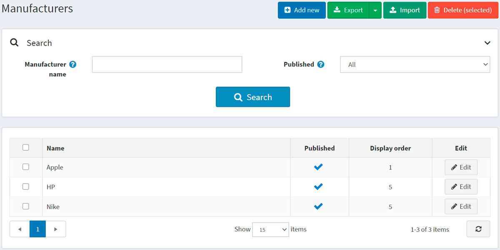
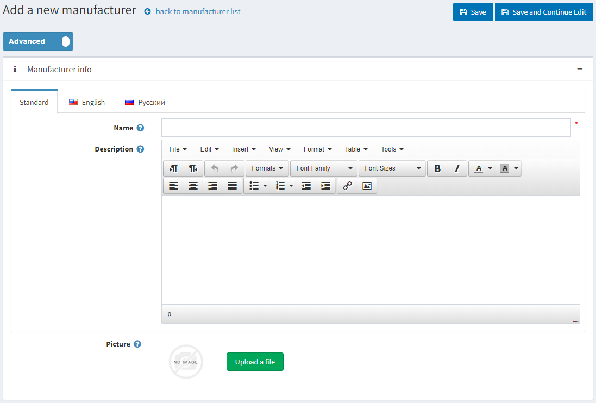
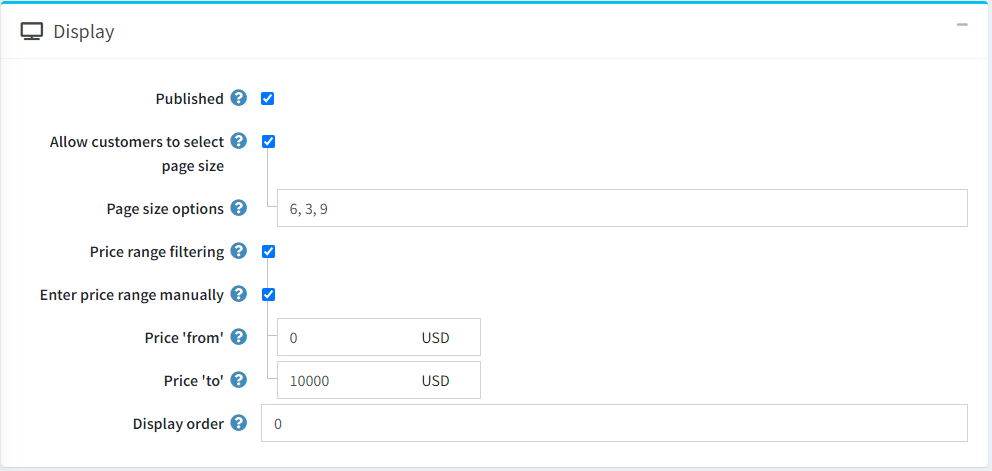
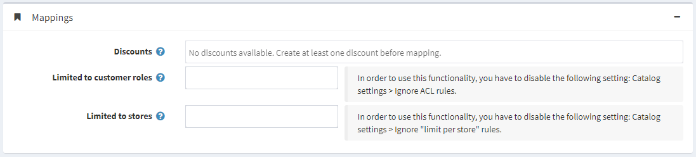
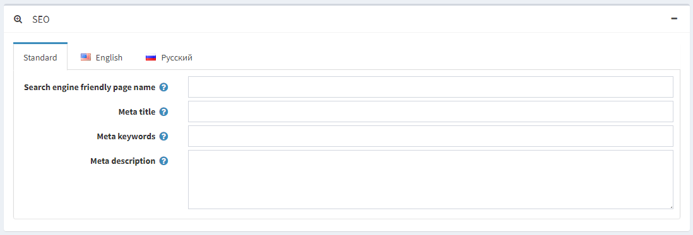
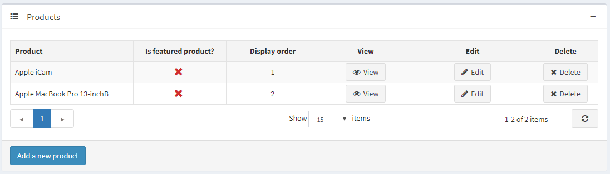

# 製造商

若要管理製造商，請前往 **目錄 → 製造商**。



您可以在「搜尋」面板中透過輸入 **製造商名稱** 或其部分名稱、依據 **已發佈** 屬性，或在特定 **商店** 的所有製造商中進行搜尋（若已啟用多個商店）。

> [!NOTE]
>
> 若要從清單中移除製造商，請選取要刪除的項目，然後點擊 **刪除 (已選取)** 按鈕。
> 您可以點擊 **匯出** 按鈕將製造商匯出至外部檔案以進行備份。點擊 **匯出** 按鈕後，您將看到下拉式選單，讓您選擇 **匯出至 XML** 或 **匯出至 Excel**。

## 新增製造商

若要新增製造商，請點擊頁面上方的 **Add new** 按鈕。此時會顯示 *Add a new manufacturer*（新增製造商）視窗。



此頁面提供兩種模式：**進階 (advanced)** 與 **基本 (basic)**。切換至基本模式僅會顯示主要欄位，或使用進階模式以顯示所有可用的欄位。

### 製造商資訊

在 **製造商資訊** 面板中，請定義以下詳細資料：

- **名稱** — 這是目錄中顯示的製造商名稱。
- **描述** — 製造商的描述。請使用編輯器來設定版面配置與字型。
- **圖片** — 代表製造商的圖片。請從您的裝置上傳圖片。

### 顯示



在 *顯示* 面板中，定義以下詳細資訊：

- 勾選 **已發布** 核取方塊，以允許該製造商在前台網站顯示。
- 勾選 **允許顧客選擇頁面大小** 核取方塊，以允許顧客自行選擇頁面大小，即製造商詳細資料頁面上顯示的商品數量。顧客可以從商店負責人在 **頁面大小選項** 欄位中輸入的列表裡選擇頁面大小。
  - 若已勾選上述核取方塊，則會顯示 **頁面大小選項**。請輸入以逗號分隔的頁面大小選項列表（例如：10, 5, 15, 20）。若未進行選擇，第一個選項即為預設的頁面大小。
  - 若未勾選 **允許顧客選擇頁面大小** 核取方塊，則會顯示 **頁面大小** 選項。此設定用於決定該製造商商品的頁面大小，例如每頁顯示 '4' 個商品。
    > [!TIP]
    >
    > 例如，當您為某個製造商新增七個商品並將頁面大小設為三時，該製造商的詳細資料頁面在前台網站上將會顯示每頁三個商品，且總頁數會是三頁。

- 若您想啟用價格範圍篩選功能，請勾選 **價格範圍篩選** 核取方塊。
  - 若您希望手動輸入價格範圍，請勾選 **手動輸入價格範圍** 核取方塊。
    - 若啟用了上述設定，請輸入 **價格「從」**。
    - 以及 **價格「至」**。
- **顯示順序** — 製造商的顯示順序編號。此顯示數字用於在前台網站上排序製造商（遞增排序）。顯示順序為 1 的製造商將會置於列表的最上方。
- 若您已在 **系統 → 範本** 頁面中安裝了自訂製造商範本，則會顯示 **製造商範本** 欄位。此範本決定了該製造商（及其商品）的顯示方式。

### 對應



在 *對應 (Mappings)* 面板中，定義下列詳細資訊：

- **折扣 (Discounts)** — 選擇與此製造商關聯的折扣。您可以在 **促銷 → 折扣** 頁面建立折扣。請參閱 [折扣](xref:zh-Hant/running-your-store/promotional-tools/discounts) 章節以了解更多關於折扣的資訊。

    > [!NOTE]
    >
    > 請注意，這裡僅會顯示類型為 *指派給製造商 (assigned to manufacturers)* 的折扣。當折扣對應到該製造商後，它們將會套用到該製造商旗下的所有商品。
    >
    > [!NOTE]
    >
    > 若您想要使用折扣，請確保 **設定 → 設定 → 目錄設定 → 效能** 面板中的 **忽略折扣 (全站適用) (Ignore discounts (sitewide))** 設定已停用。

- 在 **限制給顧客角色 (Limited to customer roles)** 欄位中，選擇能夠在目錄中看到該製造商的顧客角色。如果不需要此選項，請保持欄位空白，如此一來所有人都能看見該製造商。
    > [!NOTE]
    >
    > 若要使用此功能，您必須停用下列設定：**設定 → 目錄設定 → 忽略 ACL 規則 (全站適用) (Ignore ACL rules (sitewide))**。請參閱 [存取控制清單 (ACL) 的相關說明](xref:zh-Hant/running-your-store/customer-management/access-control-list)。

- 如果製造商的商品僅在特定商店販售，請在 **限制給商店 (Limited to stores)** 欄位中選擇對應的商店。如果不需要此功能，請保持欄位空白。
  > [!NOTE]
  >
  > 若要使用此功能，您必須停用下列設定：**目錄設定 → 忽略「各商店限制」規則 (全站適用) (Ignore "limit per store" rules (sitewide))**。請參閱 [多商店功能說明](xref:zh-Hant/getting-started/advanced-configuration/multi-store)。

### SEO



在 *SEO* 面板中，請定義下列詳細資訊：

- **搜尋引擎友善網頁名稱 (Search engine friendly page name)** — 搜尋引擎所使用的頁面名稱。若您將此欄位留空，製造商頁面的 URL 將會使用製造商名稱來產生。若您輸入 custom-seo-page-name，則會使用以下自訂 URL：`http://www.yourStore.com/custom-seo-page-name`。

- **Meta 標題 (Meta title)** 用於指定網頁的標題。這是一段插入在您網頁標頭中的程式碼：

    ```html
    <head>
        <title> Creating Title Tags for Search Engine Optimization & Web Usability </title>
    </head>
    ```

- **Meta 關鍵字 (Meta keywords)** — 製造商的 meta 關鍵字，代表該頁面最重要的主題簡潔清單。Meta 關鍵字標籤看起來像這樣：`<meta name="keywords" content="keyword, keyword, keyword phrase, etc.">`

- **Meta 描述 (Meta description)** — 製造商的描述。Meta 描述標籤是網頁內容的簡要總結。Meta 描述標籤看起來像這樣：`<meta name="description" content="Brief description of the contents of your page">`

點擊 **儲存並繼續編輯 (Save and continue edit)** 按鈕，即可繼續將商品新增至該製造商。

### 商品

*商品* 面板包含與所選製造商相關的商品列表；這些商品可以在目錄中依製造商進行篩選。商店擁有者可以為製造商新增商品。請注意，您必須先儲存製造商，才能開始新增商品。

點擊 **新增商品 (Add a new product)** 以尋找您想要加入此製造商的商品。您可以透過 **商品名稱 (Product name)**、**類別 (Category)**、**供應商 (Vendor)**、**商店 (Store)**、**商品類型 (Product type)** 以及 **製造商 (Manufacturer)** 進行搜尋。


選取您想要加入至該製造商的商品，然後點擊 **儲存 (Save)** 按鈕。該商品將會顯示在所選製造商之下。



商品加入至製造商後，您可以透過點擊商品旁邊的 **編輯 (Edit)** 按鈕，在 *商品* 表格中定義以下資訊：

- **是否為精選商品 (Is featured product)**。
- **顯示順序 (Display order)**。

> [!NOTE]
>
> 點擊 **檢視 (View)** 將會重新導向至 *編輯商品詳細資料* 頁面。

點擊 **儲存 (Save)**。

## 匯入製造商

如果您不想手動將所有製造商新增至您的目錄，可以使用匯入選項。

> [!NOTE]
>
> 在開始匯入之前，您應該下載 Excel 格式的匯入表格範本。為了準確且正確地匯入您的製造商資料，請務必正確命名表格中的所有欄位（名稱必須與下載的表格完全一致）。

不強制要求填寫表格中的所有欄位。系統將根據您所填寫的欄位來建立製造商。

匯入過程需要消耗大量的記憶體資源。因此，建議不要一次匯入超過 500 至 1000 筆記錄。如果您有更多的記錄，建議將其拆分為多個 Excel 檔案並分批匯入。

## 參閱

- [新增商品](xref:zh-Hant/running-your-store/catalog/products/add-products)
- [SEO](xref:zh-Hant/running-your-store/search-engine-optimization)

## 教學課程

- [在 nopCommerce 中管理製造商](https://www.youtube.com/watch?v=NnWD9-zi8s4&feature=youtu.be)