# 新增商品

以最佳方式設定商品對於商店來說至關重要。請確保不要遺漏任何細節，例如顯示各種尺寸和顏色選項、提供詳盡的商品描述，以及新增吸睛的圖片。

若要新增商品，請前往 **目錄 → 商品**。點擊右上角的 **新增** 按鈕。

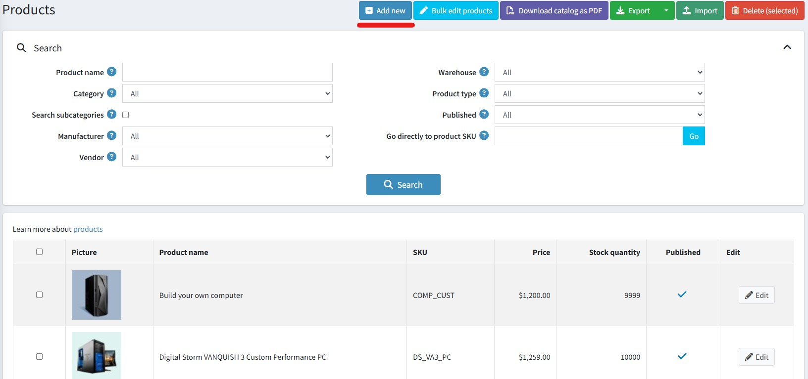

> [!NOTE]
>
> 您可以點擊 **匯入** 按鈕從外部檔案匯入商品。一旦您有了商品清單，便可點擊 **匯出** 按鈕將其匯出到外部檔案以進行備份。點擊 **匯出** 按鈕後，您將會看到一個下拉式選單，可讓您選擇 **匯出為 XML (所有找到的)** 或 **匯出為 XML (已選取的)**，以及 **匯出為 Excel (所有找到的)** 或 **匯出為 Excel (已選取的)**。此外，還可以 **將目錄下載為 PDF**，以便將選取的商品列印成 PDF 檔案。若要從清單中移除商品，請選取要刪除的項目並點擊 **刪除 (已選取的)** 按鈕。

*新增商品* 頁面提供兩種模式：**進階** 和 **基本**（預設為進階模式）。您可以切換到基本模式，該模式僅會顯示必要欄位。

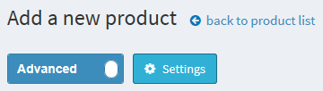

您也可以設定 *基本* 模式來選擇哪些欄位需要設為必填。若要執行此操作，請點擊切換開關旁邊的 **設定** 按鈕。此時會顯示如下的 *設定* 彈出式視窗：

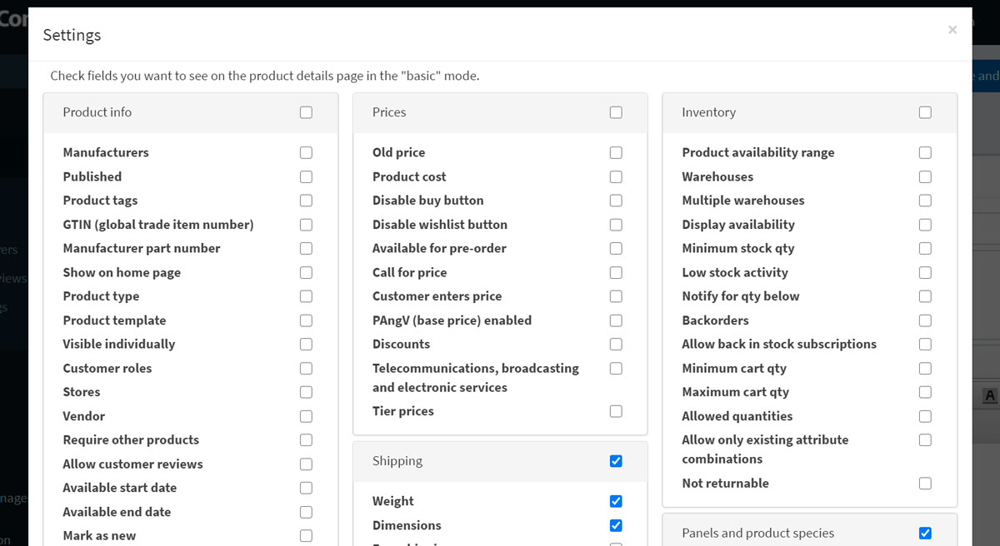

選取所需的欄位並點擊 **儲存**。請注意，在此情況下頁面將會重新整理。

## 商品資訊

請先在「商品資訊」(Product info) 面板填寫一般資訊：

- 輸入 **商品名稱** (Product name)。
- 輸入商品的 **簡短描述** (Short description)，這將顯示在型錄中。
- 輸入商品的 **完整描述** (Full description)，這將顯示在商品詳細頁面上。您可以在此處加入文字、條列清單、連結或額外圖片。請務必撰寫詳細的說明，因為這會影響顧客的決策。
- 輸入商品 **SKU**。這是內部用於追蹤商品的庫存單位。這是您用來追蹤此商品的唯一內部識別碼。
- **類別**。您可以將商品指派給任意數量的類別。您可以在 **型錄 → 類別** (Catalog → Categories) 中管理 [商品類別](xref:zh-Hant/running-your-store/catalog/categories)。

- **製造商**。您可以將商品指派給任意數量的製造商。您可以在 **型錄 → 製造商** (Catalog → Manufacturers) 中管理 [製造商](xref:zh-Hant/running-your-store/catalog/manufacturers)。

- 選取 **已發佈** (Published) 讓商品在您的商店中顯示。
- 輸入 **商品標籤** (Product tags) — 用於識別商品的關鍵字。請輸入標籤，並以逗號分隔。與特定標籤關聯的商品越多，在型錄頁面側邊欄顯示的 *熱門標籤* 雲中，該標籤看起來就會越大。閱讀更多關於如何管理商品標籤的資訊，請參閱 [商品標籤](xref:zh-Hant/running-your-store/catalog/products/product-tags) 章節。
  
  

- 輸入 **GTIN (全球貿易項目代碼)**。這些識別碼包括 UPC（北美）、EAN（歐洲）、JAN（日本）以及 ISBN（圖書）。
- 輸入 **製造商零件編號** (Manufacturer part number)。這是製造商為該商品提供的零件編號。
- 勾選 **顯示於首頁** (Show on homepage) 核取方塊，將此商品顯示在商店首頁。建議用於最熱門的商品。如果勾選此項，商店擁有者還可以指定商品的 **顯示順序** (Display order)。1 代表列表的最上方。
- 設定 **商品類型** (Product type) 為 *單一商品* (Simple) 或 *組合商品* (Grouped)。閱讀更多關於商品類型的資訊，請參閱 [組合商品 (變體)](xref:zh-Hant/running-your-store/catalog/products/grouped-products-variants) 章節。
- 如果您在 **系統 → 範本** (System → Templates) 頁面安裝了自訂商品範本，「商品範本」(Product template) 欄位才會顯示。
- 如果您希望商品出現在型錄或搜尋結果中，請選取 **單獨顯示** (Visible individually)；否則，該商品在型錄中將會隱藏，且只能從組合商品的詳細頁面存取。
- 選擇能夠在型錄中看到該商品的 **顧客角色** (Customer roles)。如果不需要此選項且所有人皆可看到商品，則將此欄位留空。
    > [!NOTE]
    >
    > 若要使用此功能，您必須停用下列設定：**設定 → 型錄設定 → 忽略 ACL 規則 (全站)**。閱讀更多關於存取控制清單 (ACL) 的資訊 [here](xref:zh-Hant/running-your-store/customer-management/access-control-list)。
- 如果商品僅在特定商店銷售，請在 **限制商店** (Limited to stores) 欄位中選擇商店。若不需要此功能，請將該欄位留空。
  > [!NOTE]
  >
  > 若要使用此功能，您必須停用下列設定：**型錄設定 → 忽略「單一商店限制」規則 (全站)**。閱讀更多關於多商店功能的資訊 [here](xref:zh-Hant/getting-started/advanced-configuration/multi-store)。

- **供應商**。您可以在 **顧客 → 供應商** (Customers → Vendors) 中管理 [供應商](xref:zh-Hant/running-your-store/vendor-management)。
- **需要其他商品** (Require other products) 用於定義該商品是否需要搭配其他商品。如果需要，請選取 **必要商品 ID** (Required product IDs)，以逗號分隔輸入，並確保沒有循環參照（例如：A 需要 B，B 需要 A）。如果需要，可選擇 **自動將這些商品加入購物車** (Automatically add these products to the cart)。
- 選取 **允許顧客評論** (Allow customer reviews) 以啟用顧客評論此商品的功能。
- 定義商品的 **可開始日期** (Available start date) 和/或 **可結束日期** (Available end date)。
- 選取 **標記為新品** (Mark as new) 以將商品標記為最近新增。這樣，您可以管理「新品」頁面上顯示的商品列表。您也可以使用 **標記為新品。開始日期** (Mark as new. Start date) 和 **標記為新品。結束日期** (Mark as new. End date) 欄位，指定商品顯示為新品的期間。
- 在 **管理員備註** (Admin comment) 欄位中，輸入用於資訊目的的備註。此備註僅供內部使用，顧客無法看見。

## 價格

在 *價格 (Price)* 面板中，請定義以下項目：

- **價格 (Price)**：使用預設貨幣設定價格。
    > [!NOTE]
    >
    > 您可以在 **設定 → 貨幣** 中更改商店貨幣。閱讀更多關於貨幣的資訊 [here](xref:zh-Hant/getting-started/configure-payments/advanced-configuration/currencies)。

- **舊價格 (Old price)**：如果大於零，它將在前台網站顯示，並顯示在新的價格旁邊以供比較。
- **商品成本 (Product cost)**：與生產該商品或服務相關的所有成本總和。此資訊不會向顧客顯示。
- **停用購買按鈕 (Disable buy button)**：此選項對於「詢價」商品非常實用。
- **停用願望清單按鈕 (Disable wishlist button)**。
- **開放預購 (Available for pre-order)**：如果商品尚未在商店上架，但您希望允許顧客訂購，請勾選此項。前台網站將顯示「預購 (Pre-order)」按鈕來取代標準的「加入購物車 (Add to cart)」按鈕。當選擇此選項時，將會顯示 **預購可用開始日期 (Pre-order availability start date)** 欄位。請以 UTC 格式輸入商品的預計開始販售日期。當達到此日期時，「預購」按鈕將自動變更為「加入購物車」。
- **來電詢價 (Call for price)**：勾選此項後，商品詳細資訊頁面將顯示「來電詢價」或「來電報價」，而不是原本的價格。這有助於您與顧客建立聯繫，並提供他們感興趣商品的額外資訊。
- **顧客輸入價格 (Customer enters price)**：勾選此項表示必須由顧客輸入價格。當選擇此選項時，將顯示以下欄位：
  - 在 **最小金額 (Minimum amount)** 欄位中，輸入價格的最低金額。
  - 在 **最大金額 (Maximum amount)** 欄位中，輸入價格的最高金額。
- **啟用 PAngV (基礎價格) (PAngV (base price) enabled)**：如果商品具有基礎價格，請選擇此項。根據德國法律 (PAngV)，這是必要的規定。例如，如果您販售 500 mL 的啤酒價格為 1.50 歐元，則必須顯示基礎價格：每 1 公升 3.00 歐元。當選擇此選項時，將顯示以下欄位：
  - **商品數量 (Amount in product)** — 所販售商品的數量。
  - **商品單位 (Unit of product)** — 上述數值的計量單位。
  - **參考數量 (Reference amount)** — 基礎數量。
  - **參考單位 (Reference unit)** — 上述數值的計量單位。
- **折扣 (Discounts)**：了解如何設定折扣 [here](xref:zh-Hant/running-your-store/promotional-tools/discounts)。
    > [!NOTE]
    >
    > 如果您想要使用折扣，請確保 **設定 → 設定 → 目錄設定 → 效能 (Configuration → Settings → Catalog settings → Performance)** 面板中的 **忽略折扣 (全站) (Ignore discounts (sitewide))** 設定已停用。

- 透過選擇 **免稅 (Tax exempt)** 來設定該商品是否免稅。否則，請從 **稅務類別 (Tax category)** 下拉式選單中，為此商品選擇所需的稅務分類。稅務類別可由商店管理者在 **設定 → 稅務 → 稅務類別** 中進行設定。
- 如有需要，請設定 [階梯價格 (tier prices)](xref:zh-Hant/running-your-store/promotional-tools/tier-prices)。

## 貨運

在「貨運」面板中定義商品的貨運詳細資訊：

- 若該商品可以寄送，請勾選 **貨運已啟用 (Shipping enabled)**。此區塊將會展開以顯示更多詳細資訊。
- 設定用於貨運計算的商品參數：**重量 (Weight)、長度 (Length)、寬度 (Width)、高度 (Height)**。
    > [!NOTE]
    >
    > 您可以在 **設定 → 貨運 → 度量單位** 中變更預設的度量標準。

- **免運費 (Free shipping)**（若有）。
- **單獨寄送 (Ship separately)**：若該商品應與其他商品分開寄送，請勾選此項。如果訂單中包含該商品的多個品項，所有品項都將會分開寄送。
- **額外運費 (Additional shipping charge)**。
- **到貨日期 (Delivery date)**：將顯示於前台商店中。
    > [!NOTE]
    >
    > 您可以在 **設定 → 貨運 → 到貨日期** 中管理到貨日期選項。

> [!NOTE]
>
> 還有一個 **啟用預估運費（商品頁面） (Estimate shipping enabled (product page))** 設定，可在 **設定 → 設定 → 貨運設定** 中啟用。
> 此設定允許在商品詳細資訊頁面上，透過彈出視窗根據顧客的寄送地址顯示預估的貨運資訊。

## 庫存

依照 [here](xref:zh-Hant/running-your-store/order-management/inventory-management) 所述，定義商品的庫存設定。

## 多媒體

在此面板中，您可以新增與目前商品相關的所有媒體內容。

### 圖片

在 **圖片** 面板中，您可以新增商品圖片。

您可以使用 **上傳檔案** 按鈕一次上傳多個圖片檔案。
圖片上傳後，您可以為每一張圖片設定以下數值：

- 在 **Alt** 欄位中，輸入「img」HTML 元素的「alt」屬性值。若留空，將使用預設規則（例如：商品名稱）。
- 在 **Title** 欄位中，輸入「img」HTML 元素的「title」屬性值。若留空，將使用預設規則（例如：商品名稱）。
- 定義圖片在商品頁面上的 **顯示順序**。1 代表列表的最上方。

> [!NOTE]
>
> 若要上傳 *.svg 格式的圖片，您需要啟用下列設定：
> 

> [!TIP]
>
> [YouTube 教學課程：大量匯入商品圖片](https://www.youtube.com/watch?v=9BUqR_OGiq4)

### 影片

在「影片 (Video)」頁籤中，您可以加入來自任何影片託管網站（例如 *YouTube* 或 *Vimeo*）的嵌入式影片連結。

#### YouTube 嵌入連結

1. 在 YouTube 上找到您的影片並點擊「分享 (Share)」按鈕。
1. 從彈出式選單中選擇「嵌入 (Embed)」。
  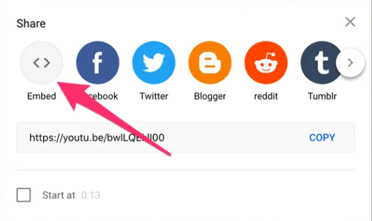
1. 複製引號內的連結。
  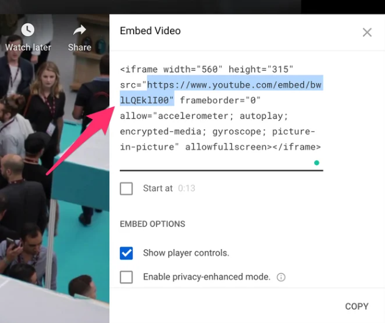
1. 將此連結貼上到上述的「嵌入影片網址 (Embed video URL)」欄位中。請注意，影片必須設定為「公開 (Public)」或「不公開 (Unlisted)」才能嵌入；「私人 (Private)」影片無法嵌入。

#### Vimeo 嵌入連結

1. 在 Vimeo 上找到您的影片並點擊「分享 (Share)」按鈕。
  
1. 複製引號內的連結。
  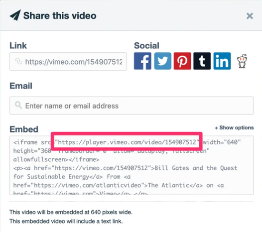
1. 將此連結貼上到上述的「嵌入影片網址 (Embed video URL)」欄位中。

## 商品屬性

在 *商品屬性* 面板中，您可以新增商品屬性。深入了解關於商品屬性以及如何建立它們的相關資訊 [here](xref:zh-Hant/running-your-store/catalog/products/product-attributes)。

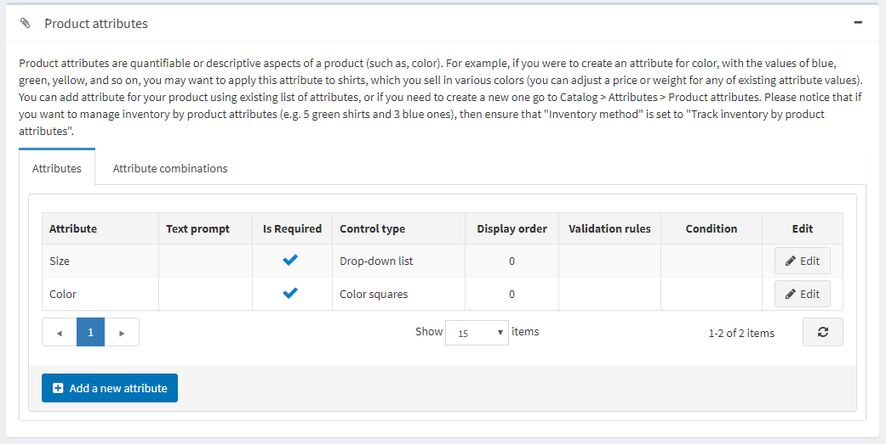

### 新增屬性

當您建立好屬性列表後，請點擊 *Attributes*（屬性）頁籤中的 **Add a new attribute**（新增屬性）。系統將會顯示如下的 *Add a new attribute*（新增屬性）視窗：

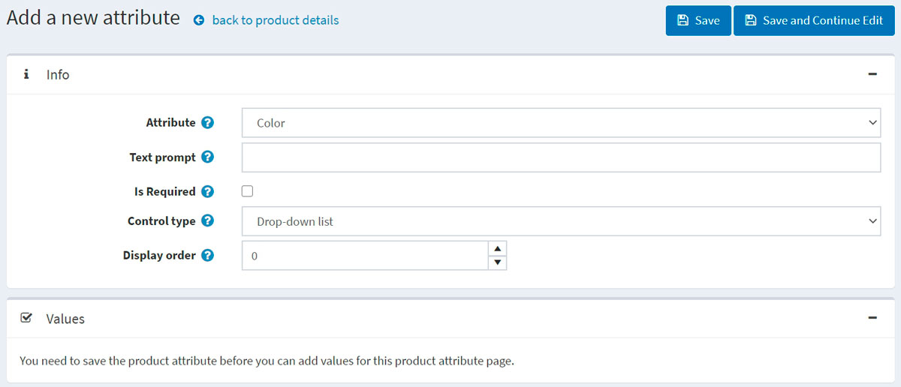

設定新屬性：

- 從 **Attribute**（屬性）下拉式清單中選擇一個屬性。
- 如果您希望在公開商店的屬性名稱前顯示特定文字，請填寫 **Text prompt**（文字提示）欄位。
- 勾選 **Is required**（必填），將此屬性設定為顧客必須填寫的項目。
- 定義此屬性的 **Control type**（控制項類型，例如：下拉式清單、單選按鈕清單）。
    > [!NOTE]
    >
    > 針對「Date picker」（日期選擇器）控制項類型，您可以透過 *All settings (advanced)*（所有設定（進階））頁面中的 **catalogsettings.countdisplayedyearsdatepicker** 參數來設定要顯示的年份數量。例如，如果您設定為 0，則僅顯示當前年份；如果您設定為 5，則會顯示當前年份以及往後的 5 個年份。請閱讀關於如何在 [All settings](xref:zh-Hant/getting-started/advanced-configuration/all-settings)（所有設定）頁面進行相關設定。

- 定義此屬性在商品頁面上的 **Display order**（顯示順序）。1 代表顯示在清單的最上方。

點擊 **Save and continue edit**（儲存並繼續編輯）。
此時 **Values**（值）面板會顯示該屬性的預定義值。如有需要，請點擊值資料列中的 **Edit**（編輯）。

### 編輯屬性值

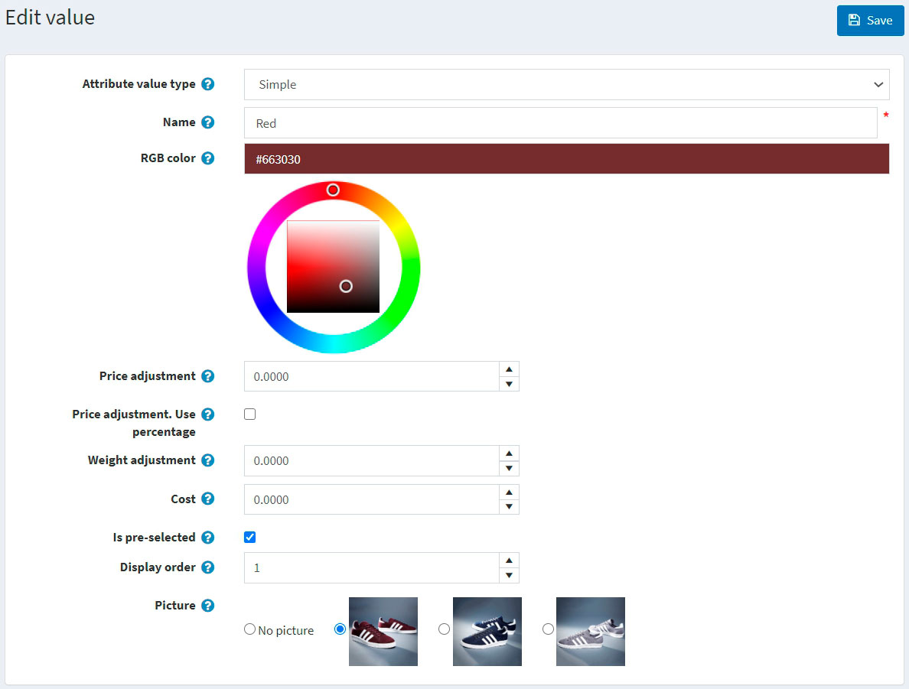

編輯屬性值細節如下：

- 選擇 **屬性值類型 (Attribute value type)**。共有兩種屬性值類型：*簡單 (Simple)* 與 *關聯商品 (Associated to product)*。如果您希望此屬性值為目錄中的另一個商品，並同時追蹤其庫存，請選擇 *關聯商品* 類型。在此，您可以使用 *組合商品功能 (bundled products functionality)*，讓顧客能將各種商品組合或套裝視為單一商品購買，且顧客將有機會使用下方描述的 **顧客輸入數量 (Customer enters quantity)** 欄位來設定所需的屬性數量。

若前一個設定為 *關聯商品*，將會顯示以下欄位：

- **關聯商品 (Associated product)** 允許您選擇與此屬性關聯的商品。請使用 **關聯商品 (Associate a product)** 按鈕來選擇商品。

> [!NOTE]
>
> 請確保選擇關聯商品後沒有出現警告訊息。例如：
> 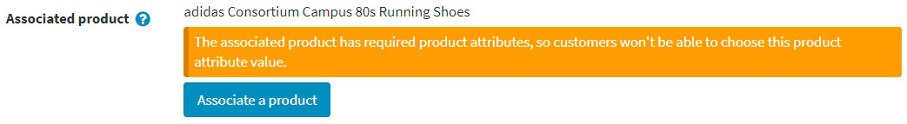

- 勾選 **顧客輸入數量 (Customer enters quantity)** 欄位，以允許顧客輸入該屬性（代表關聯商品）的數量。
- 若上述欄位未勾選，您可以指定 **商品數量 (Product quantity)**。允許的最小值為 1。
- 輸入屬性的 **名稱 (Name)**。
- 指定 **RGB 顏色 (RGB color)**，用於顏色方塊 (color squares) 屬性控制項。
- 在 **價格調整 (Price adjustment)** 欄位中，輸入選擇此屬性值時所套用的價格。例如，輸入 '10' 即增加 10 元。若勾選了 **價格調整。使用百分比 (Price adjustment. Use percentage)**，則輸入 10 代表 10%。
- 勾選 **價格調整。使用百分比 (Price adjustment. Use percentage)**，此選項決定是否將百分比套用於該商品。若未啟用，則使用固定數值。
- 使用 **重量調整 (Weight adjustment)** 欄位來指定選擇此屬性值時所套用的重量調整值。
- 指定 **成本 (Cost)** 欄位。屬性值成本是構成該值的所有組件之成本。這可能是向第三方供應商購買組件的採購價格，或是若組件為內部製造時，材料與生產流程的總成本。
- 若此屬性值應預設為勾選狀態，請選取 **是否預選 (Is pre-selected)** 欄位。
- 輸入屬性值的 **顯示順序 (Display order)**。1 代表屬性值清單中的第一項。
- 選擇與此屬性值關聯的 **圖片 (Picture)**。當點選（選取）此商品屬性值時，該圖片將取代主要商品圖片。

點擊 **儲存 (Save)**。

### 屬性條件

若有需要，請在「條件」面板中定義此屬性的條件。當選取了先前的屬性後，條件屬性才會出現；例如在服飾個人化選項中，只有在勾選「個人化」選項按鈕時，才會顯示輸入文字的方塊。

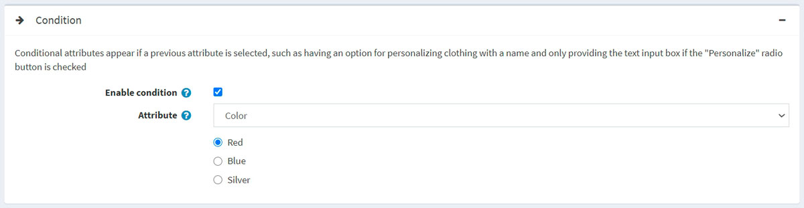

- 勾選 **Enable condition** 核取方塊以啟用條件。
- 選擇 **Attribute** 及其數值。當選取該數值時，條件即達成，該屬性便會顯示出來。

### 商品屬性組合

在「商品屬性組合」分頁中，您可以定義各種屬性組合，並為每一項組合指定以下資訊：

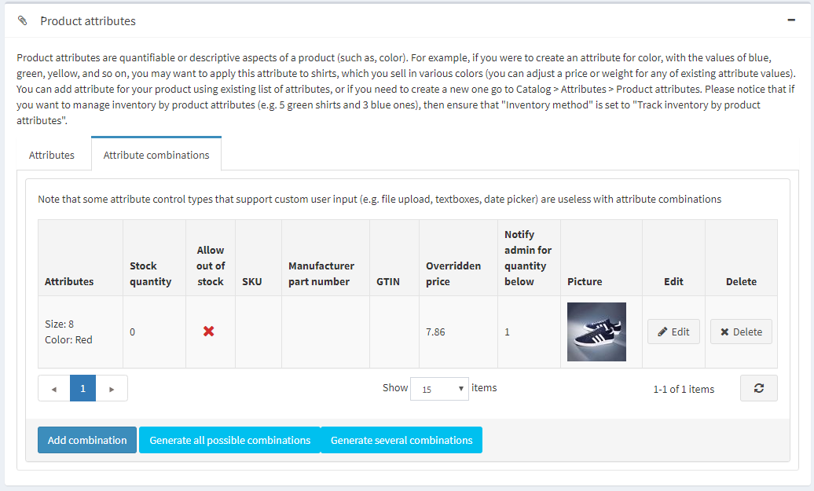

點擊 **新增組合** 按鈕來選擇新的組合並輸入其詳細資料：

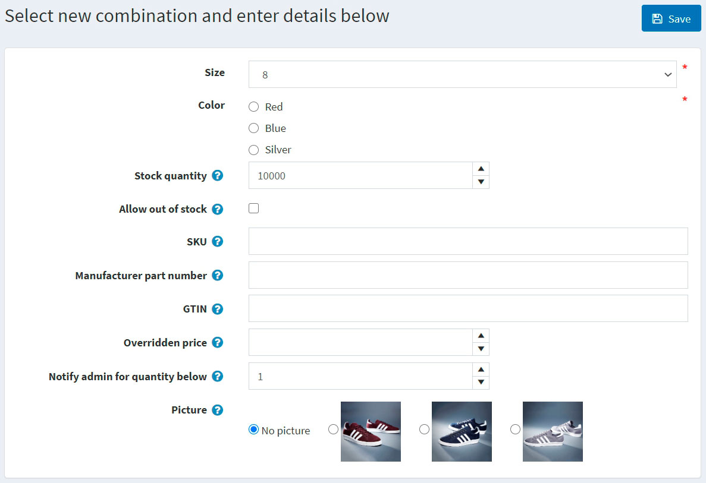

針對每個組合，請定義以下內容：

- 該組合中的屬性。
- 此組合目前的 **庫存數量**。
- 如果您已在商品詳細資料頁面啟用「透過屬性管理庫存」，當目前庫存數量低於（達到）**最低庫存量**時，您可以執行多種動作（例如：低庫存報告）。
- **允許缺貨購買**：如果您希望允許顧客在無庫存時，仍能購買具有特定屬性的商品。
- **SKU**。
- **製造商料號**。
- **GTIN**。
- **覆寫價格**：如果具有特定屬性的商品價格與一般商品價格不同，可在此設定。例如，您可以透過這種方式提供折扣。若要忽略此欄位，請留空。
  > [!NOTE]
  >
  > 當指定此欄位時，所有其他已套用的折扣將會被忽略。
- 在 **庫存低於此數量時通知管理員** 中，輸入當庫存低於該數值時，管理員將收到通知。
- 選擇與此屬性組合相關聯的 **圖片**。當選取此商品屬性組合時，該圖片將會取代主要商品圖片。

點擊 **儲存**。

> [!NOTE]
>
> 請注意，某些支援自訂使用者輸入的屬性控制類型（例如：檔案上傳、文字方塊、日期選擇器）在屬性組合中是無效的。

若要產生所有可能的組合，請使用 **產生所有可能的組合** 按鈕。或者使用 **產生部分組合** 按鈕，手動選擇某些屬性值來產生必要的組合。

## 規格屬性

規格屬性是指商品的各項特徵，例如螢幕尺寸或 USB 連接埠數量，這些特徵會顯示在商品詳細頁面上。規格屬性可用於在商品分類頁面中篩選商品。深入瞭解關於規格屬性 [here](xref:zh-Hant/running-your-store/catalog/products/specification-attributes) 的資訊。

> [!NOTE]
>
> 與商品屬性（product attributes）不同，規格屬性僅用於顯示資訊。

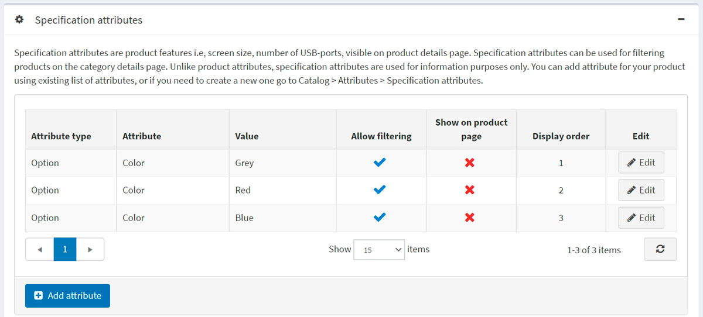

在「規格屬性」面板中，您可以新增規格屬性。

> [!NOTE]
>
> 您可以使用現有的屬性清單為商品新增屬性，或者如果您需要建立新的屬性，請前往 **目錄 → 屬性 → 規格屬性**。

若要新增屬性，請點擊 **新增屬性** 按鈕並填寫「新增商品規格屬性」區段：

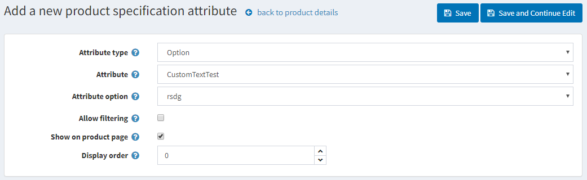

- 從下拉式選單中選擇 **屬性類型**。
- 從預先建立的屬性清單中選擇 **屬性**。
- 選擇 **屬性選項**。
- 若有需要，請勾選 **允許篩選**，以便在商品分類頁面上透過此選項進行篩選。
- 選擇 **在商品頁面顯示**，讓該屬性在商品頁面上可見。
- 設定屬性的 **顯示順序**。1 代表位於清單的最上方。

點擊 **儲存**。

## 商品類別

定義商品是否為：

- [禮品卡](xref:zh-Hant/running-your-store/promotional-tools/gift-cards)
- [可下載商品](xref:zh-Hant/running-your-store/catalog/products/downloadable-products)
- [租賃商品](xref:zh-Hant/running-your-store/catalog/products/rental-products)
- [週期性商品](xref:zh-Hant/running-your-store/catalog/products/recurring-products)

## SEO

為商品頁面定義下列 SEO 參數：

- **搜尋引擎友善網頁名稱 (Search engine friendly page name)** — 搜尋引擎使用的頁面名稱。如果您留空，商品頁面 URL 將會以商品名稱來產生。如果您輸入 custom-seo-page-name，則會使用以下自訂 URL：`http://www.yourStore.com/custom-seo-page-name`。
- **Meta 標題 (Meta title)** — 網頁的標題。
- **Meta 關鍵字 (Meta keywords)** — 與商品相關、最重要主題（關鍵字與關鍵片語）的簡潔清單。這些詞彙將會被加入到商品頁面的頁首。
- **Meta 描述 (Meta description)** — 商品的簡短描述，將會被加入到商品頁面的頁首。

閱讀更多關於 SEO 的資訊 [here](xref:zh-Hant/running-your-store/search-engine-optimization)。

## 相關商品與交叉銷售

依照 [here](xref:zh-Hant/running-your-store/promotional-tools/cross-sells-and-related-products) 的說明設定相關商品與交叉銷售。

## 已購買訂單

若要查看該商品曾被購買的訂單列表，請前往「已購買訂單」（Purchased with orders）面板。在此，您可以檢查訂單狀態並查看訂單詳細資料。

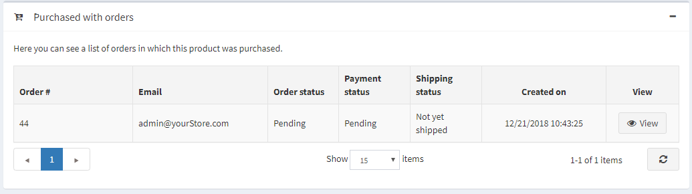

## 庫存數量異動紀錄

在此頁籤中，您可以檢視該商品所有的數量變更記錄，以及包含該商品的訂單。

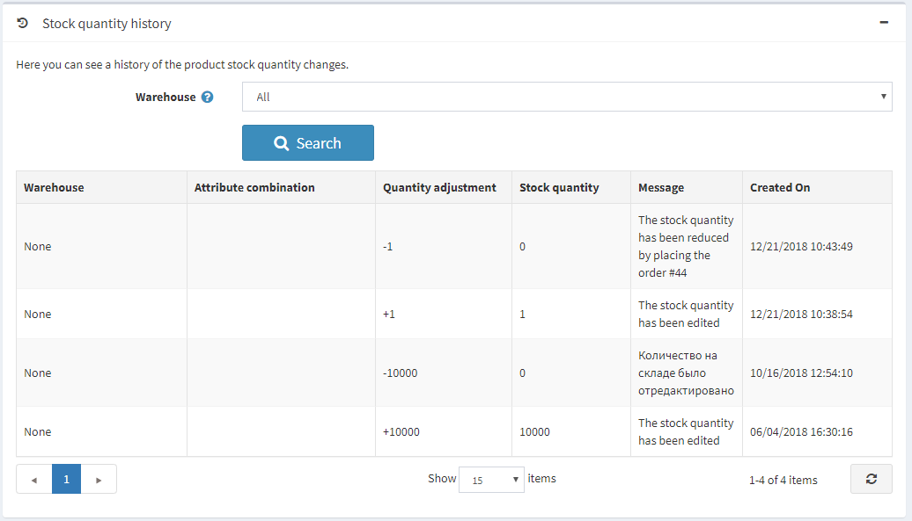

## 設定商品頁面

以下章節說明了商品頁面的設定：[商品欄位](xref:zh-Hant/running-your-store/catalog/catalog-settings#product-fields)、[商品頁面](xref:zh-Hant/running-your-store/catalog/catalog-settings#product-page) 以及 [分享](xref:zh-Hant/running-your-store/catalog/catalog-settings#share)。

## 參閱

- [商品分類](xref:zh-Hant/running-your-store/catalog/categories)
- [商品製造商](xref:zh-Hant/running-your-store/catalog/manufacturers)
- [訂單管理](xref:zh-Hant/running-your-store/order-management/index)
- [網路研討會：nopCommerce 入門第一步](https://www.youtube.com/watch?v=B_CfgJH0ylM&list=PLnL_aDfmRHwsJn1rnKaXdIcJg4pKJeeXs)

## 教學課程

- [影片教學：新增商品](https://www.youtube.com/watch?v=wVgTgdQVWPQ&index=2&list=PLnL_aDfmRHwsbhj621A-RFb1KnzeFxYz4)