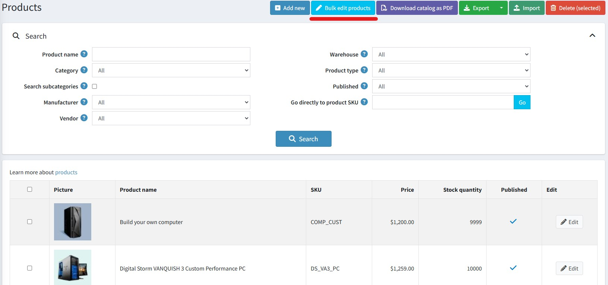
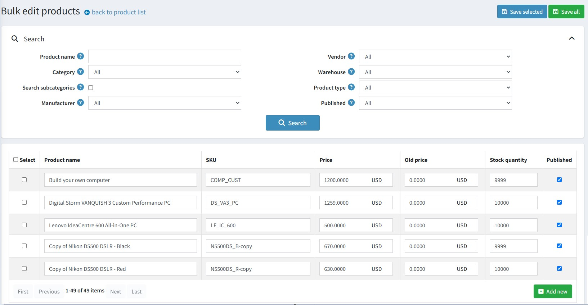

# 批次編輯商品

若要批次編輯商品，請前往 **商品 → 批次編輯商品**。批次編輯商品頁面會列出所有現有的商品。

通常當您想要編輯商品時，會進入該商品的編輯頁面。若只是小幅修改倒無所謂，但當您需要一次修改大量商品時，這樣做會變得繁瑣且耗時。

批次編輯商品功能提供了一種簡單且方便的方法，可批次編輯部分商品資訊。可供編輯的欄位清單包括：

- 商品名稱
- SKU
- 價格
- 原價
- 庫存數量
- 已發佈

頁面右上角設有「**儲存所選項目**」與「**儲存全部**」按鈕。點擊後，輸入的新值將會儲存至資料庫中。

您也可以點擊表格末端的「**新增**」按鈕來增加商品。