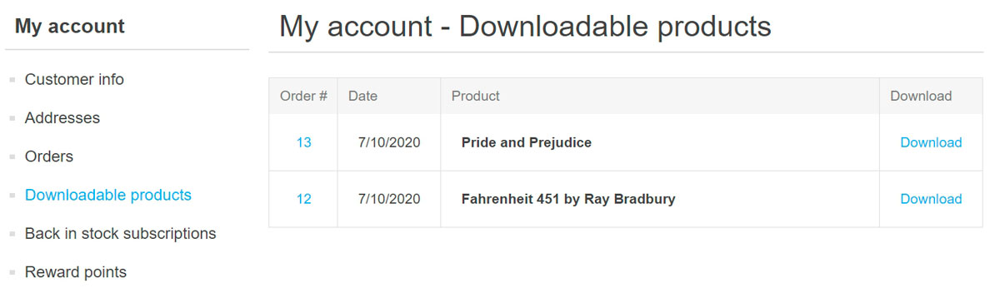
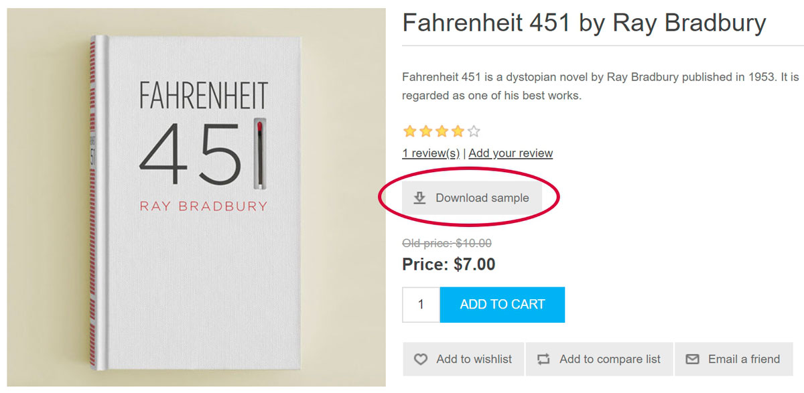
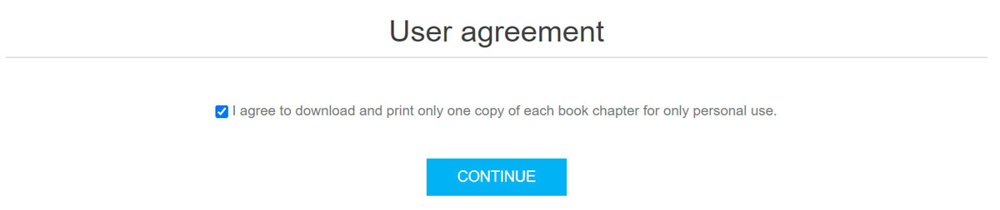
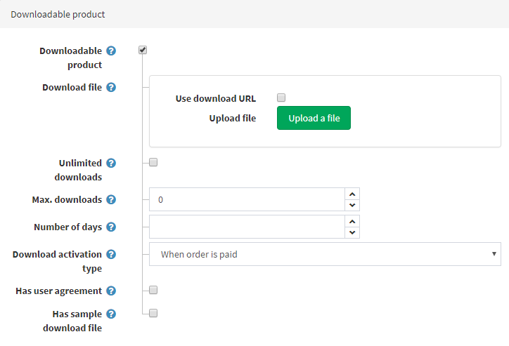

# 可下載商品

當您打算銷售電子書、有聲書、課程、PDF、音樂、軟體，或是想要建立一個圖片庫時，可下載商品功能將會非常實用。

## 範例

假設您希望銷售電子書。

什麼因素使電子書店與其他商店有所不同？

- 首先，您應該為顧客提供一種從您的商店下載書籍的簡單方式。
 在 nopCommerce 中，顧客可以在「我的帳戶」區段找到他們購買的所有可下載商品：
  

- 您可能也希望允許顧客預覽他們想要購買的書籍部分內容。
 在此情況下，顧客將會在商品詳細資訊頁面上看到以下的 *Download sample*（下載範例）按鈕：
  

- 或者，要求顧客在下載電子書前簽署一份 *user agreement*（使用者協議）也是很有用的做法。例如，同意僅供個人使用，下載並列印每一章電子書的一份副本。
 這是顧客看到此協議的方式：
  

所有這些功能都可以在編輯商品時進行設定。此外，在特殊情況下，您可以透過設定顧客保留存取權限的天數或最大下載次數來限制特定書籍的下載。您也可以選擇顧客何時能夠下載書籍：在書籍付款後立即下載，或是在人工驗證之後。

如果您已經學會如何設定 [一般商品](xref:zh-Hant/running-your-store/catalog/products/add-products)，請參考下方章節學習如何將該商品製作成可下載商品。

## 設定可下載商品

若要建立可下載商品，請前往 **目錄 → 商品**。點選 **新增**，填寫一般商品欄位，並在 *可下載商品* 面板中勾選相應的核取方塊。

定義以下詳細資訊：

- 在 **下載檔案** 區段中，使用 **上傳檔案** 按鈕上傳檔案，或是透過勾選相應的核取方塊並輸入 **下載 URL** 來使用 **使用下載 URL** 功能。
- **無限制下載**：若商品可以下載無限次數時使用。當此選項未勾選時，會出現額外的欄位。
- **最大下載次數** 欄位：輸入顧客購買商品後可獲得的最大下載次數。
- **天數**：顧客保留檔案存取權限的天數。如果您希望啟用持續下載，請將此欄位留空。
- **下載啟用類型**：
  - *訂單已付款時* — 選擇此選項可僅在訂單付款狀態為「已付款」時啟用下載。
  - *手動* — 選擇此選項可將控制權交給商店管理員。選擇此選項後，管理員必須手動啟用下載。這是在「編輯訂單詳細資訊」頁面的 *商品* 面板中執行。
- **具有使用者協議** — 若顧客必須簽署使用者協議才能下載商品時勾選。
- 接著會顯示 **使用者協議文字** 編輯器，讓您可以輸入或編輯使用者協議內容。
- **具有範例下載檔案** 允許顧客下載範例檔案。
  - 如果適用，請使用 **上傳檔案** 按鈕上傳 **範例下載檔案**，或是透過勾選相應的核取方塊並輸入 **下載 URL** 來使用 **使用下載 URL** 功能。它將會顯示在商品詳細資訊頁面上，並可由任何顧客免費下載。

 > [!TIP]
 >
 > 由於可下載商品不需要寄送，請確保在 *出貨* 面板中 **啟用出貨** 欄位為未勾選狀態。
 >
 > [!TIP]
 >
 > 由於您不需要追蹤可下載商品的庫存，請確保在 *庫存* 面板中 **庫存方式** 欄位設為 *不追蹤庫存*。

## 顧客註冊

您可以決定可下載商品是否需要顧客註冊，請前往 **設定 → 設定 → 顧客設定** 頁面，並在 *一般* 面板中勾選 **可下載商品需要註冊** 核取方塊。

## 可下載商品帳戶頁面

如果您想要在顧客帳戶頁面隱藏「可下載商品」選單項目，請前往 **設定 → 設定 → 顧客設定** 頁面，並勾選 **隱藏「可下載商品」頁籤** 核取方塊。

## 參閱

- [訂單](xref:zh-Hant/running-your-store/order-management/orders)

## 教學課程

- [管理數位商品](https://www.youtube.com/watch?v=om-HKr-B2yA)