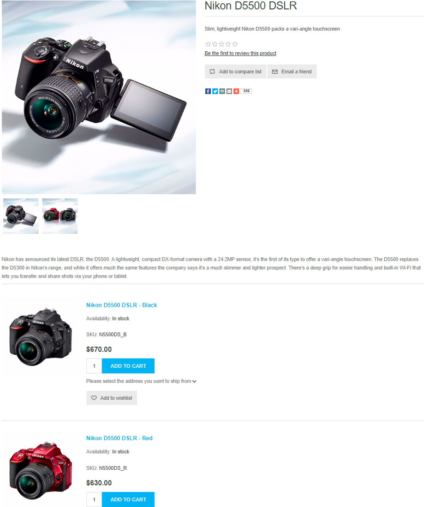
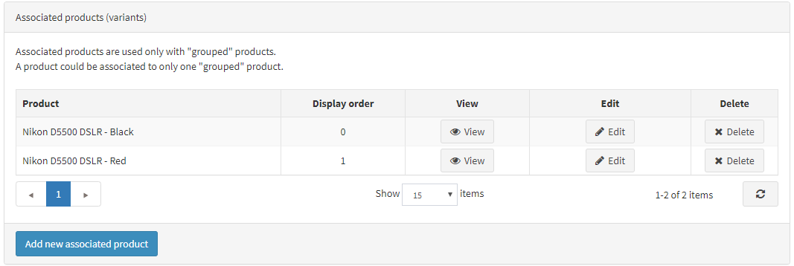

# 群組商品 (變體)

群組商品 (Grouped products)，或稱為帶有變體的商品，是用於販售具有多種補充項目或屬性組合商品的便利工具。此類商品的多種組合可以作為獨立商品進行販售，且價格可能有所不同。

在 nopCommerce 中，群組商品看起來就像是一個顯示所有可能選項的單一商品詳細頁面。這是一個既便利又對 SEO 友善的工具，適合用來販售複雜的商品。

> [!TIP]
>
> 例如，一個基礎商品（如相機機身）可以與各種鏡頭組合進行群組。群組商品的另一個使用案例是販售具有多種屬性組合的產品類型。例如，各種口味的巧克力。在這種情況下，顧客可以輕鬆地在同一個頁面上看到主商品及其所有選項。

## 新增群組商品

若要建立群組商品，請前往 **目錄 → 商品**。請依照下列步驟操作：

  > [!TIP]
  >
  > 了解如何填寫商品欄位 [here](xref:zh-Hant/running-your-store/catalog/products/add-products)。

1. 建立數個「簡單」類型的商品。這些是主商品的變體。使用 **個別顯示 (Visible individually)** 核取方塊來定義您是否希望它們在目錄和搜尋結果中單獨顯示，還是僅顯示在主商品的詳細頁面上。
1. 建立一個 **群組 (商品帶有變體)** 商品，並在 **關聯商品 (變體)** 面板中指派您在上一步建立的這些簡單商品：

    

> [!NOTE]
>
> - 在前台商店中，顧客會在 *群組* 商品的詳細頁面上，為每個關聯商品看到一個獨立的 **加入購物車** 按鈕。
> - 一個 *簡單* 商品只能與一個 *群組* 商品關聯。
> - *群組* 商品本身 **無法直接訂購**。然而，與其關聯的 *簡單* 商品則可以。例如，顧客無法直接訂購「Creative 音效卡」這個商品。相反地，他們必須訂購 OEM 或零售版本的「Creative 音效卡」。在這種情況下，*群組* 商品是「Creative 音效卡」，並且為該 *群組* 商品配置了兩個關聯的 *簡單* 商品：OEM 與零售，每個商品可能具有不同的價格。

## 教學課程

- [了解 nopCommerce 中的群組商品](https://www.youtube.com/watch?v=B1UdxXf_jmE)
- [在 nopCommerce 中建立組合商品](https://www.youtube.com/watch?v=sf9jP6KFcko)