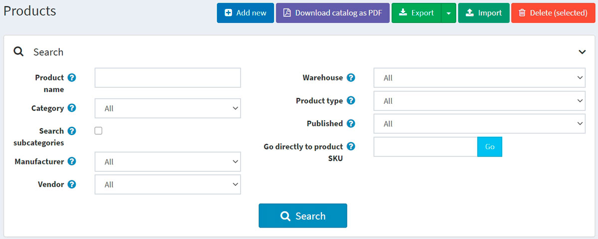
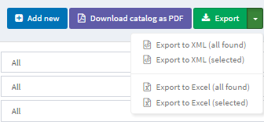
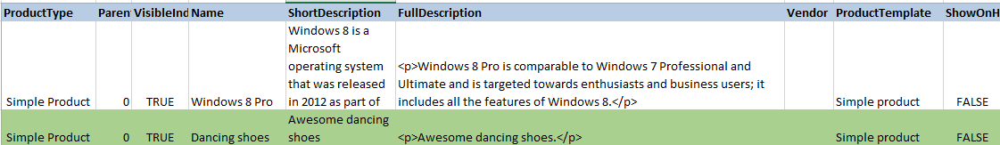
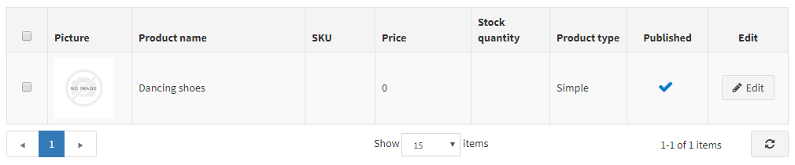

# 匯入/匯出商品

nopCommerce 支援從 Excel 格式匯入商品，以及匯出 XML 或 Excel 格式的商品。您也可以從目錄中將商品下載為 PDF 格式。
您可以在頁面左上方，透過 **目錄 → 商品** 找到這些選項。

## 匯出商品

您可以點擊 **匯出** 按鈕，將商品匯出為 XML 或 Excel 格式。點擊 **匯出** 按鈕後，您會看到下拉式選單，可讓您選擇 **匯出為 XML (所有找到的項目)** 或 **匯出為 XML (已選項目)**，以及 **匯出為 Excel (所有找到的項目)** 或 **匯出為 Excel (已選項目)**。

如果您不需要下載所有商品，請使用 *搜尋* 面板來尋找所需的商品，或是使用核取方塊來選取商品。系統將會下載一個包含您所選擇商品的檔案。該檔案將包含商品編輯頁面各面板中的所有商品特徵（商品資訊、SEO、圖片等）。

> [!NOTE]
>
> 如果您使用了商品屬性，匯出的 Excel 表格將會以列進行分組。若要檢視屬性詳細資訊，請點擊表格中商品旁邊的 + 號。
> 

## 匯入商品

如果您不想手動將所有商品新增到目錄中，可以使用匯入選項。

> [!NOTE]
>
> 在開始匯入之前，您應該先下載 Excel 格式的匯入表格範本，正如 [匯出商品](#exporting-products) 章節中所述。為了準確且正確地匯入您的商品，將表格中的所有欄位正確命名（必須與下載的表格完全一致）至關重要。

並非必須填寫表格中的所有欄位。商品將會根據已填寫的欄位進行建立。

匯入的商品會以 SKU 作為辨識依據。如果 SKU 已經存在，則該商品將會被更新。

匯入過程需要大量的記憶體資源。因此，不建議一次匯入超過 500–1000 筆記錄。如果您有更多的記錄，建議將它們拆分成多個 Excel 檔案並分別匯入。

### 範例

例如，我們想要將「舞鞋」加入到我們的目錄中。讓我們在表格中建立一個新列：

然後點擊 **匯入**，選擇檔案，並點擊 **從 Excel 匯入** 按鈕。接著檢查目錄中是否已出現新的商品。

## 匯入位於外部資源上的商品圖片

有時需要匯入位於外部資源上的商品圖片。nopCommerce 支援此類情境。然而，為了安全起見，此選項預設為停用。您可以在管理後台的 **「目錄設定」** 頁面啟用它。只需啟用 **「匯出/匯入商品。允許下載圖片」** 設定即可。

在此圖片載入方法中，.NET 平台提供了位址驗證碼。儘管位址完全符合 [RFC3986](https://datatracker.ietf.org/doc/html/rfc3986) 規範，但此機制並不總是能正確判定位址的正確性。我們建議避免在 URL 中使用特殊字元，例如 **^** 或 **~**。因此，請確保所有指定的 URL 僅包含拉丁字母。

## 匯入包含類別與供應商的商品

匯入類別與供應商的工作較為特殊，因為一個商品可以屬於多個類別或供應商。此儲存格中的每個新值必須以 **;** 字元分隔。請避免使用空白來進行格式化，儘管演算法應該會忽略它們（例如，1;2;3 優於 1; 2; 3）。

**類別** 與 **供應商** 欄位可以包含對應物件的識別碼 (ID) 或名稱（您可以選擇使用其中一種方式，或兩者混用）。如果您想要依名稱匯入類別，可以指定名稱本身，或是完整的類別名稱階層。在此情況下，父類別與子類別之間應以 **>>** 符號分隔。例如：「電腦 >> 桌上型電腦;」

依名稱匯入類別與供應商具有區分大小寫的特性，也就是說，「**T**est 類別/供應商名稱」與「**t**est 類別/供應商名稱」是不一樣的。

## 設定匯入/匯出

下列章節說明了匯入/匯出設定：[匯出/匯入](xref:zh-Hant/running-your-store/catalog/catalog-settings#exportimport)。

## 參閱

* [新增商品](xref:zh-Hant/running-your-store/catalog/products/add-products)