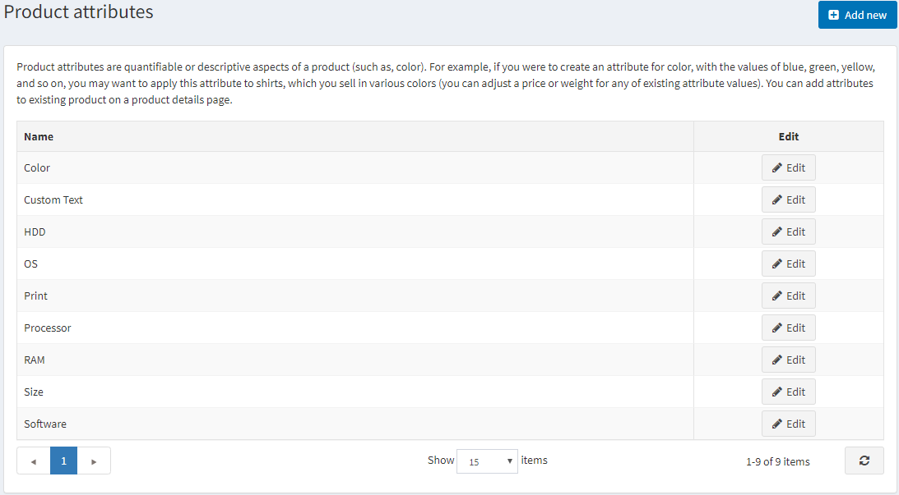
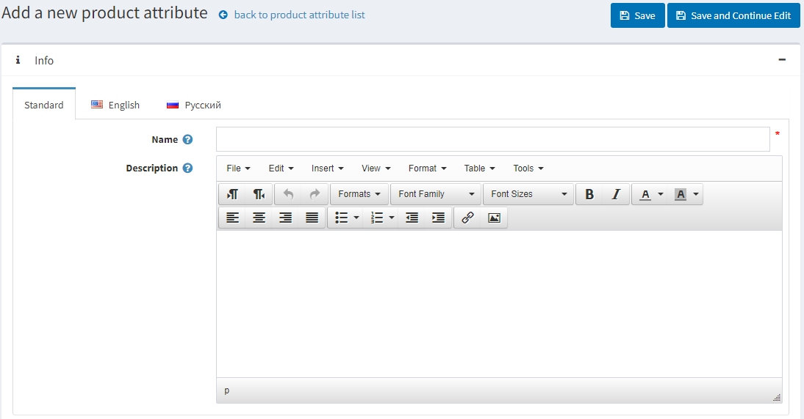
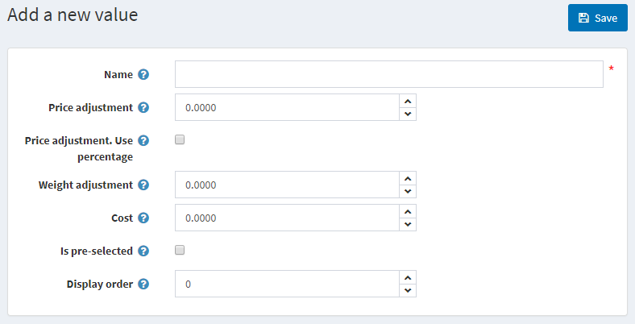
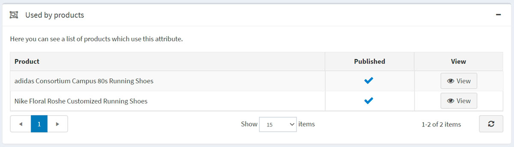

# 商品屬性

商品屬性是商品的變體（例如：顏色、尺寸）。

使用者可以建立各種屬性組合。例如，一個商品可以有各種尺寸和顏色。因此，使用者會建立兩個屬性及其值，例如「尺寸」（S、M、L）和「顏色」（紅、藍、白），然後根據商品的庫存狀況來設定群組。

在 nopCommerce 中，商品屬性用於 **庫存追蹤**，也可能造成 **價格差異**。

若要定義商品屬性，請前往 **目錄 → 屬性 → 商品屬性**。

> [!NOTE]
>
> 預設情況下，nopCommerce 並未預先建立任何商品屬性。

## 新增商品屬性

點擊 **新增** 以增加一個屬性。

在「新增商品屬性」視窗中，填寫 **名稱** 和 **描述** 欄位。

點擊 **儲存並繼續編輯** 以進入「預定義值」編輯面板。

> [!TIP]
>
> [YouTube 教學：新增具有顏色屬性的商品](https://youtu.be/QihipwQ61YU)

## 新增預定義值

在「預定義值」面板中，點擊 **新增一個值**，系統將會開啟「新增一個值」視窗：

在「新增一個值」視窗中，定義以下項目：

- 屬性 **名稱**。
- 選擇此屬性值時所套用的 **價格調整**。例如，填入 '10' 即增加 10 元。若勾選 **價格調整：使用百分比**，則以百分比計算。
- **價格調整：使用百分比** 核取方塊可用於決定價格調整為百分比而非絕對數值。
- 選擇此屬性值時所套用的 **重量調整**。
- **成本** 屬性值是指構成此值的所有元件成本。這可能是向第三方供應商購買元件時的採購價格，或是若元件為自行製造時，材料與生產流程的合併成本。
- 此值是否為顧客 **預先勾選**。
- 在屬性清單中的 **顯示順序**。

填寫欄位後，點擊 **儲存**。

> [!TIP]
>
> 在新增商品屬性時，不需要立即建立屬性值；您可以稍後在將特定的商品屬性套用到商品時再進行建立。
> 一旦設定好屬性和值，即可在商品編輯頁面的「商品屬性」面板中進行分組與管理。
>
> [!NOTE]
>
> 某些商店經營者傾向於強調透過屬性區分的商品，並為每個特定屬性建立獨立的商品（例如，將藍色 T 恤和紅色 T 恤分開列出）。在這種情況下，我們建議建立群組商品（如範例中的襯衫），這樣當顧客查看該群組商品時，所有的變體都會顯示在同一個頁面上。閱讀更多關於 [群組商品](xref:zh-Hant/running-your-store/catalog/products/grouped-products-variants) 的資訊。
>
> [!WARNING]
>
> 新增或更新現有的「預定義值」不會影響已經擁有該屬性的商品。

## 商品使用面板

在「商品使用」面板中，您可以選擇哪些商品使用此屬性：

## 參見

- [新增商品](xref:zh-Hant/running-your-store/catalog/products/add-products)
- [群組商品](xref:zh-Hant/running-your-store/catalog/products/grouped-products-variants)

## 教學

- [條件式商品屬性概述](https://www.youtube.com/watch?v=eIdHVcEdos8&t=55s)