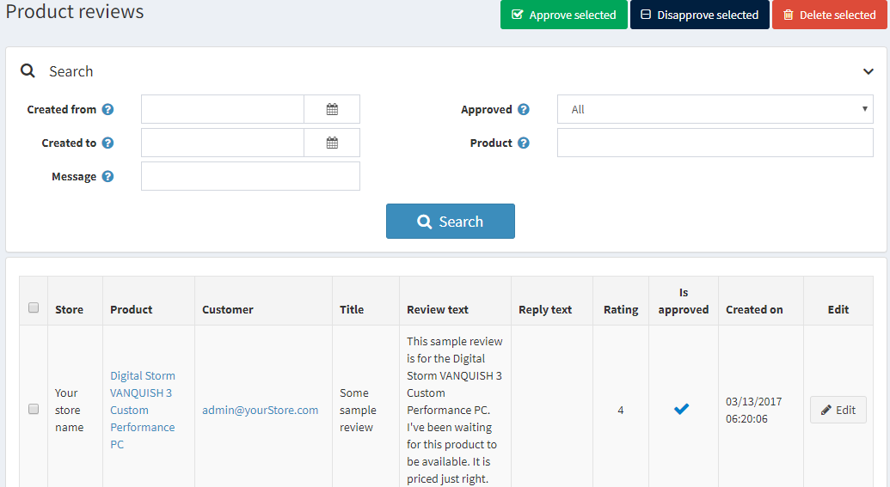
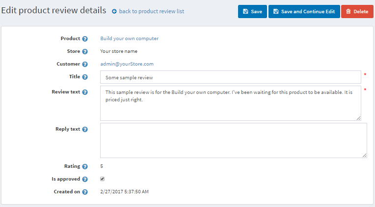
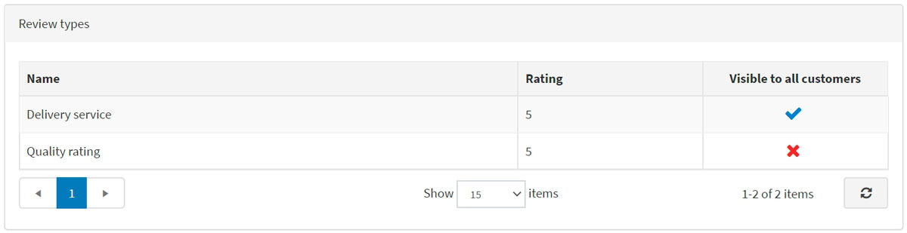

# 商品評論

商品評論是顧客對商品的意見回饋。評論也可以包含評分。

在前台網站中，評論會顯示在商品詳細頁面上。顧客可以為各種商品撰寫評論。當評論撰寫完畢並經由商店管理員核准後，其他顧客可以點擊評論旁的「Yes」（是）或「No」（否）來判定該則評論是否有幫助。

> [!NOTE]
>
> 預設情況下，評論必須經過商店管理員核准後，才會顯示在前台網站中。不過，若商店管理員決定評論不需要核准，可以更改此預設行為。若要取消強制性的商品評論核准，請前往 **設定 → 設定 → 目錄設定**，並取消勾選 **商品評論必須核准** 選項。

## 管理商品評論

若要管理商品評論，請前往 **目錄 → 商品評論**。屆時將會顯示如下的 *商品評論* 視窗：

### 搜尋評論

您可以透過下列方式搜尋評論：

- **建立日期範圍**：使用「建立日期起」與「建立日期迄」。在「建立日期起」與「建立日期迄」欄位中，輸入搜尋的日期範圍。您也可以點擊下拉式行事曆並選擇所需的日期範圍。
- **訊息**：可用於根據標題或文字片段來尋找評論。
- **已核准**：可用於根據「已核准」屬性來尋找評論。
- **商品**：對特定商品的相關評論進行排序與顯示。
- **商店**：允許檢視特定商店商品的所有評論。如果您擁有超過一家商店，將會顯示此欄位。

### 核准或撤銷核准

選擇您想要核准或撤銷核准的評論，並分別點擊 **核准所選** 按鈕或 **撤銷核准所選** 按鈕。

## 編輯商品評論

若要編輯商品評論，請點擊評論旁的 **編輯**。屆時將會顯示如下的 *編輯商品評論詳細資料* 視窗：

- 檢視此評論所屬的 **商品**。點擊此欄位後，您將會被重新導向至編輯商品詳細資料視窗，您可以在該處編輯商品資訊。
- 檢視此評論撰寫所在的 **商店**。
- 以及建立該評論的 **顧客**。點擊此欄位後，您將會被重新導向至編輯顧客詳細資料視窗，您可以在該處編輯顧客資訊。
- 您可以編輯評論的 **標題**。
- 以及它的 **內容**。
- 在 **回覆內容** 欄位中，您可以對評論留下回覆；該回覆將會顯示在前台網站的評論下方。
- **評分** 顯示顧客的評分。該欄位無法編輯。
- 勾選 **已核准** 核取方塊即可核准評論。
- **建立於** 顯示評論建立的日期與時間。

## 評論類型

如果您已經建立了自訂的評論類型，將會看到 *評論類型* 面板：

在此區域中，您可以檢視目前商品的所有額外評論。**評分** 顯示顧客的評分。表格中的任何欄位皆無法編輯。

若要取得關於設定評論的更多資訊，請參閱 [商品評論](xref:zh-Hant/running-your-store/catalog/catalog-settings#product-reviews) 與 [評論類型](xref:zh-Hant/running-your-store/catalog/catalog-settings#review-types) 章節。

## 教學課程

- [管理商品評論](https://www.youtube.com/watch?v=TBOpCoEAMnU&feature=youtu.be)
- [管理商品評論類型](https://youtu.be/Ts7_T9sd1Do)