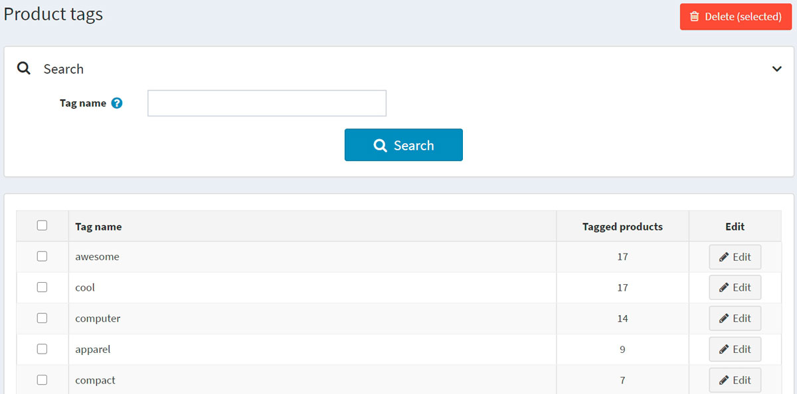
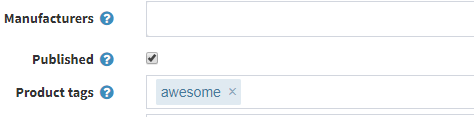
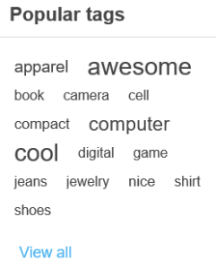

# 商品標籤

商品標籤是供商品識別的關鍵字。它們用於根據特定特徵對商品進行分類，並實現精確且狹窄的商品搜尋。
例如，如果您銷售服飾並想要為 T 恤建立標籤，它們可以是「t-shirt」、「cotton」、「polo」。

若要編輯前台網站顯示的商品標籤，請前往 **目錄 → 商品標籤**。

在商品標籤頁面上，您可以在 **標記商品數** 欄位中查看有多少商品具有該特定標籤。您可以透過點擊旁邊的 **編輯** 按鈕來編輯標籤。或者，您也可以透過選取標籤，然後點擊 **刪除(所選)** 按鈕來刪除標籤。

## 新增商品標籤

當您新增或編輯商品時，可以在商品詳細資料的編輯頁面上新增標籤。

輸入標籤並以逗號分隔。一旦建立標籤，它們同樣可以用於其他商品。關聯到特定標籤的商品越多，它在目錄頁面側邊欄所顯示的「熱門標籤」區塊中看起來就越大：

## 設定商品標籤

以下章節說明了商品標籤的設定：[標籤](xref:zh-Hant/running-your-store/catalog/catalog-settings#tags)。

## 參閱

* [商品分類](xref:zh-Hant/running-your-store/catalog/categories)
* [新增商品](xref:zh-Hant/running-your-store/catalog/products/add-products)