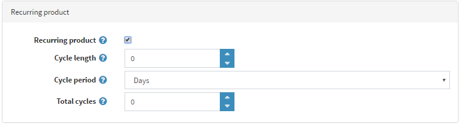

# 定期配送商品

「定期配送」商品類型通常用於訂閱服務，或是提供分期付款計畫的商品。若您的商品屬於定期配送類型，請勾選 *定期配送商品* 面板中的對應核取方塊。

請定義以下詳細資訊：

- **週期長度 (Cycle length)**：重複訂單執行的時間間隔。
- **週期單位 (Cycle Period)**：以「天」、「週」、「月」或「年」為單位，定義時間週期的計算方式。
- **總週期數 (Total cycles)**：顧客將收到此定期配送商品的次數。

您可以為任何商品定義定期配送週期，讓系統自動建立重複性的訂單。在此情況下，每當需要進行付款時，系統將使用原始訂單的付款資訊來處理後續的定期訂單。此外，後續訂單亦將套用原始訂單的運費計算方式。

> [!NOTE]
>
> 至少必須有一個啟用的付款模組支援定期付款功能。

## 參閱

- [付款方式](xref:zh-Hant/getting-started/configure-payments/payment-methods/index)