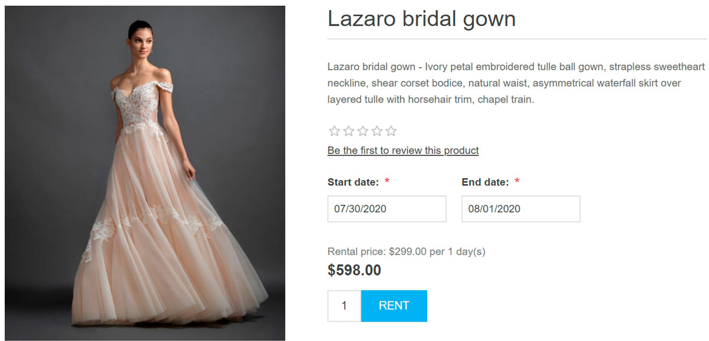
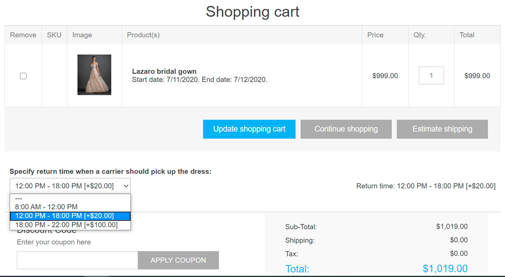
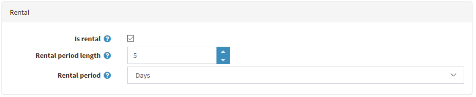
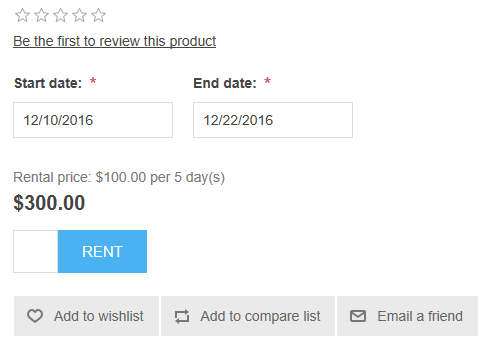

# 租賃商品

當您想要建立一個讓顧客預訂房間或旅館的網站時，租賃商品功能非常實用。此功能也可用於提供租賃服務的網站，例如出租婚紗、露營設備、兒童玩具等。

## 範例

假設您希望建立一個提供婚紗租賃的網站。

在這種情況下，哪些功能會派上用場呢？

- 其中一項最重要的功能是允許顧客選擇*租賃期間*。在 nopCommerce 中，允許顧客選擇開始日期與結束日期，如下圖所示：
 

- nopCommerce 也允許商店管理員選擇*租賃週期*與*租賃週期長度*。例如，您希望婚紗的最短租賃期為 3 天。在這種情況下，顧客會在商品詳細頁面上看到以下內容：
 

- 使用*結帳屬性*來允許顧客指定快遞人員應取回商品的歸還時間：
 
 閱讀更多關於結帳屬性的資訊 [here](xref:zh-Hant/running-your-store/order-management/checkout-attributes)。

如果您已經學會如何設定 [一般商品](xref:zh-Hant/running-your-store/catalog/products/add-products)，請閱讀以下章節，了解如何將該商品設為租賃商品。

## 設定租賃商品

若要建立租賃商品，請前往 **目錄 → 商品**。點擊 **新增**，填寫一般商品欄位，並在 *租賃* 面板中勾選對應的核取方塊。

定義以下詳細資訊：

- **租賃週期長度**：這是租賃週期的長度，即最短計費期間。價格即為此期間的費用。
- **租賃週期**：分為 *天*、*週*、*月* 或 *年*。這定義了租賃期間的時間單位。

購買租賃商品時，顧客必須在前台網站指定租賃期間。應付金額會自動計算。

## 教學課程

- [管理租賃商品](https://www.youtube.com/watch?v=tOaC6hOILZY&list=PLnL_aDfmRHwsbhj621A-RFb1KnzeFxYz4&index=24)