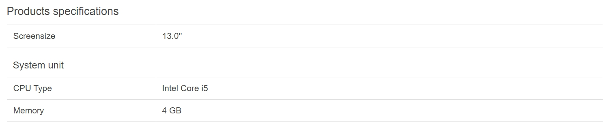
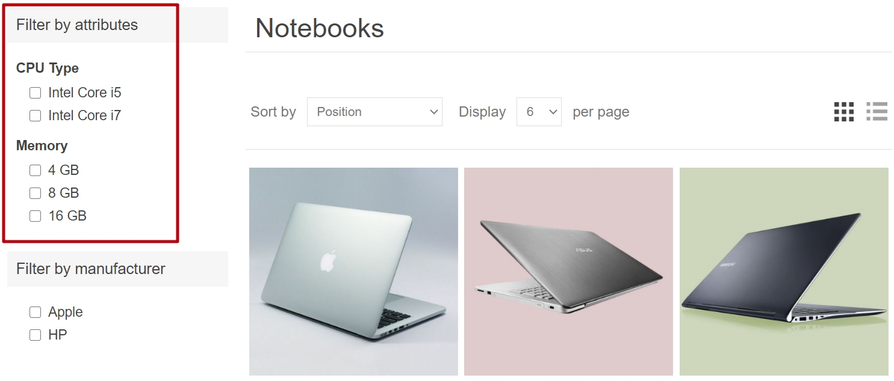
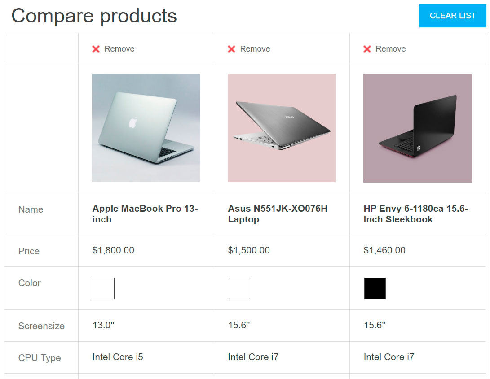
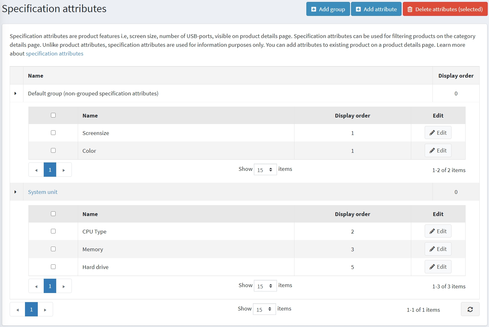
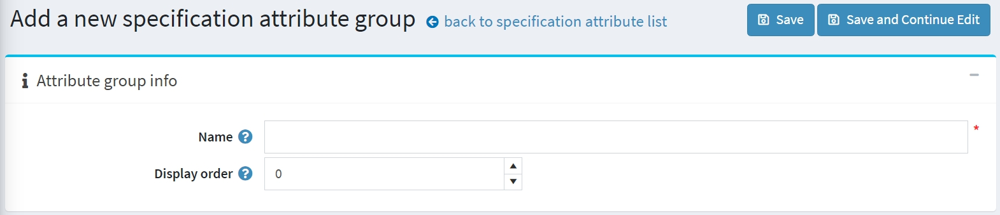
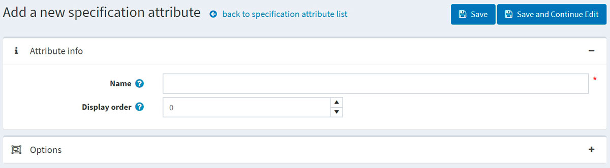
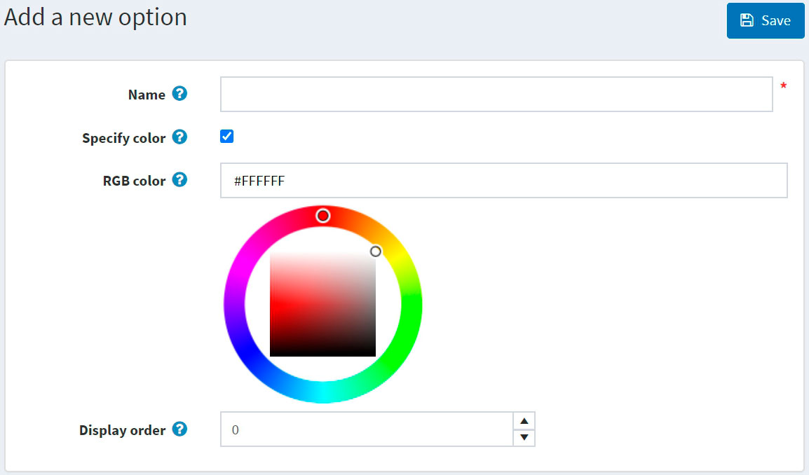
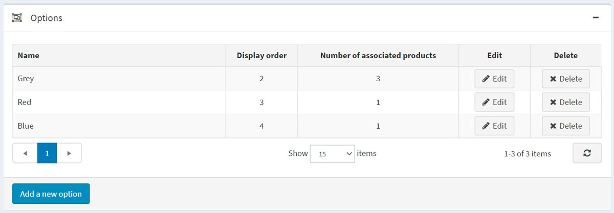
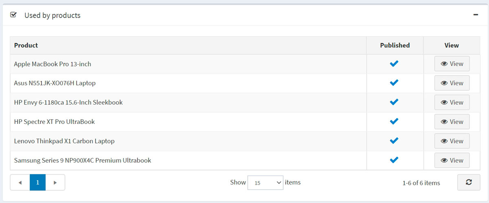

# 規格屬性

規格屬性與 [商品屬性](xref:zh-Hant/running-your-store/catalog/products/product-attributes) 類似；然而，它們僅用於提供資訊（顯示於商品詳細頁面），以及在分類詳細頁面上用來篩選商品。它們不會定義商品價格，也無法用於庫存追蹤。

## 範例

假設您正在經營一家線上電腦商店。什麼有助於顧客做出購買決策？

- 提供顧客關於您商品全面且具描述性的資訊。儘管您已經填寫了某台電腦的簡短描述與完整描述，仍應讓顧客能夠查看反映商品最重要細節的規格特性：

  

  當您在 [為商品新增規格屬性](xref:zh-Hant/running-your-store/catalog/products/add-products#specification-attributes) 時，若勾選了 **顯示於商品頁面 (Show on product page)** 欄位，此表格即可顯示在商品詳細資訊頁面上。

- 允許您的顧客使用篩選功能來搜尋電腦。假設我們可以在您的商店中依據 CPU 類型和記憶體進行搜尋，那麼分類頁面看起來會像這樣：

  

  當 [為商品新增規格屬性](xref:zh-Hant/running-your-store/catalog/products/add-products#specification-attributes) 時，若勾選 **允許篩選 (Allow filtering)** 欄位，即可針對特定商品啟用此屬性的篩選功能。

- 在您的商店中加入「商品比較」功能。此功能同樣使用規格屬性。對於您的電腦商店來說，「商品比較」頁面看起來會像這樣：

  

  若要啟用「商品比較」功能，請前往 **設定 → 設定 → 目錄設定**。在 *商品比較 (Compare products)* 面板中，勾選 **啟用「商品比較」 ('Compare products' enabled)** 核取方塊。

下一節將說明如何建立規格屬性。請注意，在建立規格屬性清單後，您需要將這些規格屬性逐一新增至各項商品中。請參閱 [新增商品 - 規格屬性](xref:zh-Hant/running-your-store/catalog/products/add-products#specification-attributes) 章節，了解如何將規格屬性新增至商品。

## 建立規格屬性群組

> [!NOTE]
>
> 所有未歸屬於任何群組的規格屬性都會顯示在 *預設群組 (未分組的規格屬性)* 中。

若要檢視並編輯規格屬性及其群組列表，請前往 **目錄 → 屬性 → 規格屬性**。

點擊 **新增群組** 以新增群組。此時將顯示 *新增規格屬性群組* 視窗，如下所示：

在 *屬性群組資訊* 面板中，輸入：

- 規格屬性群組的 **名稱**。
- **顯示順序** 數字。

然後儲存變更。

## 建立規格屬性

> [!NOTE]
>
> 預設情況下，nopCommerce 並未預先建立任何規格屬性。

若要檢視並編輯規格屬性列表，請前往 **目錄 → 屬性 → 規格屬性**。

在此頁面上，您可以透過勾選規格屬性並點擊 **刪除 (所選)** 按鈕來刪除它們。

點擊 **新增屬性** 來新增一個屬性。隨後將顯示 *新增規格屬性* 視窗，如下所示：

在 *屬性資訊* 面板中，輸入以下內容：

- 規格屬性的 **名稱**。
- **顯示順序** 數字。

點擊 **儲存並繼續編輯** 以進入 *選項* 編輯面板。

### 新增選項

在「選項」面板中點擊 **新增選項** 按鈕以建立新的規格屬性選項。接著會顯示 **新增選項** 視窗，如下所示：

定義以下選項設定：

- **名稱**：規格屬性選項的名稱。
- 勾選 **指定顏色** 核取方塊，以選擇用來取代選項文字名稱的顏色（它將顯示為一個「顏色方塊」）。
  - 選擇要顯示給顧客的 **RGB 顏色**。
- **顯示順序**：排序編號。

點擊 **儲存** 以儲存選項詳細資料。

下圖顯示了已經新增的選項：

### 商品使用狀況

若您已將規格屬性套用至商品，您可以在「商品使用狀況」面板中查看這些商品的列表：

## 參閱

- [新增商品](xref:zh-Hant/running-your-store/catalog/products/add-products)
- [商品屬性](xref:zh-Hant/running-your-store/catalog/products/product-attributes)
- [YouTube 教學影片：管理規格屬性](https://www.youtube.com/watch?v=YmD_vHqWzQw&index=11&list=PLnL_aDfmRHwsbhj621A-RFb1KnzeFxYz4)