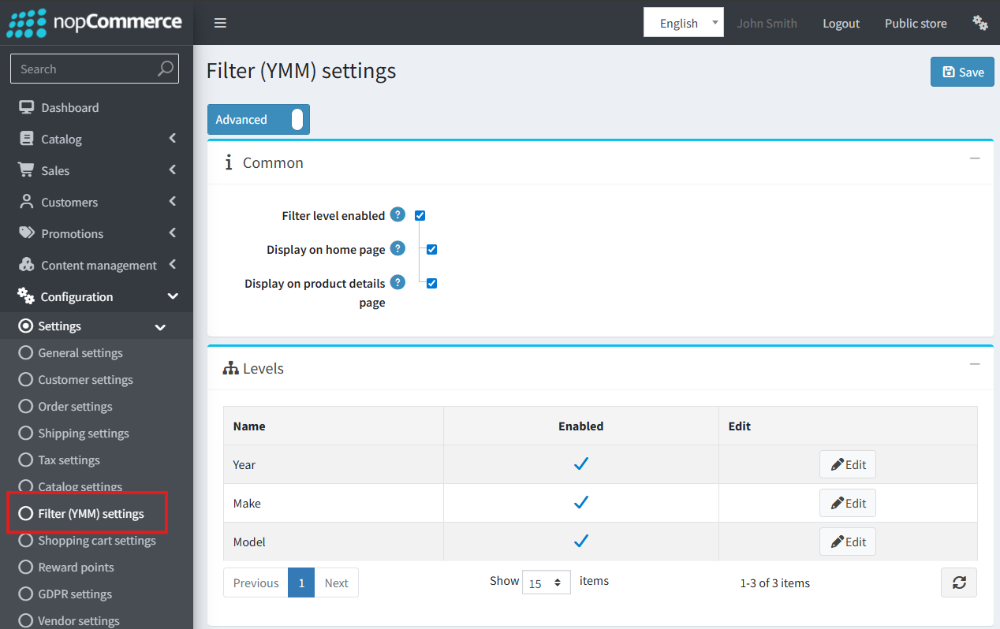
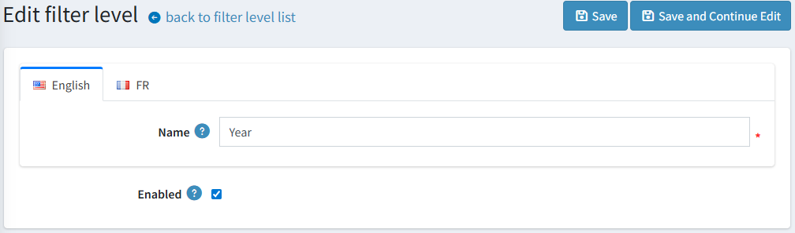
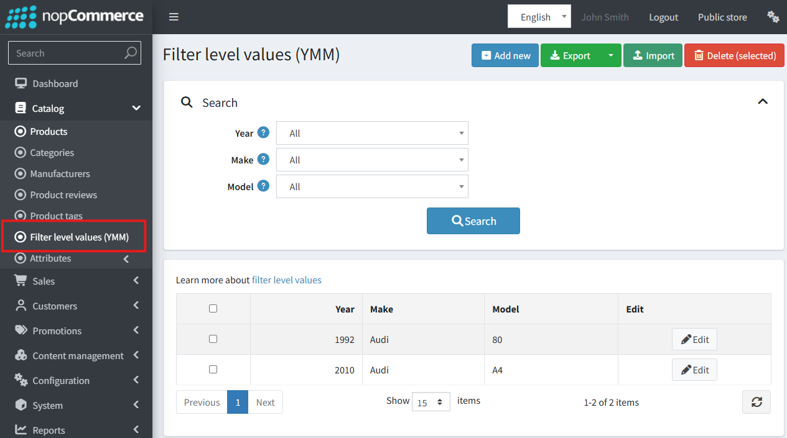
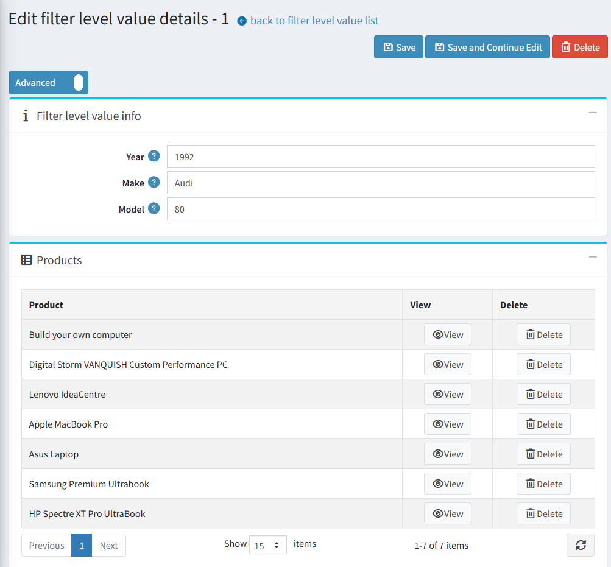
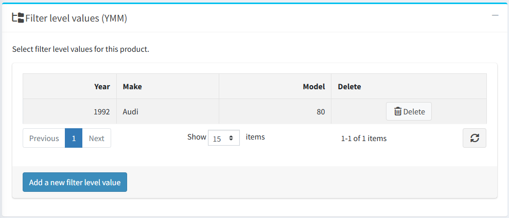
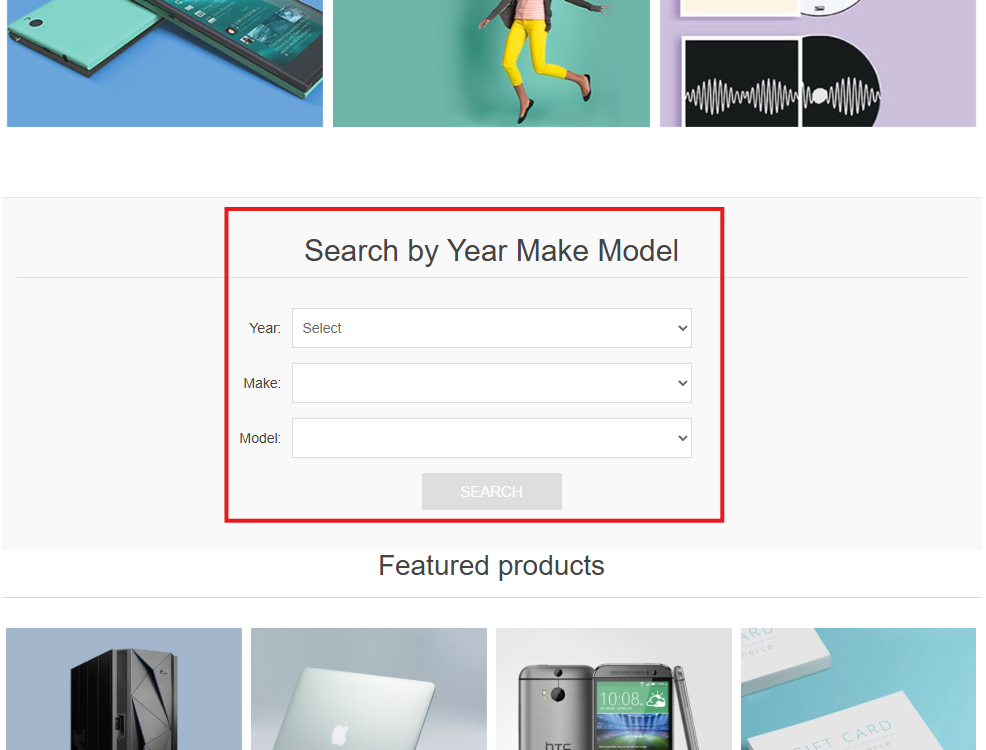
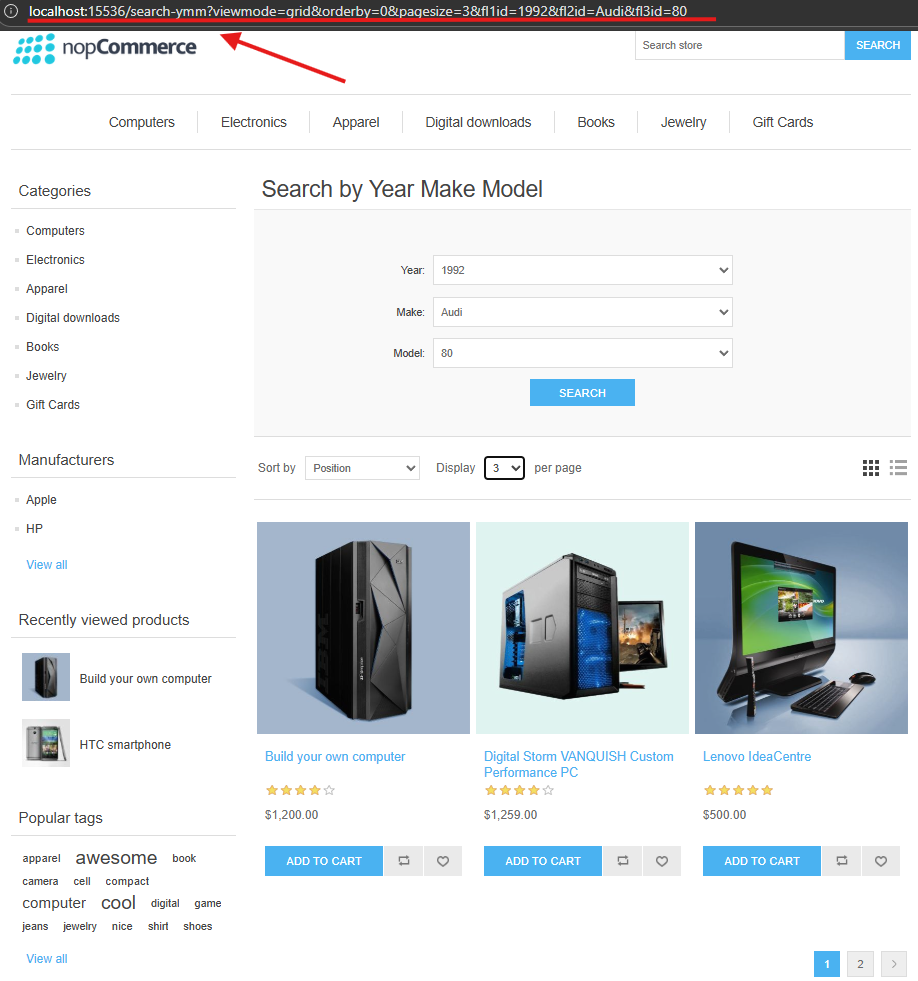
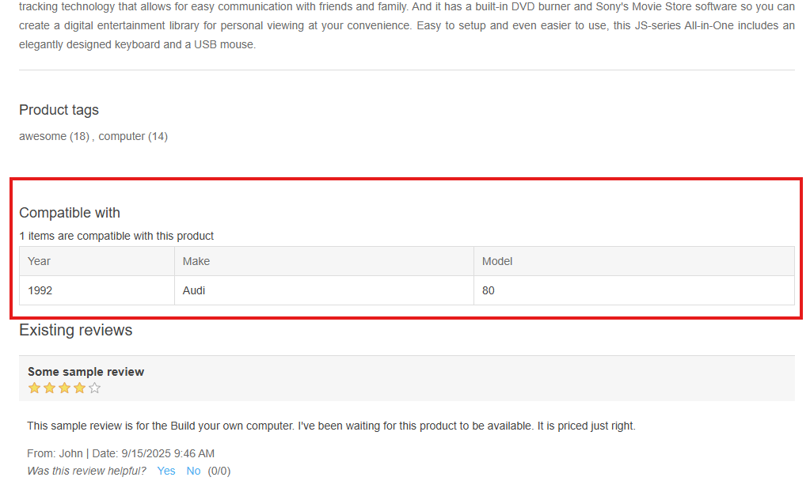

# YMM (Year-Make-Model) 篩選器

## 總覽

YMM (Year-Make-Model，年份-廠牌-型號) 篩選器讓顧客能透過結構化的多層次篩選系統來尋找商品。儘管其名稱暗示用於汽車產業，但此功能具有高度自訂性，可應用於任何需要相容性檢查的商品目錄，例如電子零件（例如：依「廠牌、型號、顯示尺寸」進行篩選）。

其核心目的是協助顧客輕鬆找到與特定車輛或產品相容的零件，進而提升使用者體驗並減少購買錯誤的可能性。

### 主要功能

- **可設定的多層次篩選：** 管理員最多可定義三個巢狀篩選層級（例如：年份 → 廠牌 → 型號）。
- **靈活的數值管理：** 透過管理後台或 Excel 匯入/匯出功能，即可輕鬆新增、編輯及大量管理篩選值（例如：2023、Audi、A4）。
- **商品與篩選器對應：** 將商品指派給一個或多個相容的篩選組合，以確保精確的搜尋結果。
- **無縫整合前台網站：** 在首頁顯示篩選器以便於操作，並在商品頁面顯示詳細的相容性資訊。

## 管理後台設定

### 篩選器設定

若要設定此功能，請前往 **設定 → 設定 → 篩選器 (YMM) 設定**。

- **`Enabled`**：這是用來啟用或停用網站上所有 YMM 功能的總開關。預設為停用。
- **`Display on home page`**：勾選此方塊可在網站首頁顯示 YMM 篩選區塊。
- **`Display filter values on product details page`**：勾選後，商品頁面會出現一個「相容於」表格，列出所有相關聯的篩選組合。預設為啟用。

#### 篩選層級網格

您可以在此自訂三個可用的篩選層級：

- **Enabled：** 啟用或停用各個層級。
- **Name：** 為每個層級設定一個可自訂且可在地化的名稱。
    > [!NOTE]
    >
    > 在預設情況下，新安裝的系統會設定並啟用「年份 (Year)」、「廠牌 (Make)」和「型號 (Model)」。

> [!WARNING]
>
> 若子層級目前處於啟用狀態，則無法停用其父層級。

### 管理篩選值

若要建立及管理每個篩選層級的選項，請前往 **目錄 → 篩選層級值 (YMM)**。

- **建立與編輯數值：** 管理員可以針對已啟用的篩選層級新增或編輯數值組合（例如：年份：2024、廠牌：BMW、型號：X5）。系統會防止重複組合的建立。

    

- **商品對應：** 建立或編輯數值組時，會出現一個新視窗，您可以在其中將商品直接對應到該特定組合。此視窗也會顯示已對應的商品。
- **管理功能：**
  - **篩選：** 管理網格可透過每個啟用層級進行篩選，以快速找到項目。
  - **匯入/匯出：** 使用 Excel 匯入與匯出工具大量管理篩選值。
  - **刪除選取項目：** 同時移除多個數值組合。

### 從商品編輯頁面進行對應

您也可以直接從商品的設定頁面管理對應關係。

1. 前往 **目錄 → 商品** 並開啟商品進行編輯。
1. 找到新的 **「篩選層級值 (YMM)」** 面板（位於「交叉銷售」面板之後）。

    

1. 您可以在此新增或移除商品與現有篩選組合之間的關聯。

## 前台網站功能

### 首頁篩選器

如果已啟用在首頁顯示的功能，顧客將會看到一個包含各個啟用篩選層級下拉式選單的篩選區塊。

這些下拉式選單是**相依且循序的**。必須先在第一層篩選器（例如「年份」）中選擇一個值，第二層下拉式選單（例如「廠牌」）才會變為可操作，依此類推。

### 搜尋結果頁面

搜尋動作僅會在顧客針對**所有已啟用的篩選層級**皆選定數值後才會執行。
點擊 **搜尋** 後，使用者將被重新導向至專屬的 YMM 搜尋結果頁面。

此頁面會在頂部顯示所選的篩選條件，並在下方顯示所有符合條件的商品分頁列表。

### 商品詳細頁面

如果對應的設定已啟用，商品頁面上會顯示一個標題為 **「相容於」** 的表格。此表格清楚列出了該特定商品所相容的所有 YMM 組合，讓顧客對他們的購買更有信心。

