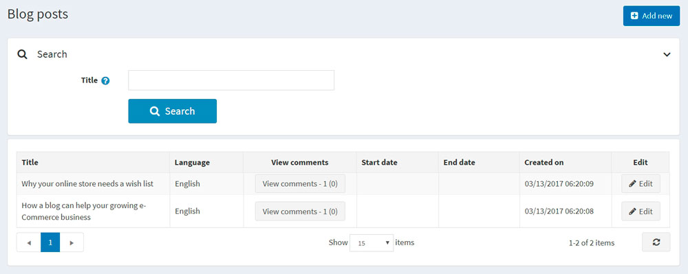
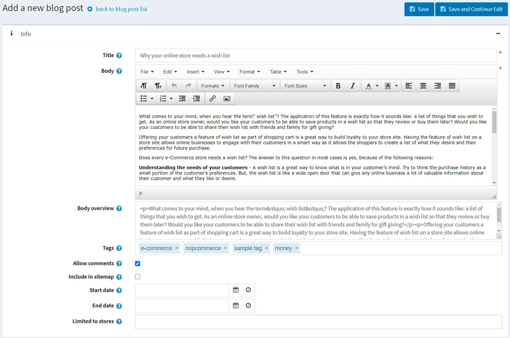
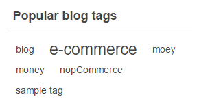
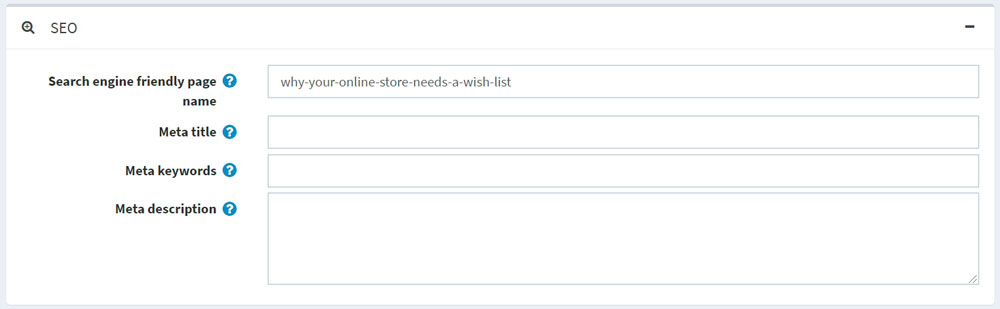
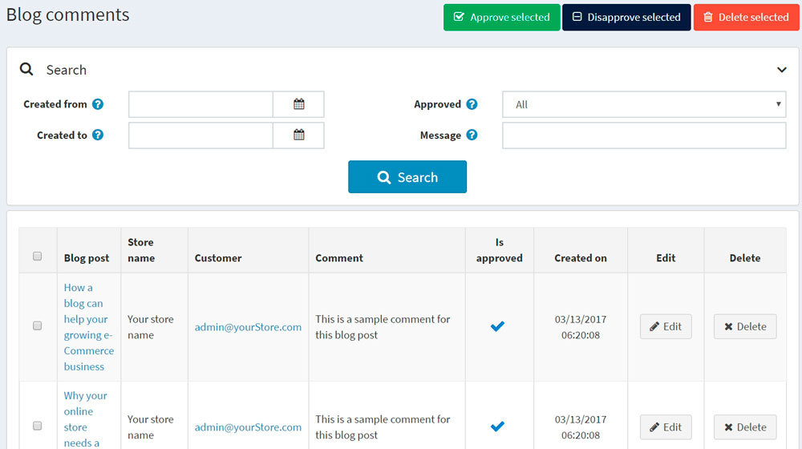
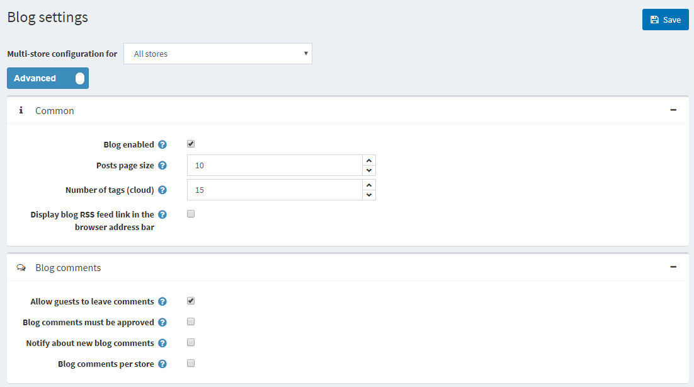

# 部落格

部落格是與現有顧客建立連結的絕佳方式，不僅能讓他們隨時掌握最新的商品資訊或提供教育內容，還能協助開發新顧客。

若要管理部落格文章，請前往 **內容管理 → 部落格文章**。

## 新增部落格文章

點擊 **新增** 並填寫關於新部落格文章的資訊。

### 資訊

在「資訊」面板中，定義以下部落格文章詳細資料：

* 若啟用了一種以上的語言，請從 **語言** 下拉式清單中選擇此部落格文章的語言。顧客只會看到他們所選語言的部落格文章。
* 輸入此部落格文章的 **標題**。
* 輸入此部落格文章的 **內文**。
* 您可以指定 **內文概覽**，若您只想讓部分文字顯示在列出所有部落格文章的主部落格頁面上。
* 輸入要在前台商店部落格頁面上顯示的 **標籤**。標籤是可以用來識別此部落格文章的關鍵字。請輸入與此部落格文章相關的標籤清單，並以逗號分隔。與特定標籤關聯的部落格文章越多，該標籤在部落格頁面側邊欄「熱門標籤」區域中顯示的字體就會越大。
   

* 勾選 **允許評論** 核取方塊，以允許顧客對此部落格文章發表評論。
* 勾選 **包含在網站地圖中** 核取方塊，將此部落格文章包含在網站地圖中。
* 輸入顯示此部落格文章的 **開始日期** 和 **結束日期**（以世界協調時間 UTC 為準）。

 > [!NOTE]
 >
 > 若您不想定義部落格文章的開始和結束日期，可以將這些欄位留空。

* 在 **限制商店** 欄位中選擇商店，僅讓特定商店啟用此部落格文章。若不需要此功能，請將該欄位留空。
  > [!NOTE]
  >
 > 若要使用此功能，您必須停用以下設定：**目錄設定 → 忽略「依商店限制」規則 (全站)**。閱讀更多關於多商店功能的資訊 [here](xref:zh-Hant/getting-started/advanced-configuration/multi-store)。

在編輯現有的部落格文章時，或點擊新文章的 **儲存並繼續編輯** 按鈕後，您可以點擊右上角的 **預覽** 按鈕，查看該部落格文章在網站上的呈現方式。

### SEO

在 *SEO* 面板中，請定義以下部落格文章的詳細資訊：

* 定義 **搜尋引擎友善頁面名稱 (Search engine friendly page name)**。例如，輸入 "the-best-news" 即可讓您的 URL 變成 `http://yourStore.com/the-best-news`。若將此欄位留空，系統將會根據部落格文章標題自動產生。
* 在 **Meta title** 欄位中覆寫頁面標題（預設標題為部落格文章的標題）。
* 輸入 **Meta keywords** 以將其加入部落格文章的標頭中。它們代表頁面上最重要主題的簡明清單。
* 輸入 **Meta description** 以將其加入部落格文章的標頭中。Meta description 標籤是頁面內容的簡要總結。

## 管理部落格留言

若要管理部落格留言，請選擇 **內容管理 → 部落格留言**。

使用 **核准所選項目** 按鈕來核准所選的留言，並使用 **取消核准所選項目** 來取消核准留言。
您也可以編輯或刪除部落格留言。若留言被刪除，該留言將會從系統中移除。

## 部落格設定

您可以在 **設定 → 設定 → 部落格設定** 中管理部落格設定。此頁面提供兩種模式：*進階* 與 *基本*。

此頁面支援多商店設定；這意味著可以針對所有商店定義相同的設定，或為不同商店設定不同的值。如果您想要管理特定商店的設定，請從多商店設定下拉式清單中選擇該商店名稱，並勾選左側所需的核取方塊，以設定其自訂數值。如需進一步詳細資訊，請參閱 [多商店](xref:zh-Hant/getting-started/advanced-configuration/multi-store)。

### Common

定義下列 *Common* 設定：

* 勾選 **Blog enabled** 核取方塊以啟用商店中的部落格功能。
* 在 **Posts page size** 欄位中，設定每頁顯示的貼文數量。
* 在 **Number of tags (cloud)** 欄位中，輸入標籤雲中要顯示的標籤數量。
* 勾選 **Display blog RSS feed link in the browser address bar** 核取方塊，以在瀏覽器網址列顯示部落格 RSS 訂閱連結。

### 部落格留言

定義下列的 *部落格留言* 設定：

* 勾選 **允許訪客發表留言** 核取方塊，以啟用未註冊的使用者在部落格新增留言。
* 若部落格留言必須經由管理員核准，請勾選 **部落格留言必須經過核准** 核取方塊。
* 勾選 **通知新部落格留言** 核取方塊，以便在有新的部落格留言時通知商店擁有者。
* 勾選 **依商店顯示部落格留言** 核取方塊，僅顯示目前商店所撰寫的部落格留言。

點擊 **儲存**。

> [!NOTE]
>
> 為了安全起見，您可以為部落格留言啟用 CAPTCHA。欲了解更多資訊，請前往 [CAPTCHA](xref:zh-Hant/getting-started/advanced-configuration/security-settings#captcha) 章節。