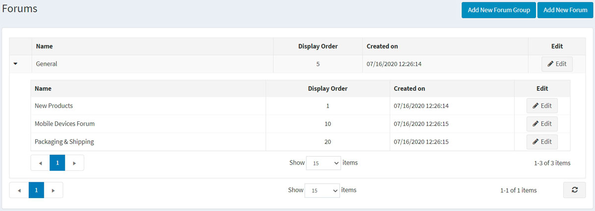
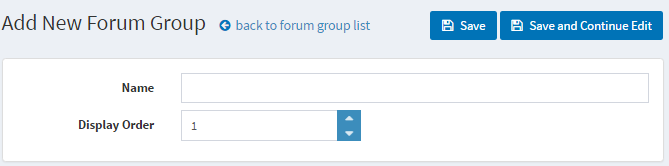
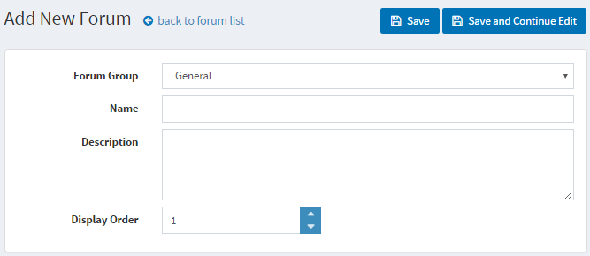
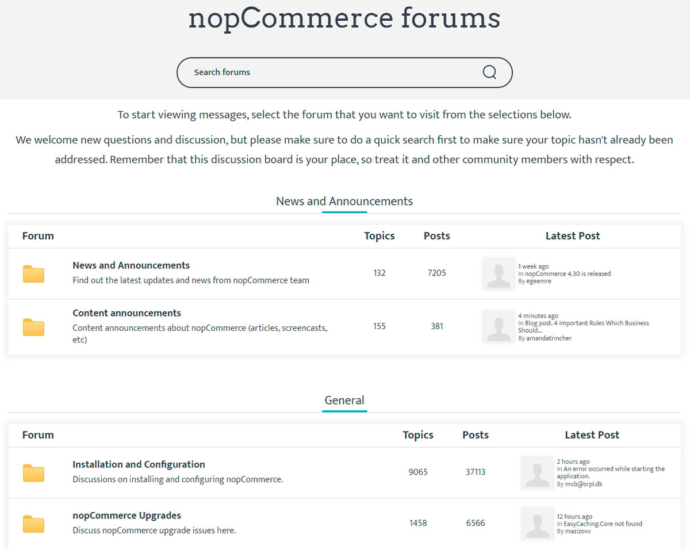
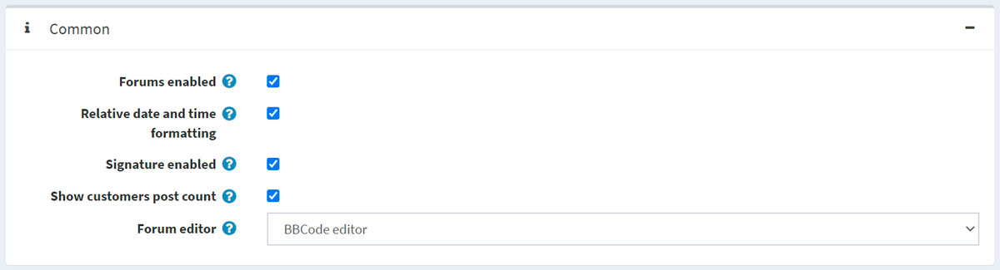
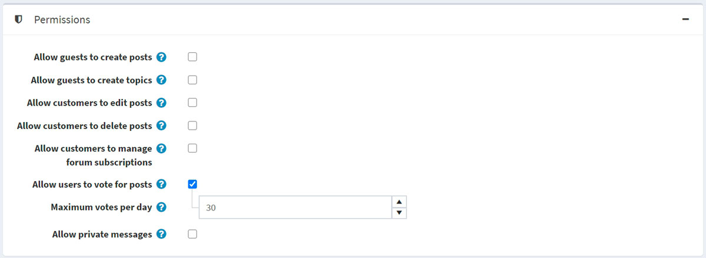
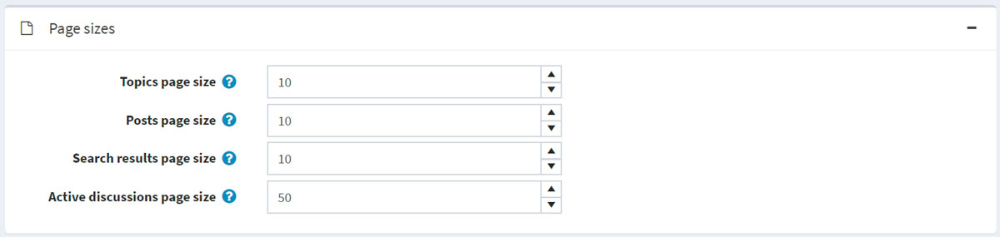
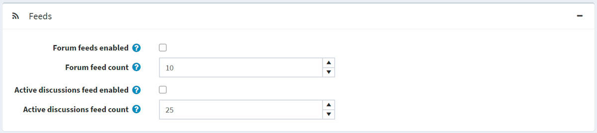

# 論壇

論壇是一個線上討論網站，人們可以在這裡透過發布訊息的形式進行對話。一個論壇可能包含多個子論壇，每個子論壇下又包含數個內容頁面（topics）。

> [!NOTE]
>
> 在 nopCommerce 中，論壇預設為停用狀態。若要啟用論壇，請前往 **設定 → 設定 → 論壇設定**，並勾選 **啟用論壇 (Forums enabled)** 核取方塊。啟用後，「論壇」連結應會顯示在前台網站的選單中（預設佈景主題為頂部選單或頁尾）。

> [!NOTE]
>
> 自 4.90 版本起，如果需要，您必須在啟用論壇後 [手動加入](xref:zh-Hant/running-your-store/content-management/menu) 選單或頁尾項目。

若要管理論壇群組及論壇（在論壇群組內），請前往 **內容管理 → 論壇**。

## 新增論壇群組

點擊 **新增論壇群組 (Add new forum group)** 按鈕。

- 定義新的論壇群組 **名稱 (Name)**。
- 在 **顯示順序 (Display order)** 欄位中，輸入該論壇群組的顯示順序。數值 1 代表顯示在清單的最上方。

點擊 **儲存 (Save)**。

## 新增論壇

- 從 **論壇群組 (Forum group)** 下拉式選單中，選擇所需的論壇群組。
- 輸入新論壇的 **名稱 (Name)**。
- 輸入新論壇的 **說明 (Description)**。
- 選擇論壇群組的 **顯示順序 (Display order)**。數值為 1 代表顯示在清單的最上方。

點擊 **儲存 (Save)**。

若要查看論壇應如何運作的範例，請前往 <http://www.nopcommerce.com/boards/>。

## 論壇設定

若要存取論壇設定，請前往 **設定 → 設定 → 論壇設定**。此頁面提供兩種模式：*進階 (advanced)* 與 *基本 (basic)*。

此頁面支援多商店設定；這表示您可以為所有商店定義相同的設定，或為不同商店設定不同的值。如果您想管理特定商店的設定，請從多商店設定的下拉式選單中選擇該商店名稱，並勾選左側所需的核取方塊，以便為其設定自訂值。如需進一步詳細資訊，請參閱 [多商店 (Multi-store)](xref:zh-Hant/getting-started/advanced-configuration/multi-store)。

### 一般

在「一般」面板中定義以下論壇設定：

- 勾選 **Forums enabled** 核取方塊以啟用論壇。
- 勾選 **Relative date and time formatting** 核取方塊以啟用相對日期與時間格式（例如：2 小時前、1 天前）。
- 您可以勾選 **Signature enabled** 來讓顧客設定個人簽名。
- 勾選 **Show customers post count** 核取方塊以顯示顧客發布的貼文數量。
- 從 **Forum editor** 下拉式選單中，選擇要使用的論壇編輯器類型：
  - 簡易文字方塊 (Simple textbox)。
  - BBCode 編輯器。
  > [!NOTE]
  >
  > 不建議在正式營運環境中變更論壇編輯器類型。

### 權限

在「權限 (Permissions)」面板中定義以下論壇設定：

- **允許訪客建立貼文 (Allow guests to create posts)**。
- **允許訪客建立內容頁面 (Allow guests to create topics)**。
- **允許顧客編輯貼文 (Allow customers to edit posts)**。
- **允許顧客刪除貼文 (Allow customers to delete posts)**。
- **允許顧客管理論壇訂閱 (Allow customers to manage forum subscriptions)**。
- 勾選 **允許使用者對貼文投票 (Allow users to vote for posts)** 核取方塊以啟用投票功能。
  - 若已啟用上述設定，**每日最高投票次數 (Maximum votes per day)** 欄位可用於設定使用者每天可進行的投票數。
- 勾選 **允許私人訊息 (Allow private messages)** 核取方塊以啟用私人訊息。若啟用，將顯示以下兩項設定：
  - 勾選 **顯示私人訊息提醒 (Show alert for PM)** 核取方塊，以在收到新私人訊息時啟用提醒彈出視窗。
  - 若希望顧客在收到新私人訊息時透過電子郵件收到通知，請勾選 **通知私人訊息 (Notify about private messages)**。

### 頁面大小

在「頁面大小」面板中定義以下論壇設定：

- **主題頁面大小** — 論壇中主題的頁面大小，例如每頁顯示 '10' 個主題。
- **文章頁面大小** — 主題中文章的頁面大小，例如每頁顯示 '10' 篇文章。
- **搜尋結果頁面大小** — 搜尋結果的頁面大小，例如每頁顯示 '10' 個結果。
- **熱門討論頁面大小** — 熱門討論頁面的頁面大小，例如每頁顯示 '10' 個結果。

### RSS 資訊來源 (Feeds)

在「資訊來源」(Feeds) 面板中定義下列論壇設定：

- 勾選 **啟用論壇 RSS 資訊來源** (Forum feeds enabled) 核取方塊，以啟用每個論壇的 RSS 資訊來源。
- 在 **論壇資訊來源數量** (Forum feed count) 欄位中，設定每個資訊來源應包含的內容頁面數量。
- 勾選 **啟用活躍討論資訊來源** (Active discussions feed enabled) 核取方塊，以啟用活躍討論內容頁面的 RSS 資訊來源。
- 在 **活躍討論資訊來源數量** (Active discussions feed count) 欄位中，設定「活躍討論」資訊來源中應包含的討論數量。

## 教學課程

- [管理 nopCommerce 中的論壇](https://www.youtube.com/watch?v=wW2QvC4WA_8)