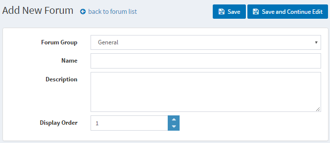
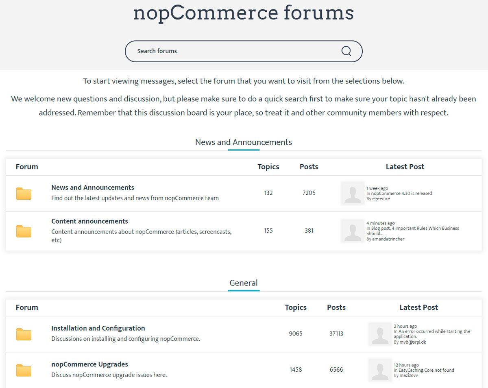
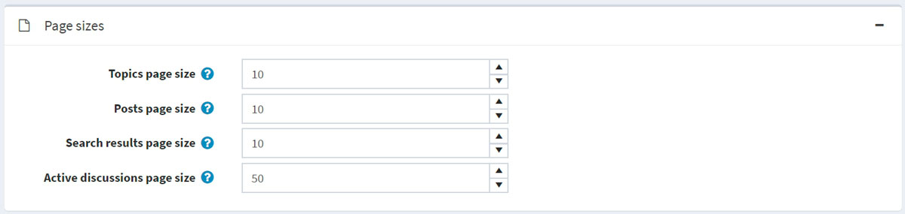
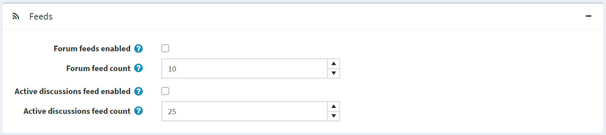

# 論壇

論壇是一個線上討論網站，人們可以在其中以張貼訊息的形式進行對話。一個論壇可能包含多個子論壇，每個子論壇中都有數個內容頁面。

> [!NOTE]
>
> 在 nopCommerce 中，論壇預設為停用。若要啟用論壇，請前往 **設定 → 設定 → 論壇設定**，並勾選 **啟用論壇** 核取方塊。「論壇」連結應會顯示在前台網站的選單中（預設佈景主題為頂部選單或頁尾）。

> [!NOTE]
>
> 自 4.90 版本起，若有需要，您必須在啟用論壇後 [手動新增](xref:zh-Hant/running-your-store/content-management/menu) 選單或頁尾項目。

若要管理論壇群組和論壇（位於論壇群組內），請前往 **內容管理 → 論壇**。

## 新增論壇群組

點擊 **新增論壇群組** 按鈕。

- 定義新的論壇群組 **名稱**。
- 在 **顯示順序** 欄位中，輸入該論壇群組的顯示順序。數值 1 代表位於列表的最上方。

點擊 **儲存**。

## 新增討論區

- 從 **討論區群組 (Forum group)** 下拉式選單中，選擇所需的討論區群組。
- 輸入新討論區的 **名稱 (Name)**。
- 輸入新討論區的 **說明 (Description)**。
- 選擇討論區群組的 **顯示順序 (Display order)**。數值 1 代表清單的最上方。

點擊 **儲存 (Save)**。

若要查看討論區運作方式的範例，請前往 <http://www.nopcommerce.com/boards/>。

## 論壇設定

若要存取論壇設定，請前往 **設定 → 設定 → 論壇設定**。此頁面提供兩種模式：*進階 (advanced)* 與 *基本 (basic)*。

此頁面支援多商店設定；這意味著可以針對所有商店定義相同的設定，或為不同商店設定不同的值。如果您想要管理特定商店的設定，請從多商店設定的下拉式清單中選擇該商店名稱，並勾選左側所需的核取方塊，即可為其設定自訂值。若需進一步了解，請參閱 [多商店](xref:zh-Hant/getting-started/advanced-configuration/multi-store)。

### 一般

請在 *一般 (Common)* 面板中定義以下論壇設定：

- 勾選 **啟用論壇 (Forums enabled)** 核取方塊以啟用論壇。
- 勾選 **相對日期與時間格式 (Relative date and time formatting)** 核取方塊，以啟用相對日期與時間顯示（例如：2 小時前、1 天前）。
- 勾選 **啟用簽名 (Signature enabled)**，讓顧客可以設定自己的個人簽名。
- 勾選 **顯示顧客發文數 (Show customers post count)** 核取方塊，以顯示顧客所建立的貼文數量。
- 從 **論壇編輯器 (Forum editor)** 下拉式選單中，選擇要使用的論壇編輯器類型：
  - 簡易文字方塊 (Simple textbox)
  - BBCode 編輯器 (BBCode editor)
  > [!NOTE]
  >
  > 不建議在正式營運環境中變更論壇編輯器類型。

### 權限

在「權限」面板中定義下列論壇設定：

- **允許訪客建立貼文**。
- **允許訪客建立內容頁面**。
- **允許顧客編輯貼文**。
- **允許顧客刪除貼文**。
- **允許顧客管理論壇訂閱**。
- 勾選 **允許使用者對貼文投票** 核取方塊以啟用投票功能。
  - 若啟用上述設定，**每日最高投票次數** 欄位可設定使用者每日可進行的投票數。
- 勾選 **允許私人訊息** 核取方塊以啟用私人訊息功能。若啟用，將顯示下列兩項設定：
  - 勾選 **顯示私人訊息提醒** 核取方塊，可在收到新私人訊息時啟用提醒彈出視窗。
  - 若希望顧客在收到新私人訊息時透過電子郵件收到通知，請勾選 **通知私人訊息**。

### 頁面大小

在「頁面大小」面板中定義以下論壇設定：

- **主題頁面大小 (Topics page size)** — 論壇中主題的頁面大小，例如每頁顯示 '10' 個主題。
- **文章頁面大小 (Posts page size)** — 主題中文章的頁面大小，例如每頁顯示 '10' 篇文章。
- **搜尋結果頁面大小 (Search results page size)** — 搜尋結果的頁面大小，例如每頁顯示 '10' 個結果。
- **熱門討論頁面大小 (Active discussions page size)** – 熱門討論頁面的頁面大小，例如每頁顯示 '10' 個結果。

### 摘要 (Feeds)

在「摘要」(Feeds) 面板中定義以下論壇設定：

- 勾選 **Forum feeds enabled** 核取方塊，可為每個論壇啟用 RSS 摘要。
- 在 **Forum feed count** 欄位中，設定每個摘要要包含的內容頁面數量。
- 勾選 **Active discussions feed enabled** 核取方塊，可為活躍討論內容頁面啟用 RSS 摘要。
- 在 **Active discussions feed count** 欄位中，設定「活躍討論」摘要中要包含的討論數量。

## 教學

- [在 nopCommerce 中管理論壇](https://www.youtube.com/watch?v=wW2QvC4WA_8)