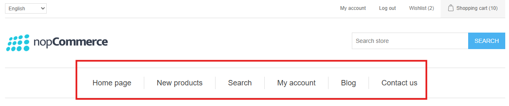
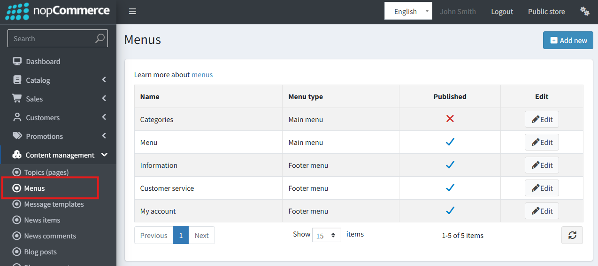
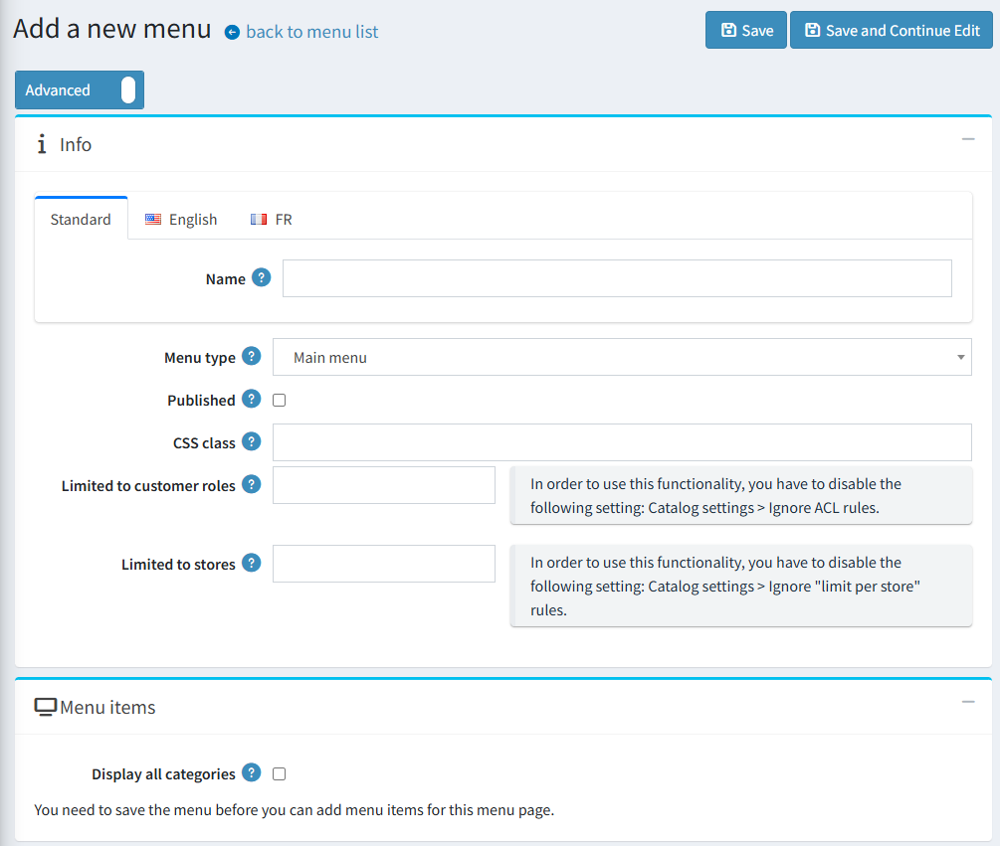
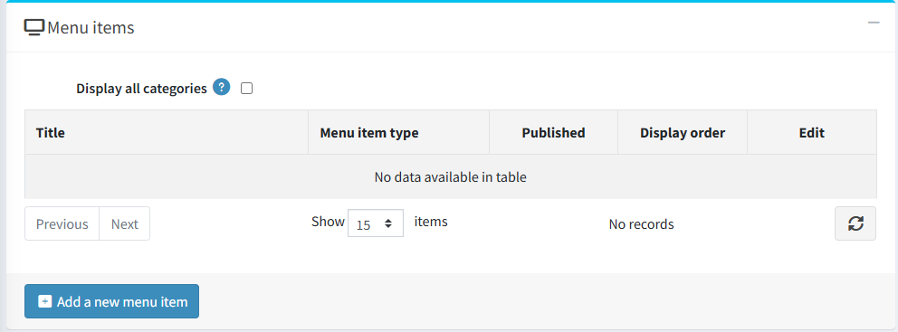
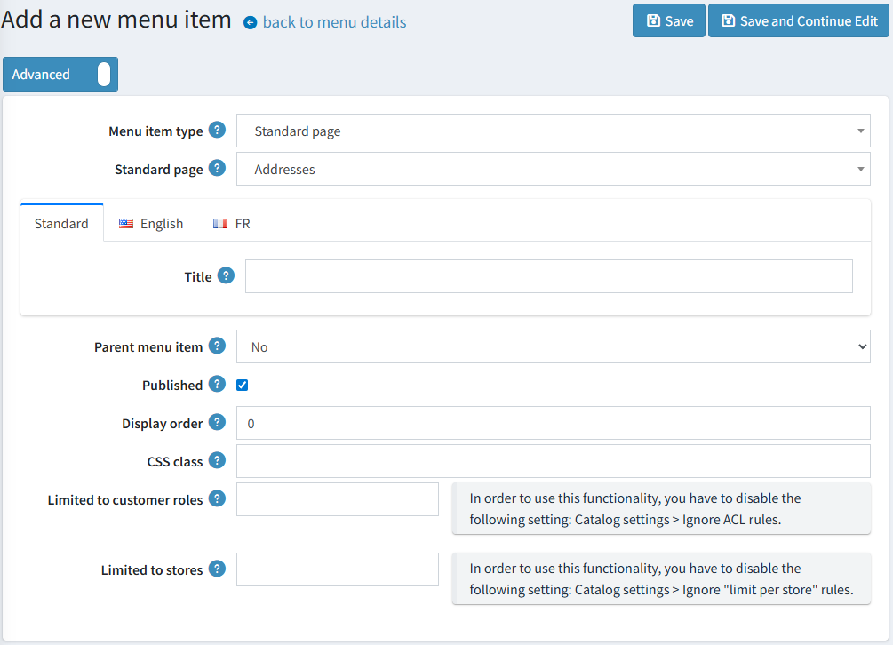
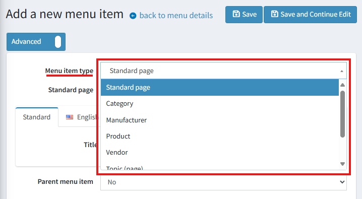
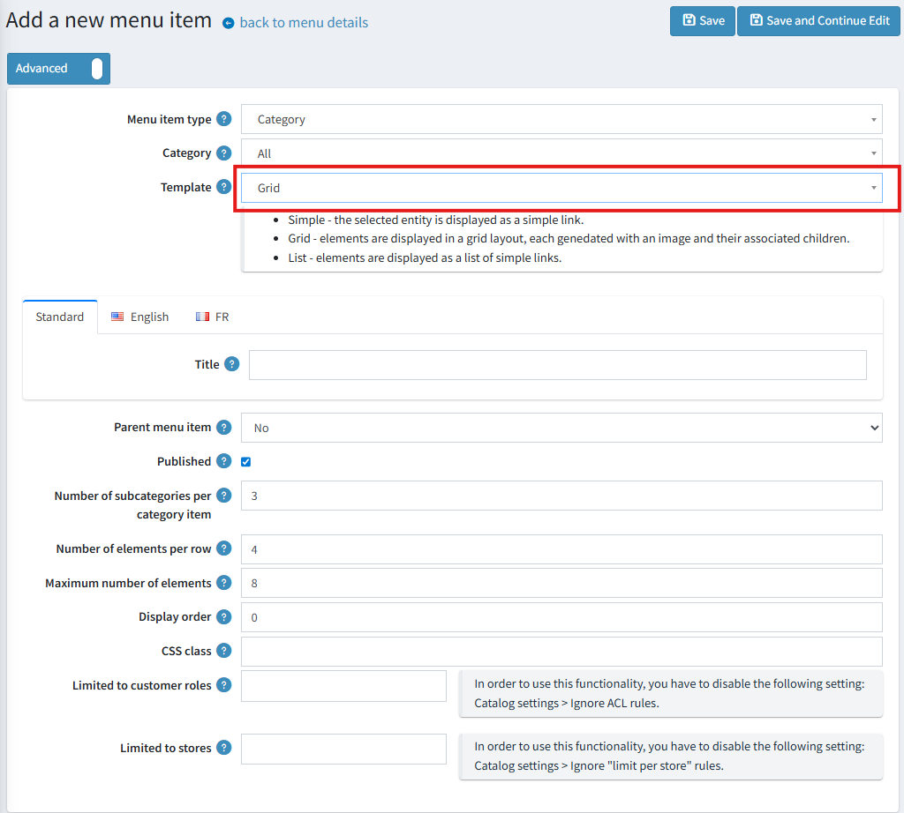

# Mega Menu（大型選單）

從 4.90 版本開始，主選單與頁尾導覽列可由管理員在管理後台進行完全自訂。

## 存取選單管理

若要管理選單，請導覽至 **內容管理 → 選單**。
在此頁面中，您可以編輯現有的選單或建立新的選單。

## 建立與管理選單

建立新選單時，必須使用 **選單類型** 指定其位置：

- **主選單 (Main menu)**：主要的導覽列。
- **頁尾 (Footer)**：網站頁尾處的導覽連結。

> [!WARNING]
>
> 雖然您可以建立多個 `Main menu` 實例，但同一時間前台網站只會顯示一個，具體顯示哪一個取決於其可用性與建立順序。

**「顯示所有類別」('Display all categories')** 設定會根據商店的類別及其子類別自動產生頂層選單項目。若勾選此核取方塊，這些類別連結將會出現在任何手動建立的選單項目之前。

在選單成功建立後，您就可以開始將項目新增至其中。

## 新增與設定選單項目

在建立或編輯選單項目時，可以使用下列參數。

> [!WARNING]
>
> 對於 `Footer` 類型的選單，**「父級選單項目」('Parent menu item')** 屬性無法使用，因為頁尾導覽僅支援單一階層，不支援巢狀結構。

### 選單項目類型

此參數決定了選單項目的行為與可用設定。

- **標準頁面 (Standard page)**：連結至具有預先設定路由的系統預設頁面。
- **類別 (Category)**：
  - 顯示所有類別（以網格或列表佈局）。
    - 顯示單一類別（以網格、列表或簡單連結呈現）。
- **製造商 (Manufacturer)**：
  - 顯示所有製造商（以網格或列表佈局）。
  - 連結至「所有製造商」頁面。
  - 連結至特定製造商頁面。
- **商品 (Product)**：直接連結至選定的商品頁面。
- **供應商 (Vendor)**：
  - 顯示所有供應商（以網格或列表佈局）。
  - 連結至「所有供應商」頁面。
  - 連結至特定供應商頁面。
- **內容頁面 (Topic (page))**：連結至選定的內容頁面。
- **自訂連結 (Custom link)**：一個簡單的連結，由您手動指定文字與 URL。
- **純文字 (Text without link)**：顯示不可點擊的文字。這對於作為標題且不需要連結至任何地方的父級項目非常實用。

### 網格/列表佈局的額外設定

對於使用網格或列表範本的選單項目（例如顯示所有類別），可以使用下列選項：

- **每列顯示的元素數量 (網格)**：設定網格單列中顯示的最大項目數量。
- **每個類別項目的子類別數量 (網格)**：設定每個網格方塊內顯示的最大子類別連結數量。
- **元素的最大數量**：設定要顯示的子項目總最大數量。

