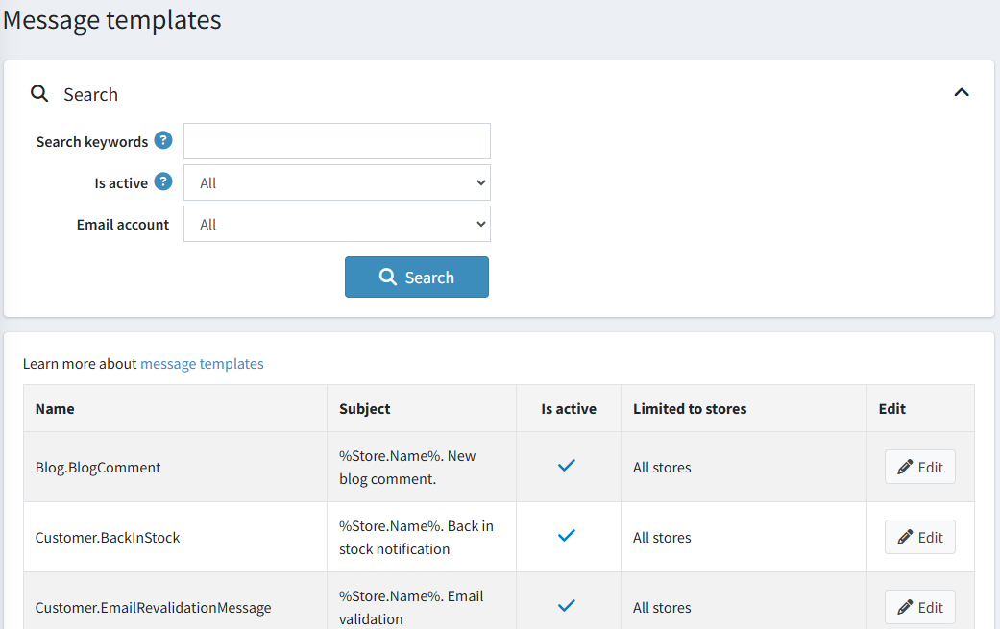
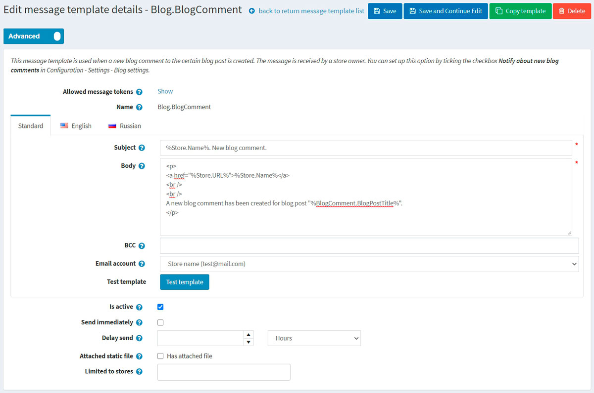
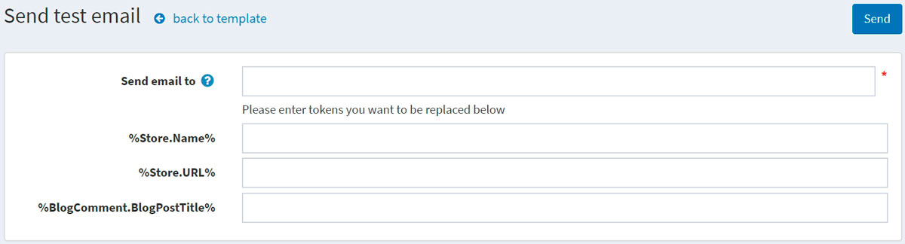

# 訊息範本

訊息範本定義了從您的商店發送的自動化訊息之版面配置、內容與格式。這些訊息稱為交易電子郵件，因為每一封訊息都與特定類型的交易相關聯。

nopCommerce 預設提供了多種訊息範本，用於通知使用者與商店擁有者有關訂單狀態等資訊。若要存取訊息範本，請前往 **內容管理 → 訊息範本**。

篩選：

* 您可以透過關鍵字或商店來搜尋訊息範本。關鍵字用於搜尋訊息範本的名稱、內文或主旨。如果您擁有多個商店，且未啟用「目錄設定」頁面上的 **效能 → 忽略「依商店限制」規則 (全站)** 設定，則會顯示可用商店的清單。

* **電子郵件帳號**。如果商店擁有兩個或多個電子郵件帳號，則會出現此下拉式清單。

* 您也可以透過 **啟用** 來篩選訊息範本。

## 編輯訊息範本

找到您要編輯的訊息範本並點擊 **編輯**。系統將顯示如下的「編輯訊息範本詳細資料」視窗：

如果您安裝了多種語言，請選擇所需的 **語言頁籤**。

> [!TIP]
>
> 系統預設僅使用英語。您可以在 **設定 → 語言** 中管理語言。如需進一步了解 nopCommerce 中的語言設定，請參閱 [在地化](xref:zh-Hant/getting-started/advanced-configuration/localization) 章節。

編輯訊息範本詳細資料如下：

* 編輯訊息的 **主旨**。您可以在主旨中包含權杖 (tokens)。您可以在頁面頂端看到所有允許使用的權杖清單。
* 編輯訊息的 **內文**。
* 如有需要，請在 **BCC** 欄位中輸入此電子郵件的密件副本收件者。
* 從 **電子郵件帳號** 下拉式清單中，選擇用於傳送此訊息範本的電子郵件帳號。
* 您可以點擊 **測試範本** 按鈕來測試此訊息範本。點擊後，將顯示「傳送測試電子郵件」視窗如下：
  
  在 **寄送郵件至** 欄位中輸入您的電子郵件，以測試值填入權杖，然後點擊 **傳送** 按鈕。
  

> [!TIP]
>
> 電子郵件帳號是在 **設定 → 電子郵件帳號** 中設定的。如需進一步了解，請參閱 [電子郵件帳號](xref:zh-Hant/getting-started/email-accounts) 章節。

* 勾選 **啟用** 選項以表示此訊息應該被傳送。
* 如果您希望立即傳送此電子郵件，請勾選 **立即傳送** 核取方塊。
  * 如果未勾選上述核取方塊，則會顯示 **延遲傳送** 欄位。
* 勾選 **附加靜態檔案** 核取方塊以上傳將附加在每封傳送郵件中的檔案。
* 如果該訊息範本僅適用於特定商店，請在 **限制於商店** 欄位中選擇對應的商店。如果不需此功能，請將該欄位留空。
  > [!NOTE]
  >
  > 若要使用此功能，您必須停用以下設定：**目錄設定 → 忽略「依商店限制」規則 (全站)**。如需進一步了解多商店功能，請參閱 [here](xref:zh-Hant/getting-started/advanced-configuration/multi-store)。

點擊 **儲存**。

> [!NOTE]
>
> 若要建立訊息範本的完整副本，請點擊右上角的 **複製範本**。如果您配置了多個商店並希望為每個商店建立不同的範本，此功能非常有用。

## 參閱

* [電子郵件帳號](xref:zh-Hant/getting-started/email-accounts)
* [語言](xref:zh-Hant/getting-started/advanced-configuration/localization)

## 教學課程

* [在訊息範本中新增條件](https://www.youtube.com/watch?v=5chrb1yH1v4&feature=youtu.be)