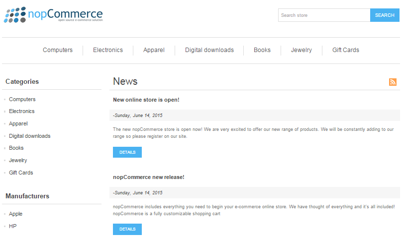
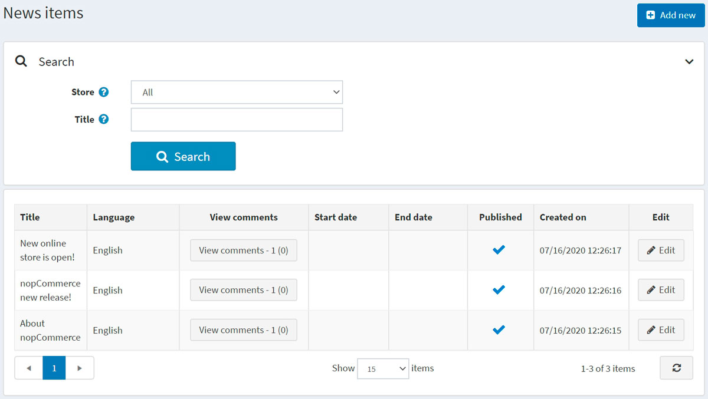
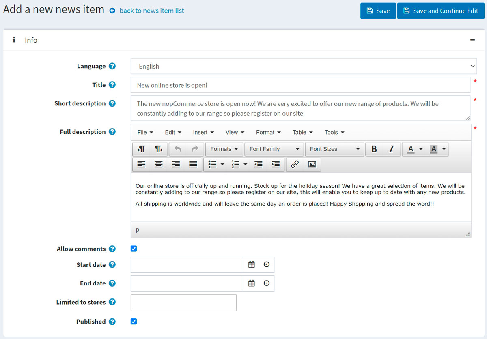
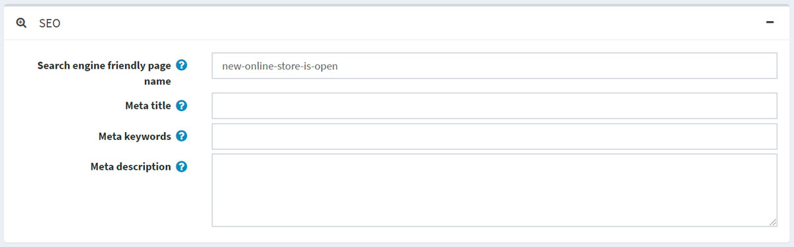
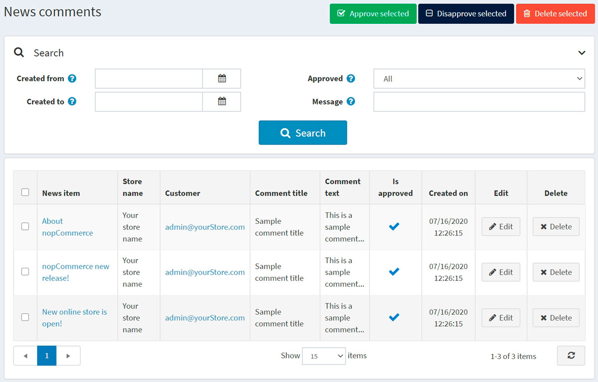
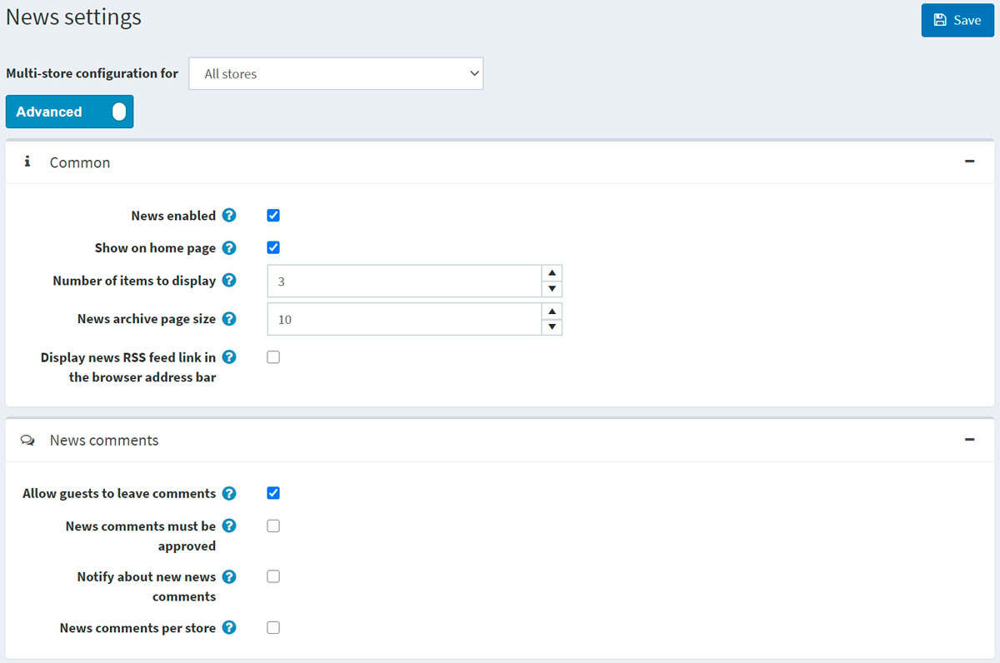

# 新聞

nopCommerce 允許您在商店中發布新聞。您可以發布任何重要訊息，例如 nopCommerce 的最新版本資訊、公司更新等。

新聞將會顯示在您商店的首頁或網站頁尾選單中。

若要管理新聞，請前往 **內容管理 → 新聞項目**。所有新聞的列表將會顯示如下：

## 新增新聞

若要新增一則新聞項目，請點擊 **編輯** 按鈕並填寫新聞項目的相關資訊。

### 資訊

在「資訊」面板中，定義以下新聞項目細節：

- 若啟用了多種語言，請從 **語言** 下拉式選單中選擇此新聞項目的語言。顧客將只能看到他們所選語言的新聞。
- 輸入此新聞項目的 **標題**。例如：「我們新的 nopCommerce 商店正式上線」。
- 在 **簡短描述** 欄位中，輸入此新聞項目的摘要。這是訪客在公開商店的新聞列表中會看到的文字。
- 在 **完整描述** 欄位中，輸入此新聞項目的內文。
- 勾選 **允許留言** 核取方塊，以允許顧客針對該新聞項目新增留言。

- 輸入此新聞項目顯示的 **開始日期** 與 **結束日期**（以協調世界時間 UTC 為準）。

  > [!NOTE]
  >
  > 如果您不想定義新聞項目的開始與結束日期，可以將這些欄位留空。

- 在 **限制於商店** 欄位中選擇商店，以僅針對特定商店啟用此新聞項目。如果不需要此功能，請將該欄位留空。

  > [!NOTE]
  >
  > 為了使用此功能，您必須停用以下設定：**目錄設定 → 忽略「每個商店的限制」規則 (全站)**。閱讀更多關於多商店功能的內容 [here](xref:zh-Hant/getting-started/advanced-configuration/multi-store)。

- 勾選 **已發布** 核取方塊，以將此新聞項目發布到您的商店中。

在編輯現有的新聞項目，或是為新項目點擊 **儲存並繼續編輯** 按鈕後，您可以點擊右上角的 **預覽** 按鈕，查看該新聞項目在網站上的顯示樣貌。

### SEO

在 *SEO* 面板中，定義下列新聞項目細節：

- 定義 **搜尋引擎友善頁面名稱**（Search engine friendly page name）。例如，輸入 "the-best-news" 可使您的 URL 變為 `http://yourStore.com/the-best-news`。若將此欄位留空，系統將根據新聞標題自動產生。
- 在 **Meta 標題**（Meta title）欄位中覆寫頁面標題（預設標題為該新聞項目的標題）。
- 輸入 **Meta 關鍵字**（Meta keywords），這些關鍵字將被加入到新聞項目的標頭（header）中。它們代表該頁面最重要的主題，是一份簡短且精確的列表。
- 輸入 **Meta 描述**（Meta description），這些描述將被加入到新聞項目的標頭中。Meta 描述標籤是對頁面內容的簡短且精確的摘要。

## 管理新聞留言

若要管理新聞留言，請前往 **內容管理 → 新聞留言**。

使用 **核准所選** 按鈕來核准所選的留言，並使用 **取消核准所選** 來取消對留言的核准。
您也可以編輯或刪除留言。一旦刪除，該留言將會從系統中移除。

## 新聞設定

您可以在 **設定 → 設定 → 新聞設定** 中管理新聞設定。此頁面提供兩種模式：*進階* 與 *基本*。

此頁面支援多商店設定；這意味著您可以為所有商店定義相同的設定，或者為不同商店定義不同的設定。如果您想管理特定商店的設定，請從多商店設定下拉式清單中選擇該商店名稱，並勾選左側所需的核取方塊，即可為其設定自訂值。有關更多詳細資訊，請參閱 [多商店](xref:zh-Hant/getting-started/advanced-configuration/multi-store)。

### 一般設定

定義以下 *一般* 設定：

- 勾選 **News enabled** 核取方塊以啟用商店中的新聞功能。
- 勾選 **Show on home page** 以便在商店首頁顯示您的新聞項目。
- 輸入要在首頁顯示的 **Number of items to display**（項目數量）。
- 輸入 **News archive page size**（新聞封存頁面大小）。這是單一頁面上顯示的新聞數量。
- 勾選 **Display news RSS feed link in the browser address bar** 以便在顧客的瀏覽器網址列中啟用新聞 RSS 訂閱連結。

### 新聞評論

定義以下 *新聞評論* 設定：

- 勾選 **允許訪客發表評論** 核取方塊，以允許未註冊的使用者在新聞下方新增評論。
- 若新聞評論必須經由管理員核准，請勾選 **新聞評論必須經過核准** 核取方塊。
- 若要通知商店負責人有新的新聞評論，請勾選 **通知有新的新聞評論** 核取方塊。
- 若要僅顯示在目前商店所撰寫的新聞評論，請勾選 **每個商店的新聞評論** 核取方塊。

點擊 **儲存**。

## 教學課程

- [在 nopCommerce 中管理新聞](https://www.youtube.com/watch?v=ztLlRXvBQK4)