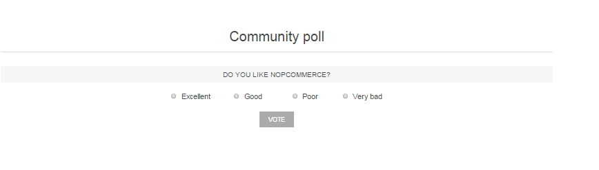
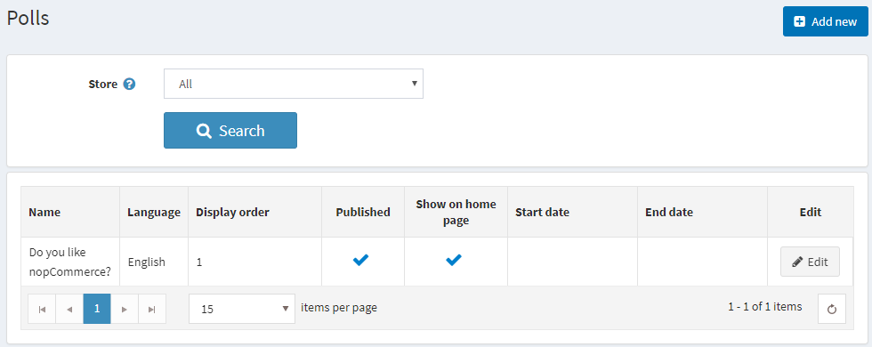
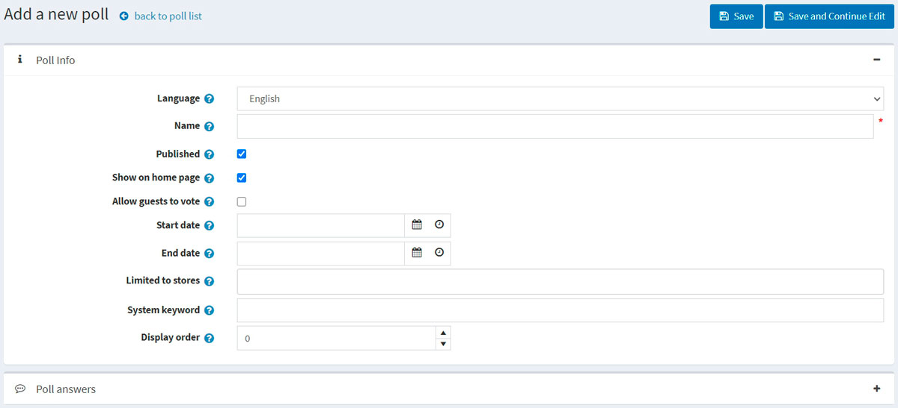
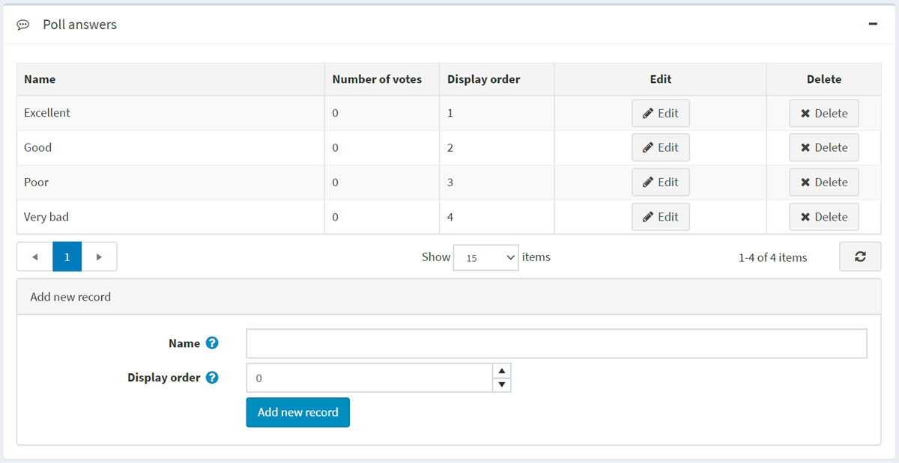

# 民意調查

nopCommerce 的民意調查功能讓您可以使電子商務網站更具互動性。您可以透過許多方式在電子商務網站中使用民意調查。一種常見的方法是將其作為簡短的顧客滿意度調查。人們喜歡被詢問意見，這是一個檢視您作為線上商家表現如何的好機會。

Default Clean nopCommerce 佈景主題首頁上的民意調查看起來像這樣：

若要檢視所有民意調查並新增調查，請前往 **內容管理 → 民意調查**。

若要搜尋在特定商店中使用的民意調查，請從清單中選擇商店名稱。

## 新增民意調查

若要新增民意調查，請點擊右上角的 **新增** 按鈕。

### 民意調查資訊

為新的民意調查定義以下詳細資料：

- 如果啟用了多種語言，請從 **語言** 下拉式清單中選擇此民意調查的語言。顧客只會看到他們所選語言的民意調查。
- 輸入此民意調查的說明性 **名稱**。這是顧客將看到的文字。例如：「您覺得我們的商店如何？」
- 勾選 **已發布** 核取方塊以啟用此民意調查。
- 如果您想在首頁顯示該民意調查，請勾選 **在首頁顯示民意調查** 核取方塊。
- 勾選 **允許訪客投票** 核取方塊，以允許未註冊的使用者參與民意調查。
- 以協調世界時間 (UTC) 輸入 **開始日期** 和 **結束日期**。
  > [!NOTE]
  >
  > 如果您不想定義民意調查的開始與結束日期，可以將這些欄位留空。

- 在 **限制商店** 欄位中選擇商店，以僅針對特定商店啟用此民意調查。如果不需此功能，請將該欄位留空。
  > [!NOTE]
  >
  > 若要使用此功能，您必須停用以下設定：**目錄設定 → 忽略「依商店限制」規則 (全站)**。閱讀更多關於多商店功能的內容 [here](xref:zh-Hant/getting-started/advanced-configuration/multi-store)。

- 在 **系統關鍵字** 欄位中，您可以指定民意調查的顯示位置。例如：LeftColumnPoll。
- 輸入民意調查的 **顯示順序**。數值 1 代表位於清單最上方。

點擊 **儲存並繼續編輯** 以進入 *民意調查答案* 面板。

### 民意調查答案

填寫以下民意調查答案資訊：

- 將顯示給顧客的 **名稱**。
- **顯示順序**。數值 1 代表位於清單最上方。

然後點擊 **新增記錄** 按鈕來儲存答案。

完整的答案清單可能如下所示：

隨後，您可以根據需要 **編輯** 或 **刪除** 記錄。

## 教學課程

- [在 nopCommerce 中管理民意調查](https://www.youtube.com/watch?v=RJP45cUhuZQ)