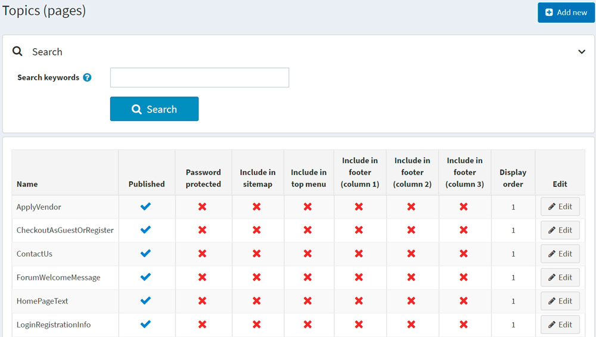
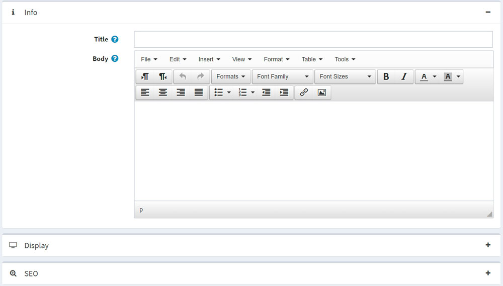

# 內容頁面 (Topics)

內容頁面 (Topics) 是可以顯示在您的網站上的自由格式內容區塊，可以嵌入到其他頁面中，也可以作為獨立的頁面顯示。這些內容頁面通常用於 FAQ 頁面、政策頁面、特別說明等。若要建立自訂頁面，您應該建立一個新的內容頁面，並在內容頁面詳細資料頁面輸入您的自訂頁面內容。內容可以針對每一種語言分別撰寫。

## 內容頁面列表

若要檢視內容頁面，請前往 **內容管理 → 內容頁面 (Topics)**。
您可以透過在 **搜尋關鍵字** 欄位中輸入內容文字或其片段，或篩選特定商店的所有內容頁面，來搜尋內容頁面列表。



## 新增內容頁面

若要新增內容頁面（Topic），請前往 **內容管理 → 內容頁面 (Topics)**。
點擊 **新增** 並填寫該新內容頁面的相關資訊。



### 資訊

在 *資訊* 面板中，定義下列內容頁面細節：

* 輸入該內容頁面的 **標題 (Title)**。
* 使用 **內文 (Body)** 欄位中提供的編輯器來新增內容頁面內容。
* **URL** 欄位僅供參考。它是該內容頁面在前台商店中的 URL。您可以透過編輯下方的 **搜尋引擎友善頁面名稱 (Search engine friendly page name)** 欄位來進行修改。

### 顯示

在 *顯示 (Display)* 面板中，定義下列內容頁面細節：

* 勾選 **已發佈 (Published)** 核取方塊以發佈此內容頁面。
* 您可以將此內容頁面包含在 **頂端選單 (top menu)**、**頁尾 (第一欄) (footer (column 1))**、頁尾 (第二欄) (footer (column 2))、頁尾 (第三欄) (footer (column 3)) 以及 **網站地圖 (sitemap)** 中。只需勾選對應的核取方塊即可。
* 如果此內容頁面受密碼保護，請勾選 **受密碼保護 (Password protected)** 核取方塊。**密碼 (Password)** 欄位將會顯示在公開商店的內容頁面中。顧客需要輸入密碼才能存取此內容頁面的內容。
* 從 **顧客角色 (Customer roles)** 下拉式清單中，選擇可以存取此內容頁面的一個或多個顧客角色。
  > [!NOTE]
  >
  > 為了使用此功能，您必須停用下列設定：**設定 → 目錄設定 (Catalog settings) → 忽略 ACL 規則 (全站) (Ignore ACL rules (sitewide))**。閱讀更多關於存取控制清單 (ACL) 的資訊 [here](xref:zh-Hant/running-your-store/customer-management/access-control-list)。

* 在 **限制商店 (Limited to stores)** 下拉式清單中，選擇要顯示此內容頁面的商店。
  > [!NOTE]
  >
  > 為了使用此功能，您必須停用下列設定：**目錄設定 (Catalog settings) → 忽略「依商店限制」規則 (全站) (Ignore "limit per store" rules (sitewide))**。閱讀更多關於多商店功能的資訊 [here](xref:zh-Hant/getting-started/advanced-configuration/multi-store)。

* 使用 **商店關閉時可存取 (Accessible when store closed)** 欄位，讓此內容頁面在商店關閉時仍可存取。
* 選擇內容頁面的 **顯示順序 (Display order)**。例如，1 代表清單中的第一個項目。
* 輸入此內容頁面的 **系統名稱 (System name)**。
  > [!NOTE]
  >
  > 對不同的內容頁面使用相同的系統名稱是可行的。例如，您可以建立兩個系統名稱相同但可存取角色不同的內容頁面。例如，分別設定給 *訪客 (Guest)* 和 *已註冊 (Registered)* 顧客角色。這意味著訪客和已註冊顧客將在網站上看到不同的內容。

> [!NOTE]
>
> 在編輯現有的內容頁面時，或在為新頁面點擊 **儲存並繼續編輯 (Save and continue edit)** 按鈕後，您可以點擊 **預覽 (Preview)** 按鈕，查看內容頁面在網站上的呈現效果。

### SEO

在 *SEO* 面板中，定義下列內容頁面細節：

* 在 **Search engine friendly page name** 欄位中，輸入搜尋引擎所使用的頁面名稱。如果您沒有輸入任何內容，網頁 URL 將會使用頁面名稱來組成。如果您輸入 *custom-seo-page-name*，則會使用下列 URL：`http://www.yourStore.com/custom-seo-page-name`。
* 在 **Meta title** 欄位中，輸入所需的標題。標題標籤 (title tag) 會指定網頁的標題。這是一段插入網頁標頭的程式碼，格式如下：

   ```html
   <head>
     <title>
        Creating Title Tags for Search Engine Optimization & Web Usability
      <title>
   </head>
   ```

* 輸入所需的類別 **Meta keywords**，這代表您頁面中最重要主題的簡短列表。Meta keywords 標籤格式如下：

   ```html
   <meta name="keywords" content="keywords, keyword, keyword phrase, etc.">
   ```

* 在 **Meta description** 欄位中，輸入類別的描述。Meta description 標籤是您頁面內容的簡短摘要。Meta description 標籤格式如下：

   ```html
   <meta name="description" content="Brief description of the contents of your page.">
   ```

點擊 **Save**。該內容頁面將會顯示在前台商店中。

## 參閱

* [SEO](xref:zh-Hant/running-your-store/search-engine-optimization)

## 教學課程

* [新增內容頁面範本](https://www.youtube.com/watch?v=M-g4Ux2GCaY)