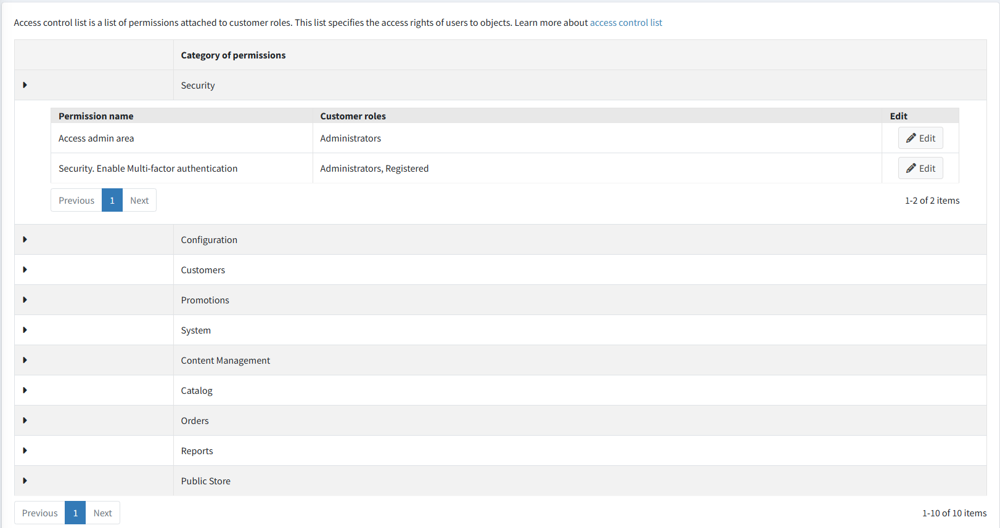
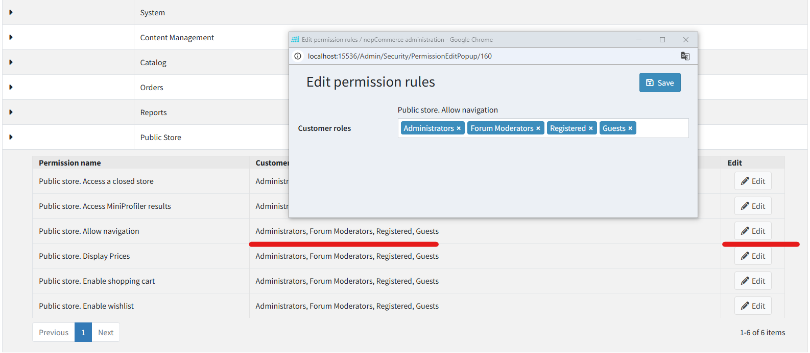

# 存取控制清單

存取控制清單 (ACL) 用於限制或授予使用者存取網站特定區域的權限。此清單由管理員進行管理。因此，使用者必須擁有管理員權限才能存取此功能。存取控制清單具有以下特性：

* 存取控制清單是基於角色的，也就是說，它管理如 *Global administrators*、*Content managers* 等角色。這些角色清單可在 **顧客 → 顧客角色** 頁面進行管理。詳細資訊請參考 [顧客角色](xref:zh-Hant/running-your-store/customer-management/customer-roles)。
* 存取控制清單出現在管理後台。請確保使用者必須是管理員才能存取 ACL。
* 系統中預設了一些管理員動作，包括 *Manage orders*（管理訂單）、*Manage customers*（管理顧客）等更多項目。

若要管理存取控制清單，請前往 **設定 → 存取控制清單**。此時將會顯示 *Access control list* 視窗：

點擊 **Edit**（編輯），並在 *Permission*（權限）項目旁勾選所需的角色。被選取的角色將獲得對應動作的存取權。

點擊 **Save**（儲存）。

> [!TIP]
>
> 範例：我們需要一個名為 *Content manager*（內容管理員）的角色。*Content manager* 必須擁有管理新商品和製造商、編輯網站評論、部落格、行銷活動的權限，但不能存取購物車。
> 執行步驟如下：
>
> 1. 在 **顧客 → 顧客角色** 頁面建立一個名為 *Content manager* 的 **顧客角色**。
> 1. 在存取控制清單中，為下列權限勾選所需的顧客角色：*Access Admin Area*、*Admin Area. Manage Blog*、*Admin Area. Manage Campaigns*、*Admin Area. Manage Forums*、*Admin Area. Manage News*、*Admin Area. Manage Newsletter Subscribers*、*Public Store. Allow Navigation*、*Public Store. Display Prices*。
> 1. 儲存變更。