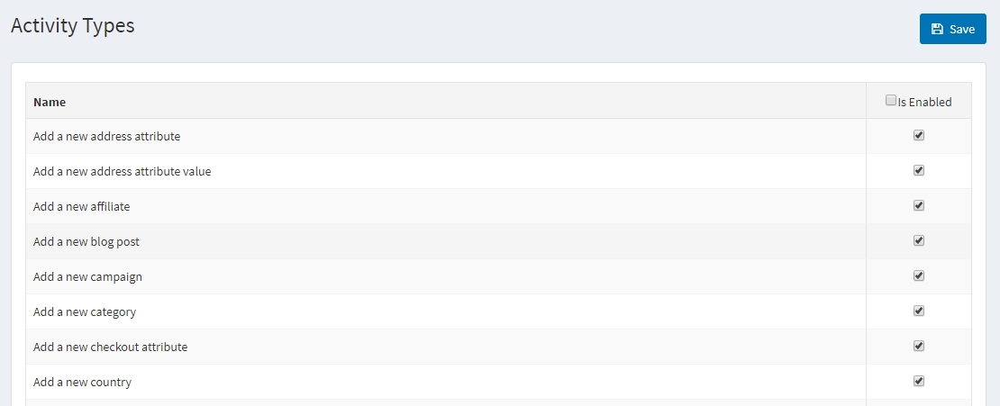
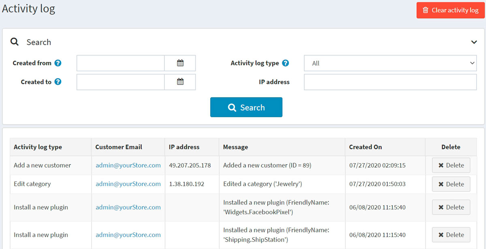

# 活動紀錄

活動紀錄（Activity log）用於追蹤系統中的使用者活動。在 nopCommerce 中，預設啟用所有「活動類型」的追蹤。商店管理員可以透過取消勾選相關核取方塊來停用它們。列出的活動類型大多僅針對管理員，記錄管理後台中的操作。不過，有些活動類型則是針對前台網站，用來追蹤顧客的操作（例如加入購物車/願望清單或下訂單）。

## 顧客活動類型

若要啟用或停用活動類型，請前往 **顧客 → 活動類型**。

勾選您想要啟用的活動類型旁邊的 **已啟用** 核取方塊，然後點擊右上角的 **儲存**。

## 顧客活動紀錄

若要搜尋活動紀錄，請前往 **顧客 → 活動紀錄**。

使用下列一個或多個欄位來定義搜尋條件：

- 若要依日期範圍搜尋，請在 **建立日期 (起)** 與 **建立日期 (迄)** 欄位中輸入日期範圍。或者，您可以點擊下拉式行事曆並選擇所需的日期區間。
- **活動紀錄類型**：用於篩選顧客的活動。
- **IP 位址**：依 IP 位址搜尋顧客。

您可以點擊某個活動紀錄項目旁邊的 **刪除** 按鈕來清除該項目，或是點擊右上角的 **清除活動紀錄** 按鈕來清除所有活動紀錄。